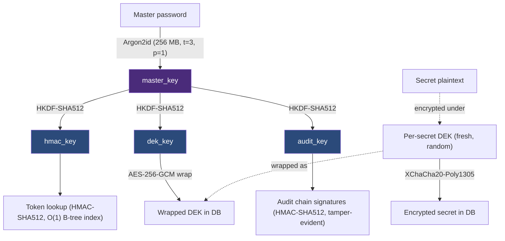

# Security Policy

## Supported versions

| Version | Supported |
|---|---|
| 1.0.x (beta) | Yes |

## Support period

Resurgamus Horizon v1.0.0 is scheduled to be placed on the market in
**September 2026**. Its support period runs **five years**, ending
**September 2031**.

During that period Resurgamus manages vulnerabilities in the product and in
the components it integrates, and provides security updates free of charge to
every user, under the AGPL, with an advisory for each fixed issue. Five years
is the floor set by Article 13(8) of the Cyber Resilience Act
(Regulation (EU) 2024/2847); a secrets vault is long-lived infrastructure, so
the expected-use-time exception to go shorter does not apply here.

The end date is stated as month and year, is fixed at the time of supply, and
does not move backwards. If a later release extends it, the longer period
applies to that release; it never shortens for a version already supplied.

**The five years to September 2031 are unconditional.** They are not
contingent on revenue, funding, commercial uptake, or the project's staffing.
That is deliberate: the CRA floor is an obligation owed to everyone the
product was supplied to, so making it conditional would defeat it.

What *is* conditional is anything **beyond** that date. Resurgamus intends to
extend the support period past September 2031, and commercial licensing and
paid support are what would fund a longer commitment - potentially a rolling
window rather than a fixed end date. Any extension will be announced as a new
end date here, in month-and-year form, before the current one lapses. An
extension can only ever lengthen the period; it never shortens it, and the
absence of an extension never shortens it either.

### What the support period covers

The commitment attaches to the **canonical artifact**: the signed container
images and the `rhorizon_crypto` wheel built in CI, verifiable per
[docs/verifying-images.md](docs/verifying-images.md) and
[docs/verifying-releases.md](docs/verifying-releases.md).

Platform support is **graded**, and the grade is part of the commitment - it
is not a promise of identical parity everywhere. See
[docs/COMPATIBILITY.md](docs/COMPATIBILITY.md) for the authoritative matrix.

| Track | Commitment to September 2031 |
|---|---|
| Signed container image + wheel (canonical) | Full: security fixes, advisories, verified reproducible builds |
| Kubernetes / Helm, Docker, Podman rootless | Full, on the canonical artifact |
| Native installers, **Tested** platforms | Security fixes; a platform may be regraded with notice if upstream makes it untenable (see below) |
| Native installers, **Supported** / **Experimental** platforms | Best effort; no parity guarantee |
| MCP server and hub (`mcp/`, `mcp-hub/`) | Security fixes for the shipped surface. The Model Context Protocol is young and moving; breaking upstream spec changes are handled as feature work, not as a support-period breach |

Two dependencies will need migration inside the window, and that work is part
of the commitment rather than a reason to shorten it:

- **Python 3.12** reaches security end-of-life on **31 October 2028**. A
  migration to a supported interpreter happens before that date.
- **OpenBSD** supports only its two most recent releases and ships every six
  months, so the OpenBSD lane is revalidated per release rather than pinned.

Regrading a platform requires a release note and does not affect the canonical
artifact's end date. Where technically feasible, users are notified when the
support period expires.

## Reporting a vulnerability

**Do not open a public issue for security vulnerabilities.**

- **Paying sponsors / commercial members:** email **horizon@resurgamus.com**.
  First response within **48 hours**, or the shorter time in your support
  agreement if you have one.
- **Everyone else (OSS / AGPL):** email **security@example.com**. First response
  within **96 hours**.

Include:
- Description of the vulnerability
- Steps to reproduce
- Impact assessment
- Suggested fix (if any)

### Response and remediation targets

Two distinct clocks. The first is how fast a human replies to *you*; the
second is how fast a fix ships, and it does **not** depend on who reported.

| | First response | Applies to |
|---|---|---|
| Paying sponsor / commercial member | 48 hours | Reports to `horizon@resurgamus.com` |
| Anyone else | 96 hours | Reports to `security@example.com` |

Remediation is driven by severity, not by reporter. A critical flaw found by
an anonymous reporter is fixed on the same clock as one raised by a sponsor:

| Severity | Fix or documented mitigation |
|---|---|
| Critical - remote key compromise, auth bypass, secret disclosure | 7 days |
| High - privilege escalation, audit-chain forgery, sealed-state bypass | 30 days |
| Medium | Next scheduled release |
| Low / hardening | Backlog, batched |

Security fixes ship separately from feature work (`fix:` commits are already
released independently), free of charge, to every user under the AGPL, with an
advisory per fixed issue. Paying sponsorship buys **attention latency and
support**, never privileged access to a fix or an embargo extension.

These targets are effort commitments for a small maintainer team, not a
contractual uptime SLA. Where one conflicts with a commercial support
agreement, the agreement governs for that customer - and can only be shorter,
never longer.

## Disclosure policy

- Coordinated disclosure (90-day window)
- Credit will be given in the CHANGELOG unless you prefer anonymity
- No bug bounty program at this time

## Scope

In scope:
- Authentication or authorization bypass
- Secret leakage (plaintext in logs, responses, or DB)
- Cryptographic weaknesses
- Audit chain bypass or forgery
- Container escape or privilege escalation

Out of scope:
- Attacks requiring physical access to the host
- Social engineering
- DoS (rate limiting is implemented but not hardened for DDoS)
- Issues in third-party dependencies (report upstream, but let us know)

---

## Standards & frameworks - cross-references

Resurgamus Horizon does not aim to be "compliant" by checkbox; the
security design is mapped to recognized frameworks so an auditor can
trace each control to a primitive, an endpoint, or a piece of code.

| Framework | Document | Coverage |
|---|---|---|
| [MITRE ATT&CK](https://attack.mitre.org/) (Enterprise v15) | [docs/THREAT-MODEL.md](docs/THREAT-MODEL.md#1-threat-model---mitre-attck-mapping) | Initial Access, Persistence, Privilege Escalation, Credential Access, Defense Evasion, Lateral Movement, Collection - covered or partial with explicit gaps |
| [OWASP ASVS](https://owasp.org/www-project-application-security-verification-standard/) Level 2 (v4.0.3) | [docs/THREAT-MODEL.md](docs/THREAT-MODEL.md#2-owasp-asvs-level-2-checklist) | V2 Auth, V3 Sessions, V4 Access Control, V6 Crypto, V7 Errors, V8 Data Protection, V9 Comms, V13 API - 42/45 MET |
| [NIS2](https://eur-lex.europa.eu/eli/dir/2022/2555/oj) (UE 2022/2555) Art. 21 | [docs/NIS2-COMPLIANCE.md](docs/NIS2-COMPLIANCE.md) | Risk management, encryption at rest & in transit, access control, incident logging, secret rotation, supply chain |
| [CRA](https://eur-lex.europa.eu/eli/reg/2024/2847/oj/eng) (EU 2024/2847) - CE marking | [docs/CRA-COMPLIANCE.md](docs/CRA-COMPLIANCE.md) | Resurgamus as manufacturer; important class I FOSS product; Article 32(5) Module A self-assessment; roadmap to CE marking |
| [OWASP Top 10](https://owasp.org/Top10/) (2021) | [docs/THREAT-MODEL.md](docs/THREAT-MODEL.md#1-threat-model---mitre-attck-mapping) (covered transitively via ASVS) | A01 Broken Access Control, A02 Cryptographic Failures, A03 Injection, A04 Insecure Design, A07 ID&A Failures, A08 Software & Data Integrity, A09 Logging & Monitoring |
| [NIST SP 800-63B](https://pages.nist.gov/800-63-3/sp800-63b.html) (Authenticator levels) | this document, section "Software & primitive choices" | AAL2 via WebAuthn/FIDO2 + multi-factor (master password + 2FA) |
| [STRIDE](https://learn.microsoft.com/en-us/azure/security/develop/threat-modeling-tool-threats) | [docs/THREAT-MODEL.md](docs/THREAT-MODEL.md) (implicit via MITRE+ASVS) | Spoofing, Tampering, Repudiation, Info Disclosure, DoS, Elevation of Privilege |

## CRA posture

Resurgamus Horizon maintains a control-by-control readiness assessment for the
EU Cyber Resilience Act (Regulation (EU) 2024/2847):

| Area | Current documented posture |
|---|---|
| Annex I, Part I - product cybersecurity properties | 10 `COMPLIANT`, 3 `CONTRIBUTES`, 0 `NON-COMPLIANT` |
| Annex I, Part II - vulnerability handling | 4 `COMPLIANT`, 3 `CONTRIBUTES`, 1 `TO PRODUCE` |

**Roadmap goal:** complete operational CRA readiness by **11 September 2026**,
including the vulnerability-reporting workflow, manufacturer documentation,
support-period policy, and remaining Annex I measures.

Detailed evidence, gaps, legal-role analysis, and the remediation roadmap:
[`docs/CRA-COMPLIANCE.md`](docs/CRA-COMPLIANCE.md). Official EU references:
[CRA summary](https://digital-strategy.ec.europa.eu/en/policies/cra-summary)
and [reporting obligations](https://digital-strategy.ec.europa.eu/en/policies/cra-reporting).

[docs/SECURITY-AUDIT.md](docs/SECURITY-AUDIT.md) is the **living
remediation tracker** - current findings, status, and the work in
progress to address them. Expect it to change between releases; consult
it for the up-to-date posture, not for a frozen audit report.

---

## Security design - high level

Crypto stack ([docs/THREAT-MODEL.md](docs/THREAT-MODEL.md) for the MITRE/ASVS mappings):

- Argon2id (256 MB, t=3, p=1) for password -> master key
- HKDF-SHA512 to derive `hmac`, `dek`, `audit` sub-keys
- XChaCha20-Poly1305 for secrets, each with its own DEK
- AES-256-GCM to wrap the DEKs (wrap key lives in Rust, mlock'd)
- HMAC-SHA512 for token lookup (O(1) B-tree index) and chained audit signatures

Additional controls:

- Shamir Secret Sharing (M-of-N) for the master password / unseal key
- 2FA on unseal: WebAuthn/FIDO2, YubiKey HMAC-SHA1, or TOTP (RFC 6238)
- Mutation audit chain dual-written to PostgreSQL + daily JSONL; read records
  protected by signed Merkle checkpoints and sealed archives
- Container is read-only, non-root (uid 1500), all caps dropped, `no-new-privileges`, pids/memory limits
- Keys are zeroed on seal - Rust `zeroize` performs the wipe on `Drop`
- Multi-worker key custody: only the master process holds the sub-keys; followers delegate every crypto op over a `0700` filesystem-path Unix socket (peer-UID checked via `SO_PEERCRED`, fail-closed) and hold one Shamir share each. The legacy `/dev/shm` key-share path was removed

---

## Software & primitive choices

Resurgamus Horizon uses well-known primitives and audited libraries.

### Cryptographic primitives

| Primitive | Choice | Why this one |
|---|---|---|
| **Password KDF** | Argon2id (256 MB, t=3, p=1) | Winner of the [PHC](https://password-hashing.net/) competition and standardized in RFC 9106. Its memory cost raises the cost of parallel password guessing. rhorizon fixes a 256 MB application profile rather than exposing a weaker runtime setting. |
| **Symmetric AEAD (secrets)** | XChaCha20-Poly1305 | Its 24-byte random nonce makes accidental collisions negligible at the expected write volume; nonce reuse remains forbidden. It does not depend on AES hardware acceleration. |
| **Symmetric AEAD (DEK wrap)** | AES-256-GCM | Commonly hardware-accelerated through AES-NI and standardized by NIST SP 800-38D. It wraps fixed-size DEKs with the master-derived `dek_key`; each wrap still requires a unique nonce. |
| **HMAC** | HMAC-SHA512 | Standardized (FIPS 198-1, RFC 2104). 512-bit output gives ample collision resistance. SHA512 is faster than SHA256 on 64-bit CPUs. Used for token lookup (DB index of HMAC hashes) and chained audit signatures. |
| **Key derivation** | HKDF-SHA512 | Extract-and-expand standard (RFC 5869). Cleanly separates master key into purpose-specific sub-keys (`hmac`, `dek`, `audit`) with domain separation via `info=`. |
| **Asymmetric (WebAuthn)** | ECDSA P-256 (ES256) / RSA (RS256) | The server offers both in `pubKeyCredParams`; the authenticator picks. ES256 is the FIDO2 baseline; RS256 covers platform authenticators (e.g. Windows Hello) that don't do ECDSA. EdDSA is not offered here - it's used elsewhere in rhorizon (audit-chain signing, cluster CA, PKI engine), not for WebAuthn. |

### Libraries (and why)

| Concern | Library | Why this one |
|---|---|---|
| **libsodium bindings** | [PyNaCl](https://pynacl.readthedocs.io/) | Python bindings to [libsodium](https://doc.libsodium.org/), whose high-level APIs provide the XChaCha20-Poly1305 implementation used here. |
| **AES-GCM, HKDF, ECDSA** | [cryptography (pyca)](https://cryptography.io/) | A maintained Python cryptography library backed by OpenSSL. |
| **WebAuthn / FIDO2** | [python-fido2](https://github.com/Yubico/python-fido2) | Maintained by Yubico and implements CTAP2 / WebAuthn server operations. |
| **TOTP** | [pyotp](https://github.com/pyauth/pyotp) | Implements RFC 4226 (HOTP) and RFC 6238 (TOTP) in Python. |
| **age encryption (backups)** | [pyrage](https://github.com/woodruffw/pyrage) | Bindings to [rage](https://github.com/str4d/rage), a Rust implementation of the [age](https://age-encryption.org/) file-encryption format. |
| **Memory protection** | Rust extension (`rhorizon_crypto`) using [`memsec`](https://crates.io/crates/memsec) (`mlock`) + [`zeroize`](https://crates.io/crates/zeroize) (drop-time wipe) | `zeroize` implements a wipe that the compiler must preserve. `mlock(2)` keeps the key pages out of swap when the host permits locking. Rust custody keeps these keys outside Python object introspection. |
| **LDAP** | [bonsai](https://bonsai.readthedocs.io/) | Async LDAP client with native libldap bindings for binds, TLS, referrals, and retry handling. |

### Defense-in-depth layers

| Layer | Purpose | Implementation |
|---|---|---|
| Network | Don't be reachable from the public internet | Operator's responsibility - VPN (IPsec / OpenVPN) or private VLAN. Bind addresses default to `127.0.0.1`. |
| Reverse proxy (optional) | TLS termination, WAF, SSO | Generic labels for Traefik / Caddy / nginx ingress; SSO via headers (Authelia / Authentik / Keycloak / oauth2-proxy compatible) |
| Application | Auth + scope + audit | Self-contained (master password + 2FA), HMAC-SHA512 tokens, scope+namespace ACLs, chained audit |
| Container | Reduce blast radius if app is compromised | `read_only`, non-root uid 1500, `cap_drop ALL`, `no-new-privileges`, tmpfs `noexec/nosuid`, pids/memory limits |
| Memory | Reduce exposure through Python introspection and swap | Rust `mlock` + `zeroize`-on-drop for master and sub-keys; crypto operations use the Rust-held keys |
| Storage | Prevent a DB dump alone from decrypting secrets | Double envelope (XChaCha20-Poly1305 secret + AES-256-GCM DEK wrap); master-derived key material is held separately in memory |
| Audit | Detect tampering after the fact | Ed25519-signed mutation chain (HMAC-SHA512 legacy/fallback) in DB + daily JSONL, with signed Merkle checkpoints and sealed archives for reads |

### Quantum-resistant posture

The storage core uses 256-bit symmetric primitives, information-theoretic
Shamir sharing, passphrase-encrypted backups, and HMAC audit signatures.
Shor's algorithm does not break those primitives; Grover's algorithm reduces
the brute-force margin of symmetric keys. Transport prefers hybrid ML-KEM
(`X25519MLKEM768`) on the UI/inter-node TLS and PostgreSQL paths, but operators
must verify that each live connection negotiated the hybrid group. WebAuthn
and certificate signatures remain classical. See
[docs/POST-QUANTUM.md](docs/POST-QUANTUM.md).

---

## See also

- [docs/THREAT-MODEL.md](docs/THREAT-MODEL.md) - full MITRE ATT&CK + OWASP ASVS Level 2 mapping, explicit limitations
- [docs/SIDE-CHANNELS.md](docs/SIDE-CHANNELS.md) - constant-time design, exhaustive amd64/aarch64 functional tests, the x86_64 assembly gate, memory protection, and residual risks
- [docs/POST-QUANTUM.md](docs/POST-QUANTUM.md) - post-quantum posture: hybrid ML-KEM transport + PQ-by-construction storage core
- [docs/NIS2-COMPLIANCE.md](docs/NIS2-COMPLIANCE.md) - NIS2 Art. 21 control matrix
- [docs/SECURITY-AUDIT.md](docs/SECURITY-AUDIT.md) - internal security audit findings + remediation log
- [docs/FAIL2BAN.md](docs/FAIL2BAN.md) - IP-level brute-force protection
- [docs/TLS.md](docs/TLS.md) - native HTTPS configuration
