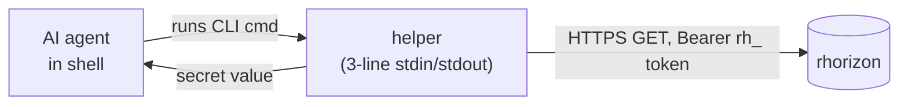

# Integrating an AI agent with the vault

How a coding agent (Claude Code, Aider, Cursor, custom LangChain script,
...) consumes secrets from Resurgamus Horizon without embedding a bootstrap
credential in its prompt or repository. Allow-listed secret values may still
enter model context when a tool returns them. The same patterns work for any
agent that can run a shell command or make an HTTPS request.

This document is the **why and how**; for the MCP (Model Context
Protocol) flavor specifically - used by Claude Desktop and other MCP
hosts - see [`MCP.md`](MCP.md). For walk-through-and-deploy adoption
of the helpers themselves, see
[`../tools/git-credential-rhorizon.examples/README.md`](../tools/git-credential-rhorizon.examples/README.md)
and
[`../tools/matrix-notify.examples/README.md`](../tools/matrix-notify.examples/README.md).

## 1. The problem

An AI coding agent needs credentials to do useful work:

- A Git push token to commit on your behalf.
- A Matrix / Slack / email token to notify you when a long task is done.
- Maybe an OpenAI / Anthropic API key for sub-tasks. A Gitea / GitHub
  token for issues. A Restic password for a backup probe.

Three places people usually put these - and why each is wrong for an AI:

| Where | Problem with an AI consumer |
|---|---|
| `.env` / `~/.bashrc` | The agent's process inherits **every** secret, regardless of which task. A bug or prompt injection can dump them. |
| Inline in the prompt / chat history | The credential lands in conversation logs, in your provider's training data exclusion path, in screen recordings. Effectively public-leakable. |
| Hardcoded in scripts the agent runs | Same as `.env`, plus the agent's repo writes can expose them in commits. |

Conventional operator credential hygiene (one user, one password manager,
biometric prompt) doesn't translate. The agent needs **just-in-time,
narrowly-scoped, fully-audited** access - exactly what a vault is for.

## 2. Two integration patterns

### Pattern A - MCP server (model-side integration)

Best for: hosts that speak MCP natively (Claude Desktop, MCP-aware IDEs,
LangChain `MCPToolkit`).

The vault is exposed as an MCP server. The model **asks for** a secret
by name (an MCP `tool` invocation), the host (acting as the operator's
proxy) checks a whitelist policy, and only allow-listed secrets are
returned. The MCP payload omits the bootstrap token; the host process holds
it. The model does receive the allow-listed secret value returned by the tool,
so the whitelist is the effective disclosure boundary.

Setup, policy file format, and the `rhorizon-mcp` server itself are
documented in [`MCP.md`](MCP.md).

### Pattern B - Direct token + CLI helpers (agent-side integration)

Best for: terminal-driven agents (Claude Code, Aider, custom scripts).
The agent has a shell, so it just runs commands.



The helper keeps the bootstrap token and resolved value out of its normal
stdout protocol. This is not an operating-system isolation boundary: an agent
running as the same Unix account can read a mode-0600 token file and inspect
processes it is permitted to trace. For stronger isolation, run the helper or
MCP server under a dedicated account or sandbox that the agent cannot inspect.
Host root remains trusted.

The vault master key is not part of this workflow; sealing and unsealing are
separate operator actions.

The agent only knows: "run `git push`" or "run `matrix-notify 'done'`".
The helper does the rest.

## 3. Worked example - this very repository

Resurgamus Horizon eats its own dogfood. The AI coding agent that
contributed several recent commits to this codebase consumes secrets
exactly the way described above. Here's the actual setup:

### 3.1 Bootstrap token

A single rhorizon token, scoped to one namespace:

```json
{
  "name": "agent",
  "permissions": { "secrets": "rw", "namespaces": ["agent"] }
}
```

`secrets:rw` because this particular agent also writes to its scratch
namespace. A read-only consumer would use `"secrets":"r"`. The
`namespaces` claim caps blast radius - even if the token leaks, an
attacker can only read/write within `agent/`, not `prod/` or
`infra/`.

For higher-trust agents, add an IP allowlist (see
[`SECRETS-AND-TOKENS.md`](SECRETS-AND-TOKENS.md#23-per-token-ip-allowlist-allowed_ips)):

```json
{
  "name": "agent",
  "permissions": { "secrets": "r", "namespaces": ["agent"] },
  "allowed_ips": "10.0.0.1/32"
}
```

The bootstrap token sits at `~/.config/rhorizon/token` (mode `0600`).
The agent's user owns it. The agent process can read it; another user
on the same host cannot.

### 3.2 Secrets in the namespace

| Secret name | What it holds | Used by |
|---|---|---|
| `gitea-agent-write` | Gitea API token (push permission, repos owned by the user) | `git-credential-rhorizon` for `git push` |
| `matrix-agent-token` | Matrix access token (one bot account) | `matrix-notify` / `matrix-read` |
| `matrix-agent-room` | Room ID (`!yourroom:matrix.example.com`) | `matrix-notify` / `matrix-read` |

Each secret rotates independently - the agent picks up the new value
on the next call. No restart, no config edit.

### 3.3 Helpers on PATH

Two CLI helpers (~250 lines each, stdlib Python) live in
`~/.local/bin/`, symlinked from `tools/` in this repo:

- `git-credential-rhorizon` - git's credential-helper protocol.
  When git needs auth, it runs this; this runs the bootstrap token
  against rhorizon to fetch the gitea token; returns it to git.
  See [`tools/git-credential-rhorizon`](../tools/git-credential-rhorizon)
  + [`tools/git-credential-rhorizon.examples/README.md`](../tools/git-credential-rhorizon.examples/README.md).

- `matrix-notify` / `matrix-read` - same pattern for Matrix
  messaging. The agent uses these to ping the operator at the end of a
  long task and to read async replies between turns.
  See [`tools/matrix-notify`](../tools/matrix-notify),
  [`tools/matrix-read`](../tools/matrix-read), and
  [`tools/matrix-notify.examples/README.md`](../tools/matrix-notify.examples/README.md).

The agent's transcript shows it just running `git push` or `matrix-notify
"done"`. No tokens visible.

### 3.4 What the audit log shows

Every helper call hits rhorizon. Every hit is a `read_secret` event:

```
actor=agent  action=read_secret  target=gitea-agent-write    ip_address=10.0.0.1
actor=agent  action=read_secret  target=matrix-agent-token   ip_address=10.0.0.1
actor=agent  action=read_secret  target=matrix-agent-room    ip_address=10.0.0.1
```

The operator can answer questions like "what did the AI agent access in
the last hour" with one query. With `actor=agent` separate from the
operator's `actor=operator` token, attribution is unambiguous.

## 4. Threat model - what a leak buys an attacker

| Leak | Reachable secrets | Impact |
|---|---|---|
| Agent prompt / chat history scraped | Bootstrap token only **if** the agent ever printed it (it shouldn't - helpers eat it). | Limited to the agent's namespace + scope. With `allowed_ips`, also limited to one host. |
| Bootstrap token file readable | Everything in the agent's namespace. | Rotate the token (revoke old, mint new). Helpers pick up the new file on next call. |
| Vault master password | Everything. | Emergency `rotate-password` (see SECRETS-AND-TOKENS section 2.7). All tokens invalidated. |
| Compromise of a stored secret (e.g. gitea token) | One credential. | Rotate the underlying credential, update the value in rhorizon. Every consumer picks it up next call - no scripts to find and edit. |

The "stop printing tokens in chat history" rule is the agent's
responsibility; the helpers exist to make it easy. If you find yourself
writing `curl -H "Authorization: Bearer $RH_TOKEN"` in a prompt to your
agent, write a helper instead.

## 5. Try it without a real vault - mock-stack

[`tools/matrix-notify.examples/mock-stack.py`](../tools/matrix-notify.examples/mock-stack.py)
is a runnable single-file demo. It boots a fake rhorizon vault and a
fake Matrix homeserver in two threads, prints a banner with a
copy-paste env block, and logs every interaction with a timestamp.

```bash
# Terminal 1
./tools/matrix-notify.examples/mock-stack.py

# Terminal 2 - copy the export line from the banner
export RH_CONFIG_DIR=/tmp/mock-rhorizon-XXXX
matrix-notify "hello from the demo"
matrix-read --backfill 10
matrix-read --watch
```

You can show this to a prospective adopter without exposing any real
credential. The same pattern works for `git-credential-rhorizon` -
write a one-shot demo that mocks gitea's credential-needing endpoint.

## 6. Checklist for adopting this in your own AI workflow

1. **Pick the integration pattern.** MCP if your host supports it
   ([`MCP.md`](MCP.md)); direct token + helpers otherwise.
2. **Mint a namespace** in rhorizon for the agent (e.g. `aider/`,
   `cursor/`, `<your-username>-llm/`).
3. **Store the credentials the agent will need** in that namespace.
4. **Mint a bootstrap token** scoped to `secrets:r` (or `rw` if the
   agent writes secrets) on **just** that namespace. Add `allowed_ips`
   if the agent runs from one host.
5. **Drop the bootstrap token at `~/.config/rhorizon/token`** (mode
   `0600`).
6. **Install the helpers on `$PATH`**. Adapt the existing ones
   (`git-credential-rhorizon`, `matrix-notify`) or write a new one in
   the same shape - the pattern is < 100 lines of stdlib.
7. **Tell the agent** to use the helper, not the raw vault API. In
   `CLAUDE.md` (or whatever instruction file your host reads), document
   "use `matrix-notify` to send messages, never embed Matrix tokens
   in scripts you write".
8. **Watch the audit log.** First run, you should see exactly the
   `read_secret` events you expect. If the agent reaches for something
   it shouldn't, the audit catches it before the leak does damage.

## 7. Two-way chat - operator <-> agent over Matrix (or Slack, IRC, ...)

A natural extension of the dogfood pattern: use the same vault-backed
helpers to give the operator and the AI agent a dedicated chat room
they can ping back and forth in. Useful when:

- The agent runs a long task - finishes hours after the operator left
  the terminal. A Matrix message to the operator's room is more useful
  than scrolling tmux backlog.
- The operator wants to ask a follow-up between agent sessions
  ("hey, did the deploy roll forward yesterday?") without spinning up
  a new agent context just for that.
- Several ops on a team need visibility into what the agent has done /
  is doing - a shared Matrix room IS the audit log.

### Setup (mirrors section 3 of this doc)

A Matrix bot account, `@<your-agent>:matrix.example.com`. Two secrets
in the vault:

```bash
read -rsp 'Matrix agent token: ' RH_SECRET; echo
printf '%s' "$RH_SECRET" | rhorizon set matrix-agent-token \
  --namespace agent --stdin
unset RH_SECRET

read -rp 'Matrix room ID: ' RH_ROOM
printf '%s' "$RH_ROOM" | rhorizon set matrix-agent-room \
  --namespace agent --stdin
unset RH_ROOM
```

The agent uses the existing `matrix-notify` / `matrix-read` CLI
helpers (see [`tools/matrix-notify.examples/README.md`](../tools/matrix-notify.examples/README.md)).
The operator uses the same helpers from their workstation.

### What this gives you

| Direction | Tool | What it does |
|---|---|---|
| Agent -> operator | `matrix-notify "deploy ok"` | Push notification to the room. |
| Operator -> agent | `matrix-notify "look at the build log"` | Same - the agent reads it on its next `matrix-read` between turns. |
| Agent -> operator (richer) | `matrix-notify --format html "<strong>Q:</strong>..."` | Markup for emphasis, code blocks. |
| Operator viewer | a small `matrix-read --watch` wrapper | Read-only terminal viewer that streams the room. The operator composes from Element/their Matrix client (their own identity); the wrapper is mirroring + topic-logging only. Avoids the identity-confusion trap of letting an `@bot` token send operator-typed text. |
| Agent reads recent | `matrix-read --backfill 50` | Pulls history + advances the cursor. |
| Agent watches live | `matrix-read --watch --format json` | Long-poll, JSONL stream - pipe to scripts that react to keywords. |

### Audit value

Every send and every read shows up in rhorizon's audit log with
`actor=<agent-token-name>`. So the chronology of "agent received this,
agent replied that, operator asked the next thing, ..." is reconstructable
from the vault audit + the Matrix room - even if the agent itself
crashes or the operator's terminal scrolls off.

This is **not** a chat product - it's a worked example of the same
"vault-backed, audited, narrowly-scoped" pattern applied to async
operator<->agent interaction. The transport (Matrix) and the chat helpers
are interchangeable - the same architecture works for Slack
(Slack incoming webhooks + RTM API), Mattermost, IRC with SASL,
or even SMTP. Pick the transport your team already uses, bind the
credentials in the vault, and use a protocol-specific helper when the agent
does not need the plaintext value.

## 8. Production hardening - beyond "it works on my workstation"

The setup above gets you up and running. For an agent that runs
unattended on shared infrastructure, three additional moves matter:

**Dedicated UNIX user for the agent.** The default flow shares a user
account with the operator: same `~/.bash_history`, same
`~/.ssh/`, same `~/.config/`. A bug in the agent (or a clever prompt
injection) can read or write any of those. Create a separate user
(`useradd -m -s /usr/bin/bash agent`), give it its own
`~/.config/rhorizon/` with its own bootstrap token, and run the agent
process as that user (`sudo -u agent` or a systemd-user service).
Audit attribution then carries through: `actor=agent` is
distinct from `actor=operator` in the rhorizon log.

**Migrate `.env` and CI pipeline secrets to the vault, in that order.**
Inventory every project's `.env` and `.woodpecker/*.yml` first; rotate
each consumer off plaintext one at a time, not in bulk - too many ways
for a missed reference to silently break a service. CI pipelines should
use ephemeral tokens (TTL = pipeline duration + buffer, `allowed_ips`
= the runner host) rather than long-lived secrets. See
[`SECRETS-AND-TOKENS.md`](SECRETS-AND-TOKENS.md#25-ephemeral-tokens) section 2.5.

**Reach the vault over the right network.** From the vault host itself
the agent talks to `http://127.0.0.1:8200`. From peers in the
VPN mesh, the URL is `http://<vpn-ip>:8200`. The vault MUST NOT
be exposed on a public interface. Bind the API to the loopback or to the
VPN interface and let the firewall do the rest.

These three moves cover the "agent has its own identity, the vault is
the only credential store, traffic is on the right network". Each is
incremental - you can ship the basic helpers first and harden later.
