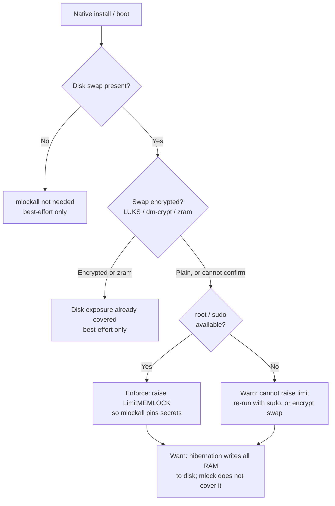

# Deployment

This document covers the supported deployment scenarios for Resurgamus
Horizon - from a laptop dev stack to a production single-VM behind a
reverse proxy with SSO and LDAP. It is operator-oriented: every section
points at the environment variables and files that require configuration.

For a 5-minute hands-on, see [`QUICKSTART.md`](QUICKSTART.md). For
deeper Docker / Kubernetes specifics, see
[`DOCKER.md`](DOCKER.md) and [`K8S.md`](K8S.md).

---

## 1. Pick a topology

| Scenario | Reachability | Auth | Use case |
|---|---|---|---|
| **Local / dev** | `127.0.0.1` only | Master password + 2FA optional | Development, integration testing |
| **Private network / VPN** | VPN CIDR + loopback | Master password + 2FA | Single-VM production, sovereign self-hosted |
| **Reverse-proxy + SSO** | VPN CIDR via proxy | Master password + 2FA *plus* upstream SSO (`Remote-User` headers) | Behind an existing SSO gateway |
| **LDAP / AD bound** | VPN CIDR | LDAP/AD bind -> session token | Existing identity provider |

The scenarios are **layered**, not exclusive: SSO and LDAP both sit on
top of "Private network / VPN". Multiworker mode (section 7) is
orthogonal and always on, independent of which exposure you pick.

---

## 2. Local / dev

Point of this mode: get the stack running on a workstation in under
five minutes, with safe defaults that bind nothing publicly.

```bash
git clone https://github.com/JR-Shdw/Horizon.git rhorizon
cd rhorizon
cp env.example .env
sed -i "s|^POSTGRES_PASSWORD=.*|POSTGRES_PASSWORD=$(openssl rand -hex 32)|" .env
docker compose up -d
```

Defaults you get for free:

| Setting | Value | Why |
|---|---|---|
| Bind addresses | `127.0.0.1` | Cannot reach the box from another host |
| TLS | off | nginx serves plain HTTP - fine on loopback |
| Workers | 5 | Raw-compose default; `install.sh` presets scale this (below) |
| Multiworker | on (5 workers) | Always on, so behavior matches production |
| 2FA | none | Opt in once you have a YubiKey / TOTP app handy |

### Sizing presets

`tools/install.sh --tier <home|smb|heavy|super-heavy>` sizes the stack in one
command, on **both** the container and native paths. **home is the default** and
binds localhost.

| Tier | Workers | Total RAM | For |
|---|---|---|---|
| `home` | 1 | ~600 MB | Personal / laptop. Single process, no failover. |
| `smb` | 5 | ~1.6 GB | Minimum for professional / multi-worker use. |
| `heavy` | 10 | ~2.7 GB | High concurrency. |
| `super-heavy` | 20 | ~5 GB | Very high concurrency / many agents. |

On the **container** path the tier loads `tools/presets/<tier>.env` (api workers
+ PostgreSQL + memory). On the **native** path it maps to `--workers` and memory
derives from the worker count (`workers x 160 + 256 + 192 MB`). Re-run with
another `--tier` to switch; volumes persist and the stack returns **sealed**, so
re-unseal after. `smb` is the floor for multi-worker key compartmentalization and
failover; `home` trades both for the smaller footprint.

### Boot persistence

`--persist` makes the tier restart after a reboot: no-op on Docker (daemon +
`restart: unless-stopped` already do it), `loginctl enable-linger` + a
`systemd --user` unit on rootless podman+systemd (may need `sudo loginctl
enable-linger <user>` once). On BSD use the native install (root -> `rc.d`); the
container path is Linux in practice (no Docker/podman on *BSD bar FreeBSD jails).
The stack returns **sealed** on boot - unseal again.

For development against a real database without rebuilding the
container every time, use `make logs` / `make db-shell` (see Makefile).

Optional Podman / Docker rootless variations are documented in
[`QUICKSTART.md`](QUICKSTART.md#podman--docker-rootless).

---

## 3. Private network / VPN production (single VM)

Goal: one host behind a VPN (IPsec / OpenVPN / Tailscale /
ZeroTier - your call), with the vault reachable from the VPN CIDR
only. No public internet exposure, no reverse proxy, no SSO yet - just
a hardened single-VM deployment.

### 3.1 Host preparation

- Patched kernel + Docker Engine >= 24 (for compose v2)
- **512 MB RAM** minimum at the defaults (typical idle: ~210 MB across the
  three containers - see "Tuning for small hosts" below). Argon2id at
  256 MB runs only during the unseal handshake and is transient.
- **3 GB free disk**. The bulk is the container images (~1 GB:
  postgres ~625 MB, api ~320 MB, frontend ~95 MB). The DB and audit
  volumes grow slowly; allow some headroom for log retention (default
  365 days, configurable via `RH_AUDIT_RETENTION_DAYS`).
- VPN already up and the box reachable on a private CIDR
- Time synced (NTP) - TOTP and audit timestamps depend on it

#### Tuning for small hosts

The container memory caps in `docker-compose.yml` (768 MB api, 512 MB
postgres, 64 MB frontend) are *upper bounds*, not requirements. On a
constrained host you can lower them via a `docker-compose.override.yml`:

```yaml
services:
  api:
    deploy:
      resources:
        limits:
          memory: 384M     # tight but viable; leaves room for one Argon2id
  postgres:
    deploy:
      resources:
        limits:
          memory: 192M
```

A 512 MB host is comfortable. A 256 MB host works if Postgres is
trimmed (`shared_buffers=64MB`) and you accept that an unseal under
256 MB Argon2id may briefly hit swap. Below 256 MB total, drop to
`RH_WORKERS=1` (see section 3.3); that is the single-worker mode,
which holds its keys in-process with no failover (section 7).

### 3.2 Bind addresses

In `.env`:

```ini
# 10.0.0.20 is your VPN-facing IP on this host.
WG_IP=10.0.0.20          # admin/UI plane + nginx frontend
WG1_IP=10.0.0.20         # machine-to-machine plane (separate it if you want)
```

The root `docker-compose.yml` publishes the API on `${WG_IP}:8200` and
`${WG1_IP}:8200`, and nginx on `${WG_IP}:8201` (HTTP) plus `:8443` (HTTPS when
`TLS_ENABLED=true`). If you do not need a separate m2m plane, point both at the
same IP.

### 3.3 Workers

| Workers | Memory (mlock) | For |
|---|---|---|
| 1 | ~608 MB | smallest; single process |
| 5 | ~1.25 GB | multi-worker: high load + worker resilience |

Memory is mlock-reserved (per-worker RSS + 256 MB Argon2id unseal spike). 2-4
floor to 5. Detail in [`multiworker.md`](multiworker.md).

### 3.4 First boot

```bash
docker compose up -d
docker compose logs -f api      # watch the schema migration
curl https://10.0.0.20:8443/api/v1/vault/status   # TLS_ENABLED=true
# plaintext equivalent, VPN-only and no TLS: curl http://10.0.0.20:8200/...
# {"sealed": true, ...}
```

The first **unseal** creates the master key from your password. **This
password protects everything.** Choose a strong one and store it in
your password manager and offline (see backup section).

```bash
RH_ADDR=https://10.0.0.20:8443 rhorizon unseal
# Master password: ********
# Returns a root token, shown ONCE
```

The CLI prompts without placing the password in shell history. Store the
one-time root token in your password manager.

### 3.5 After reboot

The vault is sealed by default after every reboot - that is the design.
An operator (or a Shamir quorum) must unseal it. To automate after-reboot
unseal **without** weakening the model, the recommended path is the
CLI on a trusted operator workstation:

```bash
rhorizon login https://10.0.0.20:8443
rhorizon unseal --yubikey   # or --totp
```

Auto-seal after inactivity is opt-in via `RH_AUTO_SEAL_MINUTES`
(default 0 = never). Set it only if your threat model requires it; for
most self-hosted setups, "unseal once after reboot, stay open for the
crons" is the right balance.

### 3.6 Memory protection and swap

rhorizon protects secret material in memory in two independent layers:

- **Key buffers (always on).** The master key, its sub-keys and the wrap key
  live in Rust `SecureBuffer`/`WrapKey` objects that request `mlock` and are
  zeroized on drop. Check the reported lock status because rootless host limits
  can prevent page locking. The buffers themselves are a few hundred bytes;
  their drop-time wipe does not depend on page-locking privileges.
- **Whole-process lock (`mlockall`, conditional).** At startup each worker
  best-effort `mlockall`s its whole address space so no page (including a
  briefly-decrypted secret value) can be written to swap. This is the only
  layer that depends on the host: it needs the memlock rlimit raised to the
  worker budget (`RH_WORKERS x 160 + 256 + 192 MB`, see 3.3).
- **Process inspection lockout (Linux, mandatory).** Each worker sets
  `PR_SET_DUMPABLE=0` before handling secrets. Startup fails if that call fails,
  preventing another process under the API UID from reading `/proc/PID/mem` or
  attaching with `ptrace`. Host root and kernel compromise remain out of scope.

`mlockall`'s single job is keeping cleartext pages off **disk swap**, so the
installer enforces it only when that risk is real, i.e. when plain unencrypted
disk swap exists. If swap is encrypted (LUKS/dm-crypt), is `zram` (RAM-only),
or absent, the disk-exposure risk is already covered and the best-effort lock
is left as-is. Raising the memlock limit needs root, so on a rootless install
with unencrypted swap rhorizon warns instead of enforcing.



**Hibernation.** `mlock`/`mlockall` do **not** protect against suspend-to-disk:
hibernation copies all of RAM, locked pages included, to the resume device. On
a laptop with unencrypted swap the hibernation image is cleartext. Encrypt swap
(and the resume device) or disable hibernation for full coverage.

**Core dumps** are disabled by default (`RLIMIT_CORE=0`). Keep
`RH_DISABLE_CORE_DUMPS=true` in production; disabling that guard can allow a
crash to spill plaintext to disk.

---

## 4. Reverse proxy + TLS

Resurgamus Horizon ships with a hardened nginx that can do its own TLS
(`TLS_ENABLED=true`, see [`TLS.md`](TLS.md)). When a reverse proxy is
already in front of your stack, let it terminate TLS and leave nginx in
HTTP mode.

### 4.1 Generic compose labels

The `docker-compose.yml` carries declarative labels prefixed with
`proxy.*`. They activate only if a compatible reverse proxy is on the
`reverse_proxy` external network. Examples:

| Reverse proxy | How it picks up the labels |
|---|---|
| Traefik | Native (`traefik.*`); rename the label prefix or use a label-mapping plugin |
| Caddy | `caddy-docker-proxy` reads `caddy.*` labels - adapt accordingly |
| nginx | No label discovery; write a manual server block instead |

The labels are **declarative metadata** - they do not
break the stack on their own. Adapt or drop them based on what your
proxy expects. A redacted production example is documented as a
gitignored `INFRASTRUCTURE.md` template (operator's local notes; see
your private deployment notes).

### 4.2 TLS source

| Source | When |
|---|---|
| nginx native TLS | No upstream proxy, internal CA or self-signed acceptable |
| Reverse proxy with ACME (Let's Encrypt, ZeroSSL, ...) | Public CA needed; proxy handles renewal |
| `cert-manager` (Kubernetes) | See [`K8S.md`](K8S.md) |
| Internal CA (PKI) | Most enterprise scenarios; distribute the CA to clients |

### 4.3 What to NOT expose publicly

- The API itself (reachable via VPN only)
- Postgres (Docker-internal network only)
- `/docs` and `/redoc` (`enable_docs=false` by default; enable only behind SSO if at all)
- The `/metrics` endpoint (allowlist via `RH_METRICS_ALLOWED_CIDRS`)

---

## 5. SSO via reverse-proxy headers

Resurgamus Horizon's *unseal* always requires the master password +
2FA - no SSO can replace that. SSO sits in front for **post-unseal UI
access**: it lets your team log into the web UI without managing a
separate password.

The flow:

```
User -> reverse proxy (Authelia / Authentik / Keycloak / oauth2-proxy) -> rhorizon
                          |
                          +--- adds Remote-User + Remote-Groups headers
```

Resurgamus Horizon endpoint: `POST /api/v1/vault/auth/proxy` reads the
trusted headers and issues a session token mapped from group -> scope.

### 5.1 Configuration

```ini
RH_PROXY_AUTH_ENABLED=true
RH_PROXY_USER_HEADER=Remote-User
RH_PROXY_GROUPS_HEADER=Remote-Groups
RH_PROXY_TRUSTED_IPS=172.18.0.0/16     # CIDR of your reverse proxy
RH_PROXY_SESSION_TTL_HOURS=8
```

Critical: `RH_PROXY_TRUSTED_IPS` is the **only** thing standing
between the reverse proxy and a client forging headers. Set it to a
CIDR that only the proxy can originate from. If the proxy and rhorizon
are on the same Docker network, use that network's CIDR.

### 5.2 Group -> scope mapping

The mapping is configured at runtime via the API by an admin:

```bash
curl -X PUT https://vault.example/api/v1/vault/auth/proxy/mappings \
  -H "Authorization: Bearer $ADMIN_TOKEN" \
  -H "Content-Type: application/json" \
  -d '{
    "ops": {"secrets": "rw", "tokens": "rw", "audit": "r"},
    "developers": {"secrets": "r"},
    "sec": {"admin": "rw"}
  }'
```

Group names are matched case-sensitively against `Remote-Groups`
(comma-separated by convention).

### 5.3 Compatible upstream stacks

Anything that emits `Remote-User` / `Remote-Groups` (or equivalent
configurable header names) works:

- **Authelia** - explicit support, header injection in forward-auth mode
- **Authentik** - ProxyOutpost with header-mapping flow
- **Keycloak** - via `oauth2-proxy` or Keycloak Gatekeeper
- **oauth2-proxy** standalone - `--set-xauthrequest=true`

Resurgamus Horizon is agnostic; it does not call back to the IdP.

---

## 6. LDAP / Active Directory

LDAP/AD is a separate auth path: the user authenticates with their AD
credentials, the vault binds, and on success issues a session token
mapped from AD group -> scope.

Endpoint: `POST /api/v1/vault/auth/ldap`.

### 6.1 Configure LDAP

```bash
curl -X POST https://vault.example/api/v1/vault/auth/ldap/config \
  -H "Authorization: Bearer $ADMIN_TOKEN" \
  -H "Content-Type: application/json" \
  -d '{
    "url": "ldaps://ad.example.local:636",
    "bind_dn": "CN=rhorizon,OU=ServiceAccounts,DC=example,DC=local",
    "bind_password": "service-account-password",
    "user_base": "OU=Users,DC=example,DC=local",
    "user_filter": "(sAMAccountName={username})",
    "group_base": "OU=Groups,DC=example,DC=local",
    "group_filter": "(member={user_dn})",
    "group_attr": "cn",
    "tls_verify": true,
    "session_ttl_hours": 8
  }'
```

| Field | Required | Default |
|---|---|---|
| `url`, `bind_dn`, `bind_password` | yes | - |
| `user_base`, `group_base` | yes | - |
| `user_filter` | no | `(sAMAccountName={username})` |
| `group_filter` | no | `(member={user_dn})` |
| `group_attr` | no | `cn` |
| `tls_verify` | no | `true` |
| `session_ttl_hours` | no | `8` |

The bind password is encrypted with the master-derived key and stored
in `vault_config`. The `GET /auth/ldap/config` endpoint returns a
masked password - never the cleartext.

### 6.2 Group -> scope mapping

```bash
curl -X PUT https://vault.example/api/v1/vault/auth/ldap/mappings \
  -H "Authorization: Bearer $ADMIN_TOKEN" \
  -H "Content-Type: application/json" \
  -d '{
    "CN=DevOps,OU=Groups,DC=example,DC=local": {"secrets": "rw"},
    "CN=Auditors,OU=Groups,DC=example,DC=local": {"audit": "r"}
  }'
```

LDAP and SSO-proxy mappings are independent - you can run both auth
paths simultaneously.

### 6.3 LDAP over TLS

Always use `ldaps://` (port 636) or StartTLS. The `bonsai` library
honors the system CA store; mount your internal CA into the container
if you use a private PKI:

```yaml
# docker-compose.override.yml (not committed)
services:
  api:
    volumes:
      - ./ca-bundle.pem:/etc/ssl/certs/ca-certificates.crt:ro
```

---

## 7. Multiworker mode

The API runs several uvicorn workers on one host. It is always on. Docker
Compose and `install.sh` start it with no configuration. Splitting the work
across workers raises throughput and compartmentalizes the trust boundary:
only the master process holds the sub-keys, while followers each hold one
Shamir share plus a crypto-ops RPC client. If the master crashes, a surviving
worker is elected and rebuilds the keys from a quorum of shares. See
[`multiworker.md`](multiworker.md).

This is not the HA cluster (cross-host coordination, gated by
`RH_CLUSTER_HA_ENABLED`); that is a separate, opt-in feature and has
nothing to do with the per-host worker split described here.

| Var | Default | Meaning |
|---|---|---|
| `RH_WORKERS` | `5` | uvicorn workers (1 master + N-1 followers). `1` = single-worker (keys in-process, no Shamir/RPC); `2`-`4` are floored to 5 for quorum. |
| `RH_CLUSTER_SHAMIR_TOTAL` | `0` | Key shares; `0` = auto `max(5, RH_WORKERS)`. |
| `RH_CLUSTER_SHAMIR_THRESHOLD` | `0` | Failover quorum; `0` = auto majority `max(2, total // 2 + 1)`. |

Leave the two Shamir vars at `0` unless you need an asymmetric quorum; they
track the worker count.

**Failover invariant.** With 5 workers the auto quorum is 3: the master plus
any 2 surviving followers reconstruct the keys after a master crash with no
operator action. With fewer than 2 surviving followers quorum is lost, and the
vault sits sealed until an operator re-unseals.

**Sizing for small hosts.** Multiworker floors at 5 workers (2-4 are bumped to
5 by both the installer and the container wrapper). If you cannot afford
~1.25 GB for 5 workers, run the single-worker `home` preset
(`RH_WORKERS=1`) instead: it holds its keys in one process with no
failover, the right trade-off for a small host.

---

## 8. Observability

### 8.1 fail2ban (IP-level brute-force protection)

Resurgamus Horizon writes every authentication failure to
`/var/log/rhorizon/authfail.log` in a regex-friendly format. fail2ban
reads it and bans IPs at iptables/nftables level. See
[`FAIL2BAN.md`](FAIL2BAN.md) for the filter and jail config.

### 8.2 Metrics

A Prometheus-compatible `/metrics` endpoint can be enabled:

```ini
RH_METRICS_ENABLED=true
RH_METRICS_ALLOWED_CIDRS=10.0.0.0/24,127.0.0.1/32
```

The `_ALLOWED_CIDRS` allowlist is enforced server-side regardless of
network policy - leaving it empty disables the endpoint.

### 8.3 Audit chain

The signed mutation chain is written to PostgreSQL and daily JSONL files in
`/var/log/rhorizon/audit-YYYY-MM-DD.jsonl` (Docker volume `audit_logs`). Reads
are stored in PostgreSQL, covered by signed Merkle checkpoints, and archived
with signed seals before their database prefix is pruned.

Schedule a daily integrity check (recommended via cron or a CI job):

```bash
rhorizon audit verify
# Exits non-zero if the mutation chain, read checkpoints, or archives are broken
```

Compress and ship the JSONL files to your SIEM at convenience -
`audit_compress_days=1` gzips them at the next-day rollover; `audit_retention_days=
365` is the minimum delete-protection window.

---

## 9. Backup & restore

### 9.1 What to back up

| Item | Recovery role |
|---|---|
| **PostgreSQL data** (`postgres_data` volume) | Encrypted secrets and metadata. Without the master password it is useless, but you still need it to restore. |
| **Audit logs** (`audit_logs` volume) | Tamper-evident history. Without it the chain cannot be verified. |
| **Master password** | Required to unseal. Store in a password manager + an offline copy (paper, hardware token). |
| **Shamir shares** (if used) | Held by N operators; require M to reconstruct. |
| **age identity or passphrase** | Required to decrypt encrypted `pg_dump` artifacts or API logical backup files, depending on the mode you used. |

### 9.2 Recommended cadence

```bash
# Daily - encrypted Postgres dump
docker exec rhorizon_postgres pg_dump -F c -U rhorizon rhorizon \
  | age -r age1... > /backup/rhorizon-$(date +%F).pgdump.age

# Daily - audit volume snapshot
docker run --rm \
  -v rhorizon_audit_logs:/data:ro \
  -v /backup:/backup \
  alpine tar -C /data -czf /backup/audit-$(date +%F).tar.gz .

# Daily - application-level logical backup (partial migration artifact)
APP_BACKUP=/backup/rhorizon-$(date +%F).backup
curl -sS -X POST https://vault.example/api/v1/vault/backup/create \
  -H "Authorization: Bearer $ADMIN_TOKEN" \
  -H "Content-Type: application/json" \
  -d '{"passphrase": "long-backup-passphrase"}' \
  | jq -r .payload | base64 -d > "$APP_BACKUP.age"
```

Ship to a separate datacenter / S3 bucket / offsite restic repo. Use
[restic](https://restic.net/), [borg](https://www.borgbackup.org/), or
similar - all work with the encrypted output above.

### 9.3 Restore on a fresh host

1. Bring up an empty stack on the new host (`docker compose up -d postgres`)
2. `age -d /backup/rhorizon-YYYY-MM-DD.pgdump.age | docker compose exec -T postgres pg_restore -U rhorizon -d rhorizon --clean --if-exists`
3. Restore the audit volume tarball
4. `docker compose up -d api frontend`
5. Unseal with the same master password - sub-keys are re-derived

The vault returns to operation as soon as the unseal succeeds. Tokens
and 2FA registrations survive intact. The audit chain verifies if the
audit volume was restored (otherwise the chain breaks at the gap).

---

## 10. Updates

The project is in beta - breaking changes will be announced in the
CHANGELOG. The general procedure is:

```bash
git fetch && git checkout v1.0.x
docker compose pull
docker compose up -d --build
docker compose logs -f api          # watch the migration apply
```

The schema is idempotent (`CREATE TABLE IF NOT EXISTS`, `ALTER TABLE ...
ADD COLUMN IF NOT EXISTS`). On an upgrade, the lifespan handler checks
each migration step and applies missing columns/indexes; existing data
is left alone.

After upgrade, re-unseal - the workers boot sealed.

---

## 11. Hardening checklist

Run through this before declaring a deployment "production":

- [ ] Bind addresses are NOT `0.0.0.0` (loopback or VPN-only)
- [ ] Postgres is NOT exposed (only the Docker internal network)
- [ ] `/docs` and `/redoc` are disabled (`RH_ENABLE_DOCS=false`)
- [ ] `/metrics` is allowlisted to your monitoring CIDR (`RH_METRICS_ALLOWED_CIDRS`)
- [ ] `RH_PROXY_TRUSTED_IPS` is set if SSO proxy auth is on
- [ ] Master password is in your password manager **and** stored offline (or split via Shamir)
- [ ] 2FA is enabled (`mode=any`, `yubikey`, or `totp`)
- [ ] Daily backup job is running and **tested** (try a restore on a side host)
- [ ] Daily `rhorizon audit verify` is scheduled with alerting on failure
- [ ] fail2ban is reading the authfail log
- [ ] Container resource limits are present (review the defaults in `docker-compose.yml` for the host)
- [ ] Time sync (NTP) is healthy on the host
- [ ] Host kernel is patched and the Docker Engine is recent
- [ ] You have a runbook for: unseal-after-reboot, master-password-rotation, emergency-revocation, restore-from-backup

For a discussion of what Resurgamus Horizon does **not** protect
against (host root, hypervisor, physical access), see
[`THREAT-MODEL.md`](THREAT-MODEL.md#3-explicit-limitations).
