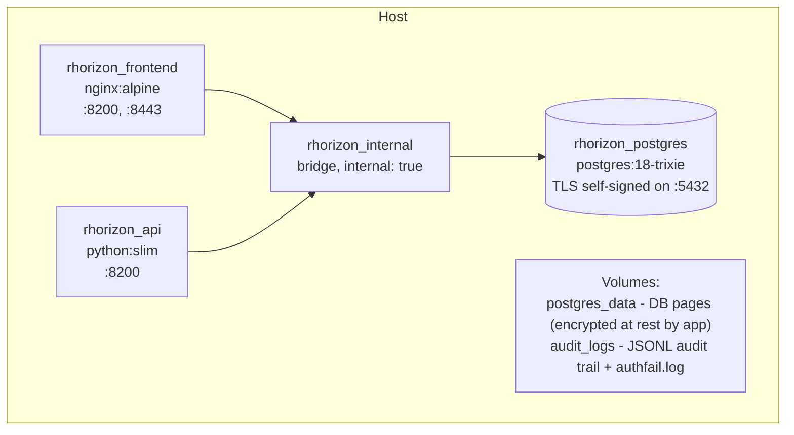
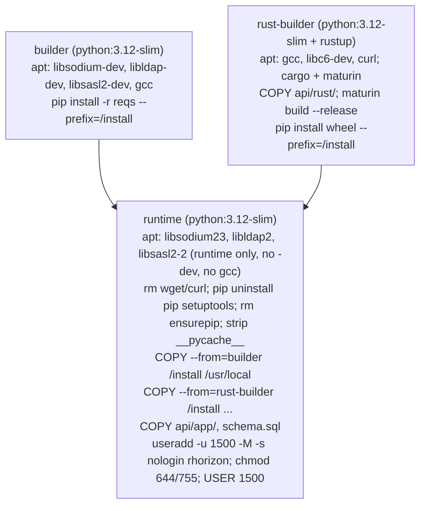

# Docker

Container packaging, Compose services, hardening, storage, networking,
and override patterns for Resurgamus Horizon.

For deployment topologies (local / VPN / SSO / LDAP), see
[`DEPLOYMENT.md`](DEPLOYMENT.md). For Kubernetes specifics, see
[`K8S.md`](K8S.md).

---

## 1. The compose stack



| Service | Image | Role | Resource limits (defaults) |
|---|---|---|---|
| `postgres` | `postgres:18-trixie` | Storage of encrypted secrets, audit chain, config | 1 G / 100 PIDs |
| `api` | built from `api/Dockerfile` | FastAPI + crypto | 1.5 G / 150 PIDs |
| `frontend` | built from `frontend/Dockerfile` | nginx (UI + reverse proxy to API) | 64 M / 50 PIDs |

The internal network `rhorizon_internal` has `internal: true` - pods on
this network cannot reach the public internet. The optional
`reverse_proxy` external network is where you attach an upstream proxy
(see [`DEPLOYMENT.md`](DEPLOYMENT.md#4-reverse-proxy--tls)).

---

## 2. Multi-stage Dockerfile (api/)

The API image is built in three stages:



What survives in the runtime image:

- Python 3.12 + libsodium23 + libldap2 + libsasl2-2 runtime libs
- `cryptography`, `pynacl`, `fido2`, `pyotp`, `bonsai`, `pyrage` and friends
- The compiled Rust extension `rhorizon_crypto` (one `.so`)
- The `app/` source tree and `schema.sql`

What is removed:

- `pip`, `setuptools`, `ensurepip` (no runtime package install possible)
- `curl`, `wget` (no exfiltration helpers)
- `gcc`, `*-dev` packages (no compilation possible)
- `__pycache__/` from the stdlib (smaller image)

---

## 3. Hardening, per service

| Protection | postgres | api | frontend |
|---|---|---|---|
| `read_only: true` | - | yes | yes |
| `cap_drop: ALL` | NET_RAW, SYS_ADMIN | yes | yes |
| `cap_add` | - | none by default; optional IPC_LOCK override | NET_BIND_SERVICE, CHOWN, SETUID, SETGID |
| `security_opt: no-new-privileges` | yes | yes | yes |
| Non-root | postgres user | uid 1500 (`rhorizon`) | uid 101 (`nginx`) |
| `tmpfs` | - | `/tmp:16M`, `/dev/shm:1M` (noexec, nosuid) | `/tmp:1M`, `/var/cache/nginx:8M`, `/run:1M`, `/etc/nginx/conf.d:1M` (noexec, nosuid) |
| memory limit | 1 G (`POSTGRES_MEM`) | 1.5 G (`RH_API_MEM`) | 64 M (`RH_FRONTEND_MEM`) |
| pids limit | 100 | 150 | 50 |
| TLS | server.crt/key generated on first boot | uses libsodium for TLS handshake to PG | nginx native TLS optional |

**`IPC_LOCK`** on the API enables `mlock(2)` on the wrap key + secure buffers
(Rust) AND the process-wide `mlockall` (`memlock_all`, default on) that keeps
served-secret pages off swap. Because `mlockall` wires the *whole* RSS -
including the 256 MB Argon2id allocation at unseal - **size the API memory for
`workers x ~160 MB + 256 MB + headroom`** (1.5 G fits the 5-worker floor; raise
`RH_API_MEM` if you raise `RH_WORKERS`). An undersized limit
OOM-kills the master at unseal; the boot guard (`mem_hardening`) warns when the
container limit is too low.

Rust secret buffers use `RH_MEMORY_LOCK_MODE=best-effort` by default. If a
lock fails, the API continues and reports `memory_protection: zeroize-only`;
buffers are still wiped on release. It warns when swap is unencrypted or its
protection cannot be verified. Encrypted swap, zram, and hosts without swap do
not need memory locking for this threat. Set `RH_MEMORY_LOCK_MODE=required` to
make buffer locking, and whole-process locking when swap is exposed, fail
closed. The separate `process_memory_protection` status reports whether
`mlockall` protected served-secret pages. Default Compose files deliberately request
neither `IPC_LOCK` nor an unlimited ulimit, so rootless and non-privileged
installations can start. On a host with unencrypted swap, grant the capability
and fail closed with the explicit override:

```bash
docker compose -f docker-compose.yml \
  -f tools/docker-compose.memory-lock.yml up -d
```

The quickstart installer copies both files into its working directory. A source
checkout uses `tools/docker-compose.memory-lock.yml` as the second file. The
installer also writes its host-side result to `RH_SWAP_PROTECTION`, because a
container cannot reliably inspect the host's swap backing device. Direct
Compose deployments default this value to `unknown`; set it to `protected`
only after verifying that the host has encrypted swap, zram, or no swap.

**Why `/dev/shm` is 1 MB**: rhorizon writes nothing there (worker IPC is a
Unix socket under `/run/rhorizon`), so capping it is defense-in-depth - an
attacker with write access can't stage large payloads, and `noexec` blocks
running uploaded binaries.

---

## 4. Volumes

| Volume | Mounted in | Contents | Backup priority |
|---|---|---|---|
| `postgres_data` | `postgres:/var/lib/postgresql` | The DB itself (secrets are app-encrypted, but you still need a dump for recovery) | Daily |
| `audit_logs` | `api:/var/log/rhorizon` | Daily JSONL audit logs + `authfail.log` | Daily |
| `./certs` (host bind) | `frontend:/certs:ro` | TLS cert + key when `TLS_ENABLED=true` | Out-of-band |

The host directory `./certs` is mounted **read-only** for nginx; it
only needs `0600`-mode certificates owned by the host's TLS-issuing
process.

---

## 5. Networks

| Network | Defined where | Usage |
|---|---|---|
| `rhorizon_internal` | Inside `docker-compose.yml`, `internal: true` | Postgres <-> API <-> frontend; cannot reach the public internet |
| `reverse_proxy` | External, must be created beforehand | Where an upstream proxy joins the API and frontend |

If you do not have a reverse proxy, simply remove the `reverse_proxy:`
network references from the compose file (or override them in
`docker-compose.override.yml`) - the stack works on `rhorizon_internal`
alone, with ports published on loopback by default.

---

## 6. Customization patterns

### 6.1 docker-compose.override.yml

This file is **gitignored** - use it for site-specific tweaks.

Example: add a custom CA bundle for LDAP / outbound TLS:

```yaml
services:
  api:
    volumes:
      - ./ca-bundle.pem:/etc/ssl/certs/ca-certificates.crt:ro
```

Example: pin uvicorn workers to a specific count:

```yaml
services:
  api:
    environment:
      RH_WORKERS: "10"
```

Example: single-worker on a small host (keys held in one process, no
failover):

```yaml
services:
  api:
    environment:
      RH_WORKERS: "1"
```

The multiworker architecture is always on and scaled by `RH_WORKERS`.
Values `2`-`4` are floored to `5` (the Shamir failover quorum needs it), so
the real choices are `1` (single-worker, no failover) or `5`+ (multiworker
with failover). Leave the Shamir vars at their `0` default unless you need an
asymmetric quorum; see [`multiworker.md`](multiworker.md). This is unrelated
to `RH_CLUSTER_HA_ENABLED`, which toggles the separate cross-host HA
cluster (off by default).

### 6.2 Building from a fork

Fork <https://github.com/JR-Shdw/Horizon> (the public mirror), then clone your
fork. Replace `YOUR-FORK` with your GitHub account; a fork keeps the upstream
repository name, so the path stays `Horizon`.

```bash
git clone https://github.com/YOUR-FORK/Horizon.git rhorizon
cd rhorizon
docker compose build           # builds both api and frontend
docker compose up -d
```

The build is deterministic enough that two fresh checkouts from the
same git revision produce byte-identical wheels (`pip wheel` plus Rust
`maturin build --release --strip`). For supply-chain provenance, see
the SBOM step in `.woodpecker/deploy.yml`.

### 6.3 Custom registry

Tag and push the built images to a private registry:

```bash
docker compose build
docker tag rhorizon_api registry.example/rhorizon_api:1.0.0
docker tag rhorizon_frontend registry.example/rhorizon_frontend:1.0.0
docker push registry.example/rhorizon_api:1.0.0
docker push registry.example/rhorizon_frontend:1.0.0
```

Then point `image:` at your tag in a `docker-compose.override.yml`:

```yaml
services:
  api:
    image: registry.example/rhorizon_api:1.0.0
    build: !reset null      # disable local build
  frontend:
    image: registry.example/rhorizon_frontend:1.0.0
    build: !reset null
```

---

## 7. Runtime modes

### 7.1 Rootful Docker (default)

Use Docker Engine 24 or later with the default Compose configuration.

### 7.2 Podman / Docker rootless

The compose file uses only standard primitives (`cap_drop`,
`no-new-privileges`, `read_only`, `tmpfs`, `pids_limit`,
`memory limits`) supported by both runtimes. Caveats:

- **Bind to ports < 1024**: not allowed in rootless. Bind to
  `127.0.0.1:8200` and front with a rootful reverse proxy if you need
  `:443`.
- **`mlock`**: the portable default does not request `IPC_LOCK` or change the
  runtime ulimit. The API, Web UI, and CLI report Rust buffer locking as
  `memory_protection` and whole-process locking as `process_memory_protection`;
  `zeroize` still wipes buffers on release. A degraded value is a warning when
  swap is unencrypted or unverified, but informational with encrypted swap,
  zram, or no swap. Use the override above only for the warning case and after
  confirming the rootless runtime permits `IPC_LOCK` and the unlimited memlock
  ulimit. Otherwise keep best-effort mode; the API remains available.

- **AppArmor / SELinux**: bundled profile names assume rootful Docker.
  Use the runtime's defaults until you write rootless equivalents.

### 7.3 Quadlet / systemd

Generate Quadlet units for per-user systemd (recommended on EL/Fedora):

```bash
podman compose --in-pod=true up -d
```

This creates a single pod with all three services and a per-user
systemd unit you can `enable` for boot-time start.

---

## 8. Health and lifecycle

Each service has a `healthcheck`:

- `postgres`: `pg_isready -U rhorizon -d rhorizon`
- `api`: `python -c "import urllib.request; urllib.request.urlopen('http://localhost:8200/health')"`
- `frontend`: `curl -sf http://localhost:8200/`

The compose file declares `depends_on: condition: service_healthy`
chains, so `frontend` waits for `api`, which waits for `postgres`.

The vault is **sealed by default** at every container restart. There
is no way to persist an unsealed state across reboots - that is the
design.

---

## 9. Logs

```bash
make logs                     # all three services, follow mode
docker compose logs -f api    # API only
docker compose logs -f --tail 200 frontend
```

Audit logs in JSONL are also accessible from the host via the
`audit_logs` volume:

```bash
docker volume inspect rhorizon_audit_logs | grep Mountpoint
ls /var/lib/docker/volumes/rhorizon_audit_logs/_data/
```

These files are append-only from the API and atomic per write
(POSIX-safe under multi-worker). Archive them to your SIEM at
convenience.

---

## 10. Common operations

| Need | Command |
|---|---|
| Bring up the stack | `make up` (or `docker compose up -d`) |
| Bring it down | `make down` |
| Rebuild after a code change | `make build` then `make restart` |
| Tail logs | `make logs` |
| Open a Postgres shell | `make db-shell` |
| Wipe everything (destructive) | `docker compose down -v` |
| Verify the audit chain | `rhorizon audit verify` (CLI) |
| Generate `.env` defaults | `make secrets` |

See the `Makefile` for the full list - it is short and self-documenting.
