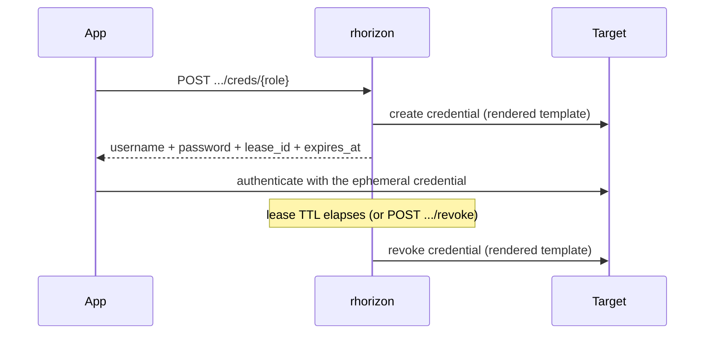

# Dynamic secrets

On-demand target credentials with a lease. Instead of storing a long-lived
password, an app asks rhorizon for a fresh credential, uses it for a short
window, and rhorizon revokes it automatically when the lease expires.

Built-in backends: PostgreSQL, MySQL/MariaDB, LDAP, Redis and Cassandra.

> Tested end-to-end against a real PostgreSQL (2026-06-23): mint a credential,
> log in to a separate target database with the ephemeral user, renew the lease,
> revoke it, and confirm the login dies, plus reaper-driven expiry. See
> `tests/test_dynamic_e2e_real.py`, `tests/test_dynamic_renew.py`,
> `tests/test_dynamic_lease_expiry.py`.

## How it works

Three objects:

- **Engine**: a backend rhorizon can provision against. Holds the privileged
  admin connection URL (encrypted at rest) and an `engine_type`
  (`postgresql` / `mysql` / `ldap` / `redis` / `cassandra`).
- **Role**: a template on an engine. A `creation_sql` and a `revocation_sql`
  with `{{name}}` / `{{password}}` / `{{expiration}}` placeholders, plus a
  default and a max TTL.
- **Lease**: one issued credential. rhorizon renders the role template with a
  generated username and password, runs it on the target, and tracks the lease
  until it expires or is revoked.

The revocation snapshot is committed as a `provisioning` lease before the
target is mutated. A partial backend operation is compensated immediately; if
that cleanup also fails, the lease is expired for reaper retry. A worker crash
therefore cannot leave an untracked credential: the persisted lease remains
revocable and is removed no later than its TTL. Renew, revoke and engine delete
refuse to race a provisioning operation.

TTL values have a 60-second floor. A role default cannot exceed its role
maximum, and a role maximum cannot exceed the engine maximum. Both mint and
renew enforce the effective engine/role cap, including for legacy rows.

The TTL is enforced by the reaper, not by the database. When a lease expires the
reaper runs the role's `revocation_sql` (DROP the user / delete the entry). The
canonical template carries no backend-native expiry (no PG `VALID UNTIL`), so
the reaper is the single source of truth for the lifetime. The `revocation_sql`
must be idempotent (`DROP ... IF EXISTS`).



## Configuration

### Module loading and dependency isolation

Each backend lives in `api/app/dynamic_engines/<backend>/` with its own source,
direct dependency manifest and hash-locked dependency file. The loader accepts
only the five names compiled into its closed catalog; an INI value can never be
used as a Python import path.

`dynamic-engines.ini` selects the modules imported by each API worker:

```ini
[modules]
postgresql = enabled
mysql = enabled
ldap = enabled
redis = enabled
cassandra = enabled
```

To disable a backend, first revoke its leases and delete its engines, then
comment its line and restart every API node. Startup fails closed if persisted
engines still depend on a disabled module, because otherwise the reaper could
no longer revoke their credentials.

The **Modules** panel provides a second, finer cluster-wide switch for every
backend allowed by the INI. Its state is stored in PostgreSQL; changing it does
not rewrite the host file. Restart every API node after a change so all workers
import or unload the same subset. The UI reports green for active, orange for a
pending restart, red for a missing driver, and black for disabled or INI-locked.
It refuses to disable a module while an engine of that type still exists.

The standard image contains the complete native catalog. To remove optional
driver packages from a hardened image, select them at build time:

```sh
docker build -f api/Dockerfile \
  --build-arg RH_DYNAMIC_ENGINE_DEPS="redis" .
```

`postgresql` remains a core dependency because Horizon itself uses asyncpg;
`ldap` is also shared by the external-login provider. MySQL, Redis and
Cassandra are physically absent when omitted from `RH_DYNAMIC_ENGINE_DEPS`.
The runtime INI must match the drivers included in that image.

### Backend connection descriptions

An engine needs a privileged connection description that can create and revoke
credentials on the target:

- **postgresql / mysql**: `connection_url` is a DSN. For MySQL/MariaDB,
  `mysqls://admin:pw@host:3306/db` enables TLS with certificate and hostname
  verification; optional `ssl_ca`, `ssl_cert` and `ssl_key` query parameters
  select a private CA and a client-certificate pair. `mysql://` is explicitly
  unencrypted and should be limited to a trusted local transport. Restrict the
  MySQL account host in role templates instead of retaining `@'%'` when the
  application source network is known.
- **ldap**: `connection_url` is a JSON blob
  `{"url":"ldaps://host:636","bind_dn":"...","bind_pw":"..."}`. The object
  accepts exactly those three keys; `ldap://` is explicitly unencrypted and
  should be limited to a trusted local transport. `creation_sql` is an LDIF add block
  (`dn:` line then `attr: value` lines); `revocation_sql` is the entry DN to
  delete. The `userPassword` is set via the RFC 3062 Password-Modify extended
  op after the add. The dynamic lifecycle is validated on lldap; other LDAP
  products remain usable but are reported as unvalidated.
- **redis**: use `redis://` or preferably `rediss://`. Roles are constrained to
  `ACL SETUSER {{name}}` for creation and exactly
  `ACL DELUSER {{name}}` for revocation. Creation must `reset` and enable the
  generated user and may set only the generated `>{{password}}`; fixed users,
  `nopass` and additional passwords are rejected. URL query parameters are
  rejected so they cannot override the enforced connection timeouts or TLS
  verification. Select the database with a numeric path such as `/0`. Example:
  `ACL SETUSER {{name}} reset on >{{password}} ~app:* resetchannels +@read`.
- **cassandra**: use JSON such as
  `{"hosts":["db1","db2"],"username":"admin","password":"...",
  "tls":true,"server_name":"cassandra.internal",
  "ca_cert":"/etc/rhorizon/cassandra-ca.pem"}`. TLS defaults to `true` and
  requires `server_name`; every node certificate must contain that shared
  identity in its SAN. Creation must first create `{{name}}` with login and the
  generated `{{password}}`; any following statements must be
  `GRANT ... TO {{name}}`. Revocation must be exactly
  `DROP ROLE IF EXISTS {{name}}`. Comments and grants to another role are
  rejected.

Namespaces confine access: a token with `namespaces: ["prod"]` only sees engines
in `prod`.

## Engine compatibility

The runtime registry is available through
`GET /api/v1/vault/dynamic/engines/compatibility`. It reports the driver and
validated targets for each engine. The current evidence is:

| Engine | Validated targets |
|---|---|
| PostgreSQL | PostgreSQL 18 |
| MySQL | MySQL 8.x |
| MariaDB | MariaDB 11 |
| LDAP | lldap |
| Redis | live validation pending; connected targets are reported unvalidated |
| Cassandra | live validation pending; connected targets are reported unvalidated |

An operator can run a read-only bind and version probe before saving an engine:

```http
POST /api/v1/vault/dynamic/engines/test-connection
Authorization: Bearer <admin:w token>
Content-Type: application/json

{
  "namespace": "prod",
  "engine_type": "postgresql",
  "connection_url": "postgresql://..."
}
```

A successful target outside the validated matrix returns
`connected_unvalidated`; it is not blocked. The probe never returns or audits
the connection URL. The maintained release matrix and its evidence are in
[COMPATIBILITY.md](COMPATIBILITY.md).

## Options

| Field | On | Meaning |
|---|---|---|
| `default_ttl_seconds` | role | Lease TTL when the caller does not override it |
| `max_ttl_seconds` | role / engine | Absolute lifetime cap; a renew can never push a lease past `created_at + max_ttl` |
| `ttl_seconds` | mint / renew | Per-request TTL (capped at the role max) |

## Permissions

| Action | Scope | Why |
|---|---|---|
| Engine / role CRUD, lease revoke | `admin:w` | Management, operator-only |
| Mint credentials, renew a lease | `secrets:w` | Consumption: the app picks among admin-provisioned roles |
| List engines / roles / leases | `admin:r` | Inventory |

## Lifecycle commands

CLI:

```bash
rhorizon dynamic engine-add pg-prod -t postgresql -n prod   # prompts for the DSN
rhorizon dynamic roles ENGINE_ID
rhorizon dynamic role-add ENGINE_ID readonly \
  -c 'CREATE ROLE "{{name}}" LOGIN PASSWORD '"'"'{{password}}'"'"'' \
  -r 'DROP ROLE IF EXISTS "{{name}}"' --ttl 1800 --max-ttl 7200
rhorizon dynamic creds ENGINE_ID readonly --ttl 600        # shown once
rhorizon dynamic leases
rhorizon dynamic renew LEASE_ID --ttl 3600
rhorizon dynamic revoke LEASE_ID
```

API:

```
POST   /api/v1/vault/dynamic/engines
GET    /api/v1/vault/dynamic/engines
GET    /api/v1/vault/dynamic/engines/compatibility
POST   /api/v1/vault/dynamic/engines/test-connection
PUT    /api/v1/vault/dynamic/modules/{engine_type}
DELETE /api/v1/vault/dynamic/engines/{engine_id}
POST   /api/v1/vault/dynamic/engines/{engine_id}/roles
GET    /api/v1/vault/dynamic/engines/{engine_id}/roles
POST   /api/v1/vault/dynamic/engines/{engine_id}/creds/{role}
GET    /api/v1/vault/dynamic/leases
POST   /api/v1/vault/dynamic/leases/{lease_id}/renew
POST   /api/v1/vault/dynamic/leases/{lease_id}/revoke
```

UI: the **Dynamic** tab under Eclipse (Secrets) controls the fine-grained module
state, manages engines, roles and leases, tests an engine connection before
creation, displays validated versus connected-unvalidated targets, mints
credentials (shown once), and renews or revokes a lease.

## Renew

A lease can be extended in place, the same model as token renewal: renew moves
`expires_at` to `now + ttl`, and the reaper holds the credential until the new
time. The one extra rule is the cap: a renew never extends a lease past
`created_at + max_ttl_seconds` (the dynamic-secrets invariant), and returns
`409` once it is already at that cap.

Caveat: if you add a backend-native expiry to `creation_sql` (for example PG
`VALID UNTIL '{{expiration}}'`), renewing the lease alone does not move that
clause. Either rely on the reaper default (no `VALID UNTIL`), or re-mint.

## systemd integration

Dynamic credentials are leased, so they are minted at service start, not loaded
as a fixed value. The pattern: mint on start, revoke on stop, restart or renew
to extend.

```ini
[Service]
# Mint on start, write the password where the app reads it.
ExecStartPre=/usr/local/bin/rh-dyn-fetch ENGINE_ID app-login /run/app/db
# ... your app reads /run/app/db.user and /run/app/db.pass ...
ExecStart=/usr/local/bin/myapp
# Revoke on stop so the lease dies at once instead of waiting for the reaper.
ExecStopPost=/usr/local/bin/rh-dyn-revoke /run/app/db.lease
Restart=on-failure
RuntimeDirectory=app
```

Size the role `default_ttl_seconds` to the service lifecycle and let `Restart=`
re-mint fresh credentials, or call `dynamic renew` from a timer before the lease
expires for a long-running service. `rh-dyn-fetch` / `rh-dyn-revoke` here are
thin wrappers around `rhorizon dynamic creds` and `rhorizon dynamic revoke`.

## Ansible integration

The collection under `integrations/ansible` mints and revokes leases without
adding Ansible to the API image. Use
`resurgamus.rhorizon.dynamic_credential` inside a `block`, revoke it with
`resurgamus.rhorizon.dynamic_revoke` in `always`, run both on
`delegate_to: localhost`, and set `no_log: true` on every task that handles the
registered result. TLS verification is enabled by default. See the collection
README for a complete play.

## Troubleshooting

| Symptom | Cause | Fix |
|---|---|---|
| `502 Failed to create target credentials` | Connection description wrong, target unreachable, or insufficient target permission | Run **Test connection**, then verify the operator template and target privileges |
| `501 ... is not installed` | INI enables a module omitted at image build | Rebuild with that name in `RH_DYNAMIC_ENGINE_DEPS`, or disable it in the INI |
| Startup refuses a disabled module | Persisted engines or leases still need its revocation code | Re-enable it, revoke leases, delete its engines, then disable and restart |
| Credential still works after expiry | Reaper could not reach the target (drop retried next cycle) | Check target reachability; the lease stays un-revoked until the drop succeeds |
| `409` on renew | Lease already at `created_at + max_ttl` | Re-mint instead of renewing |
| Leftover users after deleting a role | No `revocation_sql` to run | Drop the lingering users manually; keep `revocation_sql` idempotent |

## Related

Static secrets have their own short grace window on rotation: after a
non-emergency update the prior value stays readable via `GET ?previous` for
`secret_grace_seconds`, suppressed on an emergency update. See
[SECRETS-AND-TOKENS.md](SECRETS-AND-TOKENS.md).
