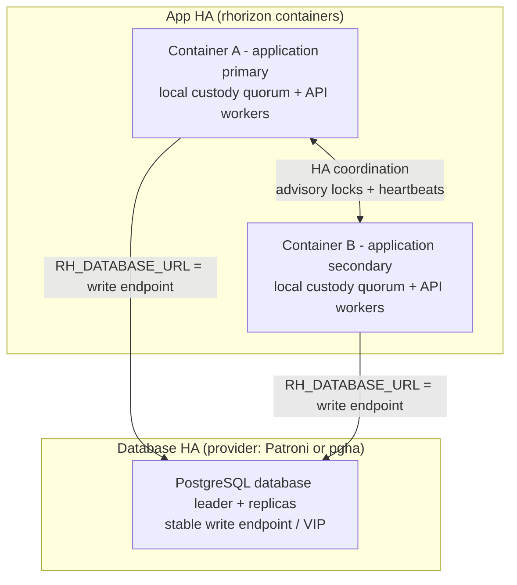

# HA cluster

For the complete production target, meaning one stable HTTPS endpoint, two
redundant edges, three API nodes, three Database HA members, worker convergence,
retry safety, audit jobs, and release gates, start with
[Production HA reference](HA-PRODUCTION-REFERENCE.md).

Native multi-host HA: a set of rhorizon containers that coordinate identity,
join via an HMAC-gated bootstrap, run an auto-promote election, and
mutually authenticate with per-node mTLS issued by a cluster CA. It sits on
top of a provider-neutral **Database HA** layer.
[Patroni](https://patroni.readthedocs.io/) is the reference Linux provider -- a
mature DCS-based control plane (etcd/consul), and the one the release lane
exercises. That DCS dependency is what makes it a poor fit on the BSDs, so
[`rhorizon-pgha`](PGHA.md) fills the same role there with a peer-quorum design
and no external arbiter. Patroni first if you are on Linux or Kubernetes,
`pgha` when you are not. A single PostgreSQL server is not an HA foundation.

## How it works

Three independent roles span the process, application, and database layers:

| Role | Scope | Responsibility |
|---|---|---|
| **Local custody leader** | one custody process per API host | holds that host's sub-keys; in embedded mode it is an API worker, in separated mode it belongs to the Rust/Python custodian pool |
| **Application primary** | one rhorizon container in the application cluster | holds cross-cluster singleton locks: DEK rotation, audit compaction, password rotation |
| **Database leader** | one PostgreSQL member selected by the Database HA provider | accepts writes through the stable database write endpoint/VIP and streams WAL to replicas |

The roles never imply one another. Every application container normally has
its own local custody leader, including an application secondary. The
application primary does not have to run on the host that owns the database
leader or write VIP. Process state lives in `vault_workers` (`worker_state`);
application state lives in `vault_cluster_nodes` (`ha_state`). PostgreSQL is
the single source of truth. Rhorizon coordinates application state with
advisory locks and heartbeats; the configured Database HA provider performs
database election and supervision (Patroni via its DCS, or `pgha` via its
BSD-native quorum mechanism).

In operator messages and incident reports, always qualify the role:
**local custody leader**, **application primary**, or **database leader**.
Bare “master” and “primary” are ambiguous.

**Process-worker replacement.** In embedded mode, local custody-leader election
reacts on the short heartbeat timeout. Separated custody uses its dedicated
supervisor and spare-share replacement. Separately, the maintenance reaper removes a
`vault_workers` row after five minutes without a heartbeat. If that process
later resumes, its next heartbeat cannot update the removed row: it immediately
closes its process-local crypto state and sends itself `SIGTERM`. The configured
Uvicorn/systemd/container supervisor must then start a clean worker, whose
registration always begins as `sealed` before follower attachment or election.
This replaces one process; it does not seal the cluster or interrupt healthy
workers. A process that remains completely frozen must be killed by the
supervisor watchdog because it cannot execute its own recovery path.

**Identity** - four identifiers:

| Identifier | Scope | Storage | Lifetime |
|---|---|---|---|
| `node_uuid` | per container | file `/var/lib/rhorizon/node-uuid` (0400) | survives restart; lost if the volume is destroyed |
| `cluster_id` | per cluster | encrypted in `vault_cluster_config` | set once at init, never rotates |
| `ha_password` | per cluster | encrypted under `ha_wrap_key` | bootstrap-only; rotatable |
| `node_cert` | per container | PEM `/var/lib/rhorizon/cluster-cert.{pem,key}` (0400) | issued by the cluster CA at JOIN, 90d (`cluster_node_cert_validity_days`), auto-renewed under 30d (`cluster_cert_renewal_threshold_days`) |

The `ha_password` only authenticates the **first** JOIN. After that the node
holds its `node_cert` and uses mTLS; rotating the `ha_password` does not evict
existing nodes.

**State machine** (`vault_cluster_nodes.ha_state`):

`unjoined -> joining -> quarantine -> secondary -> primary`, plus `draining`
and `evicted` for removal. A joining node sits in `quarantine` (steady
heartbeat + no role conflict) before becoming `secondary`. A returning
ex-application-primary self-demotes straight to `secondary` (no
re-quarantine); an anti-thrash cooldown keeps it out of the election pool
briefly.

**Application failover** - the application primary writes a short lease
(`primary_lease_expires_at`) every heartbeat. When it goes stale, each
application secondary waits a random jitter then races for
`pg_advisory_xact_lock('rhorizon:cluster:ha-primary')`; the winner writes its
application `ha_state` as `primary`. Auto-promote is on by default; the
operator endpoints are the manual override.

## Architecture



## Configuration

**Prerequisites** (without these the HA logic is fiction):

| Item | Why |
|---|---|
| Database HA (at least 3 PostgreSQL members) | a single PG is the real SPOF; use Patroni on the reference Linux topology or `pgha` on BSD, and see [HA-RUNBOOK.md](HA-RUNBOOK.md) section 0 |
| Stable database write endpoint/VIP | every application node must reach the current database leader without being configured to a member directly |
| TLS on every API endpoint | `/cluster/challenge` + `/cluster/join` carry secrets |
| Persistent volume `/var/lib/rhorizon` per container | holds `node-uuid` + `cluster-cert.*`; losing it forces JOIN-as-new |
| Private network between nodes (VPN / VLAN / ClusterIP) | never expose the API on the open internet |

**Environment variables**:

| Variable | Where | Meaning |
|---|---|---|
| `RH_CLUSTER_HA_ENABLED=true` | all nodes | enable the cluster layer |
| `RH_CLUSTER_ADVERTISE_IP` | all nodes | stable IP stored in membership and in the node-certificate SAN; required for managed multi-node deployments |
| `RH_TLS_ENABLED=true` | all nodes | required unless an external TLS proxy fronts the API |
| `RH_HA_AUTO_JOIN=true` | joiners | auto-JOIN at container start |
| `RH_HA_PRIMARY_URL` | all nodes | reachable member used for certificate refresh; the initializer may use its own URL |
| `RH_HA_SERVER_CA_FILE` | all nodes using private HTTPS PKI | CA/leaf pin used to verify the primary URL; empty uses the platform public trust store |
| `RH_CLUSTER_SERVER_CERT_MANAGED` | custom native deployments only | opt in only when the API owns writable HTTPS cert/key paths and a working nginx reload command; bundled Compose/Helm keep this false |
| `RH_HA_PASSWORD_FILE` | joiners | path to the **raw 32-byte** ha_password (not base64) |
| `RH_HA_BOOTSTRAP_VAULT_URL` | joiners | defaults to `RH_HA_PRIMARY_URL` |

The cluster layer stays off until `ha_enabled=true` in `vault_cluster_config`
(the migration default is off, so non-HA deployments are unaffected).

### Supported deployment contracts

HA is not enabled by merely increasing a replica count. Every node needs a
stable address, persistent `/var/lib/rhorizon`, HTTPS, an explicit trusted
proxy boundary and a unique node certificate.

| Installation | What Horizon configures | What the operator supplies |
|---|---|---|
| Native installer with nginx | persistent identity, HTTPS listener, loopback-only forwarded-certificate trust | stable node address, shared database endpoint and HA bootstrap password |
| Docker/Podman Compose | named identity volume, private bridge addresses, HTTPS/mTLS follows `RH_CLUSTER_HA_ENABLED` | stable host address, TLS files and the one-time JOIN overlay `tools/docker-compose.ha-join.yml` |
| Helm | API StatefulSet, one PVC per Pod, Pod IP advertisement, HTTPS/mTLS listener and NetworkPolicy paths | TLS Secret, frontend Pod CIDR, stable HTTPS service URL and one-time HA password Secret |

The application refuses to report a production-ready preflight when one of
these properties is only assumed. `RH_CLUSTER_IDENTITY_PERSISTENT=true` is a
deployment declaration; the real volume/PVC remains the operator's
responsibility.

Node mTLS certificates and the frontend HTTPS certificate have different
owners. Horizon always issues and renews the per-node mTLS identity. Compose,
Helm and the native installer keep their already-configured HTTPS certificate
under deployment control, so a read-only Kubernetes Secret or host bind is
never treated as writable. A custom native deployment may opt into Horizon
server-certificate rotation only when it provides writable
`RH_CLUSTER_SERVER_CERT_PATH`, `RH_CLUSTER_SERVER_CERT_KEY_PATH` and a tested
`RH_CLUSTER_NGINX_RELOAD_CMD`.

For a Docker/Podman installation created by `tools/install.sh`, edit its
generated `.env` on every host:

```ini
RH_CLUSTER_HA_ENABLED=true
RH_CLUSTER_ADVERTISE_IP=10.0.0.21
RH_HA_PRIMARY_URL=https://vault.internal:8443
RH_HA_SERVER_CA_FILE=/ha-server-certs/cert.pem
```

The primary starts normally and is initialized once. A secondary performs its
first JOIN with the installed one-time overlay:

```bash
export RH_HA_PASSWORD_HOST_FILE=/run/secrets/rhorizon/ha-password
docker compose -f docker-compose.yml -f docker-compose.ha-join.yml \
  --env-file .env up -d
```

After its certificate is persisted, start it again without the overlay and
securely remove the raw password file. The installer preserves the HA fields
on upgrades; it never stores the bootstrap password in `.env`.

## Options

Runtime settings (`RH_` environment prefix; defaults shown):

| Key | Default | Effect |
|---|---|---|
| `cluster_heartbeat_interval_secs` | 3 | per-node liveness write cadence |
| `cluster_state_machine_interval_secs` | 2 | how often secondaries evaluate transitions/election |
| `cluster_reaper_interval_secs` | 30 | orphan-row / drain-deadline sweep cadence |
| `cluster_join_quarantine_secs` | 60 | hold a joiner in `quarantine` before `secondary` |
| `cluster_joining_orphan_ttl_secs` | 90 | delete rows stuck in `joining`; never below quarantine plus the slower state/reaper poll |
| `cluster_drain_deadline_secs` | 30 (5-600) | grace before a draining node is evicted |
| `cluster_primary_lease_ttl_secs` | 20 (5-3600) | autonomous-failover lease; must be at least 3x heartbeat |
| `cluster_frozen_max_secs` | 30 (20-86400) | grace spent `FROZEN` and non-serving before sealing and dropping keys |
| `cluster_auto_promote_cooldown_secs` | 20 | hold a just-demoted node out of the election pool for at least one lease; 0 disables |

`FROZEN` is not a period in which the node continues serving. After the last
PostgreSQL confirmation, the node rejects requests when the lease expires (20s
by default), retains its keys for the configured grace, then seals. An isolated
node therefore seals after approximately
`cluster_primary_lease_ttl_secs + cluster_frozen_max_secs`.

Recommended `RH_CLUSTER_FROZEN_MAX_SECS` profiles:

| Deployment | FROZEN grace before seal |
|---|---:|
| same datacenter / same LAN | 20-30s (`30` default) |
| multi-site, same region | 45-60s |
| multi-region | 90-120s |

Use the upper bound when measured PostgreSQL, VIP or routing failover already
approaches the lower bound. mTLS peers that prove a shared database outage may
extend key retention, but can never return the node to service, up to the
bounded ceiling of three times this grace. Without peer evidence, the table
value is the effective limit.

Set `RH_CLUSTER_FROZEN_MAX_SECS` explicitly before a multi-site rollout. If it
is unset, the 30s same-LAN default applies when the service starts.

## Commands

CLI:

```bash
rhorizon cluster init --cluster-name <name> --save-ha-password ./ha_password.b64
rhorizon cluster status                 # members, ha_state, heartbeats, cert expiry
rhorizon cluster health                 # app + node + database + Database HA
rhorizon cluster preflight              # configuration + health + live HTTPS/mTLS proof
rhorizon cluster join --timeout 60      # poll a joiner until it has an ha_state
```

`cluster status` describes application membership; it does not identify the
database leader. `cluster health` is the end-to-end readiness view. Its dots
have one meaning everywhere in the CLI and HA tab:

| Dot | State | Meaning |
|---|---|---|
| green `●` | `green` | verified healthy |
| orange `●` | `orange` | forming, recovering, or degraded |
| red `●` | `red` | verified unsafe or unavailable |
| black/grey `○` | `grey` | unknown, disabled, or not configured; never proof of health |

The HA tab shows the three roles separately. Database HA includes the provider,
leader count (and identity when the provider reports it), members, streaming
state and lag; `pgha` additionally reports leader identity, agent freshness,
quorum, and write-VIP ownership. Patroni's normalized probe verifies that
exactly one leader exists but does not expose its member name or external VIP
owner. Provider-specific evidence stays labeled rather than being presented as
generic application state.

API (all under `/api/v1/vault/cluster/`):

| Method | Path | Auth | Purpose |
|---|---|---|---|
| POST | `init` | `cluster:w` (once) | mint `cluster_id` + `ha_password` + cluster CA (atomic) |
| POST | `challenge` | rate-limited | JOIN step 1: server nonce bound to (node_uuid, source_ip), 30s TTL |
| POST | `join` | HMAC (first) / mTLS (rejoin) | JOIN step 2: proof + per-node cert mint |
| GET | `ha` | `cluster:r` | members, `ha_state`, quarantine timers, heartbeats, conflicts |
| GET | `ha/self` | any bearer | a joiner polls its own state transition |
| POST | `promote/{uuid}` | `cluster:w` | force `secondary -> primary` |
| POST | `demote/{uuid}` | `cluster:w` | force application `primary -> secondary` (do this before drain/evict of an application primary) |
| POST | `drain/{uuid}` | `cluster:w` | graceful removal (finish in-flight, then evict) |
| POST | `evict/{uuid}` | `cluster:w` | immediate removal + revoke `node_uuid` |
| POST | `unrevoke/{uuid}` | `cluster:w` | undo an eviction's revoke (does not re-add the node) |
| POST | `rotate-ha-password/{stage,confirm,cancel}` | `admin:w` | rotate the bootstrap secret (certs untouched) |
| POST | `refresh-cert` | mTLS | node self-renews **its own** cert (cert CN is the sole target) |
| POST | `rotate-cert/{node_uuid\|all}` | `admin:w` | operator force-renew: flips `force_renew_at`, the node's renewal loop then calls `refresh-cert` |
| GET | `ca-bundle` | `cluster:r` | cluster CA cert PEM + SHA-256 fingerprint (public material only) |
| POST | `rotate-ca` | `admin:w` | mint a fresh cluster CA, previous kept for a grace window |
| POST | `issue-server-cert` | `admin:w` | mint a CA-signed nginx server cert |
| GET | `ha/membership/{node_uuid}` | none | minimal public lookup used only to resolve JOIN retries |
| GET | `health` | `cluster:r` | end-to-end readiness (app + node + database + Database HA) |
| GET | `preflight?live=false` | `cluster:r` | bounded readiness checklist with stable IDs, reasons and remediations |
| GET | `preflight?live=true` | `cluster:r` | the same checklist plus a real node-cert -> HTTPS frontend -> API mTLS probe |
| GET | `mtls-self` | mTLS | minimal identity endpoint used only by the live probe |
| POST | `repair` | `cluster:w` | operator repair path for inconsistent cluster state |

Metrics: `rhorizon_cluster_state_transitions_total`,
`rhorizon_cluster_join_attempts_total{outcome}`,
`rhorizon_cluster_rpc_latency_seconds{op}`,
`rhorizon_cluster_uuid_ip_conflicts_total`, and rotation/reaper counters.

## Quick start

1. **Pre-flight** on every node: vault unsealed, `RH_CLUSTER_HA_ENABLED=true`,
   `/var/lib/rhorizon` persistent, `/run/rhorizon` tmpfs 0700, TLS on.

2. **Init** on the first node (the printed `ha_password` is shown once):

   ```bash
   rhorizon cluster init --cluster-name rhorizon-ha-prod --save-ha-password ./ha_password.b64
   base64 -d < ./ha_password.b64 > ./ha_password.raw && chmod 0400 ./ha_password.raw
   shred -u ./ha_password.b64
   rhorizon cluster status        # one member, ha_state=PRIMARY
   ```

3. **Distribute** the ha_password out of band (`docker secret create` /
   `kubectl create secret` / `scp` to `/run/secrets/ha_password`, mode 0400).

4. **Boot each joiner** with `RH_HA_AUTO_JOIN=true`,
   `RH_HA_PRIMARY_URL=...`, `RH_HA_PASSWORD_FILE=/run/secrets/ha_password`.
   Auto-JOIN runs `challenge` -> `join`, receives the signed cert, and persists
   it. Watch it land:

   ```bash
   rhorizon cluster join --timeout 60
   rhorizon cluster status        # 1 PRIMARY + N-1 SECONDARY, heartbeats < 5s
   ```

5. **Hygiene**: remove the `ha_password` secret once joiners hold their certs
   (steady-state mTLS does not use it), save the `ca_fingerprint` somewhere
   operators can compare, and run one rotation drill before production traffic.

6. **Prove the deployment**, do not infer it from green containers:

   ```bash
   rhorizon cluster preflight
   ```

   The command exits `2` while a blocking check fails. The Web UI shows the
   same check IDs and remediations. MCP receives the bounded, topology-free
   projection and never triggers the live network probe.

## Troubleshooting

Detailed step-by-step recovery lives in
[HA-RUNBOOK.md](HA-RUNBOOK.md) section 3. Common cases:

| Symptom | Action |
|---|---|
| Application primary wedged / crashed | auto-promote elects a new application primary within `lease_ttl + skew`; if not, `rhorizon cluster promote {uuid}` on a healthy application secondary |
| Database leader missing or replicas not streaming | inspect `rhorizon cluster health` and the configured Database HA provider; do not promote an application node to repair a database election |
| Database HA is black/grey | configure/fix the provider status endpoints; unknown is not safe enough for failover drills or K7 |
| Joiner stuck in `joining` | check TLS + `RH_HA_PRIMARY_URL`; orphan rows are reaped after `cluster_joining_orphan_ttl_secs`; verify (uuid, source_ip) has no conflict in `GET /cluster/ha` |
| Joiner rejected 403 after a mistaken evict | `POST /cluster/unrevoke/{uuid}`, then restart the joiner to re-JOIN under the same UUID |
| Node cert near expiry | nodes auto-renew under 30 days; force with `POST /cluster/rotate-cert/{node_uuid}` (or `/all`) |
| `ha_password` suspected leaked | `rotate-ha-password/stage` then `confirm`; existing nodes keep working via mTLS |
| Cluster CA leak suspected | rotate the CA + broadcast `refresh-cert`; see runbook section 3.2 |
| Volume wiped (fresh `node_uuid`) | the node JOINs as new; evict the dead UUID once it ages out |
| Drain/evict an application primary returns `409 demote first` | `POST /cluster/demote/{uuid}` first, then drain/evict |

See also: [HA-RUNBOOK.md](HA-RUNBOOK.md) (Database HA layer, rolling restart,
failure-response matrix, full recovery), [HA-BENCH.md](HA-BENCH.md) (failover
timing under load).
