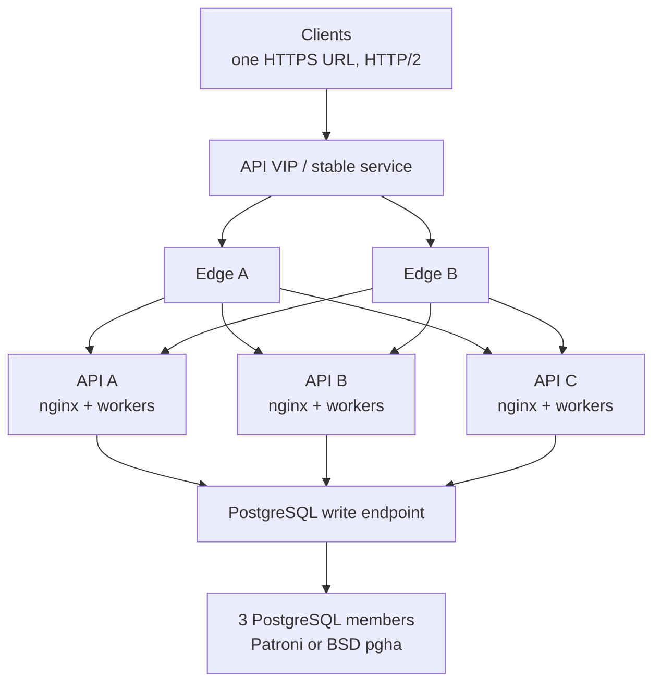

# Production HA reference

French: [Référence HA de production](fr/HA-PRODUCTION-REFERENCE.md).

This is the production topology and acceptance standard. Architecture details
are in [HA-CLUSTER.md](HA-CLUSTER.md); recovery commands are in
[HA-RUNBOOK.md](HA-RUNBOOK.md).

## Topology

Clients use one HTTPS address. Two edge instances own that address and route to
three active API nodes. All API nodes use one stable PostgreSQL write endpoint
backed by three supervised database members.



| Layer | Count | Requirement |
|---|---:|---|
| Client endpoint | 1 | stable hostname and certificate identity |
| Edge | 2 | separate failure domains |
| API | 3 | separate hosts; persistent `/var/lib/rhorizon` per node |
| Workers | 5 per reference Linux API | one local crypto master plus four followers |
| PostgreSQL | 3 | separate storage/host failure domains |
| Database supervision | odd quorum | Patroni+DCS on Linux/Kubernetes; `pgha` on BSD |
| Backup | off-host | encrypted backup, WAL archive, tested restore |

Use anti-affinity across hypervisors and power domains. A lab may co-locate
roles; production should not make edge, API, database, quorum and monitoring
share one failure domain.

## Roles

| Role | Count | Responsibility |
|---|---:|---|
| Local crypto master | one per API node | holds in-memory sub-keys; followers use local RPC |
| Application primary | one per rhorizon cluster | owns singleton cluster work |
| Database leader | one per Database HA cluster | owns the writable PostgreSQL timeline |

These roles are independent. Application promotion does not repair the
database. Database failover does not choose the application primary. Use the
qualified role names in alerts and incident notes.

## Edge behavior

### HTTP/2 and TLS

- Offer TLS 1.2/1.3 and HTTP/2 on the client endpoint.
- Keep the client hostname and certificate unchanged during edge failover.
- Protect cluster traffic with mTLS or a private authenticated network.
- nginx may accept HTTP/2 and proxy to uvicorn over HTTP/1.1 on loopback.
- An HTTP/2 edge must not share one synchronous client connection across all
  request threads. The validated K7 profile uses four connections per backend,
  rotated at 900 requests before nginx's observed 1,000-request GOAWAY.
- Close a retired connection only after its final stream.

The four/900 profile is specific to the measured edge. Recalibrate when the
proxy or nginx connection limits change.

### Routing signals

| Signal | Edge action |
|---|---|
| `/health` = 200 | liveness only; do not route on this signal |
| `/readiness` = 200 | eligible after two consecutive successes |
| `/readiness` = 503 | eject: sealed, quarantined or fenced |
| application 429 + `Retry-After` | keep backend; apply client backoff |
| gateway 502/504 from a backend | eject immediately |

After unseal, wait for both readiness and worker convergence. The management
topology must show one local crypto master, the configured number of workers,
all other workers as fresh followers, and application state `primary` or
`secondary`. Do not replace this gate with a fixed sleep.

### Retries and errors

| Request | Policy after transport failure or 502/503/504 |
|---|---|
| `GET`, `HEAD`, `OPTIONS` | bounded retry on another ready backend |
| `POST`, `PUT`, `PATCH`, `DELETE` | no proxy replay without application idempotency |

An unsafe request caught during failover returns JSON such as:

```json
{
  "error": "transaction_outcome_uncertain",
  "reason": "upstream_gateway_failure",
  "retryable": false,
  "outcome": "uncertain",
  "upstream_status": 502
}
```

A healthy cluster at its admission ceiling returns `429 capacity_overloaded`
with `Retry-After`. It remains ready. Do not report capacity pressure as 503.

**Admission control is off by default and must be enabled for production.**
`RH_MAX_CONCURRENT_REQUESTS` defaults to `0` (disabled) - no image, compose
file or preset sets it. Left at `0`, a saturated worker queues to the client
timeout instead of shedding, and the go-live capacity check below cannot pass.
Set a per-worker in-flight cap explicitly; ~2-4x the DB pool is a sane start
(with the reference `pool_size + max_overflow = 16`, that is roughly 32-64),
and small nodes want the low end. Calibrate the operating ceiling from capacity
tests rather than adopting a number from this page.

`POST /unseal` has one separate reserved slot per worker so recovery remains
available at that ceiling. A second concurrent attempt returns the same 429
contract with `reason=unseal_concurrency_limit`; it does not queue behind
Argon2. This reserved slot is unconditional - it applies even while the
in-flight cap is disabled.

## API and application HA

Each API node requires:

- persistent `node_uuid` and cluster certificate under `/var/lib/rhorizon`;
- private `/run/rhorizon` tmpfs, mode 0700;
- nginx on the node address and uvicorn on loopback;
- HA and TLS enabled, with a strict trusted-proxy allowlist;
- monitoring for seal, quarantine, worker roles and heartbeat age.

Nodes start sealed. Recovery order is: start, unseal, wait for the local crypto
master and followers, confirm application membership, then re-enable the
backend.

Healthy application membership is exactly one application primary and two
secondaries, all with fresh heartbeats, valid certificates and no UUID/IP
conflict or transitional state. Ordinary traffic is active/active; the
application primary owns only singleton work.

## Database HA

All API workers use the stable write endpoint, never a PostgreSQL member
address. Database HA is green only when the provider reports one leader,
quorum, streaming replicas, known lag within budget and matching timelines.
`pgha` must also report one correct write-VIP owner.

Budget connections cluster-wide:

```text
api_nodes × workers_per_node × (pool_size + max_overflow)
    <= 0.8 × PostgreSQL max_connections
```

Reference budget:

```text
3 × 5 × (8 + 8) = 240 application connections
PostgreSQL max_connections = 300
reserve = 60
```

Recalculate before adding workers or raising concurrency. Track pool wait time
and `pg_stat_activity`.

### WAL and storage

- Set a finite `max_slot_wal_keep_size` (4 GB on the 20–40 GB lab volume).
- Treat `wal_keep_size` as a minimum and `max_wal_size` as a soft target.
- Fence live-but-stale replicas and release slots for absent members.
- Monitor replication state, lag, timeline, archive command and disk usage.
- Alert before filesystem or `pg_wal` reaches 70%.
- Never remove files manually from `pg_wal`; rebuild stale replicas.
- Keep encrypted off-host backups and test restores.

Performance and chaos preflight must fail if database health, Database HA,
replication, WAL, archive, disk reserve or write-endpoint ownership is not
green.

## Audit

Audit recording remains enabled under load. Full verification runs outside the
request lifetime through the durable job API:

```text
POST /api/v1/vault/audit/verify/jobs
GET  /api/v1/vault/audit/verify/jobs/{job_id}
```

One job runs cluster-wide, persists in PostgreSQL, heartbeats and can be
reclaimed after worker failure. Run it before and after a fault campaign. Use
bounded audit-lite canaries during active load. Include audit tables, indexes,
WAL and retention in storage planning.

## Status and monitoring

| Dot | Meaning | Chaos/release gate |
|---|---|---|
| green `●` | verified healthy | pass |
| orange `●` | forming, recovering or degraded | stop |
| red `●` | unsafe or unavailable | stop |
| black/grey `○` | unknown or unconfigured | stop |

Monitor edge backend state/protocol/errors, API latency/429/pool waits, worker
coverage, application leases/elections/certificates, database leader/quorum/
VIP/lag/timeline/WAL/archive/disk, and audit job progress/results.

## Mutation idempotency

Immediate backend ejection cannot determine whether an already-dispatched
mutation committed. Safe replay requires an application contract:

1. Client supplies an `Idempotency-Key` with at least 128 bits of entropy.
2. The application scopes it to actor, method, canonical route and request hash.
3. PostgreSQL records pending/final state atomically with the operation.
4. Reusing the key with another request hash returns 409.
5. A completed replay returns the original response without a second side
   effect or audit action.
6. One-time tokens, PKI/KEM private keys and dynamic credentials are cached
   encrypted, authorization-bound and short-lived.
7. The edge retries mutations only on endpoints covered by this contract.

Until then, keep the structured uncertain response and reconcile the operation.

## Go-live checks

- [ ] One client URL, two healthy edges, three ready API nodes.
- [ ] One local crypto master and all configured followers on every API host.
- [ ] One application primary and two secondaries with fresh heartbeats.
- [ ] Three supervised PostgreSQL members and one stable write endpoint.
- [ ] Connection reserve, replication, WAL/archive, disk and restore checks pass.
- [ ] HTTP/2 load crosses several connection rotations without transport errors.
- [ ] API-node loss masks reads and reconciles unsafe mutations.
- [ ] Database-leader loss produces one successor and correct endpoint movement.
- [ ] `RH_MAX_CONCURRENT_REQUESTS` set to a non-zero, calibrated cap (it is `0`/disabled by default).
- [ ] Capacity pressure returns structured 429, not raw 502/503.
- [ ] Full asynchronous audit verification passes before and after fault tests.
- [ ] No HA component is orange, red or grey.

Run a long soak only after these bounded checks pass.

## Maintenance and upgrades

Change one failure domain at a time. Keep edge, API and database upgrades in
separate stages.

### Rolling compatibility

Use a rolling API upgrade only when release notes confirm:

- old and new APIs may share the database;
- schema changes are backward-compatible with the previous API;
- cluster RPC, membership and stored formats remain compatible;
- no one-shot rewrite requires all APIs to stop.

An idempotent schema installer does not prove downgrade compatibility. If any
condition is unknown, close client writes and use a maintenance window.

### Preflight

1. Require all HA, worker, database, WAL, disk and audit checks green.
2. Wait for rotations, rekey, restore and full audit jobs to finish.
3. Confirm two API nodes can carry expected traffic.
4. Record versions, image digests, config, leaders, timelines and lag.
5. Create an encrypted backup and database-consistent restore point; verify WAL
   archiving.
6. Read release/provider notes and pre-pull signed, pinned artifacts.
7. Freeze unrelated configuration and key rotations.

### Edge

1. Remove edge B from VIP/service ownership and upgrade it.
2. Validate config, TLS, HTTP/2, health checks, retries, 429 and metrics.
3. Send canary traffic or move the VIP to B.
4. Upgrade A, validate it and restore redundancy.

The client URL and certificate identity remain unchanged.

### API

Upgrade application secondaries first and the application primary last:

1. Disable one secondary on both edges and drain in-flight requests.
2. Stop gracefully; preserve `/var/lib/rhorizon` and `node_uuid`.
3. Deploy the pinned artifact and start the service.
4. Unseal using the approved 2FA/Shamir procedure.
5. Wait for stable readiness, `secondary` membership, one local crypto master
   and all followers.
6. Re-enable it, run read/write canaries and observe a stability interval.
7. Repeat for the other secondary.
8. Hand the application-primary role to an upgraded secondary, verify its
   lease, then upgrade the former primary.

Keep at least two API nodes ready. Stop on audit, worker, membership, database
or transport regression.

### Database and quorum

Run database maintenance after the API rollout is accepted.

- Minor update: upgrade one replica, wait for convergence, upgrade the other,
  perform a planned switchover, then upgrade the former leader.
- Patroni: use `patronictl` and DCS-aware procedures.
- BSD `pgha`: use its supervisor procedure and verify quorum plus VIP owner.
- Major PostgreSQL upgrade: use the provider-supported `pg_upgrade`, blue/green
  or logical migration path in a maintenance window.
- Upgrade DCS/quorum members one at a time while retaining a majority.

After each member, require one leader, correct endpoint ownership, streaming
replicas, matching timelines, bounded lag and healthy WAL/archive/disk.

### Acceptance and rollback

Before reopening maintenance:

1. Re-run the go-live checks and authenticated feature canaries.
2. Complete a durable full audit verification.
3. Record final versions/digests and take a post-upgrade backup.

Rollback rules:

- Restore the previous edge/API artifact before schema or data changes.
- Run an older API after migration only when the release declares schema
  compatibility.
- Prefer a forward fix after incompatible migration. Backup restore is a
  cluster-wide DR action with an explicit data-loss point.
- Never restore one PostgreSQL member into a live cluster or copy data between
  timelines. Use Patroni/`pgha` procedures.
- Do not reverse completed key, CA, token or audit-key rotations with stale
  state.
- Keep writes closed when integrity, leadership or compatibility is uncertain.
