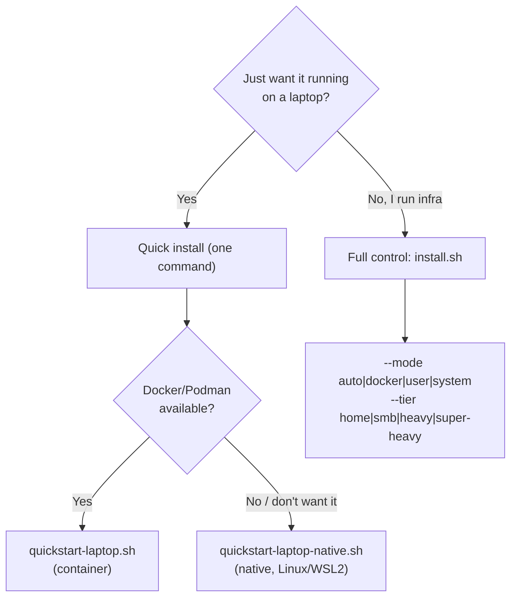

# Install

Two ways in. Pick by how much control you want.



## Quick install (one command)

Laptop/personal setup with safe defaults (localhost bind, `home` tier, one
prompt at most). Both flavors install the vault, mint a scoped MCP access key
for your AI assistant, and print a copy-paste config block.

**Container (Docker or Podman) — macOS, Windows, Linux:**

```bash
curl -fsSL https://raw.githubusercontent.com/JR-Shdw/Horizon/main/tools/quickstart-laptop.sh | bash
```

**Native (no container) — Linux, WSL2:**

```bash
curl -fsSL https://raw.githubusercontent.com/JR-Shdw/Horizon/main/tools/quickstart-laptop-native.sh | bash
```

The native path needs `sudo` (for system packages + PostgreSQL). It also turns
on whole-process memory locking when the host has unencrypted swap; see
[Memory protection and swap](DEPLOYMENT.md#36-memory-protection-and-swap).

## Full control (power user)

One entry point picks a strategy and sizes the stack:

```bash
sh tools/install.sh [--mode auto|docker|user|system] [--tier home|smb|heavy|super-heavy]
```

**Modes** (how it runs):

| Mode | Runs as | What you get |
|---|---|---|
| `auto` (default) | — | Docker/Podman if present, else native `system` (root) or `user` (non-root) |
| `docker` | container | Compose stack (Docker or Podman auto-detected) |
| `user` | your user | Native, XDG dirs, `systemd --user` (nohup fallback), no root service |
| `system` | root | Native, FHS dirs, systemd-system / rc.d, SELinux/AppArmor confinement |

**Tiers** (how big) — one knob for both container and native:

| Tier | Workers | Total RAM |
|---|---|---|
| `home` | 1 | ~600 MB |
| `smb` | 5 | ~1.6 GB |
| `heavy` | 10 | ~2.7 GB |
| `super-heavy` | 20 | ~5 GB |

On the container path a tier loads `tools/presets/<tier>.env`; on the native path
it maps to `--workers` (memory derives from the worker count). Details and the
full deployment reference live in [`DEPLOYMENT.md`](DEPLOYMENT.md).

## OS coverage

| OS | Container | Native |
|---|---|---|
| Linux (Debian/Ubuntu/Arch/Fedora/Rocky/openSUSE) | yes | yes (per-OS driver) |
| WSL2 | yes | yes |
| macOS | yes | not yet (use container) |
| FreeBSD / OpenBSD / NetBSD | no (no Docker) | yes (native, root) |
| Windows | via Docker Desktop | not planned |

aarch64 is supported on both paths. The native path shares one driver-based
trunk (`tools/install-native.sh` + `tools/drivers/<os>.sh`); the container image
is OS-agnostic, so the container path behaves the same on any host that runs
Docker or Podman.

## After install

The vault is **sealed** on every boot by design. Unseal it, then it stays open
for your crons/agents until reboot or an explicit seal. See
[`DEPLOYMENT.md`](DEPLOYMENT.md) for production hardening, TLS, reverse-proxy/SSO,
LDAP, multiworker, backup, and the memory-protection model.
