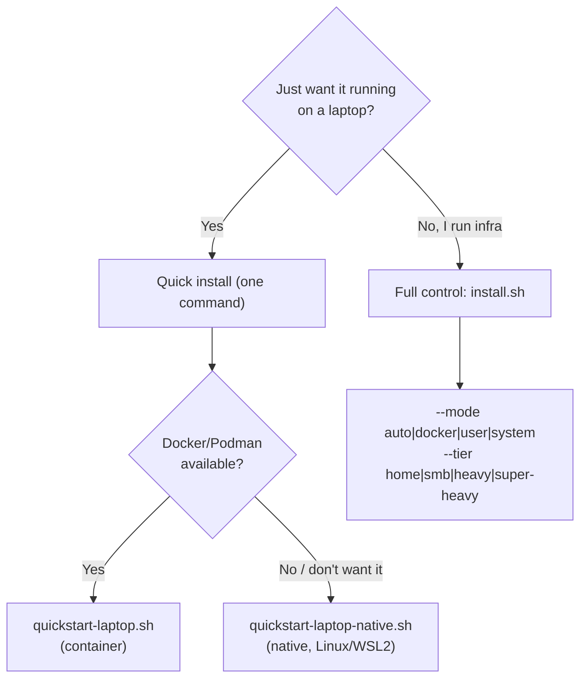

# Install

The complete install reference: every supported path in, how to check it
worked, how to upgrade it, and how to remove it.

The README's "Install in 5 minutes" is the quick path only. It is deliberately
not complete -- it gets a laptop running and stops there. This page is the one
that covers the rest.

| You want | Go to |
|---|---|
| One command on a laptop | [Quick install](#quick-install-one-command) |
| Choose runtime and size | [Full control](#full-control-power-user) |
| Native, per-OS detail | [`INSTALL-NATIVE.md`](INSTALL-NATIVE.md) |
| First secret, first unseal | [`QUICKSTART.md`](QUICKSTART.md) |
| Support tiers per platform | [`COMPATIBILITY.md`](COMPATIBILITY.md) |
| Production hardening | [`DEPLOYMENT.md`](DEPLOYMENT.md) |

Two ways in. Pick by how much control you want.



## Quick install (one command)

Laptop/personal setup with safe defaults (localhost bind, `home` tier, one
prompt at most). Both flavors install the vault, mint a scoped MCP access key
for your AI assistant, and print a copy-paste config block.

**Container (Docker or Podman) — macOS, Windows, Linux:**

```bash
curl -fsSL https://raw.githubusercontent.com/JR-Shdw/Horizon/main/tools/quickstart-laptop.sh | bash
```

**Native (no container) — Linux, WSL2:**

```bash
curl -fsSL https://raw.githubusercontent.com/JR-Shdw/Horizon/main/tools/quickstart-laptop-native.sh | bash
```

The native path needs `sudo` (for system packages + PostgreSQL). It also turns
on whole-process memory locking when the host has unencrypted swap; see
[Memory protection and swap](DEPLOYMENT.md#36-memory-protection-and-swap).

## Full control (power user)

One entry point picks a strategy and sizes the stack:

```bash
sh tools/install.sh [--mode auto|docker|user|system] [--tier home|smb|heavy|super-heavy]
```

**Modes** (how it runs):

| Mode | Runs as | What you get |
|---|---|---|
| `auto` (default) | — | Docker/Podman if present, else native `system` (root) or `user` (non-root) |
| `docker` | container | Compose stack (Docker or Podman auto-detected) |
| `user` | your user | Native, XDG dirs, `systemd --user` (nohup fallback), no root service |
| `system` | root | Native, FHS dirs, systemd-system / rc.d, SELinux/AppArmor confinement |

**Tiers** (how big) — one knob for both container and native:

| Tier | Workers | Total RAM |
|---|---|---|
| `home` | 1 | ~600 MB |
| `smb` | 5 | ~1.6 GB |
| `heavy` | 10 | ~2.7 GB |
| `super-heavy` | 20 | ~5 GB |

On the container path a tier loads `tools/presets/<tier>.env`; on the native path
it maps to `--workers` (memory derives from the worker count). Details and the
full deployment reference live in [`DEPLOYMENT.md`](DEPLOYMENT.md).

## OS coverage

| OS | Container | Native |
|---|---|---|
| Linux (Debian/Ubuntu/Arch/Fedora/Rocky/openSUSE) | yes | yes (per-OS driver) |
| WSL2 | yes | yes |
| macOS | yes | not yet (use container) |
| FreeBSD / OpenBSD / NetBSD | no (no Docker) | yes (native, root) |
| Windows | via Docker Desktop | not planned |

aarch64 is supported on both paths. The native path shares one driver-based
trunk (`tools/install-native.sh` + `tools/drivers/<os>.sh`); the container image
is OS-agnostic, so the container path behaves the same on any host that runs
Docker or Podman.

Per-OS status, the full flag surface of `install-native.sh`, and the
system-vs-user layout are in [`INSTALL-NATIVE.md`](INSTALL-NATIVE.md).
Support tiers per platform are in [`COMPATIBILITY.md`](COMPATIBILITY.md).

## Check it worked

```bash
curl --cacert ~/rhorizon/certs/cert.pem https://127.0.0.1:8443/health
```

`/health` answers whether the process is up; it does **not** mean the vault is
usable, because a healthy vault is a sealed one until you unseal it. Adjust the
CA path and port if you changed `--dir` or `--api-port`.

## After install

The vault is **sealed** on every boot by design -- a reboot leaves no secret
readable until a human unseals it. Unseal once, and it stays open for your
crons and agents until the next reboot or an explicit seal.

Walk through the first unseal and first secret in
[`QUICKSTART.md`](QUICKSTART.md). Then [`DEPLOYMENT.md`](DEPLOYMENT.md) for
production hardening, TLS, reverse-proxy/SSO, LDAP, multiworker, backup, and
the memory-protection model.

## Upgrade

| Path | Procedure |
|---|---|
| Container | [`DEPLOYMENT.md` section 10](DEPLOYMENT.md#10-updates) - pull the new images and recreate |
| Native | [`INSTALL-NATIVE.md` section 10](INSTALL-NATIVE.md#10-upgrade-procedure) - re-run the installer over the existing install |

Both keep your data: the database, the audit log and the master password are
untouched. The vault comes back **sealed**, as it does after any restart.

## Uninstall

Native installs have a dedicated reverser. It mirrors the path derivation of
`install-native.sh`, guards every step on presence, and is safe to re-run or to
run against a half-finished install:

```bash
sh tools/uninstall-native.sh [--mode user|system] [--purge-db] [--yes] [--dry-run]
```

| Flag | Effect |
|---|---|
| `--mode user\|system` | Which install to reverse. Defaults to `system` -- pass `user` for a `--mode user` install or it will look in the wrong places |
| `--purge-db` | **Also drops the PostgreSQL role and database.** Without it the data survives the uninstall |
| `--yes` / `-y` | Skip the confirmation prompt |
| `--dry-run` | Print what would be removed and change nothing |

Run it with `--dry-run` first. Without `--purge-db` your secrets remain in
PostgreSQL and a later reinstall picks them back up; with it, they are gone and
only a backup brings them back -- see
[`DISASTER-RECOVERY.md`](DISASTER-RECOVERY.md).

For a container install, remove the stack and its volumes from the install
directory (`~/rhorizon` by default):

```bash
cd ~/rhorizon && docker compose down -v      # -v also deletes the database volume
```
