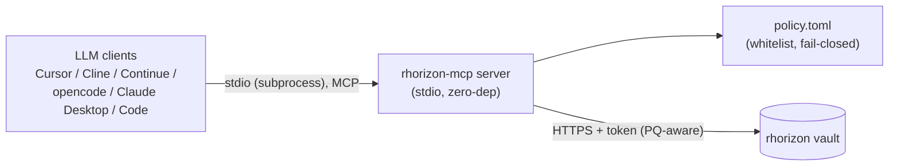
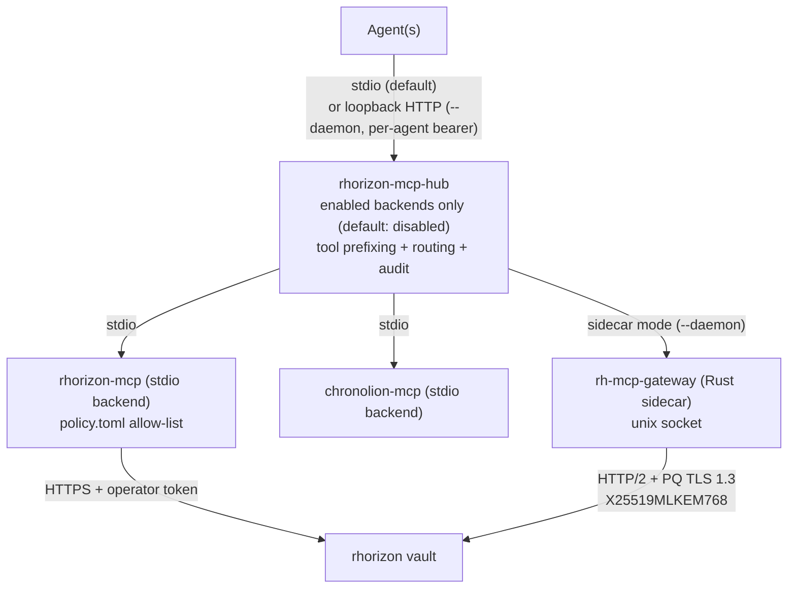
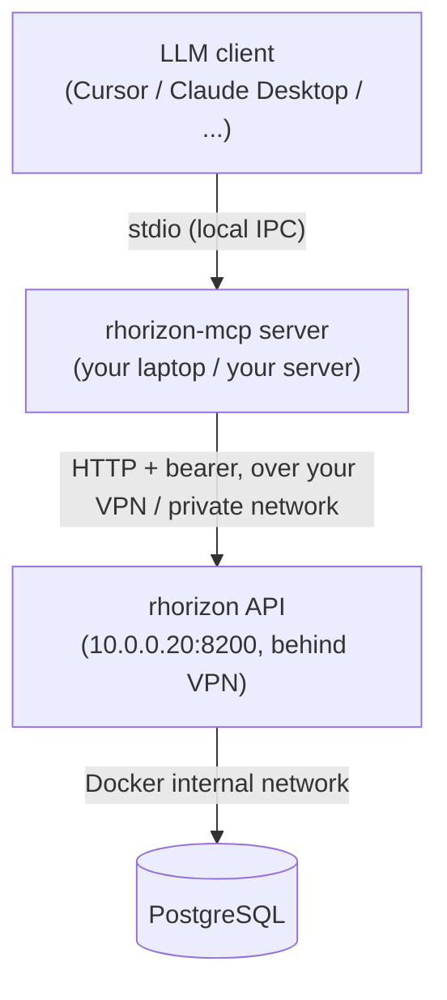

# MCP - Model Context Protocol integration

Resurgamus Horizon ships an **MCP server** (`mcp/rhorizon_mcp/`) that
exposes a curated set of vault operations as MCP tools. LLM clients
that speak MCP - Cursor, Cline, Continue, opencode, Claude Desktop,
Claude Code - can call these tools. MCP tool payloads do not expose the vault
token; allow-listed secret values are returned to the LLM when it calls
`vault_get_secret`.

The MCP server is the **trust boundary** between the LLM and the
vault: it holds the token, it consults a policy whitelist, and it
fails closed.

For the use of long-lived tokens, ephemeral tokens, and the rest of
the auth model independently of MCP, see
[`SECRETS-AND-TOKENS.md`](SECRETS-AND-TOKENS.md).

For non-MCP agent integration patterns (Ansible, CI/CD, K8s init
containers), see [`USE-CASES.md`](USE-CASES.md) and [`K8S.md`](K8S.md).

---

## 1. Architecture

`rhorizon-mcp` is **stdio-only** and has **zero third-party dependencies** --
MCP-over-stdio (newline-delimited JSON-RPC 2.0) implemented directly on the
Python standard library. An LLM client spawns it as a subprocess and calls
tools over stdin/stdout. Cloud/remote agents that cannot fork, or setups
fronting several backends behind one endpoint, use the stdio federation hub
`mcp-hub` (section 7).

> This is the **server**: stdio, one vault, one operator token. HTTP-facing
> agents, multi-backend federation, and per-agent identity are the **hub**'s
> job (`mcp-hub`, section 7) -- not the server's. The prior SDK build folded an
> HTTP transport into the server; that concern now belongs to the hub and its
> per-host daemon described in section 7.



| Layer | What it knows | What it does |
|---|---|---|
| LLM client | The names of MCP tools (e.g. `vault_get_secret`) | Calls tools by name, hands the LLM the result |
| `rhorizon-mcp` server | The vault token, the policy, the LLM session | Validates each call against `policy.toml`, forwards to vault on success, returns a structured error on denial |
| `policy.toml` | A whitelist of allowed secrets and tools | Determines what the LLM is **allowed** to ask for |
| rhorizon vault | The encrypted secrets, the audit chain | Authenticates the MCP server's token, logs every read with `actor=<token-name>` |

The server reads the vault token at startup from `RH_TOKEN_FILE` (mode 0600)
and does not include it in MCP schemas or responses. The account running the
server and host root can still read the file or process memory; they are part
of the trust boundary. The vault audits each read as `actor=<token-name>`.
TLS to the vault is PQ-aware
(`RH_VAULT_PQ=prefer|require`, X25519MLKEM768) when the vault is HTTPS on
OpenSSL 3.5+.

---

## 2. Why this design

The direct integration would hand the LLM a token and let it call the
vault directly. That fails on three counts:

1. **Token disclosure.** A token in the LLM's context can be exfiltrated
   on any prompt-injection vector. Treat the LLM as a confused-deputy.
2. **No filtering.** The vault token's scope is broad (e.g. `secrets:r`
   on a whole namespace). The LLM might only need 3 specific secrets
   out of 100. There is no way to express "read these 3, deny the rest"
   without a layer in between.
3. **Audit attribution is coarse.** Every audit entry says "this token
   read X" - but which LLM session, which user prompt? The MCP server
   sets `actor=<token-name>` per call, and you can correlate with the
   client's session log on your side.

The MCP server inserts the layer that handles all three.

---

## 3. The policy whitelist

`policy.toml` is **mandatory and fail-closed**. If the file is missing
or empty, the MCP server starts in `deny_all` mode - every LLM request
is refused. This is intentional.

```toml
# ~/.config/rhorizon-mcp/policy.toml
[secrets]
# Fully-qualified secret names. Anything not listed is denied.
whitelist = [
    "mcp/mail/imap-host",
    "mcp/mail/imap-user",
    "mcp/mail/imap-password",
]

[namespaces]
# Coarser allow: every secret in a namespace is reachable.
# Use sparingly; whitelist is preferred.
allow = ["mcp/demo"]

[tools]
# Which MCP tools the LLM is allowed to call at all.
allow = [
    "vault_status",
    "vault_whoami",
    "vault_list_namespaces",
    "vault_list_secrets",
    "vault_get_secret",
    # Optional: add vault_audit_tail only if the vault token also has audit:r.
    # Optional: add vault_cluster_health only if the vault token has cluster:r.
    # It answers "is my cluster healthy?" without granting admin, and returns
    # only states and reasons - no member names, lag figures or timelines.
    # Optional: vault_cluster_preflight needs the same cluster:r permission.
    # It returns stable checks/remediations but never starts a live probe.
]
```

**Two layers of permission**:

| Layer | Where | Granularity |
|---|---|---|
| Token scope + namespace | rhorizon vault (server-side) | Coarse - which namespaces the token can reach at all |
| `policy.toml` whitelist | rhorizon-mcp server | Fine - which specific secrets the LLM can ask for |

The token scope is your **upper bound**; the policy is what you let the
LLM actually do within that bound.

---

## 4. Available MCP tools

| Tool | Purpose | Side effect |
|---|---|---|
| `vault_status` | Returns sealed/unsealed, version, 2FA mode | None |
| `vault_whoami` | The token's own scope and namespaces | None |
| `vault_list_namespaces` | Namespaces visible to the token | None |
| `vault_list_secrets` | Secret **names** (never values) in a namespace | None |
| `vault_get_secret` | The value of a whitelisted secret | Audit log entry |
| `vault_call_api` | Optional: call a third-party API with a bound credential attached, without disclosing it (section 4.1); refused unless the operator wrote a binding | Audit log entry + one outbound request |
| `vault_audit_tail` | Optional: last N audit entries; requires the vault token to have `audit:r` | None |
| `vault_cluster_health` | Optional: cluster + PostgreSQL HA health (overall state, readiness, per-component state and reason); requires the vault token to have `cluster:r` | None |
| `vault_cluster_preflight` | Optional: topology-free HA checks with stable IDs, reasons and remediations; passive (`live=false`), requires `cluster:r` | None |

`vault_cluster_preflight` is suitable for diagnosis and automation. It cannot
certify the active HTTPS/mTLS route because an MCP model must not generate
repeated network probes. An operator performs that proof with
`rhorizon cluster preflight` or the Web UI button.

The set is intentionally narrow: read-only on secrets, no
token-management ops, no seal/unseal. If you want the LLM to do
something beyond reading, write a new MCP tool that wraps the
operation behind your own policy logic - don't expose the raw vault
endpoint.

Some clients display the tool name exactly as above. opencode prefixes
tools with the MCP server name, so a server configured as `"rhorizon"`
may show `rhorizon_vault_get_secret` instead of `vault_get_secret`.

### 4.1 The credential proxy: use a credential without reading it

`vault_get_secret` hands the value to the model, and it then lives in the
conversation history, outside the vault's control. That is the right trade for
some credentials and the wrong one for others.

Credentials are distributed at three tiers. They are alternatives, not stages:
pick per credential.

| Tier | Mechanism | The credential ends up in |
|---|---|---|
| 1 | `vault_get_secret` | the model's context, and the client's history |
| 2 | `rh-fetch` / `rh-inject` / `rh-watch` | a workload's tmpfs or environment |
| 3 | `vault_call_api` | nowhere the agent can read |

At tier 3 the agent names a credential and a request; Horizon performs the
authenticated call and returns only the upstream's answer:

```
vault_call_api(credential="github-prod", method="GET", path="/user/repos")
```

The caller supplies the method, the path and the query. It never supplies the
host, the injection point, or the credential format. Those come from the
operator's binding:

```toml
[proxy.github-prod]
namespace   = "mcp"
allow_read  = false          # vault_get_secret refuses this credential
allow_proxy = true
base_url    = "https://api.github.com"
methods     = ["GET"]
inject      = { type = "header", name = "Authorization", format = "Bearer {value}" }
```

`allow_read = false` is what makes the tier real: the same credential becomes
usable and unreadable, and the two tools cannot disagree about it. The table
goes in `policy.toml` for the stdio server and in `hub.toml` for the hub; with
no table at all, every proxied call is refused.

#### Binding options

| Key | Default | What it does |
|---|---|---|
| `namespace` | `"default"` | Where the credential lives in the vault. |
| `allow_read` | `false` | `false` makes `vault_get_secret` refuse this credential. Leaving it `true` gives you the proxy without the guarantee. |
| `allow_proxy` | `false` | Must be `true`. A table without it is inert. |
| `base_url` | *(none)* | `https://` only. May pin a path prefix (`https://gitlab.example/api/v4`), and the caller cannot climb out of it. |
| `methods` | `["GET"]` | Narrows what the credential may do *through the proxy*, independently of what the credential itself can do. |
| `inject.type` | `"header"` | Only `header` today. |
| `inject.name` | `"Authorization"` | Header the credential goes into. Framing headers (`Host`, `Content-Length`, …) are refused. |
| `inject.format` | `"Bearer {value}"` | Must contain `{value}`. Forgejo/Gitea want `token {value}`, Woodpecker and GitHub `Bearer {value}`. |
| `timeout_secs` | `15` | Upstream request timeout. |
| `max_response_bytes` | `262144` | Larger replies come back truncated, with `"truncated": true`. |
| `rate_limit_per_min` | `30` | Per credential, per process. `0` means no calls at all. |

The method list is the part worth dwelling on. A binding pinned to `["GET"]` in
front of an admin-scoped token gives the agent strictly less than the
credential carries -- a narrowing no amount of prompting can achieve.

#### Common errors

Every refusal comes back as `{"error": <code>, "message": <text>}`, and the
message names the fix.

| Message | Cause |
|---|---|
| `No proxy binding for credential 'x'` (with the bound names listed) | Typo, or no `[proxy.x]` table. |
| `The [proxy.x] binding exists but has allow_proxy = false` | The table is there but inert. |
| `Method POST is not allowed for 'x' (allowed: GET)` | Outside the binding's `methods`. |
| `this binding's inject format has no {value} placeholder` | The credential has nowhere to go. Caught before the vault is read. |
| `this binding injects into 'query'; only "header" is supported` | Same, and same timing. |
| `base_url must be https, not http` | A plain-HTTP service cannot be a destination. |
| `path must not start with '//'` / `must start with '/'` / `must not contain dot segments` | The path tried to move the request off the bound host. |
| `Rate limit reached for 'x': N calls/minute` | Per credential, per process. |
| `The vault refused to serve 'ns/x' (HTTP 403)` | The MCP server's own token lacks `secrets:r` on that namespace. |
| `upstream echoed the credential; response withheld` | The API replied with the token in the body. Nothing is returned -- not a failure of the call so much as a refusal to hand the value back. |
| `destination … is not in RH_MCP_EGRESS_ALLOW` | Hub path only: the binding permits it, the sidecar does not. |
| `egress not configured (RH_MCP_EGRESS_ALLOW is empty)` | The sidecar was started without an allow-list. |
| `CaUsedAsEndEntity` | The vault or the API serves a certificate with `basicConstraints CA:TRUE`. The message names the fix. |

A `401` from the upstream is *not* a proxy error -- the call went out and the
API rejected the credential. Check `inject.format` first: `token {value}` and
`Bearer {value}` are not interchangeable between forges.

The destination is checked in two places. The policy layer builds the URL from
the binding and refuses any path that could move the host (`//evil.test/x`,
`@evil.test/`, dot segments encoded or not, control characters). On the hub path
the Rust sidecar then re-checks the finished URL against its own allow-list, so
a bug in the Python layer cannot reach a host the operator never listed:

```bash
RH_MCP_EGRESS_ALLOW="https://api.github.com,https://gitlab.example/api/v4" rh-mcp-gateway
```

An internal API served by a private CA needs its anchor: `RH_MCP_EGRESS_CAFILE`,
added to the public roots rather than replacing them. It is a separate variable
from `RH_VAULT_CAFILE` on purpose -- the vault's CA must not become able to
certify the API being called. The file must hold the CA that signed the server
certificate, not the server certificate itself.

Also enforced on both paths:

- redirects are refused, never followed (a 302 elsewhere would re-attach the
  credential to whatever the upstream names);
- a reply echoing the credential is withheld -- APIs repeat the token they
  rejected often enough for this to matter;
- GET only, narrowed further by the binding's `methods`;
- responses capped (`max_response_bytes`), calls rate-limited per credential
  (`rate_limit_per_min`, stdio path);
- the audit records the credential *name*, the destination and the status.

Where the credential lives differs by path. On the hub path the sidecar reads
it, attaches it and drops it: the plaintext never enters the hub process, and
the upstream leg trusts public roots only, so the vault's private CA cannot
certify the API being called. On the stdio path the value is a Python `str` for
the duration of the call, exactly as `vault_get_secret` already leaves it; what
tier 3 buys there is that it does not reach the model.

To exercise the whole chain against a running vault -- standalone or HA --
`make mcp-proxy-e2e-init` writes a target file, `make mcp-proxy-e2e` runs it. It
seeds a throwaway credential, starts the sidecar and the hub daemon, drives the
tool as an agent would, and deletes what it made. On an HA cluster, set
`RH_E2E_NODE_URLS` to the per-node URLs: the call is then repeated against each
node, which is what proves a follower can serve it (a follower holds no
sub-keys and delegates the decrypt over cluster RPC).

One gap: the server-side MCP audit chain (`vault_audit_mcp`, the "MCP" tab in
Jets) is a daemon-mode hub feature. On the stdio path a proxied call is audited
by the vault as an ordinary read of the credential, so the trail shows that it
was used but not where it went; the destination appears only in the server's
stderr. Use the hub if you need the destination on the chain.

### What an MCP audit row does and does not prove

Two classes of field, and the distinction decides what a row is worth as
evidence:

| Field | Origin |
|---|---|
| `agent_token_id`, `actor` | Derived from the authenticated bearer. Unforgeable by the caller. |
| `ip_address` | Observed by the vault on the socket. |
| `hub`, `backend`, `tool`, `target`, `decision`, `detail` | **Caller-reported.** Recorded as stated, verified by nothing. |

So `hub` is a label, not an origin. Any holder of a valid token can post a row
naming any hub, and the vault has no way to tell a call that really traversed
the hub from one that did not. **Do not read a row as "this access went through
the hub."** What it supports is "the holder of this token reported doing this",
with the identity half of that statement authenticated.

The chain signature is tamper-evidence over what was written. It says the entry
has not been altered since; it says nothing about whether the writer was honest.

None of this weakens access control, because access control never depended on
it: the authority of a call is the ACL on its token, which the vault enforces
identically whether the call arrived through the hub or straight from `curl`.
That is the point of putting the boundary on the token rather than on the path.

Path-authenticated attribution becomes necessary only if you want rules that
differ *by* path (direct token denied, hub allowed), or a credential usable only
from the hub. That needs a real workload identity for the hub -- a dedicated
client certificate or a hub-specific credential -- so the vault can record an
authenticated workload rather than trusting a claim. It does not exist today:
the sidecar connects with no client authentication.

---

## 5. Setup - local stdio (Cursor, Cline, opencode, Claude Desktop, Claude Code)

The full setup walkthrough is in [`mcp/README.md`](../mcp/README.md).
TL;DR:

```bash
# 1. install the MCP server
cd ~/dev/tools/rhorizon/mcp
python -m venv .venv
source .venv/bin/activate
pip install -e .

# 2. mint a dedicated vault token (operator side)
rhorizon token create mcp-agent \
  --scope secrets:r \
  --namespace mcp/demo \
  --namespace mcp/mail
umask 077
read -rsp 'MCP token: ' RH_TOKEN; echo
printf '%s\n' "$RH_TOKEN" > ~/.config/rhorizon/mcp.token
unset RH_TOKEN

# 3. write the policy
mkdir -p ~/.config/rhorizon-mcp
$EDITOR ~/.config/rhorizon-mcp/policy.toml
chmod 600 ~/.config/rhorizon-mcp/policy.toml

# 4. wire it into your MCP client
#    For Claude Desktop, edit ~/.config/Claude/claude_desktop_config.json:
```

```json
{
  "mcpServers": {
    "rhorizon": {
      "command": "/absolute/path/to/rhorizon/mcp/.venv/bin/rhorizon-mcp-server",
      "env": {
        "RH_VAULT_URL": "http://127.0.0.1:8200",
        "RH_TOKEN_FILE": "/home/YOU/.config/rhorizon/mcp.token"
      }
    }
  }
}
```

⚠️ **The `command` path must be absolute and point to the binary
inside the venv.** MCP clients launch the server directly without your
shell PATH; `which rhorizon-mcp-server` (with the venv activated)
gives you the right path.

For Cursor / Cline / Continue, the JSON shape is similar - the
absolute-path constraint applies the same way.

---

## 6. HTTP transport -- removed from the server

The zero-dep server is **stdio only**; `--transport http` is rejected. The
in-process HTTP transport that earlier versions carried (with its own bearer
middleware) was dropped: one server, one token, one local agent.

HTTP-facing agents and multi-backend setups go through the **hub** instead
(section 7), which serves loopback HTTP under `--daemon` with per-agent
bearer identity. That is the only supported HTTP entry point.

## 7. Federation: rhorizon-mcp-hub

When you have **N MCP servers** (rhorizon, chronolion, custom internal ones)
and you want a single endpoint for the agent, run
[`rhorizon-mcp-hub`](../mcp-hub/README.md) in front of them. It is zero-dep
like the server, spawns each enabled backend as a subprocess, prefixes their
tools by backend name, routes `tools/call`, and audits.

It has two modes, and **they do not have the same security model**. Pick
deliberately.



### The two modes

| | stdio (default) | `--daemon` |
|---|---|---|
| Agents | one, local | several, each with its own bearer |
| Transport agent -> hub | stdio | **plain HTTP on loopback**, `127.0.0.1:9110` |
| Vault identity | the backend's operator token (shared) | the **calling agent's** bearer, validated via `/tokens/whoami` |
| Secret-granularity allow-list | yes - `policy.toml` in the `rhorizon-mcp` backend | **no** - the gate is the agent token's scopes + `namespaces` claim, enforced vault-side |
| Vault leg | backend's own HTTPS (PQ-aware) | Rust sidecar, HTTP/2 + PQ TLS 1.3 |
| Audit attribution | the shared operator token | the individual agent, with its source IP |

Both modes deny by default, but at different granularities:

- **Backend level, both modes.** A backend is skipped unless it carries an
  explicit `enabled = true` in `hub.toml`. The shipped default is disabled.
- **Secret level, stdio path only.** `policy.toml` is fail-closed inside the
  `rhorizon-mcp` backend: missing, empty or invalid file -> `deny_all`.
- **Daemon path.** There is no secret-granularity list in the hub. Scope the
  agent's vault token narrowly (`secrets:r` + a `namespaces` claim +
  `allowed_ips`) - that token *is* the boundary. Mint one token per agent so
  the audit chain attributes each read to a real identity.

### Transport, precisely

The daemon listener is a loopback `ThreadingHTTPServer` speaking Streamable
MCP on `POST /mcp` - **plain HTTP, no TLS**, which is fine because it is bound
to loopback. A non-loopback `bind` is refused unless
`RHORIZON_HUB_PUBLIC_BIND_OK=1` is set, and if you do that you are responsible
for putting TLS in front of it: bearer tokens would otherwise cross the
network in clear.

The leg that *does* cross the network is the sidecar's, and it is the
strongest link in the chain: HTTP/2 over post-quantum TLS 1.3
(X25519MLKEM768, `aws-lc-rs`), with an optional private-CA anchor via
`RH_VAULT_CAFILE`. The sidecar is the only component that talks to the vault
in daemon mode.

That anchor takes the vault's private CA, or a self-signed vault certificate
issued with `basicConstraints CA:FALSE`. rustls refuses a CA-flagged
certificate as a server's own leaf, where OpenSSL and Python's `ssl` accept it
-- so a hand-rolled `openssl req -x509` certificate (CA:TRUE by default on
OpenSSL 3.x) works with every other client and fails only here. The shipped
installers already issue CA:FALSE; the sidecar names the fix in the error if
you hit it.

Edge hardening on the daemon listener: bearer validation cached by
`sha256(token)` (never the plaintext), negative cache for rejects, per-IP
rate-limit on repeated rejects, bounded cache with TTL pruning and a hard
entry cap, and a generic `{"error":"unauthorized"}` on the wire with detail
only in the server log.

Tool collisions across backends are resolved by prefix: an agent sees
`rhorizon_vault_get_secret` and `chronolion_create_event`, never a bare
`vault_get_secret` that could come from either side.

### Quick setup

```bash
cd ~/dev/tools/rhorizon/mcp-hub
python -m venv .venv && source .venv/bin/activate
pip install -e .

sudo cp hub.toml.example /etc/rhorizon/hub.toml
sudo chmod 600 /etc/rhorizon/hub.toml
# Enable only the backends you want: each needs `enabled = true`.

# stdio (default, one agent):
rhorizon-mcp-hub --config /etc/rhorizon/hub.toml

# daemon (several agents, per-agent identity): requires [hub].sidecar_socket
# and `mode = "sidecar"` on the rhorizon backend.
rhorizon-mcp-hub --config /etc/rhorizon/hub.toml --daemon
```

In daemon mode, mint one narrow token per agent rather than sharing one:

```bash
rhorizon token create mcp-agent-mailbot \
  --scope secrets:r --namespace mcp/mail --allowed-ips 127.0.0.1/32
```

Full reference (`hub.toml` shape, threat model, prompt-injection
warning on rogue upstreams, roadmap) lives in
[`mcp-hub/README.md`](../mcp-hub/README.md). **Never federate an
unaudited or third-party upstream** - the hub forwards tool results
verbatim, so a rogue upstream can prompt-inject your agent.

### When NOT to use the hub

- Single MCP server -> just point the agent at it directly.
- Local desktop app (Cursor / Claude Desktop) -> stdio is simpler and faster.
- Untrusted upstreams -> pick another integration pattern; the hub does not sanitise tool results.

---

## 8. Use cases

### A. Recurring task automation

```
You:    "Check the last hour of mail and summarize it for me."
LLM:    [calls vault_get_secret name=imap-password ns=mcp/mail]
MCP:    policy check -> ALLOWED
Vault:  audit log: actor=mcp-agent, action=read_secret, target=mcp/mail/imap-password
LLM:    [connects to IMAP, reads, summarizes]
You:    [reads the summary]
```

Every secret read by the LLM ends up in the Merkle-protected read audit. Its
signed checkpoints let you verify after the fact what it touched and detect
changes to checkpointed evidence.

### B. The LLM tries to overreach

```
You:    "Pull the prod DB admin password to debug X."
LLM:    [calls vault_get_secret name=admin-password ns=prod/db]
MCP:    policy check -> DENIED (not in whitelist)
MCP:    returns {"error": "policy_denied", "message": "...not whitelisted..."}
LLM:    [explains to you why it can't, suggests adding it to the whitelist
         or picking a different approach]
```

The LLM now has a structured signal it can reason about. It doesn't
crash, doesn't hallucinate the secret - it tells you and waits.

### C. Multiple LLM clients, one vault

You can run multiple MCP servers, each with its own token + policy,
pointing at the same vault. Suggested separation:

| MCP server name | Token name | Policy scope |
|---|---|---|
| `rhorizon-agent` | `mcp-agent` | personal automation, mail, browser tools |
| `rhorizon-cursor` | `mcp-cursor` | dev secrets only (npm tokens, registry creds) |
| `rhorizon-on-call` | `mcp-on-call` | grafana / pager creds, audit-only |

Each runs as its own process, with its own token, its own policy. The
audit chain attributes everything to the right MCP server.

---

## 9. Security model

### Controls enforced by the implementation

- **Stdio MCP schemas and responses omit the vault token.** The local account
  running the MCP process and host root remain inside the token's trust
  boundary.
- **The LLM cannot call vault endpoints not exposed as MCP tools.** The exposed surface is the `[tools].allow` list. There is no generic "raw HTTP request" escape hatch.
- **A missing policy => deny everything.** The default state is "no LLM access", not "all access".

### HTTP-mode specific risks

- **Bearer leak from the agent side.** If the agent stores the bearer in a place an attacker can reach (env dump, log, prompt), they can replay it. Mitigate with vault `/tokens/ephemeral` (TTL 1h, scope minimal) and per-token `allowed_ips`.
- **TLS termination not in front of the listener.** The listener defaults to loopback bind; non-loopback requires `RH_MCP_PUBLIC_BIND_OK=1` *and* a reverse proxy doing TLS. Without TLS, a bearer crosses the wire in clear.
- **`/whoami` amplification.** Validating every request would round-trip the vault. The 30 s positive cache + 5 s negative cache + 10/min IP rate-limit are designed to absorb burst traffic without DoS-ing the vault. Keep these defaults.
- **Federation rogue upstream.** When using the hub, every upstream must be **audited and under your control**. Tool results are forwarded verbatim - a malicious upstream can prompt-inject your agent into actions you didn't authorise.

### Out of scope (your responsibility)

- **Network sandboxing of the LLM client.** If the LLM can phone home, it can exfiltrate any secret it has read. Use a firewall, an outbound proxy, or run the client in a network namespace with the egress restricted to known endpoints.
- **Prompt-injection detection in user content.** rhorizon-mcp does not parse the LLM's reasoning; it sees only tool calls. Treat user-provided text reaching the LLM as untrusted.
- **Local-machine compromise.** The token file at mode 0600 protects against other users; it does not protect against root or against an LLM client that runs as your user.

---

## 10. Observability

```bash
# Everything the LLM has read, period
rhorizon audit tail --actor mcp-agent

# Live tail while you chat
rhorizon audit follow --actor mcp-agent

# Verify tamper-evidence
rhorizon audit verify
```

If the chain breaks, you have evidence of in-DB tampering - separate
from anything the LLM might claim it did.

---

## 11. Comparison: MCP integration vs putting credentials in `.env`

This is the practical alternative most people start from.

| Concern | `.env` files | rhorizon-mcp |
|---|---|---|
| Encryption at rest | None - file is plaintext | Double envelope (XChaCha20-Poly1305 + AES-256-GCM); database alone is useless |
| Sealed at boot | No state machine | Yes - operator or Shamir quorum re-unseals |
| Per-LLM-session attribution | None | Audit chain entry per read with token name |
| Bounded blast radius | Whatever is in the file | What is whitelisted |
| Revocation latency | Edit file, restart everything | One DB UPDATE; effective immediately |
| LLM sees the secret | Always (it reads the file) | Only when explicitly required for the task |

It is OK to start with `.env` and migrate. The migration is mostly:
move secrets into rhorizon, mint a token, write a small whitelist,
point the LLM client at the MCP server. The LLM keeps working - it
just stops needing the file.

---

## 12. Network - agent access

Agents access the vault via the operator's private network - VPN
(Tailscale / OpenVPN / IPsec / ...) or VLAN:



- **Never expose rhorizon to the public internet.** Cf [`DEPLOYMENT.md`](DEPLOYMENT.md).
- The MCP server is local to your workstation in the typical Cursor / Claude Desktop setup, so the chain is loopback -> VPN -> vault.
- Ephemeral tokens (TTL 60s-24h) further bound exposure if you want a refresh loop instead of a long-lived MCP token. See [`SECRETS-AND-TOKENS.md`](SECRETS-AND-TOKENS.md#ephemeral-tokens).

---

## 13. Recommended namespaces for MCP

Use namespaces to isolate what each MCP server can touch:

| Namespace | Use |
|---|---|
| `mcp/` | All MCP-related secrets - never share with non-MCP tokens |
| `mcp/<task>/` | One namespace per LLM task (mail, browse, code-review...) |
| `agent/` | Long-running autonomous agents (separate audit attribution) |
| `default/` or `prod/` | Reserved for operator/CI use, **never** in an MCP whitelist |

The convention isn't enforced by the code - it's a discipline. Pair it
with the namespace scope on the MCP token: `--namespace mcp/mail` on
the token plus a `mcp/mail/*` whitelist gives you defense in depth.
