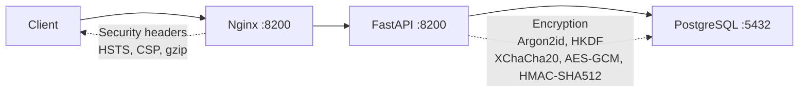

# Quickstart

rhorizon up and running in 5 minutes.

## Prerequisites

- Docker + Compose v2
- VPN access (Tailscale, OpenVPN, ...) - rhorizon must never be exposed on the internet

## 1. Clone and configure

```bash
git clone https://github.com/JR-Shdw/Horizon.git rhorizon
cd rhorizon

# Copy the env template and generate a Postgres password
cp env.example .env
sed -i "s|^POSTGRES_PASSWORD=.*|POSTGRES_PASSWORD=$(openssl rand -hex 32)|" .env

# Or run the helper:
#   make secrets
```

## 2. Start

**Pick the right compose file - the repository ships two.**

```bash
# Recommended: generates the TLS certificate, enables it, prints the URLs
sh tools/install.sh
```

That is the only path that sets TLS up for you. Driving compose directly works
too, but ships **without** a certificate (`TLS_ENABLED` defaults to `false`),
so the stack is plaintext until you supply one in `./certs`:

```bash
docker compose -f tools/docker-compose.quickstart.yml up -d
```

| File | Publishes on | Use it for |
|---|---|---|
| `tools/docker-compose.quickstart.yml` | `127.0.0.1` - API `:8200`, UI `:8080` (HTTP) and `:8443` (TLS) | Laptops, single hosts, evaluation |
| `docker-compose.yml` (root) | `${WG_IP:-10.0.0.1}` and `10.0.1.1` - API `:8200`, UI `:8201` | The operator/VPN stack |

The root file hardcodes VPN addresses, so on a host without them Docker
refuses to start the stack (*"Couldn't listen on requested ports"*). Override
the quickstart binds with `RH_API_BIND`, `RH_FRONTEND_BIND`, `RH_API_PORT`,
`RH_FRONTEND_PORT` and `RH_FRONTEND_HTTP_PORT`; the root file uses `WG_IP` and
`WG1_IP` instead.

`sh tools/install.sh` picks the quickstart file for you and prints the URL.

Three containers start: PostgreSQL, API, Frontend.
Schema is applied automatically on first boot.

## 3. Verify

```bash
# Health
curl --cacert ~/rhorizon/certs/cert.pem https://127.0.0.1:8443/health
# {"status": "ok"}

# Status (sealed by default)
curl --cacert ~/rhorizon/certs/cert.pem https://127.0.0.1:8443/api/v1/vault/status
# {"sealed": true, "version": "1.0.0-beta", ...}
```

## 4. First unseal

The installer leaves the vault **sealed** and does not invent a master
password. The first unseal creates the master key from your password.
**Choose a strong password - it protects everything.**

> **Unattended installs.** `tools/install.sh --master-password VALUE` (or
> `RH_MASTER_PASSWORD`) unseals for you instead. That path is the *only* one
> that writes credentials to disk, and it writes both:
>
> ```
> ~/rhorizon/secrets/master-password
> ~/rhorizon/secrets/root-token
> ```
>
> Mode 0400, and together they are enough to take full control of the
> instance. Move them into a password manager and delete the files once the
> backup is verified. Note the value also lands in your shell history and, for
> the life of the process, in `/proc/<pid>/cmdline`.
>
> The native installer (`tools/install-native.sh`) keeps its equivalent at
> `~/.config/rhorizon/rhorizon.env-secrets` and prompts you about it at the end
> of the run.

```bash
cd cli
python -m venv .venv
. .venv/bin/activate
pip install -e .
export RH_ADDR=https://127.0.0.1:8443
export RH_CA_FILE=~/rhorizon/certs/cert.pem
rhorizon unseal
# Master password: ********
# Status: unsealed
```

The CLI reads the password without echoing it or placing it in shell history.
Store the one-time root token it returns in your password manager.

> **The stack comes up on TLS.** `tools/install.sh` generates a self-signed
> certificate (SAN `localhost` + `127.0.0.1`, 825 days) and sets
> `TLS_ENABLED=true`, so the UI and API are on `https://127.0.0.1:8443`. It
> prints two lines to add to your shell profile:
>
> ```bash
> export RH_ADDR=https://127.0.0.1:8443
> export RH_CA_FILE=~/rhorizon/certs/cert.pem
> ```
>
> `RH_CA_FILE` is what makes the self-signed certificate trusted by the CLI and
> the `rh-*` agents - without it they correctly refuse to connect. There is no
> skip-verify switch.
>
> Plain HTTP is still listening on `:8080` and `:8200` for debugging, but the
> vault logs a `PLAINTEXT TRANSPORT` warning for **every** call that uses it,
> loopback included - same-host traffic is still readable by any process with
> `CAP_NET_RAW`, and in a pod "same host" means a sibling container.

## 5. Set your root token

Open the UI at `https://127.0.0.1:8443`, go to **Core** (settings icon),
paste your root token. You'll need it for all operations.

Or use the CLI:

```bash
rhorizon login 127.0.0.1:8443      # bare host defaults to https
# Enter your token when prompted

rhorizon status
# Status:   UNSEALED
# Version:  1.0.0-beta
```

## 6. Store your first secret

```bash
rhorizon set prod/db-password "s3cure-p4ssw0rd" -n prod
rhorizon get prod/db-password
# s3cure-p4ssw0rd

rhorizon list
#   prod/db-password  v1  [prod]
```

## 7. Generate a scoped token

```bash
rhorizon token create ops-reader '{"secrets":"r"}'
# Token:  rh_xxxxxxxxxxxx
# (shown once - save it now)
```

## 8. Optional - Enable 2FA

### TOTP

```bash
curl --cacert ~/rhorizon/certs/cert.pem \
  -X POST https://127.0.0.1:8443/api/v1/vault/totp/setup \
  -H "Authorization: Bearer $TOKEN"
# {"secret": "BASE32SECRET", "uri": "otpauth://..."}
# Scan the URI as QR code in your auth app, then:

curl --cacert ~/rhorizon/certs/cert.pem \
  -X POST https://127.0.0.1:8443/api/v1/vault/totp/enable \
  -H "Authorization: Bearer $TOKEN" \
  -H "Content-Type: application/json" \
  -d '{"code": "123456"}'

curl --cacert ~/rhorizon/certs/cert.pem \
  -X PUT "https://127.0.0.1:8443/api/v1/vault/2fa?mode=totp" \
  -H "Authorization: Bearer $TOKEN"
```

### WebAuthn / FIDO2 (browser-native touch)

Register a security key directly from the browser - no CLI needed.

1. Open the UI, go to **Core** (settings)
2. In the **Two-Factor Authentication** section, click **+ Register Security Key**
3. Enter a name and click **Touch to register**
4. Touch your security key when the browser prompts
5. Set 2FA mode to `yubikey` (accepts both WebAuthn and HMAC-SHA1)

**Unseal with WebAuthn:**

On the Horizon (dashboard) page, click **Touch Security Key** and touch your key.
The browser handles the entire flow - no CLI commands needed.

> **Note:** WebAuthn requires HTTPS or `localhost`. For CLI/automation, use HMAC-SHA1 below.

### YubiKey (HMAC-SHA1 challenge-response)

```bash
# 1. Program slot 2 with a HMAC-SHA1 secret
ykman otp chalresp --generate 2
# Save the 40-char hex secret displayed

# 2. Get the serial number
ykman info
# Serial: 12345678

# 3. In Core > 2FA, register the serial and HMAC secret, then select YubiKey.
#    The UI keeps the HMAC secret out of shell history and process arguments.
```

**Unseal with YubiKey:**

Use the Core view in the UI and click **Touch YubiKey to authenticate**. The
browser handles the challenge and submits the password without placing it in
shell history.

### Shamir (M-of-N key split)

Advanced, multi-worker only. See [`multiworker.md`](multiworker.md).

## 9. Backup

```bash
# Logical encrypted backup via API (partial migration artifact):
rhorizon backup export ./rhorizon-backup.age
```

Use `pg_dump | age` for full-fidelity disaster recovery.

## Podman / Docker rootless

rhorizon runs unchanged on Podman and Docker rootless. The compose file
uses only standard primitives (`cap_drop`, `no-new-privileges`,
`read_only`, `tmpfs`, `pids_limit`, `memory limits`) supported by both
runtimes.

### Podman

```bash
# Either invoke podman-compose directly:
podman-compose up -d

# Or generate Quadlet units for systemd (recommended on EL/Fedora):
podman compose --in-pod=true up -d
```

### Docker rootless

```bash
dockerd-rootless-setuptool.sh install
docker compose up -d   # uses the rootless socket automatically
```

### Memory locking (mlock) caveat

The portable default does not request `IPC_LOCK` or an unlimited memlock
ulimit. The API reports Rust buffer locking in `memory_protection` and
whole-process locking in `process_memory_protection`. The wipe implemented by
`zeroize` still runs on drop, so keys are cleared from heap when released. A
warning is needed only when swap is unencrypted or cannot be verified;
encrypted swap, zram, and no swap already prevent this persistent-swap
exposure.

The quickstart detects this on the host and writes `RH_SWAP_PROTECTION` to its
`.env`. A manually managed Compose deployment defaults to `unknown` until the
operator records `protected` or `unencrypted` there.

On a host with unencrypted swap, enforce memory locking on a runtime that
permits it:

```bash
cd ~/rhorizon
docker compose -f docker-compose.yml \
  -f docker-compose.memory-lock.yml --env-file .env up -d
```

This override requests `IPC_LOCK`, sets an unlimited memlock ulimit, and changes
the application policy to `required`. If the runtime cannot provide them, the
explicitly hardened start fails; remove the override to return to best effort.

### Rootless constraints

- Bind to ports < 1024 - bind to `127.0.0.1:8200` and front with a
  rootful reverse proxy if you need :443.
- AppArmor / SELinux profile names differ - the bundled profiles assume
  rootful Docker. Use the runtime's defaults until you write rootless
  equivalents.
- `docker exec` from another user - only the running user can attach.

For a sovereign / single-tenant on-prem deployment, rootless + Podman is
the recommended path.

## Architecture



All containers on internal Docker network. Only nginx binds to host
(default: 127.0.0.1 only). rhorizon is meant for a restricted local network:
reach it over a VPN or a private network, never the public internet.

## Next steps

- [Full API reference](docs/reference/api.md)
- [Roadmap](ROADMAP.md) - dynamic secrets, LDAP, container injection
- [Security policy](../SECURITY.md)

## License

[AGPL-3.0](../LICENSE) - Free to use, modify, and deploy. Modifications must be published under AGPL-3.0.

A [commercial license](../LICENSE-COMMERCIAL.md) is available for managed service providers, organizations with AGPL restrictions, or guaranteed support needs.
