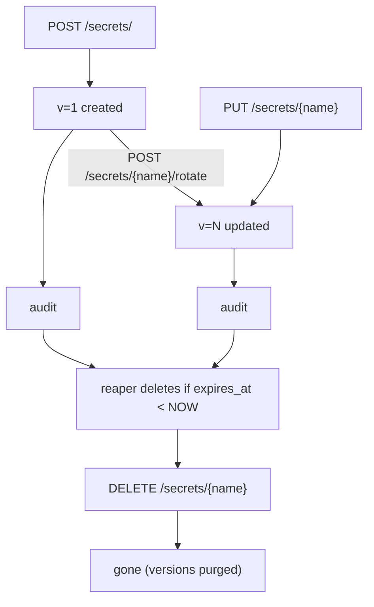

# Secrets and tokens

Resurgamus Horizon stores two kinds of objects: **secrets** (what you
want to keep encrypted) and **tokens** (the credentials your scripts,
agents, and CI use to read them).

This document covers the lifecycle, scoping, and recommended patterns
for both. For deployment specifics, see [`DEPLOYMENT.md`](DEPLOYMENT.md);
for MCP / LLM specifics, see [`MCP.md`](MCP.md); for end-to-end use
cases (Ansible, K8s, CI), see [`USE-CASES.md`](USE-CASES.md).

---

## 1. Secrets

A secret is an opaque, named, namespaced, encrypted blob.

| Field | Meaning |
|---|---|
| `name` | Required. The identifier you read and write by. Path-like names allowed (e.g. `prod/db/url`). |
| `namespace` | Logical grouping. Default `default`. Used for token scoping, RBAC, and audit. |
| `value` | The thing you actually wanted to protect. Stored encrypted; the server never logs it. |
| `metadata` | Free-form JSON tag bag (owner, expiry, rotation policy notes). Not encrypted, not load-bearing. |
| `version` | Auto-incremented on update. Older versions are kept up to `RH_SECRET_MAX_VERSIONS` (default 10). |
| `expires_at` | Optional TTL. The reaper removes the secret after this time. |
| `dek_rotated_at` | Bookkeeping for DEK rotation. Internal. |

### 1.1 Names and namespaces

There is no enforced naming scheme - `prod/db-password`,
`prod-db-password`, `prod/db/password` all work. A path-like
convention is recommended because it composes nicely with namespaces
in scripts (`get prod/db-url` is more readable than `get prod_db_url`).

Namespaces are how tokens get scoped. A token with
`{"secrets": "rw", "namespaces": ["prod"]}` can read and write any
secret whose namespace starts with `prod`; it cannot touch
`default/*`.

A token with no `namespaces` field has no namespace restriction (only
its scope applies).

### 1.2 Versioning

Every UPDATE creates a new version with a fresh DEK. Old versions are
retained up to `RH_SECRET_MAX_VERSIONS` (default 10, set to 0
for unlimited). Reading without a version selector returns the latest;
you can read specific versions via the version list endpoint.

| Why versioning | Practical use |
|---|---|
| **Roll back a misconfigured secret** | `GET /secrets/{name}/versions` then `PUT` with the old value |
| **Compare what changed** | The audit log tells you who and when, the version log tells you what |
| **Retain rotation history** | Your DB credentials rotate weekly; you can audit the chain of past values |

#### Rotation grace window

When you rotate a hot secret, consumers that cached the old value need a moment
to pick up the new one. The grace window covers that cutover: after a
non-emergency `PUT`, the prior value stays readable via `GET /secrets/{name}?previous=true`
for `RH_SECRET_GRACE_SECONDS`, then stops. Every grace read is audited as
`read_secret_previous`.

It is off by default (`0`) and capped at one day. It mirrors the
master-password emergency split: a `PUT` with `{"emergency": true}` leaves no
grace, the old (possibly leaked) value stops being served at once.

```bash
# Rotate, keep the old value reachable during cutover (grace window on)
rhorizon set db-pass NEWVALUE --update
rhorizon get db-pass --previous          # old value, until the window closes

# Rotate a leaked secret, no grace
rhorizon set db-pass NEWVALUE --update --emergency
```

Only the immediately-prior version is ever in grace; a second update moves the
window forward. Full history stays available to admins through the version
endpoints regardless.

> Tested (2026-06-23): grace serves the prior value, an emergency update
> suppresses it, it is off by default, it expires, and a second update advances
> the window. See `tests/test_secret_grace.py`.

### 1.3 Lifecycle



Per-secret DEK rotation is explicit. `POST /secrets/{name}/rotate`
re-encrypts the unchanged value under a new random DEK. Hierarchical
`dek_key` age is monitored separately; `POST /admin/rotate-dek-key`
re-wraps all DEKs after master-password re-authentication.

“Explicit” does not mean “unscriptable”: an operator can call these endpoints
from a maintenance job. Rhorizon does not keep the master password or weaken
re-authentication for an internal timer. The operator-controlled workflow can
first verify database and cluster readiness, create and test an encrypted
backup, run the rotation in an observed window, then validate readiness,
representative reads, metrics, and the audit event. Automation must inject the
password through a protected runtime channel, never command-line arguments,
logs, or the backup itself.

### 1.4 What the audit log captures

| Event | `actor` | `action` | `target` | `detail` (jsonb) |
|---|---|---|---|---|
| Read | token name | `read_secret` | `<ns>/<name>` | version read |
| Create | token name | `create_secret` | `<ns>/<name>` | namespace, has-expiry |
| Update | token name | `update_secret` | `<ns>/<name>` | new version |
| Delete | token name | `delete_secret` | `<ns>/<name>` | versions purged |
| Rotate DEK | token name | `rotate_secret` | `<name>` | new version |

The chain is HMAC-signed; tampering breaks `rhorizon audit verify`.

---

## 2. Tokens

A token is a string starting with `rh_`, given to a client (script,
agent, CI runner, MCP server, person at a CLI). It has a scope, an
optional namespace restriction, and an optional TTL.

| Field | Meaning |
|---|---|
| `name` | Human-readable label. Appears as `actor` in audit. |
| `scope` | One or more of `secrets`, `tokens`, `audit`, `cluster`, `admin`, each with `r` (read) or `rw` (read+write). |
| `namespaces` | Optional list. The token can only access secrets in these namespaces. |
| `expires_at` | Optional TTL. After expiry the token is rejected even before revocation. |
| `revoked` | Manual kill-switch. Effective immediately on next request. |

The token string is shown **once** at creation time. The DB stores
only the HMAC-SHA512 hash - recovering a lost token is impossible by
design.

#### Lifecycle operations

| Operation | Endpoint | What it does |
|---|---|---|
| Rotate the value | `POST /tokens/{id}/rotate` | Re-mints the plaintext **in place**: same id, name, permissions, `allowed_ips` and expiry. The old value stops authenticating on commit. Shown once, like creation. |
| Extend expiry | `POST /tokens/{id}/renew` | Pushes `expires_at` out. Does **not** change the value. |
| Change the IP allowlist | `POST /tokens/{id}/allowed-ips` | Updates `allowed_ips` on a live token. |
| Revoke | `POST /tokens/{id}/revoke` | Kill-switch, effective on next request. |
| Delete | `DELETE /tokens/{id}` | Removes the row (and cascades its RBAC memberships). |

**A leaked token is a rotate, not a revoke-and-recreate.** `/rotate` keeps the
id and therefore the **audit lineage** - the history before and after the leak
stays attached to one identity, and every group membership, namespace claim
and IP allowlist survives untouched. Delete-then-recreate loses all of that and
mints a new id your RBAC and audit queries do not know about. `last_used_at` is
reset to NULL so the fresh value reads as unused.

Rotating is re-issuing, so it takes the full POLA grant gate against the
token's stored permissions: a namespace-restricted caller can rotate a token
whose `namespaces` are a subset of its own, never an unrestricted one.

Post-restore stubs are a separate flow: `GET /tokens/pending/` lists them and
`POST /tokens/pending/{id}/rotate` mints their real value. See
[DISASTER-RECOVERY.md](DISASTER-RECOVERY.md).

### 2.1 Scope cheat sheet

| Scope | `r` | `rw` |
|---|---|---|
| `secrets` | Read a secret value, list names | Create / update / delete |
| `tokens` | List existing tokens (no values) | Create new tokens, revoke existing ones |
| `audit` | Read the audit chain | (no `audit:rw` - the chain is append-only) |
| `cluster` | Cluster + PostgreSQL HA status (`/cluster`, `/cluster/health`, `/cluster/ha`, CA bundle) | Node lifecycle: promote / demote / drain / evict / unrevoke / init / repair |
| `admin` | Same as `audit:r` + read all configs | Seal / unseal, rotate master, change 2FA, manage YubiKeys/TOTP/WebAuthn |

A token cannot grant a scope it does not itself have. If your token
is `secrets:r`, you cannot mint a child with `secrets:rw`.

### 2.2 Namespace scoping

Best practice: every token gets the smallest namespace that lets it
do its job. A CI runner that builds the `frontend` repo gets
`{"secrets": "r", "namespaces": ["ci/frontend"]}`. It cannot read
`prod/*` even by accident.

Cross-namespace access requires either (a) a token with multiple
namespaces in the list, or (b) an unscoped token (no `namespaces`
field). Avoid (b) for non-operator consumers.

### 2.3 Per-token IP allowlist (`allowed_ips`)

Optional second axis of containment, on top of scope and namespace.
Restricts **where** a token can be used. The vault checks the request's
client IP against a comma-separated list of CIDRs / IPs and rejects
mismatches with `403 Token not allowed from this IP`.

```bash
curl -X POST https://vault.example/api/v1/vault/tokens/ \
  -H "Authorization: Bearer $ADMIN_TOKEN" \
  -H "Content-Type: application/json" \
  -d '{
    "name": "ansible-prod",
    "permissions": {"secrets": "r", "namespaces": ["prod"]},
    "allowed_ips": "10.0.0.1/32, 10.0.0.1/32"
  }'
```

#### What the field accepts

| Form | Meaning |
|---|---|
| `null` / absent / `""` | No restriction. Backwards-compatible default. |
| `"10.0.0.1"` | A single host. Bare IP -> stored as `/32` (v4) or `/128` (v6). |
| `"10.0.0.1, 10.0.0.1, 10.0.0.1"` | **Lists are supported** - comma-separated. Mix individual IPs and CIDRs freely. |
| `"10.89.0.0/16"` | A CIDR block - every host in the subnet is allowed. |
| `"10.0.0.1/24, 2001:db8::/64"` | IPv4 and IPv6 in the same allowlist. |
| `"not-a-cidr"` | Rejected at creation with `400 Invalid allowed_ips entry`. |

Whitespace around entries is tolerated. The stored value is canonicalized
(host bits zeroed, prefix appended on bare IPs) and echoed back in the
response so the caller can confirm what was actually persisted.

#### Why bother - lateral movement

Scope (`secrets:r`) limits **what** the token can do. Namespace limits
**which secrets** it touches. The IP allowlist limits **where the token
can be replayed from** if it leaks.

Without it, a long-lived token sitting in an Ansible config on host
`10.0.0.1` is just as valid from any other host on the VPN mesh
or the Docker bridge. With it, a compromise of an unrelated workload on
the same private network does not yield a usable vault credential.

The narrower, the safer:

| Allowlist | Replay surface if leaked |
|---|---|
| `"10.0.0.1/32"` | One host. Compromise of any other LAN host won't replay it. |
| `"10.0.0.1, 10.0.0.1"` | Two hosts. Explicit list - surgical. |
| `"10.0.0.1/24"` | A whole subnet. OK for a tight VPN segment. |
| `"10.0.0.0/8"` | All of RFC 1918 / 10. Effectively useless for lateral-movement defense. |
| `null` (default) | Anywhere on whatever network reaches the vault. |

#### Reference ranges (use as ceilings, not as defaults)

| Range | Description |
|---|---|
| `10.0.0.0/8`, `172.16.0.0/12`, `192.168.0.0/16` | RFC 1918 private IPv4 |
| `fc00::/7` | IPv6 ULA |
| `10.89.0.0/16` | Podman default bridge `podman` |
| `172.17.0.0/16` | Docker default bridge `docker0` |
| `172.16.0.0/12` | Covers `docker0` plus user-defined Docker bridges (allocated from this pool) |
| your VPN subnet | VPN mesh - whatever you assigned (e.g. `10.0.0.1/24`) |

These are documented for sizing, not as recommended values. A VPN
mesh is often the loosest you should go; a single-host `/32` is what you
want for service accounts that only ever call from one place.

#### Behavior under reverse-proxy

The vault resolves the client IP through `get_client_ip(request)`, which
walks `X-Forwarded-For` and trusts only hops listed in `xff_trusted_ips`
or `proxy_trusted_ips`.
If `rhorizon` runs behind a reverse proxy (nginx, Traefik, Authelia),
configure `xff_trusted_ips` to include the proxy CIDRs - otherwise the
allowlist will match the proxy IP, not the real caller.

`proxy_trusted_ips` is separate: it authorizes SSO or mTLS identity headers
and is empty by default.

#### Where it kicks in

The allowlist check runs in `auth.require_vault_token`, immediately after
hash validation and expiry check, before scope and namespace enforcement.
It applies to **every** authenticated endpoint, including
`GET /tokens/whoami` - an IP-blocked token cannot even introspect itself.

A rejection logs `auth_failure(reason="ip_not_allowed")` to the audit
file and increments `rhorizon_auth_failures_total{reason="ip_not_allowed"}`.

#### Ephemeral tokens

`POST /tokens/ephemeral` accepts the same `allowed_ips` field with the
same semantics. Recommended for CI runners - bind the ephemeral token
to the runner host or runner pool subnet:

```bash
curl -X POST https://vault.example/api/v1/vault/tokens/ephemeral \
  -H "Authorization: Bearer $TOKEN" \
  -d '{
    "permissions": {"secrets": "r", "namespaces": ["ci/frontend"]},
    "ttl_seconds": 900,
    "allowed_ips": "10.0.0.1/32"
  }'
```

### 2.4 Long-lived vs ephemeral

| Aspect | Long-lived tokens | Ephemeral tokens |
|---|---|---|
| TTL | none (manual revoke only) | 60s - 24h (configurable) |
| Use case | persistent agents, MCP servers, fixed services | CI runners, one-shot jobs, batch tasks |
| Lifecycle | mint once, store in 0600 file | mint per run, expires by itself |
| Revocation | explicit endpoint | automatic (reaper purges) |
| Audit attribution | stable | per-run trace |

Both types use the same underlying mechanism (HMAC-SHA512 hash, DB
lookup). The TTL is just a column.

### 2.5 Ephemeral tokens

```bash
curl -X POST https://vault.example/api/v1/vault/tokens/ephemeral \
  -H "Authorization: Bearer $ADMIN_TOKEN" \
  -H "Content-Type: application/json" \
  -d '{
    "permissions": {"secrets": "r", "namespaces": ["ci/frontend"]},
    "ttl_seconds": 900,
    "label": "ci-frontend-build-2026-04-29"
  }'
# Returns:
# {
#   "token": "rh_eph_xxxxx",
#   "name": "eph-xxxxx",
#   "expires_at": "2026-04-29T11:15:00Z",
#   "permissions": {"secrets": "r", "namespaces": ["ci/frontend"]}
# }
```

Constraints (enforced server-side):

| Constraint | Why |
|---|---|
| Min TTL: 60s | Keeps the audit chain meaningful - sub-second tokens are forensics noise |
| Max TTL: `RH_EPHEMERAL_MAX_TTL` (default 24h) | Hard cap; a "long-lived ephemeral" defeats the purpose |
| `admin` scope **forbidden** | Eph tokens cannot escalate to admin. Period. |
| Reaper purge: every 5 min | Expired rows go away; not waiting for the request to fail |

Recommended scopes per use case:

| Use case | Scope | TTL |
|---|---|---|
| Ansible playbook reading prod secrets | `{"secrets": "r", "namespaces": ["prod"]}` | 30 min |
| CI build pulling registry creds | `{"secrets": "r", "namespaces": ["ci/<repo>"]}` | 15 min |
| K8s CronJob backup | `{"secrets": "r", "namespaces": ["backup"]}` | 1 h |
| Manual investigation | `{"audit": "r"}` | 4 h |
| MCP server | `{"secrets": "r", "namespaces": ["mcp/..."]}` | long-lived (see [`MCP.md`](MCP.md)) |

### 2.6 Decrypt-and-die (oneshot)

For workloads that need a secret **once** and immediately exit, the
oneshot endpoint avoids leaving a token alive at all:

```bash
curl -X POST https://vault.example/api/v1/vault/oneshot/secrets/prod/db-url \
  -H "Content-Type: application/json" \
  -d '{
    "password": "<master-password>",
    "challenge": "<from /vault/challenge>",
    "yubikey_response": "<from ykchalresp>"
  }'
# Returns: { "value": "..." }
# Side-effect: the vault auto-seals (zeros all sub-keys) immediately after
```

This is for the strict case where:

1. The reader is a one-time job (CI runner, a CronJob, a recovery script).
2. There is no operator nearby to unseal interactively but you accept that the vault will be sealed afterward and an operator must re-unseal for normal operation to resume.
3. You can safely commit to "after this read, the vault is sealed".

It is intentionally opinionated: not a TTL token, not "auto-unseal at
boot". Use only for runners that are designed to leave the vault
sealed when they're done.

### 2.7 Token rotation

Two distinct flows depending on why you're rotating:

#### Routine rotation (no compromise suspected)

```bash
POST /api/v1/vault/rotate-password
Body: {"emergency": false}
```

- The new master password takes effect.
- Existing tokens **keep working** - `prev_hmac_key` is stored encrypted, lookups try both keys for ~15 days, then the reaper drops the fallback.
- Schedule: do this on a calendar (every 90/180 days) without disrupting agents.

#### Emergency rotation (token / password leaked)

```bash
POST /api/v1/vault/rotate-password
Body: {"emergency": true}
```

- The new master password takes effect.
- **Every existing token is invalidated immediately**, including the one used to make this call.
- You must re-unseal with the new password and mint new tokens for everything.

Pick the right mode for the right reason. Routine = hygiene, emergency
= incident response.

#### Single-token rotation (one token's value)

When you only need to roll **one** token - not the whole vault - rotate
it in place:

```bash
POST /api/v1/vault/tokens/{id}/rotate
# Returns: {"token": "rh_...", "name": "ansible-prod", "warning": "..."}
```

```bash
rhorizon token rotate ansible-prod   # by name or id; prompts to confirm
```

- The token keeps its **id, name, scopes, namespaces, allowed_ips and
  expiry** - only the secret material changes. Audit lineage and the
  `name`-uniqueness invariant are preserved (no delete+recreate gap).
- The **old value stops authenticating the instant the call commits.**
  Hand the new value to every consumer first, then rotate - or rotate,
  then immediately re-provision.
- `last_used_at` resets, so the freshly rotated token reads as unused
  until a consumer adopts it (the `NEW` badge in the UI).
- Authorization: `tokens:w`, **and** the caller must be able to *grant*
  the permissions the target token carries (same POLA gate as create).
  A namespace sub-admin (`{"tokens":"w","namespaces":["dev"]}`) can
  rotate `dev` tokens but never a `prod` token nor a root (`admin`)
  token. `admin:w` rotates anything. If you couldn't create it, you
  can't rotate it.

Use this for routine per-credential hygiene (rotate `ansible-prod`
weekly) or to roll a single leaked token without forcing every other
consumer to re-provision the way an emergency master rotation would.

### 2.8 Revocation

```bash
# Revoke by ID (visible in /tokens/ list)
POST /api/v1/vault/tokens/{id}/revoke
# Or delete entirely
DELETE /api/v1/vault/tokens/{id}
```

Both are O(1) DB updates; the next request that presents the revoked
token gets `401 Unauthorized`. There is no propagation delay (no
caches in the auth path).

---

## 3. Audit attribution

Every read and every write logs `actor=<token name>`. The recommended
discipline:

- **One token name per consumer.** `ansible-prod`, `ci-frontend-build`, `mcp-agent`, `bob-laptop` - not generic `service-account`.
- **Don't share tokens between operators.** A token is also an identity. Two people sharing one token means audit cannot tell them apart.
- **Don't reuse a token after rotation.** New password => new tokens. The fact that the old one might still work for ~15 days is for operational continuity, not for laziness.

Querying:

```bash
# Everything one token did in the last 24h
rhorizon audit list --actor ansible-prod --since 24h

# Live-tail what an MCP server is reading
rhorizon audit follow --actor mcp-agent

# Find anyone who touched a specific secret
rhorizon audit list --target "prod/db-password" --limit 100

# Verify the chain end-to-end
rhorizon audit verify
```

---

## 4. Where to put the token client-side

| Consumer | Recommended storage |
|---|---|
| Ansible | Lookup plugin reading from rhorizon at run time; never in `group_vars` |
| CI / CD | Encrypted secret in the CI's own store, fed via env to the job |
| Kubernetes pods | A K8s Secret (one only - the rhorizon token), agent reads via `RH_TOKEN_FILE` |
| Bare-metal scripts | File at mode 0600 owned by the script's user |
| MCP server | `RH_TOKEN_FILE` mode 0600 under a dedicated local account; MCP payloads omit the token |
| CLI on an operator's laptop | `~/.config/rhorizon/token` mode 0600 (the `rhorizon login` command does this) |

Avoid: env vars (they leak via `/proc/PID/environ`, container metadata,
`docker inspect`), shell history, group-readable files, anywhere that
a backup of the host disk would land.

---

## 5. Common patterns

### 5.1 "I want my Ansible playbooks to stop reading `.env`"

1. Move secrets from `.env` into rhorizon (one curl per secret, or use the import endpoint).
2. Mint a token: `rhorizon token create ansible-prod --scope secrets:r --namespace prod`
3. Replace `lookup('env', 'FOO')` with a custom `lookup('rhorizon', 'foo', vault_url=..., vault_token=...)`. There's an example in [`USE-CASES.md`](USE-CASES.md).

### 5.2 "I want CI to never see long-lived tokens"

1. Mint a long-lived **token-minting** token: `tokens:rw` scope, no namespaces. Store it as a CI secret.
2. At job start, the CI calls `/tokens/ephemeral` to get a per-job ephemeral token (TTL = build duration + slack).
3. Pass the ephemeral to the build steps. It expires automatically.

### 5.3 "I want one secret read by a one-shot job, then nothing"

Use the oneshot endpoint (see section 2.6). The vault re-seals after the read,
so the job's exposure window is exactly one HTTP request.

### 5.4 "I want my LLM to read a few specific secrets"

Use the MCP server with a policy whitelist. See [`MCP.md`](MCP.md) end
to end. The MCP schemas and responses omit the token; the server's local
account remains inside its trust boundary.

### 5.5 "I want to give a contractor temporary read access"

Mint an ephemeral token with their initials in the label, namespace
scoped to what they need:

```bash
rhorizon token ephemeral \
  --scope secrets:r \
  --namespace contractor/projectx \
  --ttl 28800 \
  --label "alice-projectx-2026-04-29"
```

When the contract ends, the token expires by itself. If you need to
yank it sooner, `rhorizon token revoke <id>`.

---
