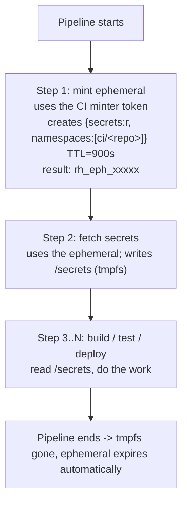
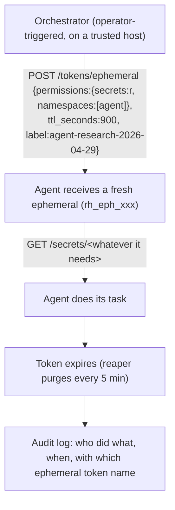

# Use cases

Practical, copy-pasteable workflows for plugging Resurgamus Horizon
into the things you already run.

For the underlying auth model (tokens, scopes, ephemeral, oneshot),
see [`SECRETS-AND-TOKENS.md`](SECRETS-AND-TOKENS.md). For the CLI used
in these examples, see [`CLI.md`](CLI.md). For deployment topology,
see [`DEPLOYMENT.md`](DEPLOYMENT.md).

---

## 1. Replace `.env` files (zero secrets on disk)

**Problem.** Secrets scattered across `.env` files on every machine.
A disk backup, container inspect, or compromised account exposes
everything.

**Solution.** Services fetch secrets from the vault at startup.
Nothing persists on disk.

### Option A - `rh-inject` (entrypoint replacement)

Replace plaintext values with `rh://` references. The injector
resolves them in memory before exec'ing the real process as PID 1.

```yaml
# docker-compose.yml
services:
  myapp:
    image: myapp:latest
    entrypoint: ["/usr/local/bin/rh-inject", "--", "/app/start.sh"]
    environment:
      RH_ADDR: https://vault.internal:8443
      RH_TOKEN: rh_xxx
      DB_PASSWORD: "rh://prod/db-password"
      API_KEY:     "rh://prod/api-key"
      REDIS_URL:   "rh://prod/redis-url"
```

What happens:

1. `rh-inject` scans env vars for the `rh://` prefix
2. Fetches each referenced secret from the vault API
3. Replaces values in the child env, in memory only
4. Removes `RH_TOKEN` from the child environment
5. `exec`s the real command - secrets never on disk

> Caveat: env-var-based injection means the resolved values appear in
> `/proc/PID/environ`. Prefer Option B for high-sensitivity workloads.

### Option B - `rh-fetch` (init container, files on tmpfs)

Write secrets as files on a tmpfs volume. The app reads them like any
other config file.

```yaml
services:
  secrets-init:
    image: rhorizon-agent:latest
    command: ["rh-fetch"]
    environment:
      RH_ADDR: https://vault.internal:8443
      RH_TOKEN: rh_xxx
      RH_SECRETS: "db-password:/secrets/db-pass,api-key:/secrets/api-key"
    volumes:
      - secrets:/secrets

  myapp:
    depends_on:
      secrets-init:
        condition: service_completed_successfully
    volumes:
      - secrets:/secrets:ro

volumes:
  secrets:
    driver_opts:
      type: tmpfs
      device: tmpfs   # RAM only - never hits disk
```

> ⚠️ **Caveat: docker vs podman tmpfs sharing**
>
> The `driver_opts: type: tmpfs` named-volume pattern above works
> correctly on **podman** (the tmpfs is shared between containers in
> the same pod / project) but **NOT on docker**: each container that
> mounts the volume gets its own private tmpfs. The init container
> writes successfully, but the consuming service sees an empty
> `/secrets` directory and fails.
>
> Workarounds for docker:
>
> 1. **Drop `driver_opts` entirely** - use a regular `local` volume.
>    Secrets land on disk under `/var/lib/docker/volumes/...` (root-only),
>    not RAM. Acceptable on a single-tenant host with full-disk
>    encryption ; loses the "never hits disk" guarantee.
> 2. **Bind-mount a host tmpfs path** - pre-create something like
>    `/run/<svc>-secrets/` on the host (`/run` is tmpfs under systemd)
>    and bind-mount it into both containers. Keeps the zero-disk
>    property at the cost of a one-time host preparation step.
>
> Test on the *target* runtime before promoting - a setup that worked
> in podman dev can break silently in docker prod.

#### Hardening file permissions

`rh-fetch` writes secrets at mode `0400` owned by the writer's UID.
That works in **podman** (rootless UID-mapping aligns the writer and
the consumer) but in **docker rootful** the consumer process (e.g.
`postgres` UID 999, `app` UID 1500...) often has a *different* UID
than the writer and gets `EACCES` on read. You have to pick a strategy:

| Mode | Owner | Reach | Trade-off |
|---|---|---|---|
| `0400` | writer | writer only | Most secure but only useful when consumer == writer (podman, K8s `fsGroup`) |
| **`0400` + `chown` per file** | **specific consumer UID per secret** | **only that one consumer** | **Most defensive in practice - requires you control the UID of every consumer (i.e. own the Dockerfiles or pin official-image UIDs)** |
| `0440` | shared GID | every container in that GID | Vault-Agent style. Needs a coordinated GID across images |
| `0444` | writer | every container that mounts the volume | Easy - but if a future service mounts the volume, it sees the secrets |

**Recommended when you control the build chain : `0400` + per-file
`chown`.** Run a one-shot init sidecar after `rh-fetch` to retarget
each file to its specific consumer's UID :

```yaml
services:
  rh_fetch:
    image: rhorizon-agent:latest
    user: "0"                     # write into a fresh root-owned volume
    command: ["rh-fetch"]
    environment:
      RH_ADDR: ...
      RH_TOKEN: ...
      RH_SECRETS: "db-password:/secrets/db-pass,api-key:/secrets/api-key"
    volumes:
      - secrets:/secrets

  secrets_perms:                  # NEW - per-file chown + chmod 0400
    image: alpine:3.20
    user: "0"
    restart: "no"
    command:
      - "sh"
      - "-c"
      - |
        set -e
        chown 999:999   /secrets/db-pass && chmod 0400 /secrets/db-pass
        chown 1500:1500 /secrets/api-key && chmod 0400 /secrets/api-key
    volumes:
      - secrets:/secrets
    depends_on:
      rh_fetch:
        condition: service_completed_successfully

  myapp:
    depends_on:
      secrets_perms:
        condition: service_completed_successfully
    volumes:
      - secrets:/secrets:ro
```

##### How does this compare to the rest of the ecosystem ?

| Tool | Default mode | Default owner | Per-file targeting |
|---|---|---|---|
| **K8s `Secret` volumes** | `0644` | controlled by pod `securityContext.fsGroup` | per-key via `items[].mode` |
| **External Secrets Operator** | renders to native K8s `Secret` | inherits K8s | inherits K8s |
| **SOPS / age** | user-supplied `umask` | user that decrypted | manual |
| **rhorizon (`0400` + chown)** | **`0400`** | **per-consumer UID** | **yes (recommended)** |

Most tools stop at `0640` + group sharing because they don't assume
the operator controls every consumer image's UID. **A competent
sysadmin running a self-hosted stack always knows which UID each
service runs as at deploy time** (it's in the Dockerfile they wrote
or the well-known UIDs of the official images they pulled). Under
that assumption, `0400` + per-file `chown` is strictly more
restrictive - and we treat it as the baseline, not a luxury.

For the Kubernetes equivalent (init containers + emptyDir Memory),
see [`K8S.md`](K8S.md#5-pattern-a---rh-fetch-init-container-recommended).

### Migration target - services worth doing first

| Service | Secrets to migrate | Suggested namespace |
|---|---|---|
| PostgreSQL | superuser, replication password | `db` |
| Gitea / Forgejo | DB password, secret_key, mailer creds | `git` |
| Woodpecker | agent secret, DB password, OAuth client | `ci` |
| Matrix / Synapse | DB password, signing key, mailer | `matrix` |
| Grafana | admin password, datasource creds | `monitoring` |
| Postfix / Dovecot | SASL passwords, DKIM private keys | `mail` |
| Restic / Borg | repo password, S3 keys | `backup` |
| Reverse proxy | ACME DNS provider tokens | `proxy` |

### Security gain

| Before | After |
|---|---|
| `.env` files readable on disk | Secrets only in memory at runtime |
| Backup includes plaintext secrets | Backup artifact contains no plaintext secret values |
| No audit trail on secret access | Every read logged (actor, IP, timestamp) |
| Rotate = edit N files on N machines | Rotate = update once in vault, restart service |

---

## 2. CI/CD secret injection

**Problem.** Your CI (Woodpecker, Gitea Actions, GitLab CI, GitHub
Actions self-hosted runners...) stores secrets in its own database. A
CI compromise leaks every pipeline secret.

**Solution.** Pipelines fetch secrets from rhorizon with **ephemeral
tokens** scoped to one pipeline run. Long-lived secrets live in the
vault, not the CI.

### Two-token pattern

| Token | Scope | TTL | Stored where |
|---|---|---|---|
| **CI minter** | `tokens:rw` (mints child tokens) | persistent | CI's own secret store |
| **Per-pipeline ephemeral** | `secrets:r` + namespace | build duration | minted at job start, expires automatically |

### Workflow



### Woodpecker pipeline example

```yaml
# .woodpecker/deploy.yml
when:
  - event: push
    branch: main

steps:
  - name: mint-ephemeral
    image: rhorizon-cli:latest
    environment:
      RH_ADDR: https://vault.internal:8443
      RH_TOKEN:
        from_secret: rhorizon_ci_minter   # tokens:rw
    commands:
      - >
        rhorizon token ephemeral -q
        --ttl 900
        --scope secrets:r
        --namespace ci/${CI_REPO_NAME}
        --label "ci-${CI_PIPELINE_NUMBER}"
        > /shared/eph_token

  - name: build
    image: rhorizon-agent:latest
    command: ["rh-fetch"]
    environment:
      RH_ADDR: https://vault.internal:8443
      RH_TOKEN_FILE: /shared/eph_token
      RH_SECRETS: "registry-password:/secrets/registry-pw"
    volumes:
      - secrets:/secrets

  - name: docker-build
    image: docker:29-cli
    commands:
      - docker login -u deploy -p "$(cat /secrets/registry-pw)" registry.example
      - docker build -t registry.example/myapp:${CI_COMMIT_SHA} .
      - docker push registry.example/myapp:${CI_COMMIT_SHA}
    volumes:
      - secrets:/secrets:ro
```

### What the CI stores after migration

| Before | After |
|---|---|
| `registry_password`, `db_password`, `deploy_ssh_key`, ... | Just one `rhorizon_ci_minter` token |
| Long-lived, shared with N pipelines | One ephemeral per pipeline run |
| Audit invisible (CI's own log only) | Every read in rhorizon's Merkle-protected read audit with `actor=eph-...` |

---

## 3. Ansible playbooks

**Problem.** `ansible-vault` uses a static password file (`.vault_pass`)
on disk. Anyone with disk access decrypts everything.

**Solution.** Ansible fetches credentials from rhorizon at playbook
runtime. No `.vault_pass` file needed.

### Lookup plugin

```python
# plugins/lookup/rhorizon.py
from ansible.errors import AnsibleError
from ansible.plugins.lookup import LookupBase
import requests


class LookupModule(LookupBase):
    def run(self, terms, variables=None, **kwargs):
        addr = variables.get("rhorizon_addr") or kwargs.get("vault_url")
        token = variables.get("rhorizon_token") or kwargs.get("vault_token")
        if not addr or not token:
            raise AnsibleError("rhorizon_addr / rhorizon_token must be set")
        results = []
        for name in terms:
            r = requests.get(
                f"{addr}/api/v1/vault/secrets/{name}",
                headers={"Authorization": f"Bearer {token}"},
                timeout=10,
            )
            r.raise_for_status()
            results.append(r.json()["value"])
        return results
```

### Playbook usage

```yaml
- hosts: all
  vars:
    rhorizon_addr: "http://10.0.0.20:8200"
    rhorizon_token: "{{ lookup('env', 'RH_TOKEN') }}"

  pre_tasks:
    - name: Fetch credentials from vault
      set_fact:
        db_password: "{{ lookup('rhorizon', 'prod/db-password') }}"
        api_key:     "{{ lookup('rhorizon', 'prod/api-key') }}"

  tasks:
    - name: Render config
      template:
        src: db.conf.j2
        dest: /etc/myapp/db.conf
        mode: '0600'
        owner: root
        group: root
```

`RH_TOKEN` lives in your operator shell only; it never enters
`group_vars/`, never gets committed.

### Security gain

| Before | After |
|---|---|
| `.vault_pass` file on disk on the controller | Ephemeral env var, gone when the shell exits |
| Static encryption password (rotates rarely) | Dynamic fetch per run; rotate in vault, next playbook gets new value |
| Audit = "ansible ran" | Audit = "ansible-prod read prod/db-password at 14:32" |

---

## 4. Backup automation (Restic / Borg / pg_dump)

**Problem.** Backup tool's repository password stored in `.env` or
passed as `--password-command` from a file readable by the user.

**Solution.** The backup script fetches the password from rhorizon
right before invoking the tool, then unsets it.

### Setup (one-time)

```bash
rhorizon set backup/restic-password    "long-backup-pass" -n backup
rhorizon set backup/s3-access-key      "AKIAXXXX"          -n backup
rhorizon set backup/s3-secret-key      "secret"            -n backup

rhorizon token create backup-agent --scope secrets:r --namespace backup
# rh_xxxxx - store in /etc/rhorizon/backup-token (mode 0600, root)
```

### Cron script

```bash
#!/bin/bash
set -euo pipefail
export RH_ADDR="https://10.0.0.20:8443"
export RH_TOKEN_FILE="/etc/rhorizon/backup-token"

# Fetch credentials
export RESTIC_PASSWORD=$(rhorizon get backup/restic-password)
export AWS_ACCESS_KEY_ID=$(rhorizon get backup/s3-access-key)
export AWS_SECRET_ACCESS_KEY=$(rhorizon get backup/s3-secret-key)

# Run backup
restic -r s3:s3.example.com/backups backup /data

# Credentials vanish when the script exits
```

For one-shot backup runs that should leave the vault sealed
afterward, see the [oneshot](#7-oneshot-decrypt-and-die) pattern.

---

## 5. AI agent integration (MCP or direct token)

Two patterns to give an AI coding agent (Cursor, Aider, Claude Code,
custom LangChain) credentials without ever embedding
them in prompts, scripts, or `.env` files. MCP (model-side, host-policed)
or direct-token + CLI helpers (agent-side, vault-policed). Worked
example using this very repo's setup, plus a runnable mock-stack to
demo without provisioning anything.

Full doc: [`AI-INTEGRATION.md`](AI-INTEGRATION.md). MCP-specific
flavor: [`MCP.md`](MCP.md).

## 5b. Bring-your-own AI assistant via MCP

**Problem.** LLM clients (Cursor, Cline, Claude Desktop, Continue)
need credentials to act on behalf of you. The naive approach drops
the credentials into the client config or env, where prompt injection
can exfiltrate them.

**Solution.** The bundled `rhorizon-mcp` server exposes a curated set
of vault operations as MCP tools, validated against a fail-closed
policy whitelist. MCP schemas and responses omit the vault token; the server
account and host root remain able to read it.

This use case has its own walkthrough - see [`MCP.md`](MCP.md). TL;DR:

```bash
cd ~/dev/tools/rhorizon/mcp && pip install -e .
rhorizon token create mcp-agent --scope secrets:r --namespace mcp/mail
umask 077
read -rsp 'MCP token: ' RH_TOKEN; echo
printf '%s\n' "$RH_TOKEN" > ~/.config/rhorizon/mcp.token
unset RH_TOKEN
$EDITOR ~/.config/rhorizon-mcp/policy.toml   # whitelist
# Wire into Cursor / Claude Desktop / etc. via their MCP config
```

The Merkle-protected read audit attributes every read to `actor=mcp-agent`
(or whatever you named the token), so you can trace what the LLM accessed
during which session and verify that checkpointed evidence was not changed.

---

## 6. Autonomous agents (LangChain, CrewAI, custom)

**Problem.** Long-running agent processes need access to
infrastructure secrets. A persistent token grants standing access; a
compromise leaks long-lived credentials.

**Solution.** Mint **per-run** ephemeral tokens with namespace
isolation. Each agent run gets minimum access for minimum time.

### Workflow



### Python skeleton

```python
import httpx, os

VAULT = os.environ["RH_ADDR"] + "/api/v1/vault"


async def run_agent(task: str, *, admin_token: str) -> dict:
    async with httpx.AsyncClient() as client:
        # 1. Mint a per-run ephemeral
        r = await client.post(
            f"{VAULT}/tokens/ephemeral",
            headers={"Authorization": f"Bearer {admin_token}"},
            json={
                "permissions": {"secrets": "r", "namespaces": ["agent"]},
                "ttl_seconds": 900,
                "label": f"agent-{task}-{os.urandom(4).hex()}",
            },
        )
        r.raise_for_status()
        eph = r.json()["token"]

        # 2. Agent fetches what it specifically needs
        r = await client.get(
            f"{VAULT}/secrets/agent/openai-api-key",
            headers={"Authorization": f"Bearer {eph}"},
        )
        r.raise_for_status()
        api_key = r.json()["value"]

        # 3. Run the task with bounded credentials
        return await do_agent_work(task, api_key)
        # Token expires automatically - no cleanup
```

### Security boundaries

| Control | Effect |
|---|---|
| Ephemeral TTL | Agent loses access after the deadline, even if compromised |
| Namespace scoping | Agent sees `agent/*` only - never `prod/*` or `backup/*` |
| `admin` scope forbidden on ephemerals | Agent cannot escalate, cannot mint child tokens, cannot seal/unseal |
| Audit chain | Every read logged with the ephemeral's name + IP - forensics-ready |
| Rate limiting | Failed auth attempts trip the rate limiter per IP |

For policy-bound LLM agents specifically (where you want to filter
what the agent is allowed to ask for), the MCP path in section 5 is stronger
than DIY - let the rhorizon-mcp server enforce the whitelist.

---

## 7. Oneshot decrypt-and-die

**Problem.** A scheduled job needs *one* secret. You don't want a
token sitting around in CI / cron; you want a single read with no
follow-up access possible.

**Solution.** The `oneshot` endpoint unseals the vault, reads the
secret, and re-seals before returning. The unsealed window is bounded
by the Argon2id derivation (~500 ms server-side).

```bash
# Vault must be SEALED at call time
rhorizon oneshot prod/api-key
# Master password: ********
# Output: just the secret value, on stdout
```

For a custom runner, submit the password in the HTTPS request body from a
protected file descriptor or secret store. Do not place it in a command
argument or a long-lived environment variable. The API request also carries
the challenge and YubiKey response; see
[`docs/docs/reference/api.md`](docs/reference/api.md).

When to use this: a one-off recovery script, a backup runner that
takes one credential and exits, an emergency maintenance task.

When NOT to use this: anything that uses the vault concurrently. The
re-seal is unconditional, so other consumers will start failing
until an operator re-unseals manually. See
[`SECRETS-AND-TOKENS.md`](SECRETS-AND-TOKENS.md#26-decrypt-and-die-oneshot)
for the rationale.

---

## 8. Matrix / chat notifications without leaked tokens

Backup post-hooks, monitoring alerts, deploy summaries - anything that
posts to a Matrix room - usually ends up with a Matrix access token
hardcoded in a script, an env file, or a container image. Same problem
as `.env` for service secrets; same fix.

`tools/matrix-notify` is a stdlib helper (Python 3.10+, no deps) that
reads its access token + target room ID from the vault on every send.
Same dogfood pattern as `git-credential-rhorizon`.

```bash
# Mint Matrix bot token + room ID into the vault
read -rsp 'Matrix bot token: ' RH_SECRET; echo
printf '%s' "$RH_SECRET" | rhorizon set matrix-bot-token \
  --namespace alerts --stdin
unset RH_SECRET

read -rp 'Matrix room ID: ' RH_ROOM
printf '%s' "$RH_ROOM" | rhorizon set matrix-alerts-room \
  --namespace alerts --stdin
unset RH_ROOM

# Bootstrap token for the alerting host (allowlisted to that one host)
curl -X POST "$VAULT_URL/api/v1/vault/tokens/" \
  -H "Authorization: Bearer $ADMIN_TOKEN" \
  -d '{
    "name":"alert-host",
    "permissions":{"secrets":"r","namespaces":["alerts"]},
    "allowed_ips":"10.0.0.1/32"
  }'

# On the alerting host: install + configure
sudo install -m 0755 tools/matrix-notify /usr/local/bin/
mkdir -p ~/.config/rhorizon && chmod 700 ~/.config/rhorizon
umask 077
read -rsp 'Alert-host token: ' RH_TOKEN; echo
printf '%s\n' "$RH_TOKEN" > ~/.config/rhorizon/token
unset RH_TOKEN
echo 'https://vault.example.com' > ~/.config/rhorizon/url
cat > ~/.config/rhorizon/matrix.conf <<EOF
homeserver   = https://matrix.example.com
token_secret = matrix-bot-token
room_secret  = matrix-alerts-room
EOF

# Use it from anywhere
matrix-notify "deploy succeeded on $(hostname)"
restic backup ... && matrix-notify "backup ok" || matrix-notify "BACKUP FAILED"
```

For services that emit webhooks instead of CLI calls (Grafana
alertmanager, Woodpecker, GitHub, Restic post-hooks), there's a
companion HTTP relay that converts `POST /webhook` -> Matrix message,
also with vault-backed credentials and an optional shared-secret
header for defense-in-depth:
[`tools/matrix-notify.examples/webhook-relay.py`](../tools/matrix-notify.examples/webhook-relay.py).

Full walkthrough including senders, systemd unit, exit-code semantics,
test mocker, operational notes (audit volume, rotation, federation
edge cases): [`tools/matrix-notify.examples/README.md`](../tools/matrix-notify.examples/README.md).

---

## 9. fail2ban for brute-force protection

Resurgamus Horizon already rate-limits by IP at the application
level. For a stronger response (block at iptables/nftables level
across all services on the host), use fail2ban - every auth failure
is logged in a regex-friendly format.

See [`FAIL2BAN.md`](FAIL2BAN.md) for the filter and jail config. Drop
in pattern that takes about 10 minutes to wire up.

---

## Namespace conventions

These are conventions, not enforced by the code. Stick to one and
your audit becomes much easier to read.

```
default/        General-purpose, shared infrastructure
prod/           Production service credentials
  prod/db-password
  prod/redis-url
  prod/api-secret-key
ci/<repo>/      One subnamespace per repo
  ci/frontend/registry-password
  ci/frontend/deploy-ssh-key
  ci/api/npm-token
backup/         Backup credentials
  backup/restic-password
  backup/s3-access-key
mail/           Mail server credentials
  mail/smtp-password
  mail/dkim-private-key
monitoring/     Observability credentials
  monitoring/grafana-admin
  monitoring/alertmanager-webhook
mcp/<task>/     One subnamespace per LLM task
  mcp/mail/imap-password
  mcp/browse/cookie-jar
agent/          Autonomous-agent credentials
  agent/openai-api-key
  agent/gitea-token
```

Match each consumer's token to the smallest namespace it needs:

| Consumer | Permissions | Namespaces | TTL |
|---|---|---|---|
| Production service | `secrets:r` | `prod` | persistent |
| CI/CD pipeline | `secrets:r` | `ci/<repo>` | ephemeral (build duration) |
| Backup cron | `secrets:r` | `backup` | persistent |
| Ansible playbook | `secrets:r` | `prod`, `mail`, ... | persistent (operator shell only) |
| MCP server (per LLM client) | `secrets:r` | `mcp/<task>` | persistent (file 0600) |
| Autonomous agent | `secrets:r` | `agent` | ephemeral (15-60 min) |
| Admin operator | `admin:rw` | (unscoped) | persistent + 2FA-protected |

---

## Quick command reference

```bash
# Store + read
rhorizon set prod/db-password "s3cure" -n prod
rhorizon get prod/db-password

# List
rhorizon list -n prod

# Tokens
rhorizon token create ci-frontend  --scope secrets:r --namespace ci/frontend
rhorizon token ephemeral --ttl 900 --scope secrets:r --namespace ci/frontend -q

# Audit
rhorizon audit tail -n 50 --actor ansible-prod
rhorizon audit verify

# Status
rhorizon status
rhorizon whoami
```

Full reference: [`CLI.md`](CLI.md). Token / scope / lifecycle deep
dive: [`SECRETS-AND-TOKENS.md`](SECRETS-AND-TOKENS.md).
