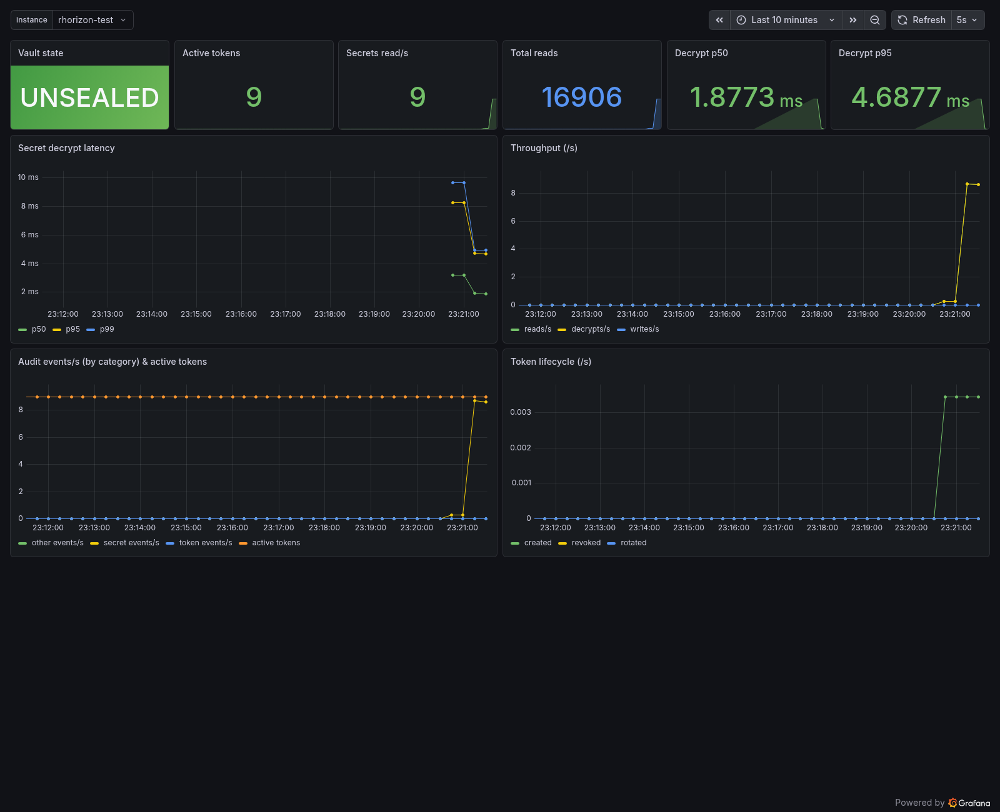
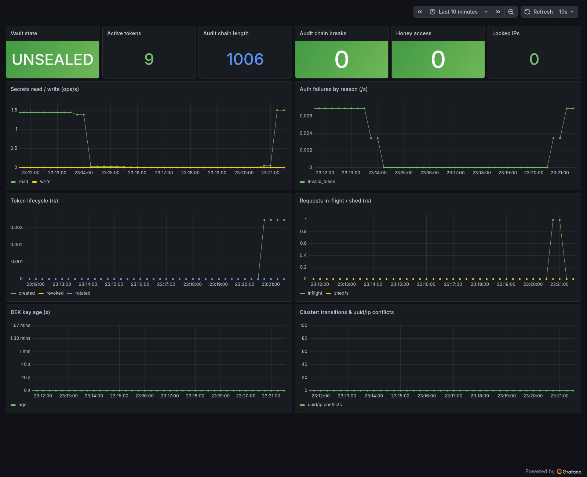

# Grafana dashboards

Importable Grafana dashboards over rhorizon's Prometheus metrics
(`GET /metrics`). Wire a Prometheus to scrape the API (CIDR-allow the scraper
via `RH_METRICS_ALLOWED_CIDRS`), add it as a Grafana datasource, and
import the JSON.

| Dashboard | File | Screenshot |
|---|---|---|
| Read & crypto (per-instance, `$instance` selector) | [`rhorizon-cluster.json`](rhorizon-cluster.json) |  |
| Overview (vault state, audit, auth, tokens, DEK) | [`rhorizon-overview.json`](rhorizon-overview.json) |  |
| Nova (live at-a-glance: state, connections, RPS, throughput, decrypt p95, auth fails; 5s refresh) | [`rhorizon-nova.json`](rhorizon-nova.json) | (none) |
| HA cluster (API + provider-neutral Database HA + PostgreSQL guardrails) | [`rhorizon-ha-cluster.json`](rhorizon-ha-cluster.json) | (none) |
| HA failover bench (multi-node lab) | [`ha-bench.json`](ha-bench.json) | (none) |

The screenshots were captured against a single 5-worker instance under a mixed
read / write / token-churn load.

`rhorizon-ha-cluster.json` is the operational one-view for an HA deploy. Its
first row is provider-neutral: Database HA, the writable database endpoint,
and rhorizon application membership use
`rhorizon_cluster_component{component=...}` from the API's `/metrics`.
Values map to green (`1`), orange/degraded (`0.5`), and red (`0`). A missing
sample is deliberately black/`UNKNOWN`; grey is never presented as healthy.
The `Failover / K7 health gate` is green only when the `database`,
`database_ha`, and `cluster` components are all present and green.

The `database_ha` series is the Prometheus projection of `/cluster/health`,
not a Patroni-specific signal:

| `RH_DATABASE_HA_PROVIDER` | Status source | What the provider-neutral panel means |
|---|---|---|
| `patroni` | Patroni REST cluster status | Exactly one leader, every member running, replicas streaming, known bounded lag, and matching timelines |
| `pgha` | BSD rhorizon-pgha agent `/status` reports | Fresh reports from all agents, quorum and one-leader consensus, exactly one primary owning the write VIP, all members reachable, and standbys streaming within the lag budget |
| `none` / unconfigured | No Database HA supervisor | No gauge sample; panel remains black/`UNKNOWN` |

This keeps three independent roles clear: the **rhorizon application primary**,
the per-host **crypto master process**, and the **database leader/write-VIP
owner**. A green role does not imply that either of the other roles is green.

The `Patroni details` row remains available for Patroni deployments and uses
Patroni's built-in `/metrics` (`patroni_*`). It is expected to be empty with
`pgha`; use the provider-neutral row in mixed Linux/BSD estates. PostgreSQL
availability and replication lag use `postgres_exporter` (`pg_up`,
`pg_replication_lag_seconds`).

The WAL guardrail row also needs `node_exporter` for
`node_filesystem_{avail,size}_bytes`. Set the `PostgreSQL node exporter` and
`PGDATA / pg_wal filesystem mountpoint` dashboard variables to the filesystem
that actually contains `PGDATA`/`pg_wal` (often `/`, `/var`, or
`/var/lib/postgresql`). The panel warns at 70% and turns red at 85%, leaving
headroom for checkpoints and crash recovery.

The deeper PostgreSQL guardrails use these normalized `postgres_exporter`
collector series. They are an explicit dashboard input contract because
postgres_exporter custom-query naming differs between packages:

| Metric | PostgreSQL source/value |
|---|---|
| `pg_wal_directory_bytes` | `sum(size)` from `pg_ls_waldir()` |
| `pg_replication_slot_retained_wal_bytes{slot_name}` | `greatest(pg_wal_lsn_diff(pg_current_wal_lsn(), restart_lsn), 0)` from `pg_replication_slots` |
| `pg_replication_slot_active{slot_name}` | `active::int` from `pg_replication_slots` |
| `pg_replication_slot_wal_lost{slot_name}` | `(wal_status = 'lost')::int` from `pg_replication_slots` |
| `pg_archive_last_success_age_seconds` | Seconds since `pg_stat_archiver.last_archived_time` |
| `pg_archive_failures_total` | `pg_stat_archiver.failed_count` exported as a counter |

Grant the exporter only the least PostgreSQL privileges required to read those
views/functions. Missing collectors render as no data, not as healthy. The
reference WAL/slot thresholds are 2 GiB orange and 4 GiB red, matching the
runbook's lab `max_slot_wal_keep_size=4GB`; align them with the production
limit after import.

Below the database rows, the rhorizon layer covers state transitions, RPC
latency, failovers, UUID/IP conflicts, reaped nodes, and HA-password load
failures. Those panels use real `rhorizon_cluster_*` series and need no
provider-specific changes.

Both dashboards reference a Prometheus datasource with `uid: prometheus` (the
cluster/overview panels hard-code it); set that uid on your datasource, or
edit the panels after import.
