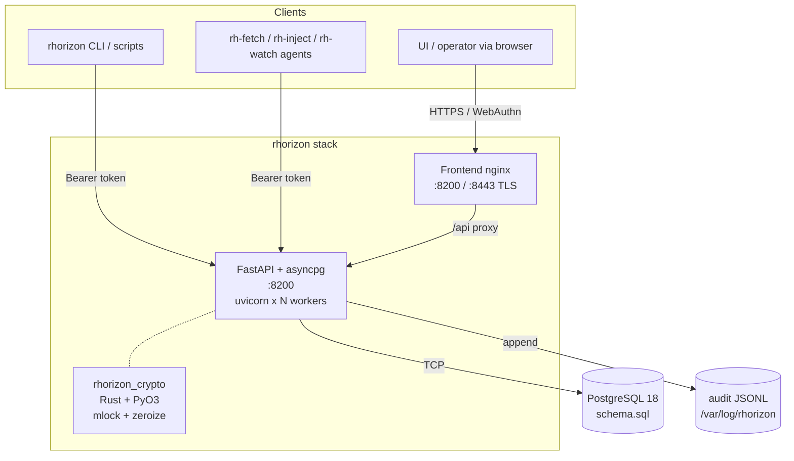
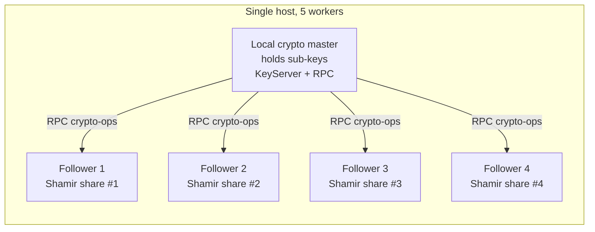

# Architecture

## Components

### API (`api/app/`)

FastAPI + SQLAlchemy async + asyncpg. The HTTP routes live in `api/app/`;
the CLI, MCP server, and MCP hub are separate clients and trust boundaries.
Routes split into focused modules : `vault.py` (seal/unseal/2FA),
`secrets.py` (CRUD), `tokens.py` (auth tokens + ephemeral), `namespaces.py`
(RBAC), `audit.py`, `groups.py`, `auth_ldap.py`,
`auth_proxy.py`, `webauthn.py`, `dynamic.py`, `backup.py`, `oneshot.py`,
`notifications.py`, `cluster.py`.

Multi-worker by default: uvicorn spawns N workers. In embedded custody they
also form the local Shamir quorum. Separated custody adds a fixed UDS-only
quorum and leaves the public workers disposable. In both layouts only one
**local crypto master** per application container holds the subkeys.

### Frontend (`frontend/`)

Single-page vanilla JS SPA, served by nginx. Nine views named after
astrophysics objects :

| View | Purpose |
|------|---------|
| Horizon | Dashboard + unseal + status |
| Eclipse | Secrets CRUD |
| Quasar | Tokens (long-lived + ephemeral, two tabs) |
| Jets | Audit (Live tail + file archives) |
| Cluster | Groups RBAC + LDAP + SSO + HA |
| Nebula | Namespaces (RBAC + delete protection) |
| Accretion | Backup / restore |
| Pulsar | Notification channels (Matrix, webhook, email) |
| Core | Settings, 2FA, Shamir, password rotation |

CSP zero-inline-style budget enforced by tests.

### Rust extension (`api/rust/`)

`rhorizon_crypto` - built into the API image via `maturin` at build
time. Provides :

- `SecureBuffer` : `Vec<u8>` mlock'd, zeroized on drop.
- `WrapKey` : AES-256-GCM 32-byte key, lives in mlock'd Rust heap,
  never crosses to Python.
- `secure_zero()` : zero a Python bytearray in place using a wipe that the
  compiler must preserve.
- Shamir GF(256) split / combine for the distributed key shares.

The wrap key is generated and used entirely in Rust ; Python never
sees the bytes. At seal, the buffers are dropped -> zeroize fires.

### Agents (`agent/rust/`)

Three Rust binaries, `cargo build --release` to musl static, then
`FROM scratch` Docker image - final size ~5-8 MB each.

- **`rh-fetch`** : init container. Reads `RH_SECRETS=name:/path,...`,
  fetches each, writes to tmpfs as files mode 0400.
- **`rh-inject`** : exec wrapper. Resolves env vars matching `rh://...`
  to vault values, then `execve()`s the real command as PID 1.
- **`rh-watch`** : sidecar. Polls every N seconds, atomic-writes on
  change, optionally signals a target PID for config reload. Supports
  ephemeral token rotation via bootstrap -> ephemeral inheritance.

All three share a `lib.rs` that provides `SecureToken` (mlock'd buffer,
zeroize on drop), `load_token()` (preferring `RH_TOKEN_FILE`
over env), and `atomic_write()` (`.tmp + fsync + rename`).

### PostgreSQL

The only storage backend, and **PostgreSQL 18 is the only supported major**
(see [COMPATIBILITY.md](https://github.com/JR-Shdw/Horizon/blob/main/docs/COMPATIBILITY.md)).

The reason is post-quantum: `ssl_groups` is a PG18+ GUC, so **PG 18 is the
only major that can negotiate the hybrid KEM (X25519MLKEM768) on the API-to-
database connection**. The shipped compose auto-skips that GUC on an older
major so the stack still starts - but what you lose is PQ key exchange on the
link carrying every wrapped DEK and every secret ciphertext. A harvest-now-
decrypt-later adversary recording that traffic is exactly the threat the
hybrid KEM exists to answer, so an older major is a downgrade of the
confidentiality story, not just an unsupported version.

The hybrid group also needs OpenSSL 3.5+, and negotiation is
best-effort with a classical fallback - so it is quantum-resistant only when
the hybrid group is actually negotiated. Full per-hop coverage table in
[POST-QUANTUM.md](https://github.com/JR-Shdw/Horizon/blob/main/docs/POST-QUANTUM.md).

Schema in `schema.sql` (idempotent - safe to re-apply on every restart).
**31 tables**. The core set: `vault_config`, `vault_dek`, `vault_secrets`,
`vault_secret_versions`, `vault_tokens`, `vault_yubikeys`, `vault_webauthn`,
`vault_audit`, `vault_challenges`, `vault_workers`, `vault_rate_limits`,
`vault_groups`, `vault_group_members`, `vault_namespaces`,
`vault_notification_channels`, `vault_dynamic_module_state`,
`vault_dynamic_engines`, `vault_dynamic_roles`, `vault_leases`,
`vault_pending_token_rotations`. Plus the HA + audit-identity
set: `vault_cluster_nodes`, `vault_cluster_config`, `vault_join_idempotency`,
`vault_rekey_envelope`, `vault_audit_lite`, `vault_audit_key_archive`,
`vault_audit_signer_certs`. `schema.sql` is the authoritative list.

The rhorizon **application layer** embeds no Consul, etcd, or Raft:
application-primary and local-crypto-master coordination use PostgreSQL
advisory locks (`pg_advisory_xact_lock`). This does not describe the separate
Database HA provider. The reference Patroni topology uses a DCS such as etcd;
BSD-native `pgha` uses peer quorum and owns the write VIP.

## Local process cluster

Embedded custody is the compatibility default. Its Docker launcher floors
`RH_WORKERS` from 2-4 to 5, giving a 3-of-5 quorum. A single worker remains a
supported small-host path without local Shamir failover.

- The local crypto master holds the five HKDF-derived sub-keys (`hmac_key`,
  `dek_key`, `audit_key`, `ha_wrap_key`, `pki_wrap_key`) plus the Ed25519
  audit-signing seed.
- Followers each hold **one** Shamir share - one share alone reveals
  nothing about the master key.
- Crypto-ops (encrypt secret, sign audit entry) are RPC'd from
  followers to master via Unix domain socket (filesystem path under
  `/run/rhorizon/`, mode 0700, peer-UID validated).
- Local crypto master crash -> election via `pg_advisory_xact_lock` + random delay
  -> winner reconstructs master key from M-of-N shares fetched from
  surviving followers.

Within each application container, the master key stays on exactly one local
crypto master process at a time; Shamir shares only serve failover
reconstruction. This role is independent from the cross-host **application
primary** and the PostgreSQL **database leader**.

Separated custody moves those roles into a fixed process pool. Public HTTP
workers keep no share and can be replaced without reducing the quorum. See
[Key custody and worker pools](key-custody.md) for deployment and sizing.

## Networking

- **API** listens on `:8200` HTTP. TLS termination is expected to
  happen upstream (nginx, traefik, the frontend container).
- **Frontend** listens on `:8200` HTTP and `:8443` HTTPS (when
  `TLS_ENABLED=true`).
- **Postgres** listens on `:5432` inside the docker network only
  (never exposed to the host). The production compose enables PG SSL
  with self-signed certs.
- **local crypto RPC**: Unix domain sockets under `/run/rhorizon/`, mode
  0700, keep follower workers from holding the full sub-key set.
- **cluster HA RPC**: cross-host mTLS with node certificates issued by the
  rhorizon cluster CA. Multi-host HA runs the API cluster on top of a
  provider-neutral Database HA layer: Patroni is the Linux/Kubernetes
  reference, while [`rhorizon-pgha`](../../PGHA.md)
  supplies peer-quorum supervision and the write VIP on BSD.

See [Memory protection](memory-protection.md), [Audit chain](audit.md),
[RBAC & namespaces](rbac.md), and the
[HA architecture](https://github.com/JR-Shdw/Horizon/blob/main/docs/HA-CLUSTER.md)
for the deep dives.
