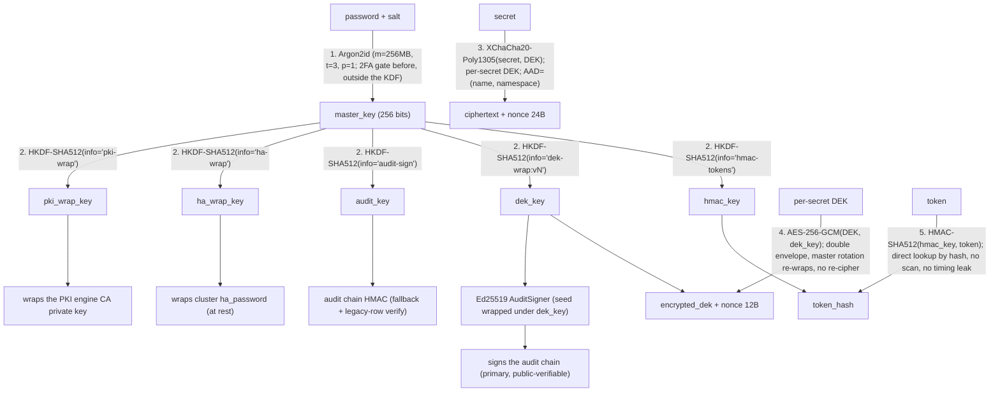

# Cryptography - 5 operations, 3 jobs

The system uses 5 numbered cryptographic operations, but they do **three
different jobs**: operations **1-2 derive keys** (nothing is encrypted yet),
operations **3-4 are the two encryption envelopes** that actually wrap a secret
(the "double envelope"), and operation **5 authenticates** tokens and the audit
chain. So a secret is protected by *two* encryption layers (3 + 4); 1-2 are key
derivation and 5 is authentication.



## Choices explained

**Argon2id** for KDF - a memory-hard password KDF standardized in
RFC 9106. The libsodium-backed parameters (256 MB / t=3 / p=1) are
fixed by the application.

**HKDF-SHA512** to derive five sub-keys from the master (`hmac_key`,
`dek_key`, `audit_key`, `ha_wrap_key`, `pki_wrap_key`) - keeps the master key
out of the per-operation hot path. Each sub-key is domain-separated by its
HKDF `info` string, so compromise of one (e.g. `hmac_key` via the
lazy-migration window) does not compromise the others. `ha_wrap_key` encrypts
the cluster `ha_password` at rest in `vault_cluster_config`; `pki_wrap_key`
wraps the PKI engine's CA private key, giving it a dedicated sub-key that
rides the Shamir bundle so a failover reconstruction keeps the CA usable.

`dek_key`'s `info` string carries a generation counter, which is what makes
`POST /admin/rotate-dek-key` cheap: bumping the version derives a fresh
`dek_key` from the same master key without touching the master password.

**Audit chain signing** - the tamper-evident audit chain is signed with an
**Ed25519** signature by default: the 32-byte seed lives in `vault_config`,
decrypted under `dek_key` at unseal and held only in a Rust `AuditSigner`
(mlock'd, zeroize-on-drop); followers delegate signing to the master via RPC.
Public-key signatures make the chain externally verifiable. The symmetric
`audit_key` HMAC chain remains as a fallback and to verify rows signed under it
before an audit identity existed - `/audit/verify` dispatches per entry.

**XChaCha20-Poly1305** for secret bodies - a 24-byte random nonce makes
accidental collisions negligible at the expected write volume; nonce
reuse is still forbidden. `Poly1305` provides AEAD integrity. Each secret has
its own DEK; the AAD binds to the UTF-8 byte lengths and values of
`(name, namespace)`, so swapping a ciphertext between rows fails decryption
with `InvalidTag`. The current v2 encoding is:

```text
"secret:v2:" || u32be(len(name)) || name || u32be(len(namespace)) || namespace
```

Rows written before v2 retain `aad_version=1` and use the legacy
`secret:{name}:{namespace}` encoding when read. Any rewrite or logical restore
upgrades the row to v2.

**AES-256-GCM** for the DEK envelope - keeps `dek_key` rotation cheap
(re-wrap N small ciphertexts) without touching the secret bodies.

Normal secret CRUD chains both envelopes inside Rust. The per-secret DEK is
generated, wrapped, unwrapped, used, and wiped without entering Python.
Followers delegate the same chained operation to the native master RPC server.
Rollback and rotation also keep their intermediate plaintext inside Rust.

**HMAC-SHA512** for token hashes - gives O(1) lookup via a B-tree
index on `vault_tokens.token_hash`. A database dump without the
master-derived `hmac_key` cannot be used to compute lookup hashes for
guessed tokens.

## What lives where

| Material | Storage | Lifetime |
|----------|---------|----------|
| Master password | operator-supplied at unseal | seconds (Argon2id then discarded) |
| Master key | Rust mlock'd RAM, `WrapKey` | until seal |
| `hmac_key` / `dek_key` / `audit_key` / `ha_wrap_key` / `pki_wrap_key` | Rust mlock'd RAM, `SecureBuffer` | until seal |
| PKI CA private key | `vault_pki_config` (wrapped under `pki_wrap_key`) | until PKI rotation |
| Ed25519 audit seed | `vault_config` (wrapped under `dek_key`); live in Rust `AuditSigner` | until seal |
| DEK (per-secret) | encrypted in `vault_dek` table | until targeted or explicit bulk secret rotation |
| Secret ciphertext | `vault_secrets.ciphertext` (PG) | until DELETE |
| `prev_hmac_key` | encrypted in `vault_config` (lazy migration) | 15 days max after master rotation |
| HA rekey X25519 private key | ciphertext under the process `WrapKey`; plaintext used only in Rust | current unseal lifetime |
| Token plaintext | shown ONCE in API response | seconds |
| Token hash | `vault_tokens.token_hash` (PG) | until revoke / expire |

## DEK rotation

Rhorizon does not rewrite every secret on a timer. It monitors the age of the
hierarchical `dek_key` and alerts when it exceeds `RH_DEK_KEY_MAX_AGE_DAYS`.
An operator then calls `POST /admin/rotate-dek-key` with the current master
password. The operation derives a new `dek_key` generation and re-wraps the
DEKs without decrypting or rewriting secret ciphertexts.

`POST /secrets/{name}/rotate` remains available when an operator explicitly
wants to replace one secret's random DEK. `POST /secrets/rotate-all` performs
the same operation for every secret and is never scheduled automatically.

Here, operator-initiated does not mean that the operation cannot be scripted.
The API is suitable for a maintenance job or an orchestrator, but the workflow
must make an explicit, authenticated decision to rotate. Rhorizon deliberately
does not retain the master password or bypass password re-authentication so
that an internal timer can perform this sensitive operation.

A production rotation workflow should:

1. verify cluster and database readiness;
2. create a database-consistent, encrypted backup and verify that its restore
   procedure is usable;
3. obtain the current master password from a protected runtime input, never
   from command-line arguments, logs, or a bundled backup;
4. call `POST /admin/rotate-dek-key` with a narrowly authorized `admin:w`
   token during an observed maintenance window;
5. check the API result, node readiness, key-age metrics, representative
   secret reads, and the audit event before declaring success.

This design leaves risk ownership with the operator: the same script can
enforce backup, readiness, approval, and post-rotation checks appropriate to
the deployment. Scheduling such a script is supported; silently scheduling
rotation inside Rhorizon is not.

## Master password rotation

Two modes, depending on whether the rotation is hygiene or incident
response :

- **`emergency=false` (admin ops)** : lazy migration. Old `hmac_key`
  is kept encrypted under the new master for ~15 days ; existing
  tokens are auto-rehashed to the new key on first use during that
  window, so they do not need to be reissued immediately.
- **`emergency=true` (sec ops)** : immediate invalidation. Old
  `hmac_key` is dropped ; every token (including the caller's) is
  rejected at the next request. Use when a token leak is suspected.

```bash
curl -X POST http://127.0.0.1:8200/api/v1/vault/rotate-password \
  -H "Authorization: Bearer $ADMIN" \
  -d '{
    "current_password": "old-pass",
    "new_password": "new-pass",
    "emergency": false
  }'
```
