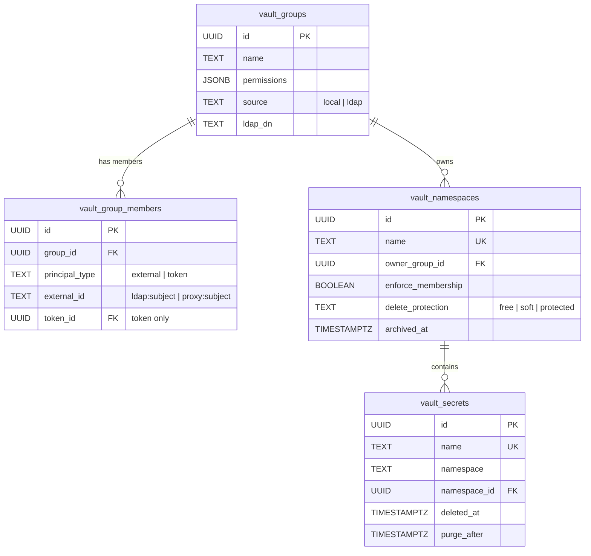
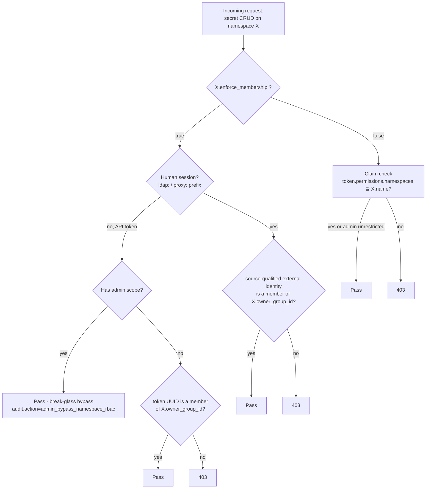

# RBAC & namespaces

Namespaces are first-class rows in `vault_namespaces` (not stringly-typed),
owned by a group, with
two security flags that are one-way ratchets at the DB level.

## Tables in play



## The two flags

### `enforce_membership` (per namespace)

Toggles between two access models for the secrets inside the namespace :

- **`false` (agnostic, default + migration default)** - claim-based :
  the token's `permissions.namespaces` list grants access. Existing
  behaviour preserved.
- **`true` (strict)** - live, typed `vault_group_members` check on **every**
  read and write. LDAP/login-provider sessions match an `external` principal
  by source-qualified identity; native tokens match a `token` principal by
  immutable token UUID. A non-member is denied even if its `namespaces` claim
  covers the namespace.

**One-way ratchet.** Going false -> true is allowed (admin + 2FA + a
warning). Going true -> false is **rejected at the DB trigger level** -
even a compromised root token cannot relax the flag. Recovery from a
wrong upgrade : create a fresh namespace in agnostic mode, transfer
secrets, archive the old one.

### `delete_protection` (per namespace)

Controls what `DELETE /secrets/{name}` does :

| Mode | DELETE behaviour |
|------|------------------|
| `free` (default) | Hard delete. Row dropped, orphaned DEK cleaned. |
| `soft` | Sets `deleted_at` + `purge_after` (now + `soft_delete_retention_days`, default 7). Reaper purges later. `POST /restore` un-deletes within window. |
| `protected` | Same as soft + admin scope required + 2FA challenge (purpose `delete_protected_secret`) + extended retention (`protected_delete_retention_days`, default 365 ; set to 0 = never auto-purge, manual restore only). |

**One-way ratchet** : free -> soft -> protected, never backwards.

## Decision tree at request time



The decision tree is implemented in `auth.check_namespace_membership`
(`api/app/auth.py`).

## Typed principals

Rhorizon has no independent local-user account table. A principal is either a
native Rhorizon token or an identity authenticated by LDAP/login proxy. Add it
explicitly:

```json
{"principal_type": "external", "principal_id": "ldap:alice"}
```

```json
{"principal_type": "token", "principal_id": "8cb18dd4-...-2e737e49"}
```

For an external identity, keep the source prefix: `ldap:alice` and
`proxy:alice` are distinct. For a token, `principal_id` is the UUID returned by
the token listing API. Reusing a token display name cannot inherit another
principal's RBAC membership. Deleting the token removes its memberships
through the database foreign key.

On upgrade from the former untyped membership table, a row matching an active
native-token name is narrowed to that token UUID. Every other ambiguous string
becomes an `external` principal whose ID is `legacy:<name>`, and therefore
matches no login session. Re-add it with an explicit `ldap:` or `proxy:`
identity, then remove the legacy membership by its `member_id`.

## Bootstrap -> ephemeral inheritance

An ephemeral token (`POST /tokens/ephemeral`) can opt to **inherit**
the caller's group memberships. Used by `rh-watch` to mint fresh
short-TTL tokens for strict-RBAC namespaces without operator
intervention :

```python
{
    "permissions": {"secrets": "r"},
    "ttl_seconds": 3600,
    "inherit_group_membership": true   # default false for back-compat
}
```

When set, the API reads the caller's typed memberships and attaches the new
ephemeral token UUID to the same groups. Deleting the expired token cascades
to those membership rows.

## Namespace lifecycle

| Operation | Auth | Notes |
|-----------|------|-------|
| `POST /namespaces/` | admin:w + 2FA + rate-limit | create with chosen flags |
| `GET /namespaces/` | token (claim-filtered) | list all visible |
| `GET /namespaces/{name}` | token | one + secret count |
| `PUT /namespaces/{name}` | admin:w + 2FA + rate-limit | change owner / upgrade flags ; **name is immutable** |
| `DELETE /namespaces/{name}` | admin:w + 2FA + rate-limit | soft delete (sets archived_at), refused if non-empty |

The name immutability is deliberate : renaming would invalidate the
AEAD AAD on every secret in the namespace. V2 length-prefixes and binds both
the secret name and namespace. The re-encrypt loop is doable but the security
review on it is pending. To "rename", create a new namespace, migrate secrets,
archive the old one.

Per-actor rate-limit on namespace mutations : default 10 / hour
(`namespace_mutation_rate_per_hour`). The window is counted from the audit
trail itself - `create_namespace`, `update_namespace` and `archive_namespace`
rows for that actor in the last hour.

On exceed the API writes a `namespace_rate_limit_exceeded` audit entry, counts
it under the `namespace` metric label, and returns `429`. It does **not** push
a notification: wire an alert on that audit action or metric if you want one
(see [observability alerts](../howto/observability-alerts.md)).
