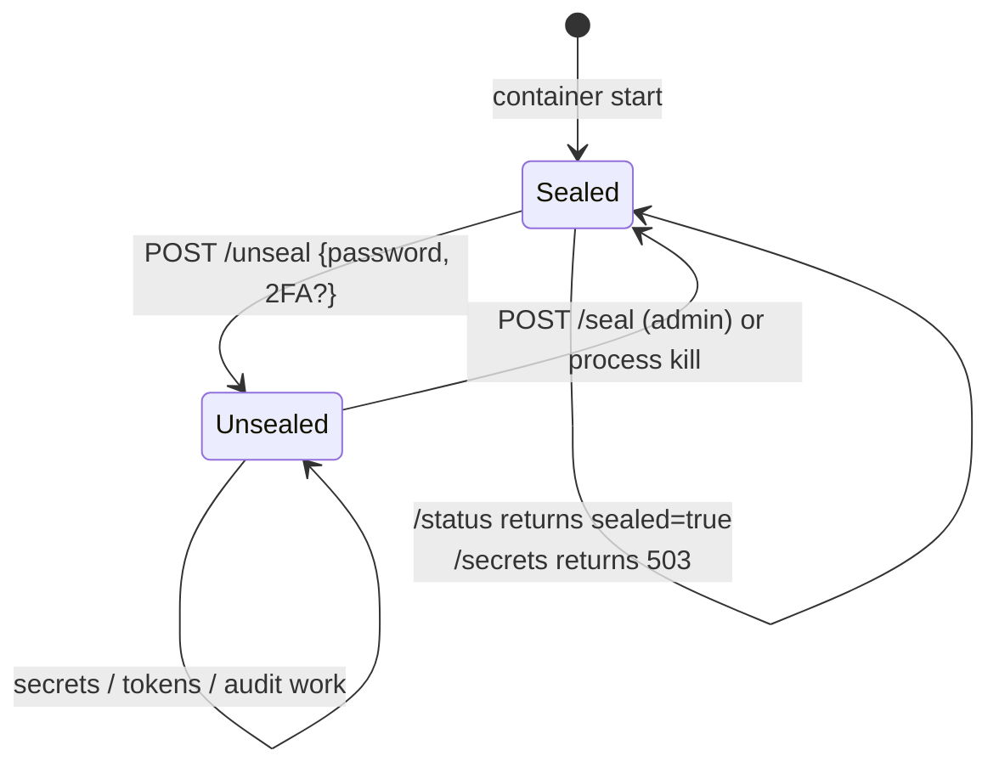

# Seal / Unseal lifecycle

rhorizon is **sealed by default**. At every restart, no master key
exists in memory ; secrets are encrypted on disk but unreadable
without the master password. The operator unseals manually after
each restart.



## Why sealed by default

1. **A reboot doesn't expose secrets.** If an attacker steals your PG
   data dir (backup tape, disk image, cold boot), they get the
   ciphertexts but not the key. They'd need to also obtain your
   master password - different attack surface, different controls.
2. **Operator confirmation = audit signal.** Every unseal is logged.
   If an unseal happens that you didn't trigger, you investigate.
3. **Forces a "where do we keep the master password" decision.**
   Cloud KMS auto-unseal hides this question and shifts the trust to
   a cloud provider. Sealed-by-default surfaces it.

## First boot

The first ever `/unseal` does three things at once :

1. Sets the master password (Argon2id KDF parameters baked at this
   moment : 256 MB, t=3, p=1).
2. Unseals the vault for the first time.
3. **Returns a one-shot `root_token`** in the response. This is the
   only time you see it.

Save it. There is no recovery - rhorizon does not have an
"emergency root token" mechanism by design: the initial root token is
treated as ephemeral.

Use the UI or `rhorizon unseal`, which prompts without placing the password in
shell history. The underlying API request and response shapes are:

```json
{ "password": "<master-password>" }
```

```json
{
  "status": "unsealed",
  "second_factor": "none",
  "root_token": "rh_...",
  "warning": "Save this token - shown once only"
}
```

## Subsequent unseals

Use `rhorizon unseal` again. The response has no `root_token` because it was
issued once:

```json
{
  "status": "unsealed",
  "second_factor": "none"
}
```

If 2FA is configured (TOTP, YubiKey, WebAuthn, or `any`), the body
must also include `totp_code`, `yubikey_response` + `challenge`, or
`webauthn_response` + `challenge`. See [2FA setup](../howto/2fa.md).

## Seal

```bash
curl -X POST http://127.0.0.1:8200/api/v1/vault/seal \
  -H "Authorization: Bearer $RH_ADMIN_TOKEN"
```

The master key, sub-keys, and 2FA decrypted secrets are zeroised in
RAM. Secret ciphertexts stay on disk, unreadable until next unseal.
All workers in a cluster receive the seal broadcast.

## Status

```bash
curl http://127.0.0.1:8200/api/v1/vault/status

# {
#   "sealed": false,
#   "version": "0.9.0-beta",
#   "second_factor": "any",
#   "yubikeys_registered": 1,
#   "totp_enabled": true,
#   "webauthn_registered": 1,
#   "shamir_enabled": false,
#   "shamir_threshold": 0,
#   "shamir_total": 0,
#   "memory_protection": "mlock",
#   "process_memory_protection": "unknown",
#   "swap_protection": "unknown",
#   "pending_restore_review": false,
#   "pending_token_rotations_count": 0
# }
```

`/status` is unauthenticated - it's safe to expose for monitoring.

The three protection fields are distinct and worth alerting on separately:
`memory_protection` covers the key *buffers* (`mlock`), while
`process_memory_protection` reports whether the whole process is locked and
`swap_protection` reports the host swap state (`protected`, `unencrypted`, or
`unknown`). A rootless container typically reports locked buffers but a
swappable process - see [memory protection](memory-protection.md).
`pending_restore_review` and `pending_token_rotations_count` are set by
`/backup/restore` and drive the post-restore review panel.

## Automation patterns

The sealed-by-default model creates a chicken-and-egg problem for
fully-automated rebuilds : if a CI/CD job rebuilds the container, who
unseals ?

### Pattern 1 : operator unseal once per reboot (recommended)

The default. After a planned reboot, an operator runs `/unseal` once
and the vault stays unsealed for cron + agents. This is what you want
for a small, ops-aware team.

### Pattern 2 : Shamir M-of-N

Split the master key across N shares (default 5), require M (default
3) to unseal. Collect the threshold shares through a secure operator
channel, make a backup, then submit them atomically. One request is reliable
behind a multi-worker listener; successive `share` requests are retained only
as a five-minute compatibility path and are not worker-affine.

```bash
# Initialize and distribute the returned shares to separate holders.
curl -X POST http://127.0.0.1:8200/api/v1/vault/shamir/init \
  -H "Authorization: Bearer $ROOT" \
  -H "Content-Type: application/json" \
  -d '{"total": 5, "threshold": 3}'

# Later, prompt without echo/history and submit M shares together.
python3 - <<'PY' | curl -X POST http://127.0.0.1:8200/api/v1/vault/unseal \
  -H "Content-Type: application/json" \
  --data-binary @-
import getpass, json
print(json.dumps({"shares": [getpass.getpass(f"Share {i}: ") for i in range(1, 4)]}))
PY
```

See the **Core** view of the UI for the full Shamir setup wizard.

## Oneshot reads

For cron / CI jobs that need a single secret and don't want to leave
the vault unsealed : the `/oneshot` endpoint unseals -> reads one
secret -> re-seals atomically.

```bash
curl -X POST http://127.0.0.1:8200/api/v1/vault/oneshot \
  -H 'Content-Type: application/json' \
  -d '{
    "password": "your-master-password",
    "secret": "prod/db-password"
  }'

# {"value": "the-secret-value"}
```

Use sparingly - the master password has to live somewhere
(`secret manager -> secret manager` recursion). The most common
legitimate use case is the very first bootstrap of an empty vault on
a new host.

## What the operator must keep

The master password is the **only** thing that survives a total loss
of the host. PG data dir, audit logs, root tokens - all worthless
without it.

Recommended : store it in **two places**, ideally :

- A paper copy in a safe.
- A second copy in a *different* secrets manager (a hardware token
  with a static password slot, a KeePass vault on a separate machine,
  a 1Password emergency kit, or split via Shamir across trusted
  operators).

If you lose the master password, all your secrets are gone. There is
no key escrow, no vendor support line, no way back.
