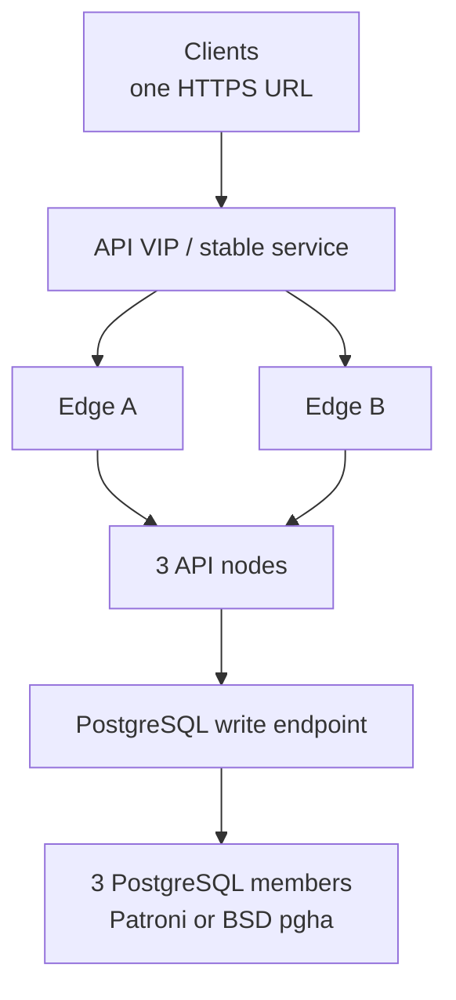

# High availability

[English production reference](https://github.com/JR-Shdw/Horizon/blob/main/docs/HA-PRODUCTION-REFERENCE.md)
· [Référence française](https://github.com/JR-Shdw/Horizon/blob/main/docs/fr/HA-PRODUCTION-REFERENCE.md)
· [Operations runbook](https://github.com/JR-Shdw/Horizon/blob/main/docs/HA-RUNBOOK.md)

Production uses one logical HTTP/2 API address, two edge instances, three
active API nodes and three supervised PostgreSQL members.

Keep these roles separate: local crypto master (one per API host), application
primary (one per rhorizon cluster), and database leader (one per Database HA
cluster).

## Routing

- `/health` is liveness only; route on `/readiness`.
- After unseal, wait for one local crypto master and all followers before
  re-enabling a node.
- Retry `GET`, `HEAD` and `OPTIONS` on another ready backend.
- Do not replay mutations without application idempotency.
- Return structured 429 with `Retry-After` for capacity pressure.
- Eject a backend on readiness 503 or gateway 502/504.

The validated HTTP/2 test profile uses four independently rotated connections
per backend. See the production reference for retry and idempotency details.

## Database and audit

All API workers connect to the stable database write endpoint. Keep application
pool capacity below 80% of PostgreSQL `max_connections`; monitor replication,
WAL slots/archive and disk reserve.

Audit recording stays enabled. Run full verification through the durable job
API before and after fault tests; use audit-lite canaries during active load.

## Release gate

All edge, API, worker, application HA, database, Database HA and audit states
must be green. Prove API-node loss, database-leader loss, HTTP/2 connection
rotation and structured overload with bounded tests before a long soak.

The production reference also documents rolling edge/API/database upgrades,
worker re-admission, mixed-version requirements and rollback limits.
