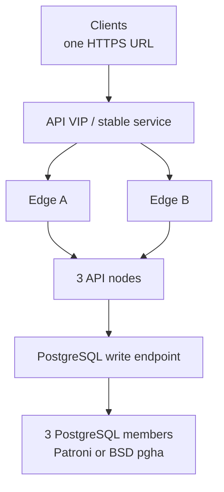

# High availability

[English production reference](https://github.com/JR-Shdw/Horizon/blob/main/docs/HA-PRODUCTION-REFERENCE.md)
· [Référence française](https://github.com/JR-Shdw/Horizon/blob/main/docs/fr/HA-PRODUCTION-REFERENCE.md)
· [Operations runbook](https://github.com/JR-Shdw/Horizon/blob/main/docs/HA-RUNBOOK.md)

Production uses one logical HTTP/2 API address, two edge instances, three
active API nodes and three supervised PostgreSQL members.



Keep these roles separate: local custody leader (one per API host), application
primary (one per rhorizon cluster), and database leader (one per Database HA
cluster).

## Routing

- `/health` is liveness only; route on `/readiness`.
- After unseal, wait for one local custody leader and full API/custodian convergence before
  re-enabling a node.
- Retry `GET`, `HEAD` and `OPTIONS` on another ready backend.
- Do not replay mutations without application idempotency.
- Return structured 429 with `Retry-After` for capacity pressure.
- Eject a backend on readiness 503 or gateway 502/504.

The validated HTTP/2 test profile uses four independently rotated connections
per backend. See the production reference for retry and idempotency details.

## Database and audit

All API workers connect to the stable database write endpoint. Keep application
pool capacity below 80% of PostgreSQL `max_connections`; monitor replication,
WAL slots/archive and disk reserve.

Audit recording stays enabled. Run full verification through the durable job
API before and after fault tests; use audit-lite canaries during active load.

## FROZEN timing

A node that cannot confirm canonical state stops serving after the application
lease expires (20 seconds by default). It then remains `FROZEN`, retaining keys
but exercising no authority, for `RH_CLUSTER_FROZEN_MAX_SECS` before it seals.
The default is 30 seconds for a same-site/LAN deployment. Use 45-60 seconds for
same-region multi-site deployments and 90-120 seconds for multi-region. Measure
database, VIP and routing convergence before choosing the lower bound.

The total isolated-node time from the last database confirmation to sealing is
the 20-second lease plus this grace. mTLS evidence of a shared database outage
may retain keys for up to three times the configured grace; it never permits a
frozen node to serve.

Set the intended 60- or 120-second profile before restarting nodes in a
multi-site deployment. If the variable is unset, the 30-second same-LAN
default applies.

## Preflight

Run one contract on every installation type:

```bash
rhorizon cluster preflight
```

It checks declared HA/TLS configuration, persistent identity, the proxy trust
boundary, node certificate, all `/cluster/health` components, worker/custodian
convergence, the latest signed full-audit verification anchor, and a live mTLS
round trip through the HTTPS frontend. A failed blocking check exits with code
2 and includes an operator action. `--no-live` is useful for passive polling,
but it does not prove the network path.

The HA Web UI uses the same API. `vault_cluster_preflight` exposes a bounded,
topology-free summary to MCP clients and deliberately skips the active mTLS
request. The K7 harness remains the release proof for node loss, pressure and
convergence; the dashboard is an observation surface, not a chaos test.

## Release gate

All edge, API, worker, application HA, database, Database HA and audit states
must be green. Prove API-node loss, database-leader loss, HTTP/2 connection
rotation and structured overload with bounded tests before a long soak.

The production reference also documents rolling edge/API/database upgrades,
worker re-admission, mixed-version requirements and rollback limits.
