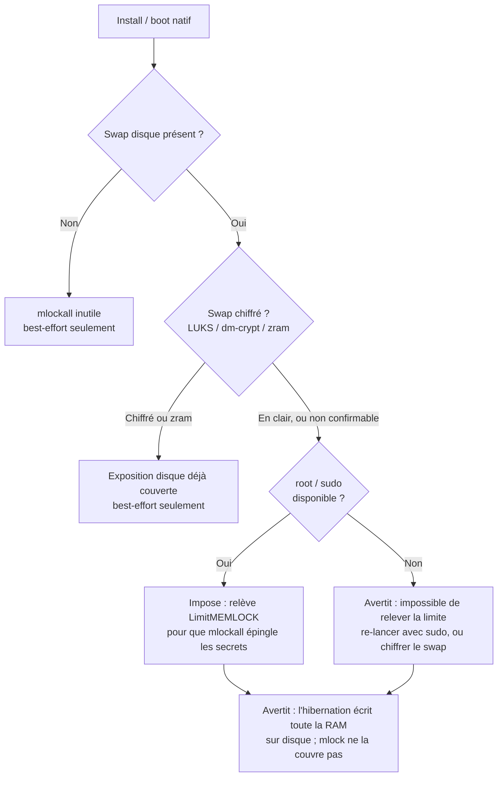

# Déploiement

Ce document couvre les scénarios réalistes de déploiement de Resurgamus
Horizon - du stack dev sur laptop à une production single-VM derrière
un reverse proxy avec SSO et LDAP. Il est orienté opérateur : chaque
section pointe vers les variables d'environnement et fichiers que vous
devez réellement toucher.

Pour une prise en main de 5 minutes, voir [`QUICKSTART.md`](QUICKSTART.md).
Pour les spécificités Docker / Kubernetes, voir
[`DOCKER.md`](DOCKER.md) et [`K8S.md`](K8S.md).

---

## 1. Choisir une topologie

| Scénario | Joignable depuis | Auth | Cas d'usage |
|---|---|---|---|
| **Local / dev** | `127.0.0.1` uniquement | Master password + 2FA optionnel | Dev, tests d'intégration |
| **Réseau privé / VPN** | CIDR VPN + loopback | Master password + 2FA | Production single-VM, self-hosted souverain |
| **Reverse-proxy + SSO** | CIDR VPN via le proxy | Master password + 2FA *plus* SSO amont (headers `Remote-User`) | Derrière une gateway SSO existante |
| **Bind LDAP / AD** | CIDR VPN | Bind LDAP/AD -> token de session | Fournisseur d'identité existant |

Les scénarios sont **empilables**, pas exclusifs : SSO et LDAP se
posent par-dessus "Réseau privé / VPN". Le mode multiworker (section 7)
est orthogonal et toujours actif, indépendant du mode d'exposition choisi.

---

## 2. Local / dev

But de ce mode : faire tourner le stack sur un poste de travail en
moins de cinq minutes, avec des défauts sûrs qui ne bindent rien
publiquement.

```bash
git clone https://github.com/JR-Shdw/Horizon.git
cd rhorizon
cp env.example .env
sed -i "s|^POSTGRES_PASSWORD=.*|POSTGRES_PASSWORD=$(openssl rand -hex 32)|" .env
docker compose up -d
```

Défauts que vous obtenez gratuitement :

| Réglage | Valeur | Pourquoi |
|---|---|---|
| Bind addresses | `127.0.0.1` | Inaccessible depuis une autre machine |
| TLS | off | nginx sert du HTTP en clair - OK sur loopback |
| Workers | 5 | Défaut raw-compose ; les presets `install.sh` l'ajustent (ci-dessous) |
| Multiworker | actif (5 workers) | Toujours actif, donc le comportement colle à la prod |
| 2FA | aucune | À activer une fois que vous avez une YubiKey / app TOTP sous la main |

### Presets de dimensionnement

`tools/install.sh --tier <home|smb|heavy|super-heavy>` dimensionne la stack en
une commande, sur **les deux** chemins (conteneur et natif). **home est le
défaut** et binde localhost.

| Tier | Workers | RAM totale | Pour |
|---|---|---|---|
| `home` | 1 | ~600 Mo | Perso / laptop. Process unique, pas de failover. |
| `smb` | 5 | ~1.6 Go | Minimum pour usage pro / multi-worker. |
| `heavy` | 10 | ~2.7 Go | Forte concurrence. |
| `super-heavy` | 20 | ~5 Go | Très forte concurrence / beaucoup d'agents. |

Sur le chemin **conteneur** le tier charge `tools/presets/<tier>.env` (workers
api + PostgreSQL + mémoire). Sur le chemin **natif** il mappe vers `--workers`
et la mémoire se dérive du nombre de workers (`workers x 160 + 256 + 192 Mo`).
Re-lancez avec un autre `--tier` pour changer ; les volumes persistent et la
stack revient **scellée**, re-déverrouillez ensuite. `smb` est le plancher pour
la compartimentation multi-worker des clés et le failover ; `home` échange les
deux contre l'empreinte réduite.

### Persistance au boot

`--persist` fait redémarrer le tier après un reboot : no-op sur Docker (le daemon
+ `restart: unless-stopped` le font déjà), `loginctl enable-linger` + une unité
`systemd --user` sur podman rootless+systemd (peut nécessiter `sudo loginctl
enable-linger <user>` une fois). Sur BSD, utilisez l'install native (root ->
`rc.d`) ; le chemin conteneur est Linux en pratique (pas de Docker/podman sur
*BSD hormis les jails FreeBSD). La stack revient **scellée** au boot - re-déverrouillez.

Pour développer contre une vraie base sans rebuild à chaque fois,
utilisez `make logs` / `make db-shell` (voir le Makefile).

Variantes Podman / Docker rootless documentées dans
[`QUICKSTART.md`](../QUICKSTART.md#podman--docker-rootless).

---

## 3. Production réseau privé / VPN (single VM)

Objectif : un hôte derrière un VPN (IPsec / OpenVPN /
Tailscale / ZeroTier - votre choix), avec le vault joignable depuis le
CIDR VPN uniquement. Pas d'exposition Internet, pas de reverse proxy,
pas encore de SSO - juste un déploiement single-VM durci.

### 3.1 Préparation de l'hôte

- Kernel patché + Docker Engine >= 24 (pour compose v2)
- **512 Mo RAM** minimum aux défauts (idle typique : ~210 Mo
  cumulés sur les trois containers - voir "Tuning pour petits hôtes"
  plus bas). Argon2id à 256 Mo ne tourne que pendant le handshake
  d'unseal et c'est transitoire.
- **3 Go d'espace disque libre.** Le gros, ce sont les images
  containers (~1 Go : postgres ~625 Mo, api ~320 Mo, frontend ~95 Mo).
  La DB et le volume audit grossissent lentement ; prévoir un peu de
  marge pour la rétention des logs (défaut 365 jours, configurable
  via `RH_AUDIT_RETENTION_DAYS`).
- VPN déjà up et la box joignable sur un CIDR privé
- Heure synchronisée (NTP) - TOTP et timestamps d'audit en dépendent

#### Tuning pour petits hôtes

Les caps mémoire des containers dans `docker-compose.yml` (768 Mo
api, 512 Mo postgres, 64 Mo frontend) sont des **bornes hautes**, pas
des prérequis. Sur un hôte contraint, tu peux les baisser via un
`docker-compose.override.yml` :

```yaml
services:
  api:
    deploy:
      resources:
        limits:
          memory: 384M     # serré mais viable ; laisse la place pour un Argon2id
  postgres:
    deploy:
      resources:
        limits:
          memory: 192M
```

Un hôte 512 Mo est confortable. Un 256 Mo marche si Postgres est
trimé (`shared_buffers=64MB`) et tu acceptes qu'un unseal sous Argon2id
256 Mo touche brièvement le swap. En dessous de 256 Mo total, baisser à
`RH_WORKERS=1` (voir section 3.3) ; c'est le mode mono-worker, qui
tient ses clés en-process sans failover (section 7).

### 3.2 Bind addresses

Dans `.env` :

```ini
# 10.0.0.20 est votre IP VPN-facing sur cet hôte
VAULT_API_BIND=10.0.0.20         # plan admin/UI
VAULT_API_BIND_M2M=10.0.0.20     # plan machine-to-machine (séparation optionnelle)
VAULT_FRONT_BIND=10.0.0.20       # frontend nginx
```

Si vous n'avez pas besoin d'un plan m2m séparé, pointez les deux binds
API sur la même IP.

### 3.3 Mode worker / multiworker

| Workers | Mémoire (mlock) | Pour |
|---|---|---|
| 1 | ~608 Mo | le plus petit ; process unique |
| 5 | ~1.25 Go | multi-worker : forte charge + résilience worker |

Mémoire réservée par mlock (RSS par worker + pic Argon2id 256 Mo à l'unseal).
2-4 sont ramenés à 5. Détail dans [`multiworker.md`](multiworker.md).

### 3.4 Premier démarrage

```bash
docker compose up -d
docker compose logs -f api      # observe la migration de schéma
curl http://10.0.0.20:8200/api/v1/vault/status
# {"sealed": true, ...}
```

Le **premier unseal** crée la master key à partir de votre password.
**Ce password protège tout.** Choisissez-le robuste et stockez-le dans
votre password manager **et** offline (voir section backup).

```bash
RH_ADDR=https://10.0.0.20:8443 rhorizon unseal
# Master password: ********
# Retourne un root token, affiché UNE fois
```

Le CLI évite de placer le mot de passe dans l'historique du shell. Stockez le
root token à usage unique dans votre gestionnaire de mots de passe.

### 3.5 Après reboot

Le vault est sealed par défaut après chaque reboot - c'est le design.
Un opérateur (ou un quorum Shamir) doit unseal. Pour automatiser le
post-reboot **sans** affaiblir le modèle, le chemin recommandé est le
CLI sur un poste opérateur de confiance :

```bash
rhorizon login http://10.0.0.20:8200
rhorizon unseal --yubikey   # ou --totp
```

L'auto-seal après inactivité est opt-in via
`RH_AUTO_SEAL_MINUTES` (défaut 0 = jamais). À activer seulement
si votre threat model l'exige ; pour la plupart des setups
self-hosted, "unseal une fois après reboot, reste ouvert pour les
crons" est le bon équilibre.

### 3.6 Protection mémoire et swap

rhorizon protège le matériel secret en mémoire sur deux couches indépendantes :

- **Buffers de clés (toujours actif).** La master key, ses sous-clés et la wrap
  key vivent dans des objets Rust `SecureBuffer`/`WrapKey` `mlock`és (jamais
  swappés) et zeroïsés au drop. Quelques centaines d'octets ; ça réussit
  toujours, quel que soit le mode d'install ou les privilèges.
- **Lock du process entier (`mlockall`, conditionnel).** Au démarrage chaque
  worker fait un best-effort `mlockall` de tout son espace d'adressage pour
  qu'aucune page (y compris une valeur de secret brièvement déchiffrée) ne soit
  écrite sur le swap. C'est la seule couche qui dépend de l'hôte : elle a besoin
  du rlimit memlock relevé au budget worker (`RH_WORKERS x 160 + 256 +
  192 Mo`, voir 3.3).
- **Blocage de l'inspection du processus (Linux, obligatoire).** Chaque worker
  applique `PR_SET_DUMPABLE=0` avant de traiter des secrets. Le démarrage échoue
  si cet appel échoue, ce qui empêche un autre processus utilisant l'UID de
  l'API de lire `/proc/PID/mem` ou de s'attacher avec `ptrace`. Le root de
  l'hôte et une compromission du noyau restent hors périmètre.

Le seul rôle de `mlockall` est de garder les pages en clair hors du **swap
disque**, donc l'installeur ne l'impose que lorsque ce risque est réel, c.-à-d.
quand du swap disque non chiffré existe. Si le swap est chiffré (LUKS/dm-crypt),
est du `zram` (RAM seulement), ou absent, le risque d'exposition disque est déjà
couvert et le lock best-effort est laissé tel quel. Relever la limite memlock
demande root, donc sur une install rootless avec swap non chiffré rhorizon
avertit au lieu d'imposer.



**Hibernation.** `mlock`/`mlockall` ne protègent **pas** contre la
suspend-to-disk : l'hibernation copie toute la RAM, pages verrouillées
comprises, sur le device de resume. Sur un laptop avec swap non chiffré l'image
d'hibernation est en clair. Chiffrez le swap (et le device de resume) ou
désactivez l'hibernation pour une couverture complète.

**Les core dumps** sont désactivés par défaut (`RLIMIT_CORE=0`). Conservez
`RH_DISABLE_CORE_DUMPS=true` en production ; désactiver cette protection peut
permettre à un crash d'écrire du plaintext sur disque.

---

## 4. Reverse proxy + TLS

Resurgamus Horizon embarque un nginx durci qui peut faire son propre
TLS (`TLS_ENABLED=true`, voir [`TLS.md`](TLS.md)). Quand un reverse
proxy est déjà devant votre stack, laissez-le terminer le TLS et
laissez nginx en HTTP.

### 4.1 Labels génériques compose

Le `docker-compose.yml` porte des labels déclaratifs préfixés
`proxy.*`. Ils ne s'activent que si un reverse proxy compatible est
sur le réseau externe `reverse_proxy`. Exemples :

| Reverse proxy | Comment il prend les labels |
|---|---|
| Traefik | Natif (`traefik.*`) ; renommez le préfixe ou utilisez un plugin de label-mapping |
| Caddy | `caddy-docker-proxy` lit les labels `caddy.*` - adaptez en conséquence |
| nginx | Pas de label discovery ; écrivez un server block manuel |

L'idée : les labels sont des **métadonnées déclaratives** - ils ne
cassent pas le stack tout seuls. Adaptez-les ou supprimez-les selon ce
que votre proxy attend. Un exemple production rédigé est documenté
comme template `INFRASTRUCTURE.md` gitignored (notes locales de
l'opérateur ; voir vos notes de déploiement privées).

### 4.2 Source TLS

| Source | Quand |
|---|---|
| TLS natif nginx | Pas de proxy amont, CA interne ou auto-signé acceptable |
| Reverse proxy avec ACME (Let's Encrypt, ZeroSSL, ...) | CA publique nécessaire ; le proxy gère le renouvellement |
| `cert-manager` (Kubernetes) | Voir [`K8S.md`](K8S.md) |
| CA interne (PKI) | La plupart des scénarios entreprise ; distribuer la CA aux clients |

### 4.3 Ce qu'il NE faut PAS exposer publiquement

- L'API elle-même (joignable via VPN uniquement)
- Postgres (réseau Docker interne uniquement)
- `/docs` et `/redoc` (`enable_docs=false` par défaut ; à activer derrière SSO si vraiment nécessaire)
- L'endpoint `/metrics` (allowlist via `RH_METRICS_ALLOWED_CIDRS`)

---

## 5. SSO via headers de reverse-proxy

L'*unseal* de Resurgamus Horizon requiert toujours master password +
2FA - aucun SSO ne peut remplacer ça. Le SSO se pose devant pour
**l'accès UI post-unseal** : il permet à votre équipe de se connecter
à l'UI web sans gérer un password séparé.

Le flow :

```
User -> reverse proxy (Authelia / Authentik / Keycloak / oauth2-proxy) -> rhorizon
                          |
                          +--- ajoute les headers Remote-User + Remote-Groups
```

Endpoint Resurgamus Horizon : `POST /api/v1/vault/auth/proxy` lit les
headers de confiance et émet un token de session mappé du group au
scope.

### 5.1 Configuration

```ini
RH_PROXY_AUTH_ENABLED=true
RH_PROXY_USER_HEADER=Remote-User
RH_PROXY_GROUPS_HEADER=Remote-Groups
RH_PROXY_TRUSTED_IPS=172.18.0.0/16     # CIDR de votre reverse proxy
RH_PROXY_SESSION_TTL_HOURS=8
```

Critique : `RH_PROXY_TRUSTED_IPS` est la **seule** chose qui
sépare le reverse proxy d'un client qui forgerait des headers.
Réglez-le sur un CIDR d'où seul le proxy peut originer. Si proxy et
rhorizon sont sur le même réseau Docker, utilisez le CIDR de ce réseau.

### 5.2 Mapping group -> scope

Le mapping est configuré au runtime via l'API par un admin :

```bash
curl -X PUT https://vault.example/api/v1/vault/auth/proxy/mappings \
  -H "Authorization: Bearer $ADMIN_TOKEN" \
  -H "Content-Type: application/json" \
  -d '{
    "ops": {"secrets": "rw", "tokens": "rw", "audit": "r"},
    "developers": {"secrets": "r"},
    "sec": {"admin": "rw"}
  }'
```

Les noms de groupes sont matchés case-sensitive contre `Remote-Groups`
(séparés par virgule par convention).

### 5.3 Stacks amont compatibles

Tout ce qui émet `Remote-User` / `Remote-Groups` (ou des noms de
headers configurables équivalents) fonctionne :

- **Authelia** - support explicite, injection de headers en mode forward-auth
- **Authentik** - ProxyOutpost avec flow header-mapping
- **Keycloak** - via `oauth2-proxy` ou Keycloak Gatekeeper
- **oauth2-proxy** standalone - `--set-xauthrequest=true`

Resurgamus Horizon est agnostique ; il ne rappelle pas l'IdP.

---

## 6. LDAP / Active Directory

LDAP/AD est un chemin d'auth séparé : l'utilisateur s'authentifie avec
ses credentials AD, le vault bind, et en cas de succès émet un token
de session mappé du groupe AD au scope.

Endpoint : `POST /api/v1/vault/auth/ldap`.

### 6.1 Configurer LDAP

```bash
curl -X POST https://vault.example/api/v1/vault/auth/ldap/config \
  -H "Authorization: Bearer $ADMIN_TOKEN" \
  -H "Content-Type: application/json" \
  -d '{
    "url": "ldaps://ad.example.local:636",
    "bind_dn": "CN=rhorizon,OU=ServiceAccounts,DC=example,DC=local",
    "bind_password": "service-account-password",
    "user_search_base": "OU=Users,DC=example,DC=local",
    "user_search_filter": "(sAMAccountName={username})",
    "group_search_base": "OU=Groups,DC=example,DC=local",
    "group_attr": "memberOf"
  }'
```

Le bind password est chiffré avec la clé dérivée du master et stocké
dans `vault_config`. L'endpoint `GET /auth/ldap/config` retourne un
password masqué - jamais le cleartext.

### 6.2 Mapping group -> scope

```bash
curl -X PUT https://vault.example/api/v1/vault/auth/ldap/mappings \
  -H "Authorization: Bearer $ADMIN_TOKEN" \
  -H "Content-Type: application/json" \
  -d '{
    "CN=DevOps,OU=Groups,DC=example,DC=local": {"secrets": "rw"},
    "CN=Auditors,OU=Groups,DC=example,DC=local": {"audit": "r"}
  }'
```

Les mappings LDAP et SSO-proxy sont indépendants - vous pouvez faire
tourner les deux chemins d'auth simultanément.

### 6.3 LDAP sur TLS

Toujours utiliser `ldaps://` (port 636) ou StartTLS. La lib `bonsai`
honore le store CA système ; montez votre CA interne dans le container
si vous utilisez une PKI privée :

```yaml
# docker-compose.override.yml (non commité)
services:
  api:
    volumes:
      - ./ca-bundle.pem:/etc/ssl/certs/ca-certificates.crt:ro
```

---

## 7. Mode multiworker

L'API tourne plusieurs workers uvicorn sur un seul hôte. C'est toujours actif.
Docker Compose et `install.sh` le démarrent sans configuration. Répartir le
travail entre workers augmente le débit et compartimente la frontière de
confiance : seul le process master tient les sous-clés, tandis que chaque
follower tient une share Shamir plus un client RPC crypto-ops. Si le master
crashe, un worker survivant est élu et reconstruit les clés depuis un quorum de
shares. Voir [`multiworker.md`](multiworker.md).

Ce n'est pas le cluster HA (coordination cross-host, activé par
`RH_CLUSTER_HA_ENABLED`) ; c'est une feature séparée et opt-in, sans
rapport avec le split de workers par-hôte décrit ici.

| Var | Défaut | Sens |
|---|---|---|
| `RH_WORKERS` | `5` | Workers uvicorn (1 master + N-1 followers). `1` = mono-worker (clés en-process, pas de Shamir/RPC) ; `2`-`4` sont plafonnés à 5 pour le quorum. |
| `RH_CLUSTER_SHAMIR_TOTAL` | `0` | Shares de clé ; `0` = auto `max(5, RH_WORKERS)`. |
| `RH_CLUSTER_SHAMIR_THRESHOLD` | `0` | Quorum de failover ; `0` = auto majorité `max(2, total // 2 + 1)`. |

Laissez les deux vars Shamir à `0` sauf besoin d'un quorum asymétrique ; elles
suivent le nombre de workers.

**Invariant failover.** Avec 5 workers le quorum auto est 3 : le master plus
n'importe quels 2 followers survivants reconstruisent les clés après un crash
master sans action opérateur. Avec moins de 2 followers survivants le quorum est
perdu, et le vault reste sealed jusqu'à un re-unseal opérateur.

**Sizing pour petits hôtes.** Le multiworker plancher à 5 workers (2-4 deviennent
5, côté installeur et wrapper conteneur). Si tu ne peux pas te permettre ~1.25 Go
pour 5 workers, utilise le preset single-worker `home` (`RH_WORKERS=1`) :
clés dans un seul process, pas de failover, le bon compromis pour un petit hôte.

---

## 8. Observabilité

### 8.1 fail2ban (protection brute-force au niveau IP)

Resurgamus Horizon écrit chaque échec d'authentification dans
`/var/log/rhorizon/authfail.log` dans un format regex-friendly.
fail2ban le lit et bannit les IPs au niveau iptables/nftables. Voir
[`FAIL2BAN.md`](FAIL2BAN.md) pour les configs filter et jail.

### 8.2 Métriques

Un endpoint `/metrics` compatible Prometheus est activable :

```ini
RH_METRICS_ENABLED=true
RH_METRICS_ALLOWED_CIDRS=10.0.0.0/24,127.0.0.1/32
```

L'allowlist `_ALLOWED_CIDRS` est appliquée côté serveur indépendamment
de la network policy - la laisser vide désactive l'endpoint.

### 8.3 Chaîne d'audit

La chaîne signée des mutations est écrite dans PostgreSQL et dans les fichiers
JSONL quotidiens `/var/log/rhorizon/audit-YYYY-MM-DD.jsonl` (volume Docker
`audit_logs`). Les lectures sont protégées par des checkpoints Merkle signés,
puis archivées avec des sceaux signés avant élagage de la base.

Planifier une vérification d'intégrité quotidienne (recommandé via
cron ou un job CI) :

```bash
rhorizon audit verify
# Sort en non-zero si la chaîne, les checkpoints ou les archives sont cassés
```

Compresser et expédier les fichiers JSONL vers votre SIEM à votre
convenance - `audit_compress_days=1` les gzip dès le rollover du jour suivant ;
`audit_retention_days=365` est la fenêtre minimale de delete-protection.

---

## 9. Sauvegarde & restauration

### 9.1 Quoi sauvegarder

| Élément | Rôle dans la récupération |
|---|---|
| **Données PostgreSQL** (volume `postgres_data`) | Secrets chiffrés et metadata. Sans le master password c'est inutile, mais il en faut pour restaurer. |
| **Audit logs** (volume `audit_logs`) | Historique tamper-evident. Sans lui la chaîne ne peut pas être vérifiée. |
| **Master password** | Requis pour unseal. À stocker dans un password manager + une copie offline (papier, token hardware). |
| **Shares Shamir** (si utilisées) | Tenues par N opérateurs ; M requises pour reconstruire. |
| **Identité age ou passphrase** | Requise pour déchiffrer les dumps `pg_dump` chiffrés ou les backups logiques API, selon le mode utilisé. |

### 9.2 Cadence recommandée

```bash
# Quotidien - dump Postgres chiffré
docker exec rhorizon_postgres pg_dump -F c -U rhorizon rhorizon \
  | age -r age1... > /backup/rhorizon-$(date +%F).pgdump.age

# Quotidien - snapshot du volume audit
docker run --rm \
  -v rhorizon_audit_logs:/data:ro \
  -v /backup:/backup \
  alpine tar -C /data -czf /backup/audit-$(date +%F).tar.gz .

# Quotidien - backup logique applicatif (artefact de migration partiel)
APP_BACKUP=/backup/rhorizon-$(date +%F).backup
curl -sS -X POST https://vault.example/api/v1/vault/backup/create \
  -H "Authorization: Bearer $ADMIN_TOKEN" \
  -H "Content-Type: application/json" \
  -d '{"passphrase": "long-backup-passphrase"}' \
  | jq -r .payload | base64 -d > "$APP_BACKUP.age"
```

Expédier vers un datacenter séparé / un bucket S3 / un repo restic
offsite. Utilisez [restic](https://restic.net/),
[borg](https://www.borgbackup.org/) ou similaire - tous fonctionnent
avec la sortie chiffrée ci-dessus.

### 9.3 Restaurer sur un hôte vierge

1. Démarrer un stack vide sur le nouvel hôte (`docker compose up -d postgres`)
2. `age -d /backup/rhorizon-YYYY-MM-DD.pgdump.age | docker compose exec -T postgres pg_restore -U rhorizon -d rhorizon --clean --if-exists`
3. Restaurer le tarball du volume audit
4. `docker compose up -d api frontend`
5. Unseal avec le même master password - les sous-clés sont re-dérivées

Le vault revient en service dès que l'unseal réussit. Tokens et
enregistrements 2FA survivent intacts. La chaîne d'audit est vérifiée
si le volume audit a été restauré (sinon la chaîne casse au gap).

---

## 10. Mises à jour

Le projet est en beta - les breaking changes seront annoncés dans le
CHANGELOG. Procédure générale :

```bash
git fetch && git checkout v1.0.x
docker compose pull
docker compose up -d --build
docker compose logs -f api          # observe l'application de la migration
```

Le schéma est idempotent (`CREATE TABLE IF NOT EXISTS`, `ALTER TABLE ...
ADD COLUMN IF NOT EXISTS`). À l'upgrade, le handler lifespan vérifie
chaque étape de migration et applique colonnes/indexes manquants ; les
données existantes sont laissées intactes.

Après upgrade, ré-unseal - les workers démarrent sealed.

---

## 11. Checklist de durcissement

Passez ceci en revue avant de déclarer un déploiement "production" :

- [ ] Bind addresses ne sont PAS `0.0.0.0` (loopback ou VPN-only)
- [ ] Postgres n'est PAS exposé (uniquement le réseau Docker interne)
- [ ] `/docs` et `/redoc` sont désactivés (`RH_ENABLE_DOCS=false`)
- [ ] `/metrics` est allowlist sur votre CIDR de monitoring (`RH_METRICS_ALLOWED_CIDRS`)
- [ ] `RH_PROXY_TRUSTED_IPS` est réglé si l'auth proxy SSO est on
- [ ] Master password est dans votre password manager **et** stocké offline (ou splitté via Shamir)
- [ ] 2FA est activée (`mode=any`, `yubikey`, ou `totp`)
- [ ] Job de backup quotidien tourne et a été **testé** (essayer une restauration sur un hôte de côté)
- [ ] `rhorizon audit verify` quotidien planifié avec alerting en cas d'échec
- [ ] fail2ban lit le log authfail
- [ ] Limites de ressources container présentes (les défauts dans `docker-compose.yml` sont sains)
- [ ] Synchro horaire (NTP) en bon état sur l'hôte
- [ ] Kernel hôte patché et Docker Engine récent
- [ ] Vous avez un runbook pour : unseal-après-reboot, rotation-master-password, révocation-d'urgence, restore-depuis-backup

Pour une discussion de ce contre quoi Resurgamus Horizon ne protège
**pas** (root hôte, hyperviseur, accès physique), voir
[`docs/THREAT-MODEL.md`](../THREAT-MODEL.md#3-explicit-limitations).
