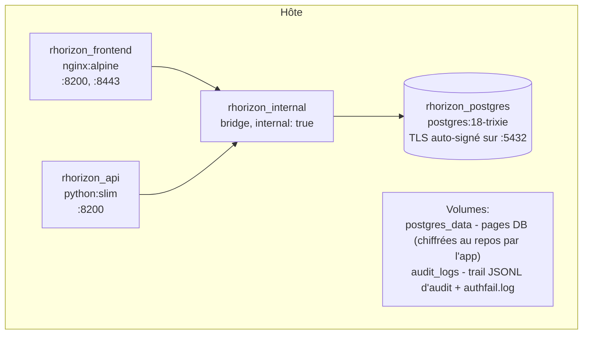
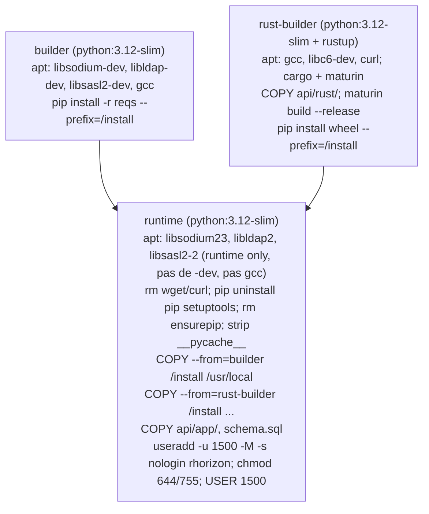

# Docker

Packaging des conteneurs, services Compose, durcissement, stockage,
réseau et patterns d'override de Resurgamus Horizon.

Pour les topologies de déploiement (local / VPN / SSO / LDAP), voir
[`DEPLOYMENT.md`](DEPLOYMENT.md). Pour les spécificités Kubernetes,
voir [`K8S.md`](K8S.md).

---

## 1. Le stack compose



| Service | Image | Rôle | Limites de ressources (défauts) |
|---|---|---|---|
| `postgres` | `postgres:18-trixie` | Stockage des secrets chiffrés, chaîne d'audit, config | 512 Mo / 100 PIDs |
| `api` | construite depuis `api/Dockerfile` | FastAPI + crypto | 768 Mo / 150 PIDs |
| `frontend` | construite depuis `frontend/Dockerfile` | nginx (UI + reverse proxy vers API) | 64 Mo / 20 PIDs |

Le réseau interne `rhorizon_internal` a `internal: true` - les pods
sur ce réseau ne peuvent pas joindre l'Internet public. Le réseau
externe optionnel `reverse_proxy` est où vous attachez un proxy amont
(voir [`DEPLOYMENT.md`](DEPLOYMENT.md#4-reverse-proxy--tls)).

---

## 2. Dockerfile multi-stage (api/)

L'image API est construite en trois stages :



Ce qui survit dans l'image runtime :

- Python 3.12 + libs runtime libsodium23 + libldap2 + libsasl2-2
- `cryptography`, `pynacl`, `fido2`, `pyotp`, `bonsai`, `pyrage` & co.
- L'extension Rust compilée `rhorizon_crypto` (un `.so`)
- L'arbre source `app/` et `schema.sql`

Ce qui est retiré :

- `pip`, `setuptools`, `ensurepip` (pas d'install runtime possible)
- `curl`, `wget` (pas d'helpers d'exfiltration)
- `gcc`, paquets `*-dev` (pas de compilation possible)
- `__pycache__/` de la stdlib (image plus petite)

---

## 3. Durcissement, par service

| Protection | postgres | api | frontend |
|---|---|---|---|
| `read_only: true` | - | yes | yes |
| `cap_drop: ALL` | NET_RAW, SYS_ADMIN | yes | yes |
| `cap_add` | - | aucun par défaut ; override IPC_LOCK optionnel | NET_BIND_SERVICE, CHOWN, SETUID, SETGID |
| `security_opt: no-new-privileges` | yes | yes | yes |
| Non-root | user postgres | uid 1500 (`rhorizon`) | uid 101 (`nginx`) |
| `tmpfs` | - | `/tmp:16M`, `/dev/shm:1M` (noexec, nosuid) | `/tmp:1M`, `/var/cache/nginx:8M`, `/run:1M`, `/etc/nginx/conf.d:1M` (noexec, nosuid) |
| Limite mémoire | 512 M | 768 M | 64 M |
| Limite pids | 100 | 150 | 20 |
| TLS | server.crt/key généré au premier boot | utilise libsodium pour le handshake TLS vers PG | TLS natif nginx optionnel |

Le Compose par défaut ne demande ni `IPC_LOCK` ni ulimit memlock illimité, afin
de démarrer sans privilège et en rootless. Si `mlock` échoue, l'API continue,
et affiche `zeroize-only`. Elle avertit seulement si le swap est non chiffré ou
impossible à vérifier. Avec un swap chiffré, zram ou sans swap, aucune action
n'est nécessaire. Pour imposer le verrouillage sur un hôte avec swap non
chiffré :

```bash
docker compose -f docker-compose.yml \
  -f tools/docker-compose.memory-lock.yml up -d
```

Cet override demande `IPC_LOCK`, un ulimit illimité et passe l'application en
mode `required`. Son échec est alors volontaire et explicite.

**Pourquoi `/dev/shm` à 1 Mo** : rhorizon n'y écrit rien ; l'IPC
multi-worker passe par un socket Unix sous `/run/rhorizon`. Le limiter
empêche un attaquant ayant obtenu un accès en écriture de stager des gros
payloads. Le flag `noexec` signifie que les binaires uploadés ne peuvent pas
tourner.

---

## 4. Volumes

| Volume | Monté dans | Contenu | Priorité backup |
|---|---|---|---|
| `postgres_data` | `postgres:/var/lib/postgresql` | La DB elle-même (les secrets sont app-encrypted, mais il en faut un dump pour la restauration) | Quotidien |
| `audit_logs` | `api:/var/log/rhorizon` | Logs d'audit JSONL quotidiens + `authfail.log` | Quotidien |
| `./certs` (bind hôte) | `frontend:/certs:ro` | Cert + clé TLS quand `TLS_ENABLED=true` | Hors-bande |

Le répertoire hôte `./certs` est monté **read-only** pour nginx ; il a
juste besoin de certificats `0600` détenus par le process TLS-issuing
de l'hôte.

---

## 5. Réseaux

| Réseau | Défini où | Usage |
|---|---|---|
| `rhorizon_internal` | Dans `docker-compose.yml`, `internal: true` | Postgres <-> API <-> frontend ; ne peut pas joindre Internet |
| `reverse_proxy` | Externe, à créer en amont | Où un proxy amont rejoint API et frontend |

Si vous n'avez pas de reverse proxy, retirez simplement les
références `reverse_proxy:` du compose (ou override-les dans
`docker-compose.override.yml`) - le stack tourne sur
`rhorizon_internal` seul, avec les ports publiés sur loopback par
défaut.

---

## 6. Patterns de personnalisation

### 6.1 docker-compose.override.yml

Ce fichier est **gitignored** - utilisez-le pour les ajustements
spécifiques au site.

Exemple : ajouter une CA bundle perso pour LDAP / TLS sortant :

```yaml
services:
  api:
    volumes:
      - ./ca-bundle.pem:/etc/ssl/certs/ca-certificates.crt:ro
```

Exemple : pin le nombre de workers uvicorn :

```yaml
services:
  api:
    environment:
      RH_WORKERS: "10"
```

Exemple : mono-worker sur un petit hôte (clés tenues dans un seul process,
pas de failover) :

```yaml
services:
  api:
    environment:
      RH_WORKERS: "1"
```

L'architecture multiworker est toujours active et se dimensionne via
`RH_WORKERS`. Les valeurs `2`-`4` sont plafonnées à `5` (le quorum de
failover Shamir l'exige), donc les vrais choix sont `1` (mono-worker, pas de
failover) ou `5`+ (multiworker avec failover). Laissez les vars Shamir à leur
défaut `0` sauf besoin d'un quorum asymétrique ; voir
[`multiworker.md`](multiworker.md). Rien à voir avec
`RH_CLUSTER_HA_ENABLED`, qui active le cluster HA cross-host séparé
(désactivé par défaut).

### 6.2 Build depuis un fork

```bash
git clone https://github.com/YOUR-FORK/rhorizon.git
cd rhorizon
docker compose build           # build api ET frontend
docker compose up -d
```

Le build est suffisamment déterministe pour que deux checkouts depuis
la même révision git produisent des wheels byte-identiques (`pip wheel`
plus Rust `maturin build --release --strip`). Pour la provenance
supply-chain, voir le step SBOM dans `.woodpecker/deploy.yml`.

### 6.3 Registry custom

Tag et push les images construites vers un registry privé :

```bash
docker compose build
docker tag rhorizon_api registry.example/rhorizon_api:1.0.0
docker tag rhorizon_frontend registry.example/rhorizon_frontend:1.0.0
docker push registry.example/rhorizon_api:1.0.0
docker push registry.example/rhorizon_frontend:1.0.0
```

Puis pointez `image:` sur votre tag dans un `docker-compose.override.yml` :

```yaml
services:
  api:
    image: registry.example/rhorizon_api:1.0.0
    build: !reset null      # désactive le build local
  frontend:
    image: registry.example/rhorizon_frontend:1.0.0
    build: !reset null
```

---

## 7. Modes runtime

### 7.1 Docker rootful (défaut)

Rien de spécial - fonctionne out-of-the-box sur Docker Engine >= 24.

### 7.2 Podman / Docker rootless

Le compose n'utilise que des primitives standard (`cap_drop`,
`no-new-privileges`, `read_only`, `tmpfs`, `pids_limit`,
`memory limits`) supportées par les deux runtimes. Caveats :

- **Bind sur ports < 1024** : pas autorisé en rootless. Bindez sur
  `127.0.0.1:8200` et mettez un reverse proxy rootful devant si vous
  voulez `:443`.
- **`mlock`** : le mode portable ne demande aucun privilège spécial. Un échec
  de `mlock(2)` est visible comme `zeroize-only`. Le `zeroize` au drop tourne
  quand même au seal. Ce statut n'est un avertissement qu'avec un swap non
  chiffré ou non vérifiable. N'utilisez l'override d'imposition que dans ce cas
  et si le runtime rootless accepte la capability et le ulimit.

- **AppArmor / SELinux** : les noms de profils bundlés assument
  Docker rootful. Utilisez les défauts du runtime jusqu'à écrire des
  équivalents rootless.

### 7.3 Quadlet / systemd

Générer des unités Quadlet pour systemd per-user (recommandé sur
EL/Fedora) :

```bash
podman compose --in-pod=true up -d
```

Crée un seul pod avec les trois services et une unité systemd
per-user que vous pouvez `enable` pour démarrage au boot.

---

## 8. Health et lifecycle

Chaque service a un `healthcheck` :

- `postgres` : `pg_isready -U rhorizon -d rhorizon`
- `api` : `python -c "import urllib.request; urllib.request.urlopen('http://localhost:8200/health')"`
- `frontend` : `curl -sf http://localhost:8200/`

Le compose déclare des chaînes `depends_on: condition: service_healthy`,
donc `frontend` attend `api` qui attend `postgres`.

Le vault est **sealed par défaut** à chaque restart de container. Il
n'y a pas moyen de persister un état unsealed entre reboots - c'est le
design.

---

## 9. Logs

```bash
make logs                     # les trois services, mode follow
docker compose logs -f api    # API uniquement
docker compose logs -f --tail 200 frontend
```

Les logs d'audit en JSONL sont aussi accessibles depuis l'hôte via le
volume `audit_logs` :

```bash
docker volume inspect rhorizon_audit_logs | grep Mountpoint
ls /var/lib/docker/volumes/rhorizon_audit_logs/_data/
```

Ces fichiers sont append-only depuis l'API et atomiques par écriture
(POSIX-safe en multi-worker). Archivez-les vers votre SIEM à votre
convenance.

---

## 10. Opérations courantes

| Besoin | Commande |
|---|---|
| Démarrer le stack | `make up` (ou `docker compose up -d`) |
| L'arrêter | `make down` |
| Rebuild après changement de code | `make build` puis `make restart` |
| Tail des logs | `make logs` |
| Ouvrir un shell Postgres | `make db-shell` |
| Tout effacer (destructif) | `docker compose down -v` |
| Vérifier la chaîne d'audit | `rhorizon audit verify` (CLI) |
| Générer les défauts `.env` | `make secrets` |

Voir le `Makefile` pour la liste complète - il est court et
auto-documenté.
