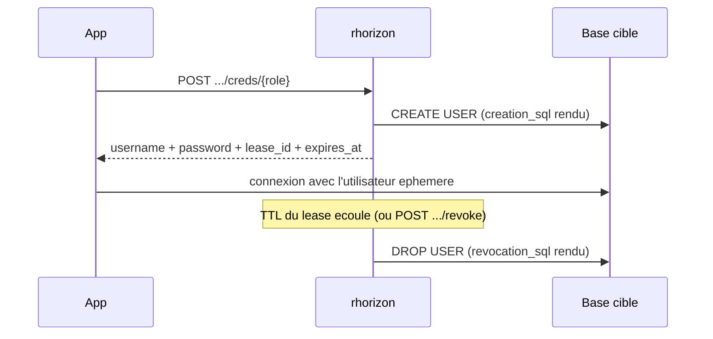

# Secrets dynamiques

Des credentials de cible crees a la demande, avec un lease. Au lieu de stocker
un mot de passe permanent, une application demande un credential frais a
rhorizon, l'utilise sur une courte fenetre, et rhorizon le revoque
automatiquement a l'expiration du lease.

Backends integres : PostgreSQL, MySQL/MariaDB, LDAP, Redis et Cassandra.

> Teste de bout en bout contre un vrai PostgreSQL (2026-06-23) : emission d'un
> credential, connexion reelle a une base cible separee avec l'utilisateur
> ephemere, renew du lease, revoke, et verification que le login meurt, plus
> l'expiry par le reaper. Voir `tests/test_dynamic_e2e_real.py`,
> `tests/test_dynamic_renew.py`, `tests/test_dynamic_lease_expiry.py`.

## Fonctionnement

Trois objets :

- **Engine** : un backend que rhorizon peut provisionner. Contient l'URL de
  connexion admin privilegiee (chiffree au repos) et un `engine_type`
  (`postgresql` / `mysql` / `ldap` / `redis` / `cassandra`).
- **Role** : un template sur un engine. Un `creation_sql` et un `revocation_sql`
  avec les placeholders `{{name}}` / `{{password}}` / `{{expiration}}`, plus un
  TTL par defaut et un TTL max.
- **Lease** : un credential emis. rhorizon rend le template du role avec un nom
  d'utilisateur et un mot de passe generes, l'execute sur la cible, et suit le
  lease jusqu'a son expiration ou sa revocation.

Le snapshot de revocation est commite dans un lease `provisioning` avant toute
mutation de la cible. Une operation backend partielle est compensee
immediatement ; si ce nettoyage echoue aussi, le lease expire pour que le
reaper reessaie. Un crash worker ne peut donc pas laisser un credential non
suivi : le lease persiste, reste revocable et sera supprime au plus tard a son
TTL. Renew, revoke et la suppression d'un engine refusent de courir contre un
provisioning en cours.

Les TTL ont un plancher de 60 secondes. Le TTL par defaut d'un role ne peut pas
depasser son maximum, et le maximum du role ne peut pas depasser celui de
l'engine. Mint et renew appliquent tous deux la limite effective engine/role, y
compris aux lignes legacy.

Le TTL est applique par le reaper, pas par la base. Quand un lease expire, le
reaper execute le `revocation_sql` du role (DROP de l'utilisateur / suppression
de l'entree). Le template canonique ne porte pas d'expiry natif cote base (pas
de `VALID UNTIL` PG), donc le reaper est l'unique source de verite pour la duree
de vie. Le `revocation_sql` doit etre idempotent (`DROP ... IF EXISTS`).



## Configuration

### Chargement des modules et isolation des dependances

Chaque backend vit dans `api/app/dynamic_engines/<backend>/` avec son code, son
manifeste direct et son lock de dependances hashe. Le chargeur n'accepte que les
cinq noms du catalogue compile : une valeur de l'INI ne peut jamais devenir un
chemin d'import Python.

`dynamic-engines.ini` choisit les modules importes par chaque worker API :

```ini
[modules]
postgresql = enabled
mysql = enabled
ldap = enabled
redis = enabled
cassandra = enabled
```

Pour desactiver un backend, revoquez d'abord ses leases et supprimez ses
engines, commentez sa ligne, puis redemarrez tous les noeuds API. Le demarrage
echoue de facon fermee si des donnees persistantes dependent encore du module :
le reaper ne doit jamais perdre le code necessaire a leur revocation.

Le panneau **Modules** ajoute un second interrupteur, plus fin et cluster-wide,
pour chaque backend autorise par l'INI. Son etat est stocke dans PostgreSQL ;
l'UI ne reecrit pas le fichier hote. Apres une bascule, redemarrez tous les
noeuds API afin que tous les workers importent ou dechargent le meme sous-
ensemble. Vert signifie actif, orange redemarrage requis, rouge driver absent,
et noir desactive ou verrouille par l'INI. La desactivation est refusee tant
qu'un engine de ce type existe.

L'image standard contient le catalogue natif complet. Une image durcie peut
retirer physiquement les drivers optionnels :

```sh
docker build -f api/Dockerfile \
  --build-arg RH_DYNAMIC_ENGINE_DEPS="redis" .
```

PostgreSQL reste dans le coeur car Horizon utilise asyncpg pour sa propre base ;
LDAP est aussi partage avec le provider de login externe. MySQL, Redis et
Cassandra sont absents lorsqu'ils ne figurent pas dans
`RH_DYNAMIC_ENGINE_DEPS`. L'INI runtime doit correspondre aux drivers presents.

### Connexions aux backends

Un engine a besoin d'une connexion privilegiee capable de creer et revoquer des
credentials sur la cible :

- **postgresql / mysql** : `connection_url` est un DSN. Pour MySQL/MariaDB,
  `mysqls://admin:pw@host:3306/db` active TLS avec verification du certificat
  et du nom d'hote ; les parametres optionnels `ssl_ca`, `ssl_cert` et
  `ssl_key` selectionnent une CA privee et une paire certificat client/cle.
  `mysql://` est explicitement non chiffre et doit etre limite a un transport
  local de confiance. Lorsque le reseau source de l'application est connu,
  restreignez l'hote du compte dans le modele de role au lieu de conserver
  `@'%'`.
- **ldap** : `connection_url` est un blob JSON
  `{"url":"ldaps://host:636","bind_dn":"...","bind_pw":"..."}`. L'objet
  accepte exactement ces trois cles ; `ldap://` est explicitement non chiffre
  et doit etre limite a un transport local de confiance. `creation_sql` est un bloc LDIF add
  (ligne `dn:` puis lignes `attr: value`) ; `revocation_sql` est le DN de
  l'entree a supprimer. Le `userPassword` est pose via l'extended op RFC 3062
  Password-Modify apres l'add. Le cycle dynamique est valide sur lldap ; les
  autres produits LDAP restent utilisables mais sont signales comme non valides.
- **redis** : utilisez `redis://`, ou de preference `rediss://`. La creation est
  limitee a `ACL SETUSER {{name}}` et la revocation exactement a
  `ACL DELUSER {{name}}`. La creation doit faire `reset`, activer l'utilisateur
  genere et ne peut poser que `>{{password}}` ; utilisateurs fixes, `nopass` et
  mots de passe additionnels sont refuses. Les parametres de query-string sont
  refuses afin qu'ils ne puissent pas modifier les timeouts imposes ou la
  verification TLS. Selectionnez la base avec un chemin numerique comme `/0`.
  Exemple :
  `ACL SETUSER {{name}} reset on >{{password}} ~app:* resetchannels +@read`.
- **cassandra** : utilisez un JSON comme
  `{"hosts":["db1","db2"],"username":"admin","password":"...",
  "tls":true,"server_name":"cassandra.internal",
  "ca_cert":"/etc/rhorizon/cassandra-ca.pem"}`. TLS vaut `true` par defaut et
  exige `server_name` ; le SAN du certificat de chaque noeud doit contenir cette
  identite commune. La creation doit d'abord creer `{{name}}` avec le login et
  le `{{password}}` genere ; les instructions suivantes doivent etre
  `GRANT ... TO {{name}}`. La revocation doit etre exactement
  `DROP ROLE IF EXISTS {{name}}`. Les commentaires et grants vers un autre role
  sont refuses.

Les namespaces confinent l'acces : un token avec `namespaces: ["prod"]` ne voit
que les engines de `prod`.

## Compatibilite des engines

Le registre runtime est expose par
`GET /api/v1/vault/dynamic/engines/compatibility`. Il indique le driver et les
cibles validees de chaque engine. Les preuves actuelles couvrent :

| Engine | Cibles validees |
|---|---|
| PostgreSQL | PostgreSQL 18 |
| MySQL | MySQL 8.x |
| MariaDB | MariaDB 11 |
| LDAP | lldap |
| Redis | validation live en attente ; une cible joignable reste non validee |
| Cassandra | validation live en attente ; une cible joignable reste non validee |

Un operateur peut tester le bind et detecter la version, en lecture seule, avant
d'enregistrer un engine :

```http
POST /api/v1/vault/dynamic/engines/test-connection
Authorization: Bearer <token admin:w>
Content-Type: application/json

{
  "namespace": "prod",
  "engine_type": "postgresql",
  "connection_url": "postgresql://..."
}
```

Une cible joignable hors de la matrice renvoie `connected_unvalidated` et n'est
pas bloquee. Le probe ne renvoie ni n'audite l'URL de connexion. La matrice de
release et ses preuves sont maintenues dans
[COMPATIBILITY.md](../COMPATIBILITY.md).

## Options

| Champ | Sur | Sens |
|---|---|---|
| `default_ttl_seconds` | role | TTL du lease quand l'appelant ne le surcharge pas |
| `max_ttl_seconds` | role / engine | Plafond de duree de vie absolue ; un renew ne peut jamais pousser un lease au-dela de `created_at + max_ttl` |
| `ttl_seconds` | mint / renew | TTL par requete (plafonne au max du role) |

## Permissions

| Action | Scope | Pourquoi |
|---|---|---|
| CRUD engine / role, revoke lease | `admin:w` | Gestion, operateur seulement |
| Emettre un credential, renew un lease | `secrets:w` | Consommation : l'app choisit parmi les roles provisionnes par l'admin |
| Lister engines / roles / leases | `admin:r` | Inventaire |

## Commandes du cycle de vie

CLI :

```bash
rhorizon dynamic engine-add pg-prod -t postgresql -n prod   # demande le DSN
rhorizon dynamic roles ENGINE_ID
rhorizon dynamic role-add ENGINE_ID readonly \
  -c 'CREATE ROLE "{{name}}" LOGIN PASSWORD '"'"'{{password}}'"'"'' \
  -r 'DROP ROLE IF EXISTS "{{name}}"' --ttl 1800 --max-ttl 7200
rhorizon dynamic creds ENGINE_ID readonly --ttl 600        # affiche une fois
rhorizon dynamic leases
rhorizon dynamic renew LEASE_ID --ttl 3600
rhorizon dynamic revoke LEASE_ID
```

API :

```
POST   /api/v1/vault/dynamic/engines
GET    /api/v1/vault/dynamic/engines
GET    /api/v1/vault/dynamic/engines/compatibility
POST   /api/v1/vault/dynamic/engines/test-connection
PUT    /api/v1/vault/dynamic/modules/{engine_type}
DELETE /api/v1/vault/dynamic/engines/{engine_id}
POST   /api/v1/vault/dynamic/engines/{engine_id}/roles
GET    /api/v1/vault/dynamic/engines/{engine_id}/roles
POST   /api/v1/vault/dynamic/engines/{engine_id}/creds/{role}
GET    /api/v1/vault/dynamic/leases
POST   /api/v1/vault/dynamic/leases/{lease_id}/renew
POST   /api/v1/vault/dynamic/leases/{lease_id}/revoke
```

UI : l'onglet **Dynamic** sous Eclipse (Secrets) controle l'etat fin des
modules, gere engines, roles et leases, teste la connexion avant creation,
distingue les cibles validees des cibles joignables non validees, emet des
credentials (affiches une fois), et renew ou revoke un lease.

## Renew

Un lease peut etre prolonge en place, meme modele que le renew de token : le
renew deplace `expires_at` vers `now + ttl`, et le reaper garde le credential
jusqu'a la nouvelle echeance. La seule regle en plus est le plafond : un renew
ne prolonge jamais un lease au-dela de `created_at + max_ttl_seconds`
(l'invariant des secrets dynamiques), et renvoie `409` une fois au plafond.

Attention : si vous ajoutez un expiry natif cote base au `creation_sql` (par
exemple PG `VALID UNTIL '{{expiration}}'`), renew le lease seul ne deplace pas
cette clause. Soit vous restez sur le defaut reaper (sans `VALID UNTIL`), soit
vous re-emettez.

## Integration systemd

Les credentials dynamiques sont a lease : ils sont emis au demarrage du service,
pas charges comme une valeur fixe. Le pattern : emettre au demarrage, revoquer a
l'arret, redemarrer ou renew pour prolonger.

```ini
[Service]
# Emission au demarrage, ecrit le mot de passe la ou l'app le lit.
ExecStartPre=/usr/local/bin/rh-dyn-fetch ENGINE_ID app-login /run/app/db
# ... votre app lit /run/app/db.user et /run/app/db.pass ...
ExecStart=/usr/local/bin/myapp
# Revocation a l'arret pour que le lease meure tout de suite, sans attendre le reaper.
ExecStopPost=/usr/local/bin/rh-dyn-revoke /run/app/db.lease
Restart=on-failure
RuntimeDirectory=app
```

Dimensionnez le `default_ttl_seconds` du role sur le cycle de vie du service et
laissez `Restart=` re-emettre des credentials frais, ou appelez `dynamic renew`
depuis un timer avant l'expiration pour un service longue duree. Ici
`rh-dyn-fetch` / `rh-dyn-revoke` sont de fins wrappers autour de
`rhorizon dynamic creds` et `rhorizon dynamic revoke`.

## Integration Ansible

La collection dans `integrations/ansible` emet et revoque les leases sans
ajouter Ansible dans l'image API. Utilisez
`resurgamus.rhorizon.dynamic_credential` dans un `block`, revoquez avec
`resurgamus.rhorizon.dynamic_revoke` dans `always`, executez les deux via
`delegate_to: localhost`, et mettez `no_log: true` sur chaque tache qui manipule
le resultat enregistre. La verification TLS est activee par defaut. Le README de
la collection contient un play complet.

## Depannage

| Symptome | Cause | Correctif |
|---|---|---|
| `502 Failed to create target credentials` | Connexion incorrecte, cible injoignable ou permission insuffisante | Lancer **Test connection**, puis verifier le template et les droits sur la cible |
| `501 ... is not installed` | L'INI active un module omis au build | Reconstruire avec ce nom dans `RH_DYNAMIC_ENGINE_DEPS`, ou le desactiver dans l'INI |
| Refus de demarrer apres desactivation | Des engines ou leases dependent encore du module | Le reactiver, revoquer les leases, supprimer les engines, puis desactiver et redemarrer |
| Le credential marche encore apres expiry | Le reaper n'a pas joint la cible (drop retente au cycle suivant) | Verifier la joignabilite de la cible ; le lease reste non-revoque tant que le drop n'a pas reussi |
| `409` sur renew | Lease deja a `created_at + max_ttl` | Re-emettre au lieu de renew |
| Utilisateurs residuels apres suppression d'un role | Plus de `revocation_sql` a executer | Supprimer les utilisateurs residuels manuellement ; garder `revocation_sql` idempotent |

## Voir aussi

Les secrets statiques ont leur propre fenetre de grace courte a la rotation :
apres une mise a jour non-emergency la valeur precedente reste lisible via
`GET ?previous` pendant `secret_grace_seconds`, supprimee sur une mise a jour
emergency. Voir [SECRETS-AND-TOKENS.md](SECRETS-AND-TOKENS.md).
