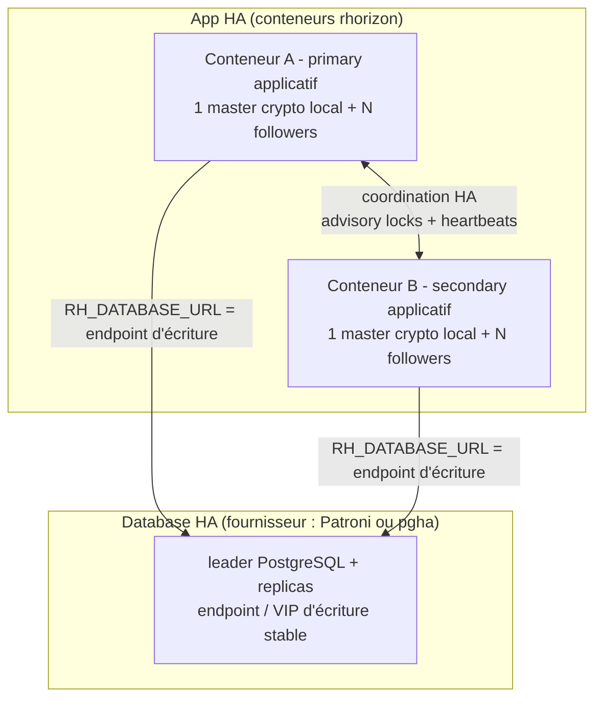

# Cluster HA

Pour la cible de production complète — un edge HTTP/2 logique, trois API,
trois membres Database HA, convergence workers, retries sûrs, audit asynchrone
et chemin d'upgrade — commencer par la
[Référence HA de production](HA-PRODUCTION-REFERENCE.md).

HA multi-hôte native : un ensemble de conteneurs rhorizon qui coordonnent leur
identité, rejoignent le cluster via un bootstrap protégé par HMAC, exécutent
une élection auto-promote, et s'authentifient mutuellement en mTLS par-nœud
émis par une CA de cluster. Le tout repose sur une couche PostgreSQL HA
neutre vis-à-vis du fournisseur, appelée **Database HA**. Patroni est le
fournisseur de référence sous Linux ;
[`rhorizon-pgha`](../PGHA.md)
(`pgha`) est le fournisseur natif BSD. Un serveur PostgreSQL isolé n'est pas
une base HA.

## Comment ça marche

Trois rôles indépendants couvrent les couches process, application et base :

| Rôle | Portée | Responsabilité |
|---|---|---|
| **Master crypto local** | un worker uvicorn dans chaque conteneur rhorizon | détient les sous-clés du conteneur ; les workers followers délèguent la crypto via une socket Unix locale |
| **Primary applicatif** | un conteneur rhorizon dans le cluster applicatif | détient les locks singleton cross-cluster : rotation DEK, compaction d'audit, rotation de password |
| **Leader de base de données** | un membre PostgreSQL choisi par le fournisseur Database HA | accepte les écritures via l'endpoint/VIP stable et streame le WAL vers les replicas |

Ces rôles ne s'impliquent jamais entre eux. Chaque conteneur applicatif a
normalement son propre master crypto local, y compris un secondary applicatif.
Le primary applicatif n'a pas besoin de tourner sur l'hôte qui possède le
leader de base ou le VIP d'écriture. L'état process vit dans `vault_workers`
(`worker_state`) ; l'état applicatif dans `vault_cluster_nodes` (`ha_state`).
PostgreSQL reste la source de vérité. Rhorizon coordonne l'état applicatif par
advisory locks et heartbeats ; le fournisseur Database HA effectue l'élection
et la supervision de la base (Patroni via son DCS, ou `pgha` via son mécanisme
de quorum natif BSD).

Dans les messages opérateur et rapports d'incident, toujours qualifier le
rôle : **master crypto local**, **primary applicatif** ou **leader de base de
données**. « master » et « primary » seuls sont ambigus.

**Remplacement d'un worker process.** L'élection du master crypto local réagit
au timeout court du heartbeat. Séparément, le reaper de maintenance supprime
une ligne `vault_workers` après cinq minutes sans heartbeat. Si ce processus
reprend ensuite, son prochain heartbeat ne peut plus modifier la ligne supprimée :
il ferme immédiatement son état crypto local et s'envoie `SIGTERM`. Le
superviseur Uvicorn/systemd/conteneur configuré doit alors démarrer un worker
propre, dont l'enregistrement commence toujours en état `sealed` avant
l'attachement follower ou l'élection. Cela remplace un processus ; le cluster
n'est pas sealed et les workers sains continuent de servir. Un processus qui
reste totalement figé doit être tué par le watchdog du superviseur puisqu'il ne
peut pas exécuter lui-même cette reprise.

**Identité** - quatre identifiants :

| Identifiant | Portée | Stockage | Durée de vie |
|---|---|---|---|
| `node_uuid` | par conteneur | fichier `/var/lib/rhorizon/node-uuid` (0400) | survit au restart ; perdu si le volume est détruit |
| `cluster_id` | par cluster | chiffré dans `vault_cluster_config` | fixé à l'init, ne tourne jamais |
| `ha_password` | par cluster | chiffré sous `ha_wrap_key` | bootstrap-only ; rotatable |
| `node_cert` | par conteneur | PEM `/var/lib/rhorizon/cluster-cert.{pem,key}` (0400) | émis par la CA au JOIN, 90j (`cluster_node_cert_validity_days`), auto-renouvelé sous 30j (`cluster_cert_renewal_threshold_days`) |

Le `ha_password` n'authentifie que le **premier** JOIN. Ensuite le nœud détient
son `node_cert` et utilise mTLS ; faire tourner le `ha_password` n'évince pas
les nœuds existants.

**Machine à états** (`vault_cluster_nodes.ha_state`) :

`unjoined -> joining -> quarantine -> secondary -> primary`, plus `draining` et
`evicted` pour le retrait. Un nœud qui rejoint reste en `quarantine` (heartbeat
stable + pas de conflit de rôle) avant de devenir `secondary`. Un ex-primary
applicatif qui revient se rétrograde directement en `secondary` (pas de
re-quarantine) ; un cooldown anti-thrash le tient à l'écart du pool d'élection
brièvement.

**Failover applicatif** - le primary applicatif écrit un lease court
(`primary_lease_expires_at`) à chaque heartbeat. Quand il devient périmé,
chaque secondary applicatif attend un jitter aléatoire puis course pour
`pg_advisory_xact_lock('rhorizon:cluster:ha-primary')` ; le gagnant inscrit son
`ha_state` applicatif comme `primary`. L'auto-promote est actif par défaut ;
les endpoints opérateur sont l'override manuel.

## Architecture



## Configuration

**Prérequis** (sans eux, la logique HA est fictive) :

| Élément | Pourquoi |
|---|---|
| Database HA (au moins 3 membres PostgreSQL) | un PG seul est le vrai SPOF ; utiliser Patroni sur la topologie Linux de référence ou `pgha` sous BSD, voir [HA-RUNBOOK.md](HA-RUNBOOK.md) section 0 |
| Endpoint/VIP d'écriture stable | chaque nœud applicatif doit atteindre le leader de base courant sans cibler directement un membre |
| TLS sur chaque endpoint API | `/cluster/challenge` + `/cluster/join` portent des secrets |
| Volume persistant `/var/lib/rhorizon` par conteneur | contient `node-uuid` + `cluster-cert.*` ; le perdre force un JOIN-as-new |
| Réseau privé entre nœuds (VPN / VLAN / ClusterIP) | ne jamais exposer l'API sur l'internet ouvert |

**Variables d'environnement** :

| Variable | Où | Sens |
|---|---|---|
| `RH_CLUSTER_HA_ENABLED=true` | tous les nœuds | active la couche cluster |
| `RH_CLUSTER_ADVERTISE_IP` | tous les nœuds | IP stable stockée dans le membership et le SAN du certificat du nœud ; obligatoire pour un déploiement multinœud géré |
| `RH_TLS_ENABLED=true` | tous les nœuds | requis sauf si un proxy TLS externe est devant l'API |
| `RH_HA_AUTO_JOIN=true` | joiners | auto-JOIN au démarrage du conteneur |
| `RH_HA_PRIMARY_URL` | tous les nœuds | membre joignable utilisé pour renouveler les certificats ; l'initialisateur peut utiliser sa propre URL |
| `RH_HA_PASSWORD_FILE` | joiners | chemin vers le ha_password **brut 32 octets** (pas base64) |
| `RH_HA_BOOTSTRAP_VAULT_URL` | joiners | défaut `RH_HA_PRIMARY_URL` |

La couche cluster reste désactivée tant que `ha_enabled=true` n'est pas posé
dans `vault_cluster_config` (le défaut de migration est off, donc les
déploiements non-HA ne sont pas affectés).

## Options

Réglages d'exécution (préfixe d'environnement `RH_`, défauts indiqués) :

| Clé | Défaut | Effet |
|---|---|---|
| `cluster_heartbeat_interval_secs` | 3 | cadence d'écriture de liveness par nœud |
| `cluster_state_machine_interval_secs` | 2 | fréquence d'évaluation transitions/élection par les secondaries |
| `cluster_reaper_interval_secs` | 30 | cadence du balayage rows-orphelines / deadline-drain |
| `cluster_join_quarantine_secs` | 60 | durée de `quarantine` avant `secondary` |
| `cluster_joining_orphan_ttl_secs` | 90 | suppression des rows bloquées en `joining` ; jamais sous la quarantine plus la boucle state/reaper la plus lente |
| `cluster_drain_deadline_secs` | 30 (5-600) | grâce avant qu'un nœud en drain soit évincé |
| `cluster_primary_lease_ttl_secs` | 20 (5-3600) | durée du lease de failover autonome ; au moins 3x le heartbeat |
| `cluster_auto_promote_cooldown_secs` | 20 | tient un nœud juste rétrogradé hors du pool d'élection pendant au moins un lease ; 0 désactive |

## Commandes

CLI :

```bash
rhorizon cluster init --cluster-name <nom> --save-ha-password ./ha_password.b64
rhorizon cluster status                 # membres, ha_state, heartbeats, expiry cert
rhorizon cluster health                 # app + nœud + base + Database HA
rhorizon cluster join --timeout 60      # poll un joiner jusqu'à ce qu'il ait un ha_state
```

`cluster status` décrit le membership applicatif ; il n'identifie pas le leader
de base. `cluster health` est la vue de readiness bout-en-bout. Les points ont
le même sens dans le CLI et l'onglet HA :

| Point | État | Sens |
|---|---|---|
| vert `●` | `green` | santé vérifiée |
| orange `●` | `orange` | formation, recovery ou mode dégradé |
| rouge `●` | `red` | état vérifié dangereux ou indisponible |
| noir/gris `○` | `grey` | inconnu, désactivé ou non configuré ; jamais une preuve de santé |

L'onglet HA sépare les trois rôles. Database HA affiche le fournisseur, le
nombre de leaders (et son identité quand le fournisseur la rapporte), les
membres, le streaming et le lag ; `pgha` ajoute l'identité du leader, la
fraîcheur des agents, le quorum et le propriétaire du VIP d'écriture. La sonde
Patroni vérifie qu'un seul leader existe mais n'expose ni son nom de membre ni
le propriétaire du VIP externe. Les preuves propres au fournisseur restent
clairement étiquetées.

API (tout sous `/api/v1/vault/cluster/`) :

| Méthode | Path | Auth | But |
|---|---|---|---|
| POST | `init` | `admin:w` (une fois) | mint `cluster_id` + `ha_password` + CA cluster (atomique) |
| POST | `challenge` | rate-limited | JOIN étape 1 : nonce serveur lié à (node_uuid, source_ip), TTL 30s |
| POST | `join` | HMAC (1er) / mTLS (rejoin) | JOIN étape 2 : preuve + mint du cert par-nœud |
| GET | `ha` | `admin:r` | membres, `ha_state`, timers de quarantine, heartbeats, conflits |
| GET | `ha/self` | n'importe quel bearer | un joiner poll sa propre transition d'état |
| POST | `promote/{uuid}` | `admin:w` | force `secondary -> primary` |
| POST | `demote/{uuid}` | `admin:w` | force l'état applicatif `primary -> secondary` (avant drain/evict d'un primary applicatif) |
| POST | `drain/{uuid}` | `admin:w` | retrait gracieux (finir l'in-flight, puis évincer) |
| POST | `evict/{uuid}` | `admin:w` | retrait immédiat + révocation du `node_uuid` |
| POST | `unrevoke/{uuid}` | `admin:w` | annule la révocation d'une éviction (ne ré-ajoute pas le nœud) |
| POST | `rotate-ha-password/{stage,confirm,cancel}` | `admin:w` | fait tourner le secret de bootstrap (certs intacts) |
| POST | `refresh-cert` | mTLS | un nœud renouvelle **son propre** cert (le CN du cert est l'unique cible) |
| POST | `rotate-cert/{node_uuid\|all}` | `admin:w` | forçage opérateur : bascule `force_renew_at`, la boucle de renouvellement du nœud appelle ensuite `refresh-cert` |
| GET | `ca-bundle` | `admin:r` | cert PEM de la CA du cluster + empreinte SHA-256 (matériel public uniquement) |
| POST | `rotate-ca` | `admin:w` | émet une nouvelle CA de cluster, l'ancienne reste valide pendant la fenêtre de grâce |
| POST | `issue-server-cert` | `admin:w` | émet un cert serveur nginx signé par la CA |
| GET | `ha/membership/{node_uuid}` | `admin:r` | consultation de l'appartenance d'un nœud |
| GET | `health` | `admin:r` | vue de readiness bout-en-bout (app + nœud + base + Database HA) |
| POST | `repair` | `admin:w` | chemin de réparation opérateur pour un état de cluster incohérent |

Métriques : `rhorizon_cluster_state_transitions_total`,
`rhorizon_cluster_join_attempts_total{outcome}`,
`rhorizon_cluster_rpc_latency_seconds{op}`,
`rhorizon_cluster_uuid_ip_conflicts_total`, plus compteurs rotation/reaper.

## Démarrage rapide

1. **Pre-flight** sur chaque nœud : vault unsealed, `RH_CLUSTER_HA_ENABLED=true`,
   `/var/lib/rhorizon` persistant, `/run/rhorizon` tmpfs 0700, TLS activé.

2. **Init** sur le premier nœud (le `ha_password` affiché n'est montré qu'une fois) :

   ```bash
   rhorizon cluster init --cluster-name rhorizon-ha-prod --save-ha-password ./ha_password.b64
   base64 -d < ./ha_password.b64 > ./ha_password.raw && chmod 0400 ./ha_password.raw
   shred -u ./ha_password.b64
   rhorizon cluster status        # un membre, ha_state=PRIMARY
   ```

3. **Distribuer** le ha_password hors-bande (`docker secret create` /
   `kubectl create secret` / `scp` vers `/run/secrets/ha_password`, mode 0400).

4. **Démarrer chaque joiner** avec `RH_HA_AUTO_JOIN=true`,
   `RH_HA_PRIMARY_URL=...`,
   `RH_HA_PASSWORD_FILE=/run/secrets/ha_password`. L'auto-JOIN exécute
   `challenge` -> `join`, reçoit le cert signé, et le persiste. Surveiller :

   ```bash
   rhorizon cluster join --timeout 60
   rhorizon cluster status        # 1 PRIMARY + N-1 SECONDARY, heartbeats < 5s
   ```

5. **Hygiène** : retirer le secret `ha_password` une fois que les joiners
   tiennent leurs certs (le mTLS steady-state ne l'utilise pas), sauvegarder le
   `ca_fingerprint` quelque part où les opérateurs peuvent comparer, et lancer
   un drill de rotation avant le trafic de production.

## Dépannage

Le détail pas-à-pas de recovery vit dans [HA-RUNBOOK.md](HA-RUNBOOK.md)
section 3. Cas courants :

| Symptôme | Action |
|---|---|
| Primary applicatif bloqué / crashé | l'auto-promote élit un nouveau primary applicatif sous `lease_ttl + skew` ; sinon `rhorizon cluster promote {uuid}` sur un secondary applicatif sain |
| Leader de base absent ou replicas non streaming | inspecter `rhorizon cluster health` et le fournisseur Database HA ; ne pas promouvoir un nœud applicatif pour réparer une élection de base |
| Database HA est noir/gris | configurer/réparer les endpoints de statut du fournisseur ; un état inconnu n'autorise ni drill de failover ni K7 |
| Joiner bloqué en `joining` | vérifier TLS + `RH_HA_PRIMARY_URL` ; les rows orphelines sont reapées après `cluster_joining_orphan_ttl_secs` ; vérifier qu'il n'y a pas de conflit (uuid, source_ip) dans `GET /cluster/ha` |
| Joiner rejeté 403 après un evict par erreur | `POST /cluster/unrevoke/{uuid}`, puis restart du joiner pour re-JOIN sous le même UUID |
| Cert de nœud proche de l'expiry | les nœuds renouvellent automatiquement sous 30 jours ; forcer avec `POST /cluster/rotate-cert/{node_uuid}` (ou `/all`) |
| `ha_password` suspecté fuité | `rotate-ha-password/stage` puis `confirm` ; les nœuds existants continuent via mTLS |
| Fuite de la CA cluster suspectée | faire tourner la CA + broadcast `refresh-cert` ; voir runbook section 3.2 |
| Volume wipé (nouveau `node_uuid`) | le nœud JOIN comme nouveau ; évincer l'ancien UUID mort une fois périmé |
| Drain/evict d'un primary applicatif renvoie `409 demote first` | `POST /cluster/demote/{uuid}` d'abord, puis drain/evict |

Voir aussi : [HA-RUNBOOK.md](HA-RUNBOOK.md) (couche Database HA, rolling
restart, matrice panne/réponse, recovery complet), [HA-BENCH.md](HA-BENCH.md)
(timing de failover sous charge).
