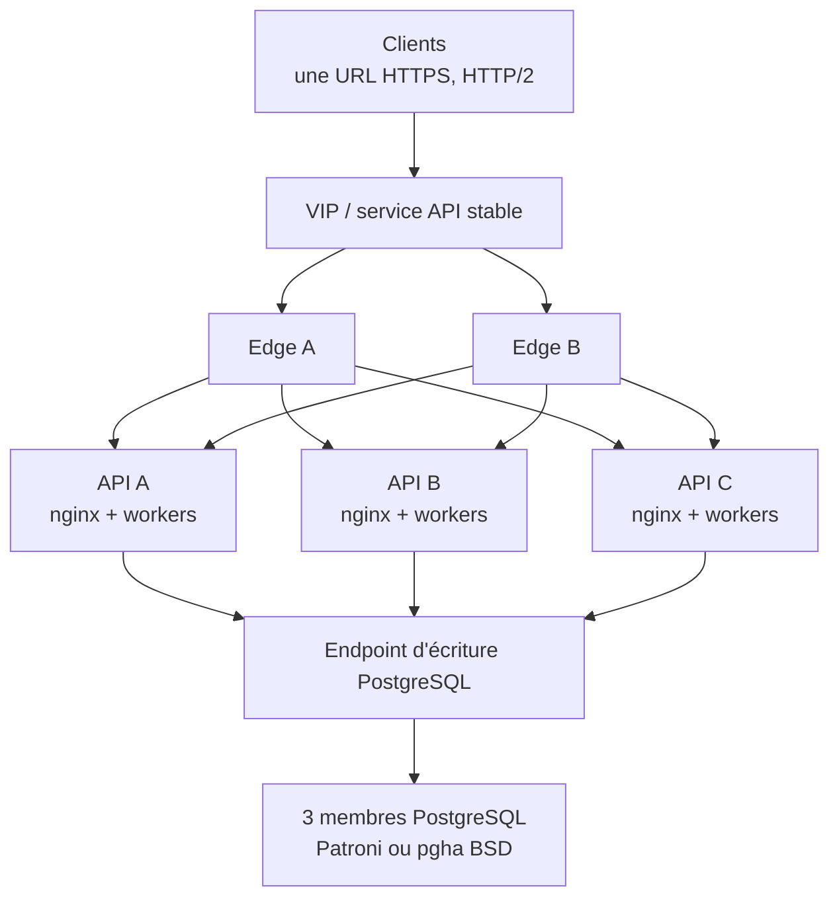

# Référence HA de production

English: [Production HA reference](../HA-PRODUCTION-REFERENCE.md).

Cette page définit la topologie et les critères d'acceptation de production.
Voir [HA-CLUSTER.md](HA-CLUSTER.md) pour l'architecture et
[HA-RUNBOOK.md](HA-RUNBOOK.md) pour les procédures de recovery.

## Topologie

Les clients utilisent une seule adresse HTTPS. Deux instances edge possèdent
cette adresse et routent vers trois API actives. Toutes les API utilisent un
endpoint stable d'écriture PostgreSQL derrière trois membres supervisés.



| Couche | Nombre | Exigence |
|---|---:|---|
| Endpoint client | 1 | hostname et certificat stables |
| Edge | 2 | domaines de panne distincts |
| API | 3 | hôtes distincts ; `/var/lib/rhorizon` persistant par nœud |
| Workers | 5 par API Linux de référence | un master crypto local et quatre followers |
| PostgreSQL | 3 | hôtes/stockages dans des domaines distincts |
| Supervision DB | quorum impair | Patroni+DCS sous Linux/Kubernetes ; `pgha` sous BSD |
| Backup | hors hôte | backup chiffré, archive WAL et restore testé |

Appliquer l'anti-affinité entre hyperviseurs et domaines électriques. Un lab
peut co-localiser les rôles ; pas la production.

## Rôles

| Rôle | Nombre | Responsabilité |
|---|---:|---|
| Master crypto local | un par API | conserve les sous-clés en mémoire ; RPC local pour les followers |
| Primary applicatif | un par cluster rhorizon | exécute les tâches singleton |
| Leader de base | un par cluster Database HA | possède la timeline PostgreSQL writable |

Les rôles sont indépendants. Une promotion applicative ne répare pas la base.
Un failover DB ne choisit pas le primary applicatif. Toujours qualifier le rôle
dans les alertes et comptes rendus.

## Comportement de l'edge

### HTTP/2 et TLS

- Proposer TLS 1.2/1.3 et HTTP/2 sur l'endpoint client.
- Conserver hostname et certificat pendant le failover edge.
- Protéger le trafic cluster par mTLS ou réseau privé authentifié.
- nginx peut recevoir HTTP/2 puis proxyfier vers uvicorn en HTTP/1.1 loopback.
- Un edge HTTP/2 ne partage pas une seule connexion cliente synchrone entre
  tous les threads. Le profil K7 validé utilise quatre connexions par backend,
  renouvelées à 900 requêtes avant le GOAWAY nginx observé à 1 000.
- Fermer une connexion retirée après son dernier stream.

Recalibrer le profil quatre/900 si les limites du proxy ou de nginx changent.

### Signaux de routage

| Signal | Action edge |
|---|---|
| `/health` = 200 | liveness seulement ; ne pas router sur ce signal |
| `/readiness` = 200 | éligible après deux succès consécutifs |
| `/readiness` = 503 | éjecter : sealed, quarantined ou fenced |
| 429 applicatif + `Retry-After` | garder le backend ; backoff client |
| 502/504 gateway du backend | éjecter immédiatement |

Après unseal, attendre readiness **et** la convergence workers. La topologie de
management doit montrer un master crypto local, le nombre configuré de workers,
tous les autres workers followers avec heartbeat frais, et l'état applicatif
`primary` ou `secondary`. Un `sleep` fixe ne remplace pas ce contrôle.

### Retries et erreurs

| Requête | Politique après panne transport ou 502/503/504 |
|---|---|
| `GET`, `HEAD`, `OPTIONS` | retry borné sur un autre backend ready |
| `POST`, `PUT`, `PATCH`, `DELETE` | aucun replay proxy sans idempotence applicative |

Une mutation interceptée pendant le failover renvoie par exemple :

```json
{
  "error": "transaction_outcome_uncertain",
  "reason": "upstream_gateway_failure",
  "retryable": false,
  "outcome": "uncertain",
  "upstream_status": 502
}
```

Au plafond d'admission, un cluster sain renvoie `429 capacity_overloaded` avec
`Retry-After` et reste ready. Ne pas annoncer la capacité en 503.

**Le contrôle d'admission est désactivé par défaut et doit être activé en
production.** `RH_MAX_CONCURRENT_REQUESTS` vaut `0` (désactivé) par défaut :
aucune image, aucun compose, aucun preset ne le positionne. Laissé à `0`, un
worker saturé fait attendre jusqu'au timeout client au lieu de délester, et la
vérification de capacité du go-live ci-dessous ne peut pas passer. Définir
explicitement un plafond d'in-flight par worker ; ~2-4x le pool DB est un
point de départ raisonnable (avec la référence `pool_size + max_overflow = 16`,
soit environ 32-64), les petits nœuds visant le bas de la fourchette. Mesurer
le plafond d'exploitation plutôt que de reprendre un chiffre de cette page.

`POST /unseal` possède un emplacement réservé distinct par worker afin de
préserver la récupération à ce plafond. Une seconde tentative simultanée
renvoie le même contrat 429 avec `reason=unseal_concurrency_limit` ; elle
n'attend pas derrière Argon2. Cet emplacement réservé est inconditionnel : il
s'applique même quand le plafond d'in-flight est désactivé.

## API et HA applicative

Chaque API nécessite :

- `node_uuid` et certificat persistants sous `/var/lib/rhorizon` ;
- `/run/rhorizon` sur tmpfs privé mode 0700 ;
- nginx sur l'adresse du nœud et uvicorn sur loopback ;
- HA/TLS activés et allowlist stricte des proxies de confiance ;
- supervision du seal, quarantine, rôles workers et âge des heartbeats.

Les nœuds démarrent sealed. Ordre de recovery : démarrer, unseal, attendre le
master crypto et les followers, confirmer le membership, puis réactiver le
backend.

Un membership sain contient un primary applicatif et deux secondaries, avec
heartbeats frais, certificats valides, aucun conflit UUID/IP ni état
transitoire. Le trafic ordinaire reste actif/actif ; le primary ne possède que
les tâches singleton.

## Database HA

Toutes les API utilisent l'endpoint stable d'écriture, jamais l'adresse d'un
membre PostgreSQL. Database HA est verte avec un leader, quorum, replicas
streaming, lag connu sous le seuil et timelines identiques. `pgha` doit aussi
rapporter un seul propriétaire correct du VIP d'écriture.

Budget cluster-wide :

```text
nœuds_API × workers_par_nœud × (pool_size + max_overflow)
    <= 0,8 × PostgreSQL max_connections
```

Référence :

```text
3 × 5 × (8 + 8) = 240 connexions application
PostgreSQL max_connections = 300
réserve = 60
```

Recalculer avant d'ajouter des workers ou de la concurrence. Suivre les
attentes du pool et `pg_stat_activity`.

### WAL et stockage

- Définir `max_slot_wal_keep_size` (4 GB sur le volume lab 20–40 GB).
- `wal_keep_size` est un minimum ; `max_wal_size` une cible souple.
- Fence les replicas vivants mais stale et libérer les slots des absents.
- Superviser réplication, lag, timeline, archive et disque.
- Alerter avant 70 % du filesystem ou de `pg_wal`.
- Ne jamais supprimer manuellement des fichiers de `pg_wal` ; reconstruire le
  replica stale.
- Conserver des backups chiffrés hors hôte et tester les restores.

Le preflight bench/chaos échoue si la base, Database HA, réplication, WAL,
archive, réserve disque ou propriété du write endpoint n'est pas verte.

## Audit

L'enregistrement d'audit reste actif sous charge. La vérification complète
sort de la durée de vie d'une requête grâce au job durable :

```text
POST /api/v1/vault/audit/verify/jobs
GET  /api/v1/vault/audit/verify/jobs/{job_id}
```

Un seul job s'exécute dans le cluster, persiste dans PostgreSQL, heartbeat et
peut être repris après la perte d'un worker. Le lancer avant et après une
campagne de panne. Pendant la charge, utiliser des canaris audit-lite bornés.
Inclure tables, index, WAL et rétention d'audit dans le calcul de stockage.

## Statut et supervision

| Point | Sens | Gate chaos/release |
|---|---|---|
| vert `●` | santé vérifiée | pass |
| orange `●` | formation, recovery ou dégradation | stop |
| rouge `●` | unsafe ou indisponible | stop |
| noir/gris `○` | inconnu ou non configuré | stop |

Superviser état/protocole/erreurs edge, latence/429/pool API, couverture
workers, leases/élections/certificats applicatifs, leader/quorum/VIP/lag/
timeline/WAL/archive/disque DB, et progression/résultat des jobs d'audit.

## Idempotence des mutations

L'éjection immédiate ne prouve pas le commit d'une mutation déjà envoyée. Un
replay sûr nécessite :

1. `Idempotency-Key` client avec au moins 128 bits d'entropie.
2. Scope par acteur, méthode, route canonique et hash de la requête.
3. État pending/final persisté atomiquement avec l'opération.
4. Même clé avec un autre hash : 409.
5. Replay terminé : réponse d'origine, sans second effet ni second audit.
6. Tokens, clés privées PKI/KEM et credentials dynamiques mis en cache chiffré,
   liés à l'autorisation et à TTL court.
7. Retry edge seulement sur les endpoints couverts par ce contrat.

En attendant, conserver la réponse `transaction_outcome_uncertain` et
réconcilier l'opération.

## Contrôles de mise en production

- [ ] Une URL client, deux edges sains, trois API ready.
- [ ] Un master crypto local et tous les followers sur chaque API.
- [ ] Un primary applicatif et deux secondaries avec heartbeats frais.
- [ ] Trois membres PostgreSQL supervisés et un write endpoint stable.
- [ ] Réserve connexions, réplication, WAL/archive, disque et restore validés.
- [ ] Charge HTTP/2 sur plusieurs rotations sans panne transport.
- [ ] Perte API : reads masqués et mutations réconciliées.
- [ ] Perte leader DB : un successeur et bon déplacement de l'endpoint.
- [ ] `RH_MAX_CONCURRENT_REQUESTS` défini à une valeur non nulle et mesurée (`0`/désactivé par défaut).
- [ ] Surcharge en 429 structuré, pas en 502/503 brut.
- [ ] Audit asynchrone complet valide avant et après les tests.
- [ ] Aucun composant HA orange, rouge ou gris.

Le soak long vient après ces tests bornés.

<a id="maintenance-upgrade"></a>

## Maintenance et montée de version

Modifier un domaine de panne à la fois. Séparer les étapes edge, API et base.

### Compatibilité rolling

Utiliser un rolling upgrade API seulement si les release notes confirment :

- coexistence des anciennes/nouvelles API sur la même base ;
- schéma backward-compatible avec l'ancienne API ;
- compatibilité RPC cluster, membership et formats persistés ;
- aucune réécriture one-shot imposant l'arrêt de toutes les API.

Un schéma idempotent n'est pas forcément downgrade-compatible. Si un point est
inconnu, fermer les écritures et utiliser une fenêtre de maintenance.

### Preflight

1. Exiger tous les contrôles HA, workers, DB, WAL, disque et audit verts.
2. Attendre la fin des rotations, rekey, restore et audit complet.
3. Confirmer que deux API portent la charge attendue.
4. Enregistrer versions, digests, config, leaders, timelines et lag.
5. Créer backup chiffré et restore point cohérent ; vérifier l'archive WAL.
6. Lire les notes de release/fournisseur et pré-puller les artefacts signés.
7. Geler les changements et rotations non liés.

### Edge

1. Retirer B du VIP/service et l'upgrader.
2. Vérifier config, TLS, HTTP/2, probes, retries, 429 et metrics.
3. Envoyer un canari ou déplacer le VIP sur B.
4. Upgrader A, le valider et restaurer la redondance.

L'URL et le certificat client ne changent pas.

### API

Upgrader les secondaries applicatifs, puis le primary :

1. Désactiver un secondary sur les deux edges et drainer les requêtes.
2. Arrêter proprement ; préserver `/var/lib/rhorizon` et `node_uuid`.
3. Déployer l'artefact pinné et démarrer.
4. Unseal via la procédure 2FA/Shamir approuvée.
5. Attendre readiness stable, état `secondary`, un master crypto et tous les
   followers.
6. Réactiver, lancer les canaris read/write et observer un intervalle stable.
7. Répéter sur l'autre secondary.
8. Transférer le primary vers un secondary upgradé, vérifier le lease, puis
   upgrader l'ancien primary.

Garder au moins deux API ready. Stopper sur toute régression audit, worker,
membership, DB ou transport.

### Base et quorum

Faire la maintenance DB après acceptation du rollout API.

- Update mineure : un replica, convergence, second replica, switchover planifié,
  puis ancien leader.
- Patroni : `patronictl` et procédures DCS-aware.
- BSD `pgha` : procédure superviseur, quorum et propriétaire VIP.
- Upgrade majeur PostgreSQL : procédure fournisseur `pg_upgrade`, blue/green ou
  migration logique dans une fenêtre de maintenance.
- DCS/quorum : un membre à la fois en conservant la majorité.

Après chaque membre : un leader, bon endpoint, replicas streaming, timelines
identiques, lag borné, WAL/archive/disque sains.

### Acceptation et rollback

Avant la fin de maintenance :

1. Refaire les contrôles de mise en production et les canaris authentifiés.
2. Terminer une vérification complète d'audit durable.
3. Enregistrer versions/digests et prendre un backup post-upgrade.

Rollback :

- Restaurer l'artefact edge/API précédent avant changement schéma/data.
- Lancer une ancienne API après migration uniquement si la compatibilité de
  schéma est déclarée.
- Après migration incompatible, préférer un fix forward. Un restore est une
  opération DR cluster-wide avec un point de perte explicite.
- Ne pas restaurer un membre PostgreSQL isolé dans un cluster vivant ni copier
  un data directory entre timelines ; utiliser Patroni/`pgha`.
- Ne pas inverser une rotation de clé, CA, token ou clé d'audit avec un état
  périmé.
- Garder les écritures fermées si intégrité, leadership ou compatibilité sont
  incertains.
