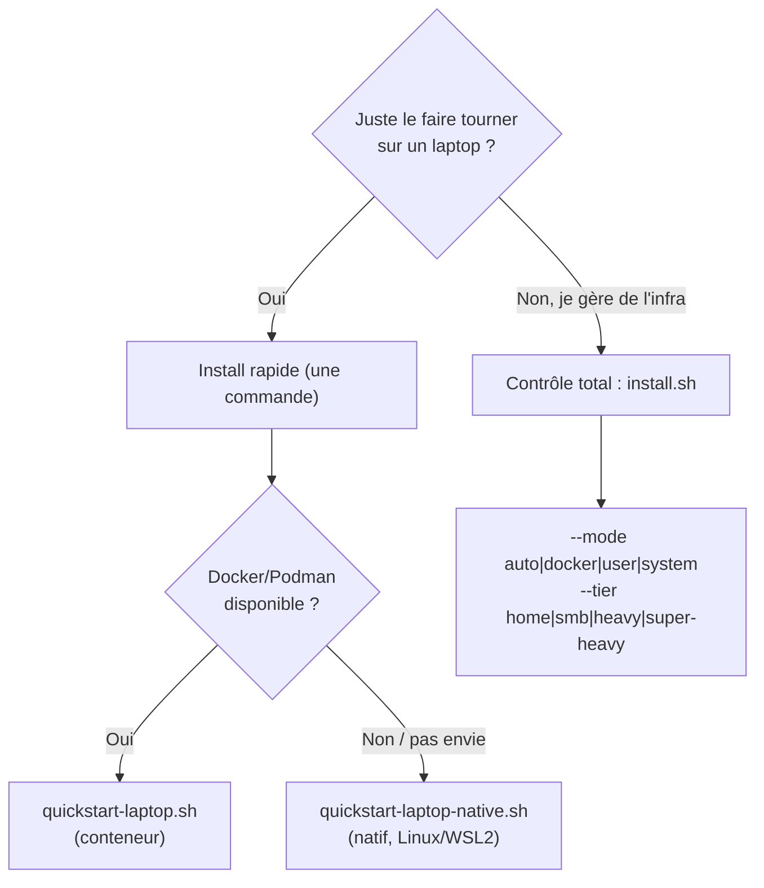

# Installation

Deux portes d'entrée. Choisissez selon le contrôle voulu.



## Install rapide (une commande)

Setup laptop/perso avec défauts sûrs (bind localhost, tier `home`, une question
au maximum). Les deux variantes installent le vault, mintent une clé d'accès MCP
scopée pour votre assistant IA, et impriment un bloc de config à coller.

**Conteneur (Docker ou Podman) — macOS, Windows, Linux :**

```bash
curl -fsSL https://raw.githubusercontent.com/JR-Shdw/Horizon/main/tools/quickstart-laptop.sh | bash
```

**Natif (sans conteneur) — Linux, WSL2 :**

```bash
curl -fsSL https://raw.githubusercontent.com/JR-Shdw/Horizon/main/tools/quickstart-laptop-native.sh | bash
```

Le chemin natif a besoin de `sudo` (paquets système + PostgreSQL). Il active
aussi le verrouillage mémoire du process entier quand l'hôte a du swap non
chiffré ; voir [Protection mémoire et swap](DEPLOYMENT.md#36-protection-mémoire-et-swap).

## Contrôle total (power user)

Un point d'entrée unique choisit une stratégie et dimensionne la stack :

```bash
sh tools/install.sh [--mode auto|docker|user|system] [--tier home|smb|heavy|super-heavy]
```

**Modes** (comment ça tourne) :

| Mode | Tourne en | Ce que vous obtenez |
|---|---|---|
| `auto` (défaut) | — | Docker/Podman si présent, sinon natif `system` (root) ou `user` (non-root) |
| `docker` | conteneur | Stack Compose (Docker ou Podman auto-détecté) |
| `user` | votre user | Natif, dirs XDG, `systemd --user` (fallback nohup), pas de service root |
| `system` | root | Natif, dirs FHS, systemd-system / rc.d, confinement SELinux/AppArmor |

**Tiers** (quelle taille) — un seul bouton pour conteneur et natif :

| Tier | Workers | RAM totale |
|---|---|---|
| `home` | 1 | ~600 Mo |
| `smb` | 5 | ~1.6 Go |
| `heavy` | 10 | ~2.7 Go |
| `super-heavy` | 20 | ~5 Go |

Sur le chemin conteneur un tier charge `tools/presets/<tier>.env` ; sur le chemin
natif il mappe vers `--workers` (la mémoire se dérive du nombre de workers). Les
détails et la référence de déploiement complète sont dans
[`DEPLOYMENT.md`](DEPLOYMENT.md).

## Couverture OS

| OS | Conteneur | Natif |
|---|---|---|
| Linux (Debian/Ubuntu/Arch/Fedora/Rocky/openSUSE) | oui | oui (driver par-OS) |
| WSL2 | oui | oui |
| macOS | oui | pas encore (utiliser le conteneur) |
| FreeBSD / OpenBSD / NetBSD | non (pas de Docker) | oui (natif, root) |
| Windows | via Docker Desktop | non prévu |

aarch64 est supporté sur les deux chemins. Le chemin natif partage un tronc
unique à base de drivers (`tools/install-native.sh` + `tools/drivers/<os>.sh`) ;
l'image conteneur est OS-agnostique, donc le chemin conteneur se comporte pareil
sur tout hôte qui fait tourner Docker ou Podman.

## Après l'installation

Le vault est **scellé** à chaque boot, par design. Déverrouillez-le, ensuite il
reste ouvert pour vos crons/agents jusqu'au reboot ou un seal explicite. Voir
[`DEPLOYMENT.md`](DEPLOYMENT.md) pour le hardening production, TLS,
reverse-proxy/SSO, LDAP, multiworker, backup, et le modèle de protection mémoire.
