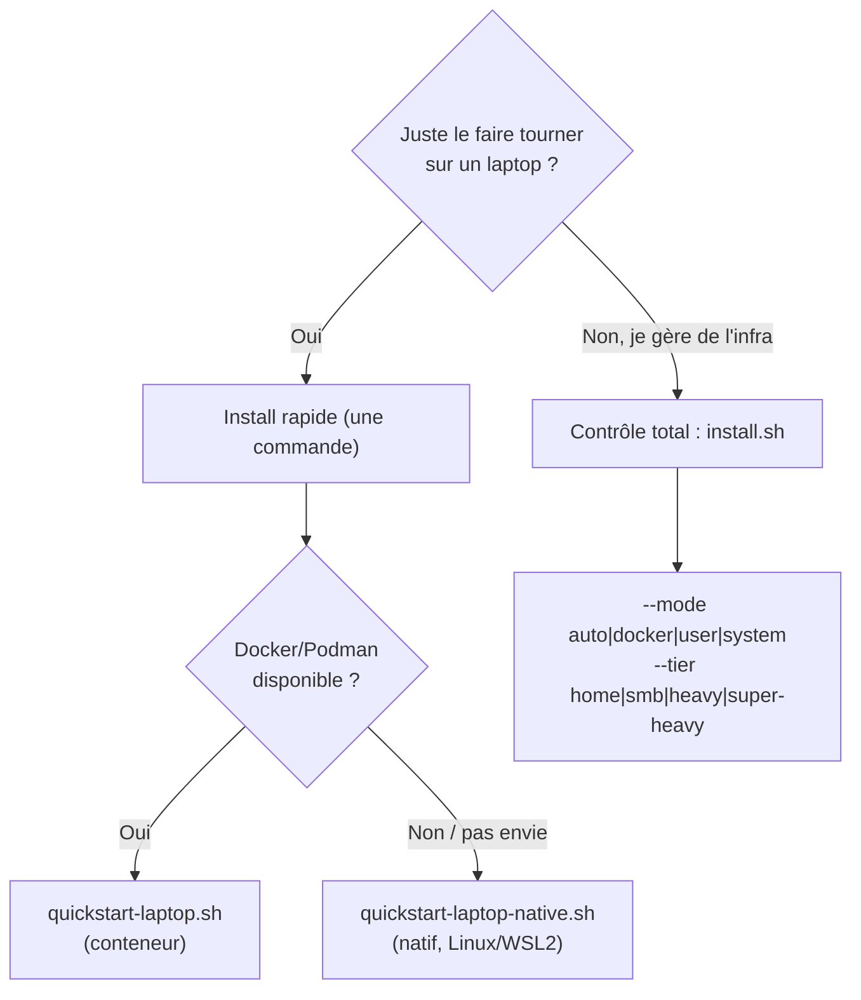

# Installation

La référence d'installation complète : tous les chemins d'entrée supportés,
comment vérifier que ça a marché, comment mettre à jour, et comment désinstaller.

L'« Installation en 5 minutes » du README est le chemin rapide uniquement. Il
n'est délibérément **pas** complet — il fait tourner un laptop et s'arrête là.
C'est cette page qui couvre le reste.

| Vous voulez | Allez à |
|---|---|
| Une commande sur un laptop | [Install rapide](#install-rapide-une-commande) |
| Choisir le runtime et la taille | [Contrôle total](#contrôle-total-power-user) |
| Le natif, détail par OS | [`INSTALL-NATIVE.md`](INSTALL-NATIVE.md) |
| Premier secret, premier unseal | [`QUICKSTART.md`](QUICKSTART.md) |
| Niveaux de support par plateforme | [`COMPATIBILITY.md`](COMPATIBILITY.md) |
| Durcissement production | [`DEPLOYMENT.md`](DEPLOYMENT.md) |

Deux portes d'entrée. Choisissez selon le contrôle voulu.



## Install rapide (une commande)

Setup laptop/perso avec défauts sûrs (bind localhost, tier `home`, une question
au maximum). Les deux variantes installent le vault, mintent une clé d'accès MCP
scopée pour votre assistant IA, et impriment un bloc de config à coller.

**Conteneur (Docker ou Podman) — macOS, Windows, Linux :**

```bash
curl -fsSL https://raw.githubusercontent.com/JR-Shdw/Horizon/main/tools/quickstart-laptop.sh | bash
```

**Natif (sans conteneur) — Linux, WSL2 :**

```bash
curl -fsSL https://raw.githubusercontent.com/JR-Shdw/Horizon/main/tools/quickstart-laptop-native.sh | bash
```

Le chemin natif a besoin de `sudo` (paquets système + PostgreSQL). Il active
aussi le verrouillage mémoire du process entier quand l'hôte a du swap non
chiffré ; voir [Protection mémoire et swap](DEPLOYMENT.md#36-protection-mémoire-et-swap).

## Contrôle total (power user)

Un point d'entrée unique choisit une stratégie et dimensionne la stack :

```bash
sh tools/install.sh [--mode auto|docker|user|system] [--tier home|smb|heavy|super-heavy]
```

**Modes** (comment ça tourne) :

| Mode | Tourne en | Ce que vous obtenez |
|---|---|---|
| `auto` (défaut) | — | Docker/Podman si présent, sinon natif `system` (root) ou `user` (non-root) |
| `docker` | conteneur | Stack Compose (Docker ou Podman auto-détecté) |
| `user` | votre user | Natif, dirs XDG, `systemd --user` (fallback nohup), pas de service root |
| `system` | root | Natif, dirs FHS, systemd-system / rc.d, confinement SELinux/AppArmor |

**Tiers** (quelle taille) — un seul bouton pour conteneur et natif :

| Tier | Workers | RAM totale |
|---|---|---|
| `home` | 1 | ~600 Mo |
| `smb` | 5 | ~1.6 Go |
| `heavy` | 10 | ~2.7 Go |
| `super-heavy` | 20 | ~5 Go |

Sur le chemin conteneur un tier charge `tools/presets/<tier>.env` ; sur le chemin
natif il mappe vers `--workers` (la mémoire se dérive du nombre de workers). Les
détails et la référence de déploiement complète sont dans
[`DEPLOYMENT.md`](DEPLOYMENT.md).

## Couverture OS

| OS | Conteneur | Natif |
|---|---|---|
| Linux (Debian/Ubuntu/Arch/Fedora/Rocky/openSUSE) | oui | oui (driver par-OS) |
| WSL2 | oui | oui |
| macOS | oui | pas encore (utiliser le conteneur) |
| FreeBSD / OpenBSD / NetBSD | non (pas de Docker) | oui (natif, root) |
| Windows | via Docker Desktop | non prévu |

aarch64 est supporté sur les deux chemins. Le chemin natif partage un tronc
unique à base de drivers (`tools/install-native.sh` + `tools/drivers/<os>.sh`) ;
l'image conteneur est OS-agnostique, donc le chemin conteneur se comporte pareil
sur tout hôte qui fait tourner Docker ou Podman.

Le statut par OS, la surface complète des options d'`install-native.sh` et la
disposition système-vs-utilisateur sont dans
[`INSTALL-NATIVE.md`](INSTALL-NATIVE.md). Les niveaux de support par plateforme
sont dans [`COMPATIBILITY.md`](COMPATIBILITY.md).

## Vérifier que ça a marché

```bash
curl --cacert ~/rhorizon/certs/cert.pem https://127.0.0.1:8443/health
```

`/health` répond si le process tourne ; ça ne veut **pas** dire que le vault est
utilisable, parce qu'un vault en bonne santé est un vault scellé tant que
personne ne l'a déverrouillé. Adaptez le chemin de la CA et le port si vous avez
changé `--dir` ou `--api-port`.

## Après l'installation

Le vault est **scellé** à chaque boot, par design — un reboot ne laisse aucun
secret lisible tant qu'un humain n'a pas déverrouillé. Déverrouillez une fois,
et il reste ouvert pour vos crons et agents jusqu'au prochain reboot ou un seal
explicite.

Le premier unseal et le premier secret sont détaillés dans
[`QUICKSTART.md`](QUICKSTART.md). Ensuite [`DEPLOYMENT.md`](DEPLOYMENT.md) pour
le durcissement production, TLS, reverse-proxy/SSO, LDAP, multiworker, backup,
et le modèle de protection mémoire.

## Mise à jour

| Chemin | Procédure |
|---|---|
| Conteneur | [`DEPLOYMENT.md` section 10](DEPLOYMENT.md#10-mises-à-jour) — tirer les nouvelles images et recréer |
| Natif | [`INSTALL-NATIVE.md` section 10](INSTALL-NATIVE.md#10-procédure-de-mise-à-jour) — relancer l'installeur par-dessus l'install existante |

Les deux conservent vos données : la base, le journal d'audit et le mot de passe
maître sont intacts. Le vault revient **scellé**, comme après n'importe quel
redémarrage.

## Désinstallation

Les installs natives ont leur reverser dédié. Il reprend la même dérivation de
chemins qu'`install-native.sh`, garde chaque étape sur une vérification de
présence, et peut être relancé sans risque — y compris sur une install à moitié
faite :

```bash
sh tools/uninstall-native.sh [--mode user|system] [--purge-db] [--yes] [--dry-run]
```

| Option | Effet |
|---|---|
| `--mode user\|system` | Quelle install défaire. Défaut `system` — passez `user` pour une install `--mode user`, sinon il cherchera aux mauvais endroits |
| `--purge-db` | **Supprime aussi le rôle et la base PostgreSQL.** Sans cette option les données survivent à la désinstallation |
| `--yes` / `-y` | Saute la confirmation |
| `--dry-run` | Affiche ce qui serait supprimé et ne change rien |

Lancez-le d'abord avec `--dry-run`. Sans `--purge-db` vos secrets restent dans
PostgreSQL et une réinstallation les retrouve ; avec, ils sont perdus et seule
une sauvegarde les ramène — voir
[`DISASTER-RECOVERY.md`](DISASTER-RECOVERY.md).

Pour une install conteneur, supprimez la stack et ses volumes depuis le
répertoire d'installation (`~/rhorizon` par défaut) :

```bash
cd ~/rhorizon && docker compose down -v      # -v supprime aussi le volume de la base
```
