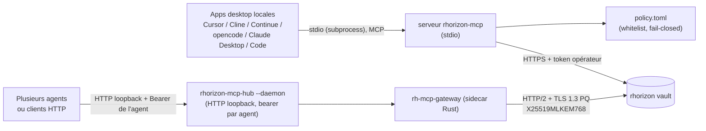
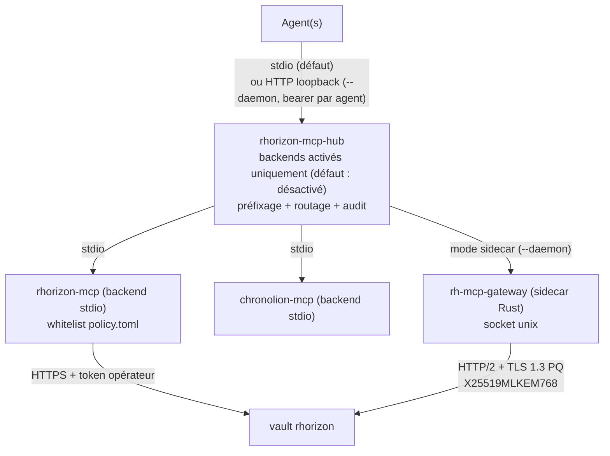
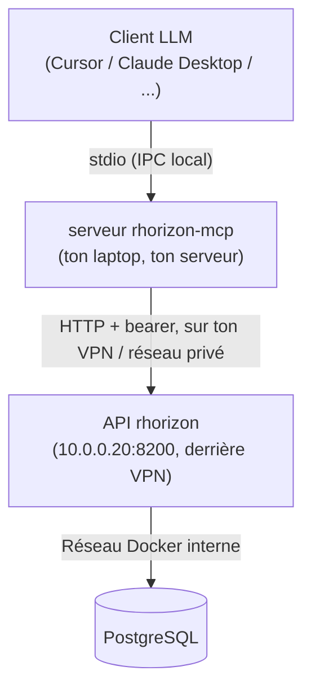

# MCP - intégration Model Context Protocol

Resurgamus Horizon embarque un **serveur MCP** (`mcp/rhorizon_mcp/`)
qui expose un sous-ensemble curaté d'opérations vault sous forme de
tools MCP. Les clients LLM qui parlent MCP - Cursor, Cline,
Continue, opencode, Claude Desktop, Claude Code - peuvent appeler ces tools.
En mode stdio, les schémas et réponses MCP n'exposent pas le token vault ; les
valeurs des secrets autorisés sont en revanche transmises au LLM lorsqu'il les
demande.

Le serveur MCP est la **frontière de confiance** entre le LLM et le
vault : il tient le token, il consulte une policy whitelist, il fait
fail-closed.

Pour l'usage de tokens long-lived, éphémères, et le reste du modèle
d'auth indépendamment de MCP, voir [`SECRETS-AND-TOKENS.md`](SECRETS-AND-TOKENS.md).

Pour les patterns d'intégration agent non-MCP (Ansible, CI/CD, init
containers K8s), voir [`USE-CASES.md`](USE-CASES.md) et
[`K8S.md`](K8S.md).

---

## 1. Architecture

Le serveur `rhorizon-mcp` est **stdio uniquement** : un agent local, un
token, une whitelist `policy.toml` fail-closed. Pour plusieurs agents ou un
point d'entrée HTTP, c'est le **hub** en mode `--daemon` (section 7), pas le
serveur.



| Couche | Ce qu'elle sait | Ce qu'elle fait |
|---|---|---|
| Client LLM | Les noms des tools MCP (ex. `vault_get_secret`) | Appelle les tools par nom, transmet le résultat au LLM |
| Serveur `rhorizon-mcp` | Le token vault, la policy, la session LLM | Valide chaque appel contre `policy.toml`, forward au vault si OK, retourne une erreur structurée si refus |
| `policy.toml` | Une whitelist de secrets et tools autorisés | Détermine ce que le LLM a le **droit** de demander |
| Vault rhorizon | Les secrets chiffrés, la chaîne d'audit | Authentifie le token du serveur MCP, log chaque read avec `actor=<token-name>` |

Le serveur lit le token vault une fois au démarrage depuis `RH_TOKEN_FILE`
(mode 0600) et ne l'inclut pas dans les payloads MCP. Le compte local du
serveur et root peuvent toujours lire le fichier ou la mémoire du processus :
ils font partie de la frontière de confiance.

| Montage | Composant | Modèle de token |
|---|---|---|
| Un agent local (Cursor, Cline, Continue, opencode, Claude Desktop, Claude Code) | `rhorizon-mcp-server`, stdio | Le serveur tient un token long-lived scopé ; les payloads MCP ne le contiennent pas. La whitelist `policy.toml` s'applique |
| Plusieurs agents / clients HTTP | `rhorizon-mcp-hub --daemon` | Chaque requête porte le bearer **de l'agent**, validé via `/tokens/whoami`. Pas de whitelist au niveau secret : les scopes et le claim `namespaces` du token sont la frontière |

---

## 2. Pourquoi ce design

L'intégration naïve serait : donner un token au LLM, le laisser parler
au vault directement. Ça échoue sur trois points :

1. **Divulgation du token.** Un token dans le contexte du LLM peut être exfiltré sur n'importe quel vecteur de prompt-injection. Traiter le LLM en confused-deputy.
2. **Pas de filtrage.** Le scope du token vault est large (ex. `secrets:r` sur un namespace entier). Le LLM n'a peut-être besoin que de 3 secrets précis sur 100. Pas moyen d'exprimer "lis ces 3, refuse le reste" sans une couche intermédiaire.
3. **Attribution audit grossière.** Chaque entrée d'audit dit "ce token a lu X" - mais quelle session LLM, quel prompt utilisateur ? Le serveur MCP met `actor=<token-name>` par appel, et tu peux corréler avec le log de session du client de ton côté.

Le serveur MCP insère la couche qui gère ces trois points.

---

## 3. La policy whitelist

`policy.toml` est **obligatoire et fail-closed**. Si le fichier est
absent ou vide, le serveur MCP démarre en mode `deny_all` - toute
requête LLM est refusée. C'est intentionnel.

```toml
# ~/.config/rhorizon-mcp/policy.toml
[secrets]
# Noms qualifiés de secrets. Ce qui n'est pas listé est refusé.
whitelist = [
    "mcp/mail/imap-host",
    "mcp/mail/imap-user",
    "mcp/mail/imap-password",
]

[namespaces]
# Allow plus grossier : tout secret du namespace est joignable.
# À utiliser avec parcimonie ; whitelist préférée.
allow = ["mcp/demo"]

[tools]
# Quels tools MCP le LLM a le droit d'appeler.
allow = [
    "vault_status",
    "vault_whoami",
    "vault_list_namespaces",
    "vault_list_secrets",
    "vault_get_secret",
    # Optionnel : ajouter vault_audit_tail seulement si le token vault a aussi audit:r.
    # Optionnel : ajouter vault_cluster_health seulement si le token vault a cluster:r.
    # Repond a "est-ce que mon cluster va bien ?" sans donner admin, et ne
    # renvoie que des etats et raisons - ni noms de membres, ni lag, ni timeline.
]
```

**Deux couches de permission** :

| Couche | Où | Granularité |
|---|---|---|
| Token scope + namespace | Vault rhorizon (côté serveur) | Grossière - quels namespaces le token peut atteindre |
| Whitelist `policy.toml` | Serveur rhorizon-mcp | Fine - quels secrets précis le LLM peut demander |

Le scope du token est ta **borne haute** ; la policy est ce que tu
laisses le LLM faire dans cette borne.

---

## 4. Tools MCP disponibles

| Tool | Rôle | Effet de bord |
|---|---|---|
| `vault_status` | Renvoie sealed/unsealed, version, mode 2FA | Aucun |
| `vault_whoami` | Le scope et namespaces du token lui-même | Aucun |
| `vault_list_namespaces` | Namespaces visibles par le token | Aucun |
| `vault_list_secrets` | **Noms** de secrets (jamais valeurs) dans un namespace | Aucun |
| `vault_get_secret` | La valeur d'un secret whitelisté | Entrée dans le log d'audit |
| `vault_audit_tail` | Optionnel : les N dernières entrées d'audit ; nécessite `audit:r` sur le token vault | Aucun |
| `vault_cluster_health` | Optionnel : santé cluster + HA PostgreSQL (état global, readiness, état et raison par composant) ; nécessite `cluster:r` sur le token vault | Aucun |

Le set est volontairement étroit : read-only sur les secrets, pas
d'ops de gestion de tokens, pas de seal/unseal. Si tu veux que le LLM
fasse autre chose, écris un nouveau tool MCP qui wrap l'opération
derrière ta propre logique policy - n'expose pas l'endpoint vault
brut.

Certains clients affichent le nom de tool exactement comme ci-dessus.
opencode préfixe les tools avec le nom du serveur MCP : un serveur
configuré comme `"rhorizon"` peut donc afficher
`rhorizon_vault_get_secret` au lieu de `vault_get_secret`.

---

## 5. Setup - stdio local (Cursor, Cline, opencode, Claude Desktop, Claude Code)

Le walkthrough complet est dans [`mcp/README.md`](../../mcp/README.md). TL;DR :

```bash
# 1. installer le serveur MCP
cd ~/dev/tools/rhorizon/mcp
python -m venv .venv
source .venv/bin/activate
pip install -e .

# 2. minter un token vault dédié (côté operator)
rhorizon token create mcp-agent \
  --scope secrets:r \
  --namespace mcp/demo \
  --namespace mcp/mail
umask 077
read -rsp 'Token MCP : ' RH_TOKEN; echo
printf '%s\n' "$RH_TOKEN" > ~/.config/rhorizon/mcp.token
unset RH_TOKEN

# 3. écrire la policy
mkdir -p ~/.config/rhorizon-mcp
$EDITOR ~/.config/rhorizon-mcp/policy.toml
chmod 600 ~/.config/rhorizon-mcp/policy.toml

# 4. câbler dans ton client MCP
#    Pour Claude Desktop, éditer ~/.config/Claude/claude_desktop_config.json :
```

```json
{
  "mcpServers": {
    "rhorizon": {
      "command": "/chemin/absolu/vers/rhorizon/mcp/.venv/bin/rhorizon-mcp-server",
      "env": {
        "RH_VAULT_URL": "http://127.0.0.1:8200",
        "RH_TOKEN_FILE": "/home/TOI/.config/rhorizon/mcp.token"
      }
    }
  }
}
```

⚠️ **Le `command` doit être un chemin absolu pointant vers le binaire
dans le venv.** Les clients MCP lancent le serveur directement sans
ton PATH shell ; `which rhorizon-mcp-server` (avec le venv activé) te
donne le bon chemin.

Pour Cursor / Cline / Continue, la forme JSON est similaire - la
contrainte chemin-absolu s'applique pareil.

---

## 6. Transport HTTP - retiré du serveur

Le serveur zéro-dep est **stdio uniquement** ; `--transport http` est
**rejeté**. Le transport HTTP in-process des versions antérieures (avec son
propre middleware bearer) a été supprimé : un serveur, un token, un agent
local.

Les agents qui ne peuvent pas fork un subprocess, et les montages
multi-backends, passent par le **hub** en mode `--daemon` (section 7). C'est
le seul point d'entrée HTTP supporté.

## 7. Federation : rhorizon-mcp-hub

Quand tu as **N serveurs MCP** (rhorizon, chronolion, internes) et que tu veux
un seul endpoint pour l'agent, lance
[`rhorizon-mcp-hub`](../../mcp-hub/README.md) devant. Il est zéro-dep comme le
serveur, spawn chaque backend activé en subprocess, préfixe leurs tools par
nom de backend, route les `tools/call`, et audite.

Il a deux modes, et **ils n'ont pas le même modèle de sécurité**. Choisir
délibérément.



### Les deux modes

| | stdio (défaut) | `--daemon` |
|---|---|---|
| Agents | un, local | plusieurs, chacun avec son bearer |
| Transport agent -> hub | stdio | **HTTP en clair sur loopback**, `127.0.0.1:9110` |
| Identité vault | le token opérateur du backend (partagé) | le bearer de **l'agent appelant**, validé via `/tokens/whoami` |
| Whitelist au niveau secret | oui - `policy.toml` dans le backend `rhorizon-mcp` | **non** - la frontière est les scopes + le claim `namespaces` du token, appliqués côté vault |
| Leg vers le vault | HTTPS propre au backend (PQ-aware) | sidecar Rust, HTTP/2 + TLS 1.3 PQ |
| Attribution d'audit | le token opérateur partagé | l'agent individuel, avec son IP source |

Les deux modes refusent par défaut, mais à des granularités différentes :

- **Niveau backend, les deux modes.** Un backend est ignoré sans un
  `enabled = true` explicite dans `hub.toml`. Le défaut livré est désactivé.
- **Niveau secret, chemin stdio uniquement.** `policy.toml` est fail-closed
  dans le backend `rhorizon-mcp` : fichier absent, vide ou invalide ->
  `deny_all`.
- **Chemin daemon.** Il n'y a pas de liste au niveau secret dans le hub.
  Scoper étroitement le token vault de l'agent (`secrets:r` + un claim
  `namespaces` + `allowed_ips`) - ce token *est* la frontière. Minter un token
  par agent pour que la chaîne d'audit attribue chaque read à une identité
  réelle.

### Le transport, précisément

Le listener daemon est un `ThreadingHTTPServer` loopback qui parle Streamable
MCP sur `POST /mcp` - **HTTP en clair, sans TLS**, ce qui convient puisqu'il
est lié à loopback. Un `bind` non-loopback est refusé sauf si
`RHORIZON_HUB_PUBLIC_BIND_OK=1` est posé, et dans ce cas c'est à toi de mettre
du TLS devant : les bearers traverseraient sinon le réseau en clair.

Le leg qui *traverse* le réseau est celui du sidecar, et c'est le maillon le
plus fort de la chaîne : HTTP/2 sur TLS 1.3 post-quantique (X25519MLKEM768,
`aws-lc-rs`), avec une ancre de CA privée optionnelle via `RH_VAULT_CAFILE`.
En mode daemon, le sidecar est le seul composant qui parle au vault.

Durcissement du listener daemon : validation bearer cachée par
`sha256(token)` (jamais le plaintext), cache négatif pour les rejets,
rate-limit par IP sur les rejets répétés, cache borné avec purge TTL et
plafond dur, et un `{"error":"unauthorized"}` générique sur le fil, le détail
restant dans le log serveur.

Les collisions de tools entre backends sont résolues par préfixe : l'agent
voit `rhorizon_vault_get_secret` et `chronolion_create_event`, jamais un
`vault_get_secret` nu qui pourrait venir de l'un ou l'autre.

### Setup rapide

```bash
cd ~/dev/tools/rhorizon/mcp-hub
python -m venv .venv && source .venv/bin/activate
pip install -e .

sudo cp hub.toml.example /etc/rhorizon/hub.toml
sudo chmod 600 /etc/rhorizon/hub.toml
# N'activer que les backends voulus : chacun a besoin de `enabled = true`.

# stdio (défaut, un agent) :
rhorizon-mcp-hub --config /etc/rhorizon/hub.toml

# daemon (plusieurs agents, identité par agent) : exige [hub].sidecar_socket
# et `mode = "sidecar"` sur le backend rhorizon.
rhorizon-mcp-hub --config /etc/rhorizon/hub.toml --daemon
```

En mode daemon, minter un token étroit par agent plutôt que d'en partager un :

```bash
rhorizon token create mcp-agent-mailbot \
  --scope secrets:r --namespace mcp/mail --allowed-ips 127.0.0.1/32
```

Référence complète (forme de `hub.toml`, threat model, avertissement
prompt-injection sur les upstreams malveillants, roadmap) dans
[`mcp-hub/README.md`](../../mcp-hub/README.md). **Ne jamais fédérer un upstream
non audité ou tiers** - le hub forwarde les tool results verbatim, donc un
upstream malveillant peut prompt-injecter ton agent.

### Quand NE PAS utiliser le hub

- Un seul serveur MCP -> pointe l'agent dessus directement.
- App desktop locale (Cursor / Claude Desktop) -> stdio est plus simple et plus rapide.
- Upstreams non fiables -> choisir un autre pattern d'intégration ; le hub ne sanitise pas les tool results.

---


## 8. Cas d'usage

### A. Automatisation de tâches récurrentes

```
Toi :   "Vérifie mes mails de la dernière heure et fais-moi un résumé."
LLM :   [appelle vault_get_secret name=imap-password ns=mcp/mail]
MCP :   policy check -> ALLOWED
Vault : audit log : actor=mcp-agent, action=read_secret, target=mcp/mail/imap-password
LLM :   [se connecte IMAP, lit, résume]
Toi :   [lit le résumé]
```

Chaque secret lu par le LLM finit dans l'audit de lecture protégé par Merkle.
Ses checkpoints signés permettent de vérifier après coup ce qu'il a touché, et
de détecter une modification des preuves déjà checkpointées.

### B. Le LLM essaie d'aller trop loin

```
Toi :   "Sors le mot de passe admin prod DB pour debug X."
LLM :   [appelle vault_get_secret name=admin-password ns=prod/db]
MCP :   policy check -> DENIED (pas dans la whitelist)
MCP :   retourne {"error": "policy_denied", "message": "...not whitelisted..."}
LLM :   [t'explique pourquoi il ne peut pas, suggère d'ajouter à la
         whitelist ou de prendre une autre approche]
```

Le LLM a maintenant un signal structuré qu'il peut raisonner. Il ne
crash pas, il n'hallucine pas le secret - il te dit et attend.

### C. Plusieurs clients LLM, un seul vault

Tu peux faire tourner plusieurs serveurs MCP, chacun avec son token +
sa policy, pointant sur le même vault. Séparation suggérée :

| Nom du serveur MCP | Nom du token | Scope policy |
|---|---|---|
| `rhorizon-agent` | `mcp-agent` | automation perso, mail, browser tools |
| `rhorizon-cursor` | `mcp-cursor` | secrets dev uniquement (npm tokens, registry creds) |
| `rhorizon-on-call` | `mcp-on-call` | creds grafana / pager, audit-only |

Chacun tourne en process séparé, avec son token, sa policy. La chaîne
d'audit attribue tout au bon serveur MCP.

---

## 9. Modèle de sécurité

### Ce que ce design *empêche* par construction

- **Les payloads MCP stdio ne contiennent pas le token vault.** Une
  prompt-injection ne peut donc pas le demander comme résultat d'un outil.
- **Le LLM ne peut pas appeler des endpoints vault non exposés en tools MCP.** La surface exposée est la liste `[tools].allow`. Pas d'échappatoire "raw HTTP request" générique.
- **Une policy absente => refus de tout.** L'état par défaut est "pas d'accès LLM", pas "tout l'accès".

### Risques spécifiques au mode HTTP

- **Fuite de bearer côté agent.** Si l'agent stocke le bearer dans un endroit qu'un attaquant peut atteindre (env dump, log, prompt), il peut le rejouer. Atténuer avec vault `/tokens/ephemeral` (TTL 1h, scope minimal) et `allowed_ips` par token.
- **TLS termination pas devant le listener.** Le listener du hub daemon bind loopback et parle HTTP en clair ; non-loopback exige `RHORIZON_HUB_PUBLIC_BIND_OK=1` *et* un reverse proxy qui fait le TLS. Sans TLS, un bearer traverse le réseau en clair. (Le leg hub -> vault, lui, passe par le sidecar en TLS 1.3 post-quantique.)
- **Amplification `/whoami`.** Valider chaque requête roundtripperait le vault. Le cache positif 30 s + cache négatif 5 s + rate-limit IP 10/min sont conçus pour absorber le trafic en burst sans DoS le vault. Garder ces défauts.
- **Upstream rogue en federation.** En utilisant le hub, chaque upstream doit être **audité et sous ton contrôle**. Les tool results sont forwardés verbatim - un upstream malveillant peut prompt-injecter ton agent vers des actions que tu n'as pas autorisées.

### Hors périmètre (ta responsabilité)

- **Sandbox réseau du client LLM.** Si le LLM peut phone home, il peut exfiltrer tout secret qu'il a lu. Utilise un firewall, un proxy outbound, ou run le client dans un network namespace avec l'egress restreint à des endpoints connus.
- **Détection de prompt-injection dans le contenu utilisateur.** rhorizon-mcp ne parse pas le raisonnement du LLM ; il voit seulement les tool calls. Traite le texte fourni à l'utilisateur atteignant le LLM comme untrusted.
- **Compromission de la machine locale.** Le fichier token en mode 0600 protège contre les autres users ; il ne protège pas contre root ou contre un client LLM qui tourne en tant que ton user.

---

## 10. Observabilité

```bash
# Tout ce que le LLM a lu, point.
rhorizon audit tail --actor mcp-agent

# Live tail pendant que tu chattes
rhorizon audit follow --actor mcp-agent

# Vérifier le tamper-evidence
rhorizon audit verify
```

Si la chaîne casse, tu as la preuve d'une falsification en DB -
indépendant de ce que le LLM pourrait prétendre avoir fait.

---

## 11. Comparaison : intégration MCP vs creds dans `.env`

C'est l'alternative pratique la plus courante en point de départ.

| Préoccupation | Fichiers `.env` | rhorizon-mcp |
|---|---|---|
| Chiffrement au repos | Aucun - fichier en clair | Double enveloppe (XChaCha20-Poly1305 + AES-256-GCM) ; la base seule est inutile |
| Sealed au boot | Pas de state machine | Oui - opérateur ou quorum Shamir re-unseal |
| Attribution per-LLM-session | Aucune | Entrée chaîne audit par read avec nom du token |
| Rayon d'impact borné | Ce qu'il y a dans le fichier | Ce qui est whitelisté |
| Latence de révocation | Édit fichier, restart tout | Un UPDATE DB ; effectif immédiatement |
| Le LLM voit le secret | Toujours (il lit le fichier) | Seulement quand explicitement requis pour la tâche |

Tu peux commencer en `.env` et migrer. La migration consiste pour
l'essentiel à : déplacer les secrets dans rhorizon, minter un token,
écrire une petite whitelist, pointer le client LLM vers le serveur
MCP. Le LLM continue de marcher - il arrête juste d'avoir besoin du
fichier.

---

## 12. Réseau - accès agent

Les agents accèdent au vault via le réseau privé de l'opérateur - VPN
(Tailscale / OpenVPN / IPsec / ...) ou VLAN :



- **Ne jamais exposer rhorizon sur Internet public.** Cf [`DEPLOYMENT.md`](DEPLOYMENT.md).
- Le serveur MCP est local au poste de travail dans le setup typique Cursor / Claude Desktop, donc la chaîne est loopback -> VPN -> vault.
- Les tokens éphémères (TTL 60s-24h) bornent davantage l'exposition si tu veux une boucle de refresh plutôt qu'un token MCP long-lived. Voir [`SECRETS-AND-TOKENS.md`](SECRETS-AND-TOKENS.md#25-tokens-ephemeres).

---

## 13. Namespaces recommandés pour MCP

Utilise les namespaces pour isoler ce que chaque serveur MCP peut toucher :

| Namespace | Usage |
|---|---|
| `mcp/` | Tous les secrets liés MCP - jamais partagé avec des tokens non-MCP |
| `mcp/<task>/` | Un namespace par tâche LLM (mail, browse, code-review...) |
| `agent/` | Agents autonomes long-running (attribution audit séparée) |
| `default/` ou `prod/` | Réservé usage opérateur/CI, **jamais** dans une whitelist MCP |

La convention n'est pas appliquée par le code - c'est une discipline.
La pairer avec le scope namespace du token MCP : `--namespace mcp/mail`
sur le token plus une whitelist `mcp/mail/*` te donne defense-in-depth.
