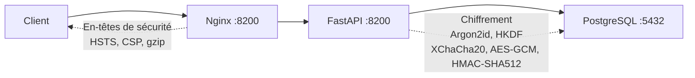

# Démarrage rapide

rhorizon opérationnel en 5 minutes.

## Prérequis

- Docker + Compose v2
- Accès VPN (Tailscale, OpenVPN, ...) - rhorizon ne doit jamais être exposé sur Internet

## 1. Cloner et configurer

```bash
git clone https://github.com/JR-Shdw/Horizon.git
cd rhorizon

# Copier le template d'environnement et générer un mot de passe Postgres
cp env.example .env
sed -i "s|^POSTGRES_PASSWORD=.*|POSTGRES_PASSWORD=$(openssl rand -hex 32)|" .env

# Ou utiliser le helper :
#   make secrets
```

Par défaut, tous les ports publiés bindent sur `127.0.0.1` - le stack
est donc sûr à démarrer sur n'importe quel hôte. Pour exposer sur un
VPN / VLAN privé, ajustez `VAULT_API_BIND`, `VAULT_API_BIND_M2M`,
`VAULT_FRONT_BIND` dans `.env`.

## 2. Démarrer

**Choisissez le bon fichier compose — le dépôt en livre deux.**

```bash
# Recommandé : génère le certificat TLS, l'active, et affiche les URLs
sh tools/install.sh
```

C'est le seul chemin qui met TLS en place pour vous. Piloter compose
directement fonctionne aussi, mais démarre **sans** certificat (`TLS_ENABLED`
vaut `false` par défaut), donc le stack est en clair tant que vous n'en
fournissez pas un dans `./certs` :

```bash
docker compose -f tools/docker-compose.quickstart.yml up -d
```

| Fichier | Publie sur | À utiliser pour |
|---|---|---|
| `tools/docker-compose.quickstart.yml` | `127.0.0.1` — API `:8200`, UI `:8080` (HTTP) et `:8443` (TLS) | Laptops, hôtes uniques, évaluation |
| `docker-compose.yml` (racine) | `${WG_IP:-10.0.0.1}` et `10.0.1.1` — API `:8200`, UI `:8201` | La stack opérateur/VPN |

Le fichier racine code en dur des adresses VPN, donc sur un hôte qui ne les a
pas, Docker refuse de démarrer le stack (*« Couldn't listen on requested
ports »*). Surchargez les binds du quickstart avec `RH_API_BIND`,
`RH_FRONTEND_BIND`, `RH_API_PORT`, `RH_FRONTEND_PORT` et
`RH_FRONTEND_HTTP_PORT` ; le fichier racine utilise `WG_IP` et `WG1_IP` à la
place.

`sh tools/install.sh` choisit le fichier quickstart pour vous et affiche l'URL.

Trois conteneurs démarrent : PostgreSQL, API, Frontend.
Le schéma est appliqué automatiquement au premier démarrage.

## 3. Vérifier

```bash
# Santé
curl --cacert ~/rhorizon/certs/cert.pem https://127.0.0.1:8443/health
# {"status": "ok"}

# Status (scellé par défaut)
curl --cacert ~/rhorizon/certs/cert.pem https://127.0.0.1:8443/api/v1/vault/status
# {"sealed": true, "version": "1.0.0-beta", ...}
```

## 4. Premier descellement

L'installeur laisse le vault **scellé** et n'invente pas de mot de passe
maître. Le premier descellement crée la clé maître à partir de votre mot de
passe. **Choisissez un mot de passe fort - il protège tout.**

> **Installs non assistées.** `tools/install.sh --master-password VALEUR` (ou
> `RH_MASTER_PASSWORD`) descelle à votre place. C'est le *seul* chemin qui
> écrit des credentials sur disque, et il en écrit deux :
>
> ```
> ~/rhorizon/secrets/master-password
> ~/rhorizon/secrets/root-token
> ```
>
> En mode 0400, et ensemble ils suffisent à prendre le contrôle complet de
> l'instance. Déplacez-les dans un gestionnaire de mots de passe et supprimez
> les fichiers une fois la sauvegarde vérifiée. Notez que la valeur atterrit
> aussi dans l'historique de votre shell et, le temps de vie du process, dans
> `/proc/<pid>/cmdline`.
>
> L'installeur natif (`tools/install-native.sh`) utilise la même disposition
> sous son propre répertoire de config, `~/.config/rhorizon/secrets/` en mode
> utilisateur, et vous en avertit en fin de run.

```bash
cd cli
python -m venv .venv
. .venv/bin/activate
pip install -e .
export RH_ADDR=https://127.0.0.1:8443
export RH_CA_FILE=~/rhorizon/certs/cert.pem
rhorizon unseal
# Master password: ********
# Status: unsealed
```

Le CLI lit le mot de passe sans l'afficher ni l'inscrire dans l'historique du
shell. Stockez le root token à usage unique dans votre gestionnaire de mots de
passe.

> **Le stack démarre en TLS.** `tools/install.sh` génère un certificat
> auto-signé (SAN `localhost` + `127.0.0.1`, 825 jours) et pose
> `TLS_ENABLED=true`, donc l'UI et l'API sont sur `https://127.0.0.1:8443`. Il
> affiche deux lignes à ajouter à votre profil shell :
>
> ```bash
> export RH_ADDR=https://127.0.0.1:8443
> export RH_CA_FILE=~/rhorizon/certs/cert.pem
> ```
>
> `RH_CA_FILE` est ce qui rend le certificat auto-signé digne de confiance pour
> le CLI et les agents `rh-*` — sans lui, ils refusent de se connecter, à juste
> titre. Il n'existe pas d'option skip-verify.
>
> Le HTTP en clair écoute toujours sur `:8080` et `:8200` pour le débogage,
> mais le vault journalise un avertissement `PLAINTEXT TRANSPORT` pour
> **chaque** appel qui l'emprunte, loopback compris — le trafic same-host reste
> lisible par tout process ayant `CAP_NET_RAW`, et dans un pod « same host »
> signifie un conteneur voisin.

## 5. Configurer votre token admin

Ouvrez l'UI à `https://127.0.0.1:8443`, allez dans **Core** (icône paramètres),
collez votre token admin. Il est nécessaire pour toutes les opérations.

Ou via le CLI :

```bash
rhorizon login 127.0.0.1:8443      # un hôte nu vaut https par défaut
# Entrez votre token quand demandé

rhorizon status
# Status:   UNSEALED
# Version:  1.0.0-beta
```

## 6. Stocker votre premier secret

```bash
rhorizon set prod/db-password "s3cure-p4ssw0rd" -n prod
rhorizon get prod/db-password
# s3cure-p4ssw0rd

rhorizon list
#   prod/db-password  v1  [prod]
```

## 7. Générer un token scopé

```bash
rhorizon token create ops-reader '{"secrets":"r"}'
# Token:  rh_xxxxxxxxxxxx
# (affiché une seule fois - sauvegardez-le maintenant)
```

## 8. Optionnel - Activer le 2FA

### TOTP

```bash
curl --cacert ~/rhorizon/certs/cert.pem \
  -X POST https://127.0.0.1:8443/api/v1/vault/totp/setup \
  -H "Authorization: Bearer $TOKEN"
# {"secret": "BASE32SECRET", "uri": "otpauth://..."}
# Scannez l'URI comme QR code dans votre app d'authentification, puis :

curl --cacert ~/rhorizon/certs/cert.pem \
  -X POST https://127.0.0.1:8443/api/v1/vault/totp/enable \
  -H "Authorization: Bearer $TOKEN" \
  -H "Content-Type: application/json" \
  -d '{"code": "123456"}'

curl --cacert ~/rhorizon/certs/cert.pem \
  -X PUT "https://127.0.0.1:8443/api/v1/vault/2fa?mode=totp" \
  -H "Authorization: Bearer $TOKEN"
```

### WebAuthn / FIDO2 (touch natif navigateur)

Enregistrez une clé de sécurité directement depuis le navigateur - pas besoin du CLI.

1. Ouvrez l'UI, allez dans **Core** (paramètres)
2. Dans la section **Two-Factor Authentication**, cliquez **+ Register Security Key**
3. Entrez un nom et cliquez **Touch to register**
4. Touchez votre clé de sécurité quand le navigateur le demande
5. Passez le mode 2FA en `yubikey` (accepte WebAuthn et HMAC-SHA1)

**Descellement avec WebAuthn :**

Sur la page Horizon (tableau de bord), cliquez **Touch Security Key** et touchez votre clé.
Le navigateur gère l'ensemble du flux - aucune commande CLI nécessaire.

> **Note :** WebAuthn nécessite HTTPS ou `localhost`. Pour le CLI/automation, utilisez HMAC-SHA1 ci-dessous.

### YubiKey (challenge-response HMAC-SHA1)

```bash
# 1. Programmer le slot 2 avec un secret HMAC-SHA1
ykman otp chalresp --generate 2
# Sauvegardez le secret hex de 40 caractères affiché

# 2. Obtenir le numéro de série
ykman info
# Serial: 12345678

# 3. Dans Core > 2FA, enregistrez le numéro de série et le secret HMAC,
#    puis sélectionnez YubiKey. L'UI garde le secret hors de l'historique
#    du shell et des arguments de processus.
```

**Descellement avec YubiKey :**

Utilisez la vue Core de l'UI et cliquez sur **Touch YubiKey to authenticate**.
Le navigateur gère le challenge et envoie le mot de passe sans l'inscrire dans
l'historique du shell.

### Shamir (découpage M-sur-N)

Avancé, multi-worker uniquement. Voir [`multiworker.md`](multiworker.md).

## 9. Sauvegarde

```bash
# Backup logique chiffré via API (artefact de migration partiel) :
rhorizon backup export ./rhorizon-backup.age
```

Utilisez `pg_dump | age` pour une reprise après sinistre complète.

## Podman / Docker rootless

rhorizon tourne tel quel sur Podman et Docker rootless. Le fichier compose
n'utilise que des primitives standard (`cap_drop`, `no-new-privileges`,
`read_only`, `tmpfs`, `pids_limit`, limites `memory`) supportées par les deux
runtimes.

### Podman

Passez `-f tools/docker-compose.quickstart.podman.yml`. Sans `-f`, compose
récupère le `docker-compose.yml` du répertoire courant — le fichier cluster qui
bind des adresses VPN, celui que ce guide vous a dit de ne pas utiliser sur un
laptop. La variante Podman cible localhost et utilise les formes portables de
`tmpfs` et le `depends_on` simple dont Podman rootless a besoin.

```bash
# Soit invoquer podman-compose directement :
podman-compose -f tools/docker-compose.quickstart.podman.yml up -d

# Soit générer des units Quadlet pour systemd (recommandé sur EL/Fedora) :
podman compose -f tools/docker-compose.quickstart.podman.yml --in-pod=true up -d
```

`sh tools/install.sh` sélectionne ce fichier pour vous quand il détecte Podman ;
les commandes ci-dessus servent à piloter compose à la main.

### Docker rootless

Passez `-f` ici pour la même raison que Podman : un `docker compose up -d` nu
depuis la racine du dépôt prend `docker-compose.yml`, le fichier cluster qui
bind des adresses VPN.

```bash
dockerd-rootless-setuptool.sh install
# utilise automatiquement le socket rootless
docker compose -f tools/docker-compose.quickstart.yml up -d
```

### Caveat sur le verrouillage mémoire (mlock)

Le défaut portable ne demande ni `IPC_LOCK` ni ulimit memlock illimité. L'API
rapporte le verrouillage des buffers Rust dans `memory_protection`, et le
verrouillage du process entier dans `process_memory_protection`. L'effacement
implémenté par `zeroize` tourne quand même au drop, donc les clés sont purgées
du tas à la libération. Un avertissement n'est nécessaire que si le swap est non
chiffré ou invérifiable ; un swap chiffré, zram, ou pas de swap du tout
préviennent déjà cette exposition persistante.

Le quickstart détecte cela sur l'hôte et écrit `RH_SWAP_PROTECTION` dans son
`.env`. Un déploiement Compose géré à la main reste à `unknown` tant que
l'opérateur n'y a pas inscrit `protected` ou `unencrypted`.

Sur un hôte avec swap non chiffré, imposez le verrouillage mémoire sur un
runtime qui le permet :

```bash
cd ~/rhorizon
docker compose -f docker-compose.yml \
  -f docker-compose.memory-lock.yml --env-file .env up -d
```

Cet override demande `IPC_LOCK`, pose un ulimit memlock illimité et passe la
politique applicative à `required`. Si le runtime ne peut pas les fournir, le
démarrage explicitement durci échoue ; retirez l'override pour revenir au
best-effort.

### Contraintes rootless

- Bind sur des ports < 1024 — bindez `127.0.0.1:8200` et mettez un reverse
  proxy rootful devant si vous avez besoin du :443.
- Les noms de profils AppArmor / SELinux diffèrent — les profils fournis
  supposent un Docker rootful. Utilisez les défauts du runtime tant que vous
  n'avez pas écrit les équivalents rootless.
- `docker exec` depuis un autre utilisateur — seul l'utilisateur qui fait
  tourner le stack peut s'attacher.

Pour un déploiement souverain / mono-tenant on-prem, rootless + Podman est le
chemin recommandé.

## Architecture



Tous les conteneurs sur le réseau Docker interne. Seul nginx se lie à l'hôte
(par défaut : 127.0.0.1 uniquement). rhorizon est conçu pour un réseau local
restreint : l'accès via un VPN ou un réseau privé est fortement recommandé,
jamais via l'internet public.

## Étapes suivantes

- [Référence API complète](../docs/reference/api.md)
- [Roadmap](ROADMAP.md) - secrets dynamiques, LDAP, injection conteneur
- [Politique de sécurité](../../SECURITY.md)

## Licence

[AGPL-3.0](../../LICENSE) - Libre d'utilisation, modification et déploiement. Les modifications doivent être publiées sous AGPL-3.0.

Une [licence commerciale](../../LICENSE-COMMERCIAL.md) est disponible pour les prestataires de services managés, les organisations avec des restrictions AGPL, ou les besoins de support garanti.
