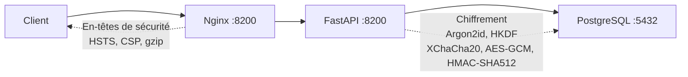

# Démarrage rapide

rhorizon opérationnel en 5 minutes.

## Prérequis

- Docker + Compose v2
- Accès VPN (Tailscale, OpenVPN, ...) - rhorizon ne doit jamais être exposé sur Internet

## 1. Cloner et configurer

```bash
git clone https://github.com/JR-Shdw/Horizon.git
cd rhorizon

# Copier le template d'environnement et générer un mot de passe Postgres
cp env.example .env
sed -i "s|^POSTGRES_PASSWORD=.*|POSTGRES_PASSWORD=$(openssl rand -hex 32)|" .env

# Ou utiliser le helper :
#   make secrets
```

Par défaut, tous les ports publiés bindent sur `127.0.0.1` - le stack
est donc sûr à démarrer sur n'importe quel hôte. Pour exposer sur un
VPN / VLAN privé, ajustez `VAULT_API_BIND`, `VAULT_API_BIND_M2M`,
`VAULT_FRONT_BIND` dans `.env`.

## 2. Démarrer

```bash
docker compose up -d
```

Trois conteneurs démarrent : PostgreSQL, API, Frontend.
Le schéma est appliqué automatiquement au premier démarrage.

## 3. Vérifier

```bash
# Santé
curl http://localhost:8200/health
# {"status": "ok"}

# Status (scellé par défaut)
curl http://localhost:8200/api/v1/vault/status
# {"sealed": true, "version": "1.0.0-beta", ...}
```

## 4. Premier descellement

Le premier descellement crée la clé maître à partir de votre mot de passe.
**Choisissez un mot de passe fort - il protège tout.**

```bash
cd cli
python -m venv .venv
. .venv/bin/activate
pip install -e .
RH_ADDR=http://localhost:8200 rhorizon unseal
# Master password: ********
# Status: unsealed
```

Le CLI lit le mot de passe sans l'afficher ni l'inscrire dans l'historique du
shell. Stockez le root token à usage unique dans votre gestionnaire de mots de
passe.

## 5. Configurer votre token admin

Ouvrez l'UI à `http://localhost:8200`, allez dans **Core** (icône paramètres),
collez votre token admin. Il est nécessaire pour toutes les opérations.

Ou via le CLI :

```bash
rhorizon login http://localhost:8200
# Entrez votre token quand demandé

rhorizon status
# Status:   UNSEALED
# Version:  1.0.0-beta
```

## 6. Stocker votre premier secret

```bash
rhorizon set prod/db-password "s3cure-p4ssw0rd" -n prod
rhorizon get prod/db-password
# s3cure-p4ssw0rd

rhorizon list
#   prod/db-password  v1  [prod]
```

## 7. Générer un token scopé

```bash
rhorizon token create ops-reader '{"secrets":"r"}'
# Token:  rh_xxxxxxxxxxxx
# (affiché une seule fois - sauvegardez-le maintenant)
```

## 8. Optionnel - Activer le 2FA

### TOTP

```bash
curl -X POST http://localhost:8200/api/v1/vault/totp/setup \
  -H "Authorization: Bearer $TOKEN"
# {"secret": "BASE32SECRET", "uri": "otpauth://..."}
# Scannez l'URI comme QR code dans votre app d'authentification, puis :

curl -X POST http://localhost:8200/api/v1/vault/totp/enable \
  -H "Authorization: Bearer $TOKEN" \
  -H "Content-Type: application/json" \
  -d '{"code": "123456"}'

curl -X PUT "http://localhost:8200/api/v1/vault/2fa?mode=totp" \
  -H "Authorization: Bearer $TOKEN"
```

### WebAuthn / FIDO2 (touch natif navigateur)

Enregistrez une clé de sécurité directement depuis le navigateur - pas besoin du CLI.

1. Ouvrez l'UI, allez dans **Core** (paramètres)
2. Dans la section **Two-Factor Authentication**, cliquez **+ Register Security Key**
3. Entrez un nom et cliquez **Touch to register**
4. Touchez votre clé de sécurité quand le navigateur le demande
5. Passez le mode 2FA en `yubikey` (accepte WebAuthn et HMAC-SHA1)

**Descellement avec WebAuthn :**

Sur la page Horizon (tableau de bord), cliquez **Touch Security Key** et touchez votre clé.
Le navigateur gère l'ensemble du flux - aucune commande CLI nécessaire.

> **Note :** WebAuthn nécessite HTTPS ou `localhost`. Pour le CLI/automation, utilisez HMAC-SHA1 ci-dessous.

### YubiKey (challenge-response HMAC-SHA1)

```bash
# 1. Programmer le slot 2 avec un secret HMAC-SHA1
ykman otp chalresp --generate 2
# Sauvegardez le secret hex de 40 caractères affiché

# 2. Obtenir le numéro de série
ykman info
# Serial: 12345678

# 3. Dans Core > 2FA, enregistrez le numéro de série et le secret HMAC,
#    puis sélectionnez YubiKey. L'UI garde le secret hors de l'historique
#    du shell et des arguments de processus.
```

**Descellement avec YubiKey :**

Utilisez la vue Core de l'UI et cliquez sur **Touch YubiKey to authenticate**.
Le navigateur gère le challenge et envoie le mot de passe sans l'inscrire dans
l'historique du shell.

### Shamir (découpage M-sur-N)

```bash
curl -X POST http://localhost:8200/api/v1/vault/shamir/init \
  -H "Authorization: Bearer $TOKEN" \
  -H "Content-Type: application/json" \
  -d '{"threshold": 3, "total": 5}'
# Retourne 5 parts - distribuez-les aux détenteurs de clés
```

Pour desceller un déploiement multi-worker, réunissez le quorum par un canal
opérateur sécurisé puis envoyez toutes les parts dans **une seule requête** :

```bash
# Saisie sans écho ni historique, puis envoi direct du quorum.
python3 - <<'PY' | curl -X POST http://localhost:8200/api/v1/vault/unseal \
  -H "Content-Type: application/json" \
  --data-binary @-
import getpass, json
print(json.dumps({"shares": [getpass.getpass(f"Part {i}: ") for i in range(1, 4)]}))
PY
```

Le champ historique `share` reste accepté une part à la fois pendant cinq
minutes, mais ces requêtes ne bénéficient pas d’une affinité worker garantie.

## 9. Sauvegarde

```bash
# Backup logique chiffré via API (artefact de migration partiel) :
rhorizon backup export ./rhorizon-backup.age
```

Utilisez `pg_dump | age` pour une reprise après sinistre complète.

## Architecture



Tous les conteneurs sur le réseau Docker interne. Seul nginx se lie à l'hôte
(par défaut : 127.0.0.1 uniquement). rhorizon est conçu pour un réseau local
restreint : l'accès via un VPN ou un réseau privé est fortement recommandé,
jamais via l'internet public.

## Étapes suivantes

- [Référence API complète](../docs/reference/api.md)
- [Roadmap](ROADMAP.md) - secrets dynamiques, LDAP, injection conteneur
- [Politique de sécurité](../../SECURITY.md)

## Licence

[AGPL-3.0](../../LICENSE) - Libre d'utilisation, modification et déploiement. Les modifications doivent être publiées sous AGPL-3.0.

Une [licence commerciale](../../LICENSE-COMMERCIAL.md) est disponible pour les prestataires de services managés, les organisations avec des restrictions AGPL, ou les besoins de support garanti.
