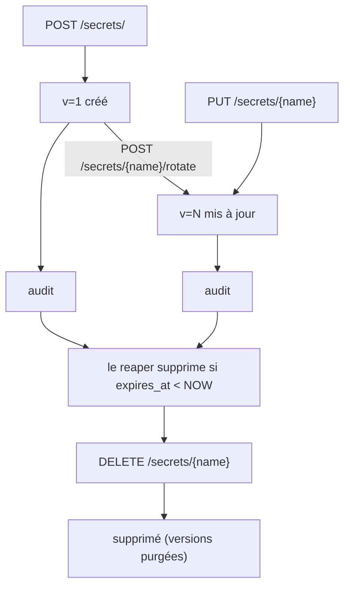

# Secrets et tokens

Resurgamus Horizon stocke deux types d'objets : les **secrets** (ce que
vous voulez garder chiffre) et les **tokens** (les credentials que vos
scripts, agents et CI utilisent pour les lire).

Ce document couvre le cycle de vie, le scoping, et les patterns
recommandes pour les deux. Pour les specificites de deploiement, voir
[`DEPLOYMENT.md`](DEPLOYMENT.md) ; pour les specificites MCP / LLM, voir
[`MCP.md`](MCP.md) ; pour les cas d'usage de bout en bout (Ansible, K8s,
CI), voir [`USE-CASES.md`](USE-CASES.md).

---

## 1. Secrets

Un secret est un blob opaque, nomme, namespace, chiffre.

| Champ | Signification |
|---|---|
| `name` | Requis. L'identifiant par lequel vous lisez et ecrivez. Noms de type chemin autorises (ex. `prod/db/url`). |
| `namespace` | Regroupement logique. Defaut `default`. Utilise pour le scoping des tokens, le RBAC, et l'audit. |
| `value` | La chose que vous vouliez vraiment proteger. Stockee chiffree ; le serveur ne la logue jamais. |
| `metadata` | Sac de tags JSON libre (owner, expiry, notes de politique de rotation). Pas chiffre, pas load-bearing. |
| `version` | Auto-incrementee a l'update. Les anciennes versions sont gardees jusqu'a `RH_SECRET_MAX_VERSIONS` (defaut 10). |
| `expires_at` | TTL optionnel. Le reaper supprime le secret apres ce temps. |
| `dek_rotated_at` | Comptabilite pour la rotation DEK. Interne. |

### 1.1 Noms et namespaces

Il n'y a pas de schema de nommage impose - `prod/db-password`,
`prod-db-password`, `prod/db/password` marchent tous. Une convention de
type chemin est recommandee parce qu'elle compose bien avec les
namespaces dans les scripts (`get prod/db-url` est plus lisible que
`get prod_db_url`).

Les namespaces sont la maniere dont les tokens sont scopes. Un token avec
`{"secrets": "rw", "namespaces": ["prod"]}` peut lire et ecrire tout
secret dont le namespace commence par `prod` ; il ne peut pas toucher
`default/*`.

Un token sans champ `namespaces` n'a aucune restriction de namespace
(seul son scope s'applique).

### 1.2 Versioning

Chaque UPDATE cree une nouvelle version avec une DEK fraiche. Les
anciennes versions sont conservees jusqu'a `RH_SECRET_MAX_VERSIONS`
(defaut 10, mettre 0 pour illimite). Lire sans selecteur de version
retourne la derniere ; vous pouvez lire des versions specifiques via
l'endpoint de liste des versions.

| Pourquoi le versioning | Usage pratique |
|---|---|
| **Rollback d'un secret mal configure** | `GET /secrets/{name}/versions` puis `PUT` avec l'ancienne valeur |
| **Comparer ce qui a change** | Le log d'audit dit qui et quand, le log de versions dit quoi |
| **Conserver l'historique de rotation** | Vos credentials DB tournent chaque semaine ; vous pouvez auditer la chaine des valeurs passees |

#### Fenetre de grace de rotation

Quand vous tournez un secret tres sollicite, les consommateurs qui ont mis en
cache l'ancienne valeur ont besoin d'un instant pour prendre la nouvelle. La
fenetre de grace couvre ce basculement : apres un `PUT` non-emergency, la valeur
precedente reste lisible via `GET /secrets/{name}?previous=true` pendant
`RH_SECRET_GRACE_SECONDS`, puis s'arrete. Chaque lecture de grace est
auditee comme `read_secret_previous`.

Desactivee par defaut (`0`) et plafonnee a un jour. Meme logique que le mode
emergency du master password : un `PUT` avec `{"emergency": true}` ne laisse
aucune grace, l'ancienne valeur (peut-etre fuitee) cesse d'etre servie aussitot.

```bash
# Rotation, garde l'ancienne valeur joignable pendant le basculement (grace active)
rhorizon set db-pass NEWVALUE --update
rhorizon get db-pass --previous          # ancienne valeur, jusqu'a fermeture de la fenetre

# Rotation d'un secret fuite, sans grace
rhorizon set db-pass NEWVALUE --update --emergency
```

Seule la version immediatement precedente est en grace ; une seconde mise a jour
deplace la fenetre. L'historique complet reste accessible aux admins via les
endpoints de versions, dans tous les cas.

> Teste (2026-06-23) : la grace sert la valeur precedente, une mise a jour
> emergency la supprime, c'est desactive par defaut, ca expire, et une seconde
> mise a jour avance la fenetre. Voir `tests/test_secret_grace.py`.

### 1.3 Cycle de vie



La rotation DEK par secret est explicite. `POST /secrets/{name}/rotate`
rechiffre la valeur inchangee avec un nouveau DEK aleatoire. L'age de la
`dek_key` hierarchique est surveille separement ; l'operateur appelle
`POST /admin/rotate-dek-key` avec le mot de passe maitre pour rechiffrer
les DEK.

« Explicite » ne signifie pas « non scriptable » : l'operateur peut appeler
ces endpoints depuis un job de maintenance. Rhorizon ne conserve pas le mot de
passe maitre et ne contourne pas la reauthentification pour alimenter un timer
interne. Le workflow controle par l'operateur peut d'abord verifier l'etat de
la base et du cluster, creer et tester une sauvegarde chiffree, lancer la
rotation dans une fenetre supervisee, puis controler la readiness, des lectures
representatives, les metriques et l'evenement d'audit. L'automatisation doit
injecter le mot de passe par un canal d'execution protege, jamais dans les
arguments de commande, les logs ou la sauvegarde elle-meme.

### 1.4 Ce que le log d'audit capture

| Evenement | `actor` | `action` | `target` | `detail` (jsonb) |
|---|---|---|---|---|
| Read | nom du token | `read_secret` | `<ns>/<name>` | version lue |
| Create | nom du token | `create_secret` | `<ns>/<name>` | namespace, has-expiry |
| Update | nom du token | `update_secret` | `<ns>/<name>` | nouvelle version |
| Delete | nom du token | `delete_secret` | `<ns>/<name>` | versions purgees |
| Rotation DEK | nom du token | `rotate_secret` | `<name>` | nouvelle version |

La chaine est signee HMAC ; toute alteration casse `rhorizon audit verify`.

---

## 2. Tokens

Un token est une chaine commencant par `rh_`, donnee a un client (script,
agent, runner CI, serveur MCP, personne a une CLI). Il a un scope, une
restriction de namespace optionnelle, et un TTL optionnel.

| Champ | Signification |
|---|---|
| `name` | Label lisible. Apparait comme `actor` dans l'audit. |
| `scope` | Un ou plusieurs parmi `secrets`, `tokens`, `audit`, `cluster`, `admin`, chacun avec `r` (read) ou `rw` (read+write). |
| `namespaces` | Liste optionnelle. Le token ne peut acceder qu'aux secrets de ces namespaces. |
| `expires_at` | TTL optionnel. Apres expiry le token est rejete meme avant revocation. |
| `revoked` | Kill-switch manuel. Effectif immediatement a la prochaine requete. |

La chaine du token est affichee **une seule fois** a la creation. La DB
ne stocke que le hash HMAC-SHA512 - recuperer un token perdu est
impossible par design.

### 2.1 Aide-memoire des scopes

| Scope | `r` | `rw` |
|---|---|---|
| `secrets` | Lire la valeur d'un secret, lister les noms | Create / update / delete |
| `tokens` | Lister les tokens existants (sans valeurs) | Creer de nouveaux tokens, revoquer les existants |
| `audit` | Lire la chaine d'audit | (pas de `audit:rw` - la chaine est append-only) |
| `cluster` | Statut cluster + HA PostgreSQL (`/cluster`, `/cluster/health`, `/cluster/ha`, CA bundle) | Cycle de vie des noeuds : promote / demote / drain / evict / unrevoke / init / repair |
| `admin` | Comme `audit:r` + lire toutes les configs | Seal / unseal, rotate master, changer la 2FA, gerer YubiKeys/TOTP/WebAuthn |

Un token ne peut pas accorder un scope qu'il ne possede pas lui-meme. Si
votre token est `secrets:r`, vous ne pouvez pas minter un enfant en
`secrets:rw`.

### 2.2 Scoping par namespace

Bonne pratique : chaque token recoit le plus petit namespace qui lui
permet de faire son travail. Un runner CI qui build le repo `frontend`
recoit `{"secrets": "r", "namespaces": ["ci/frontend"]}`. Il ne peut pas
lire `prod/*` meme par accident.

L'acces cross-namespace necessite soit (a) un token avec plusieurs
namespaces dans la liste, soit (b) un token non-scope (sans champ
`namespaces`). Evitez (b) pour les consommateurs non-opérateurs.

### 2.3 IP allowlist par token (`allowed_ips`)

Axe de confinement optionnel secondaire, par-dessus le scope et le
namespace. Restreint **ou** un token peut etre utilise. Le vault verifie
l'IP cliente de la requete contre une liste de CIDR / IP separes par
virgule et rejette les non-correspondances avec
`403 Token not allowed from this IP`.

```bash
curl -X POST https://vault.example/api/v1/vault/tokens/ \
  -H "Authorization: Bearer $ADMIN_TOKEN" \
  -H "Content-Type: application/json" \
  -d '{
    "name": "ansible-prod",
    "permissions": {"secrets": "r", "namespaces": ["prod"]},
    "allowed_ips": "10.0.0.1/32, 10.0.0.1/32"
  }'
```

#### Ce que le champ accepte

| Forme | Signification |
|---|---|
| `null` / absent / `""` | Aucune restriction. Defaut retro-compatible. |
| `"10.0.0.1"` | Un seul host. IP nue -> stockee en `/32` (v4) ou `/128` (v6). |
| `"10.0.0.1, 10.0.0.1, 10.0.0.1"` | **Les listes sont supportees** - separees par virgule. Melangez IP individuelles et CIDR librement. |
| `"10.89.0.0/16"` | Un bloc CIDR - tout host du subnet est autorise. |
| `"10.0.0.1/24, 2001:db8::/64"` | IPv4 et IPv6 dans la meme allowlist. |
| `"not-a-cidr"` | Rejete a la creation avec `400 Invalid allowed_ips entry`. |

Les espaces autour des entrees sont toleres. La valeur stockee est
canonicalisee (bits d'host mis a zero, prefixe ajoute sur les IP nues) et
renvoyee dans la reponse pour que l'appelant confirme ce qui a ete
reellement persiste.

#### Pourquoi s'embeter - mouvement lateral

Le scope (`secrets:r`) limite **ce que** le token peut faire. Le
namespace limite **quels secrets** il touche. L'IP allowlist limite
**d'ou le token peut etre rejoue** s'il fuit.

Sans elle, un token long-lived dans une config Ansible sur le host
`10.0.0.1` est tout aussi valide depuis n'importe quel autre host du
mesh VPN ou du bridge Docker. Avec elle, un compromis d'un workload
sans rapport sur le meme reseau prive ne donne pas un credential vault
utilisable.

Plus c'est etroit, mieux c'est :

| Allowlist | Surface de rejeu si fuite |
|---|---|
| `"10.0.0.1/32"` | Un host. Le compromis de tout autre host LAN ne le rejouera pas. |
| `"10.0.0.1, 10.0.0.1"` | Deux hosts. Liste explicite - chirurgicale. |
| `"10.0.0.1/24"` | Un subnet entier. OK pour un segment VPN serre. |
| `"10.0.0.0/8"` | Tout RFC 1918 / 10. Effectivement inutile pour la defense mouvement-lateral. |
| `null` (defaut) | Partout sur le reseau qui atteint le vault. |

#### Plages de reference (a utiliser comme plafonds, pas comme defauts)

| Plage | Description |
|---|---|
| `10.0.0.0/8`, `172.16.0.0/12`, `192.168.0.0/16` | RFC 1918 IPv4 prive |
| `fc00::/7` | IPv6 ULA |
| `10.89.0.0/16` | Bridge Podman par defaut `podman` |
| `172.17.0.0/16` | Bridge Docker par defaut `docker0` |
| `172.16.0.0/12` | Couvre `docker0` plus les bridges Docker user-defined (alloues depuis ce pool) |
| votre subnet VPN | Mesh VPN - ce que vous avez assigne (ex. `10.0.0.1/24`) |

Ces plages sont documentees pour le dimensionnement, pas comme valeurs
recommandees. Un mesh VPN est souvent le plus lache que vous
devriez aller ; un `/32` single-host est ce que vous voulez pour les
comptes de service qui n'appellent que depuis un seul endroit.

#### Comportement derriere un reverse-proxy

Le vault resout l'IP cliente via `get_client_ip(request)`, qui parcourt
`X-Forwarded-For` et ne fait confiance qu'aux hops listes dans
`xff_trusted_ips` ou `proxy_trusted_ips`. Si `rhorizon` tourne derriere un
reverse proxy (nginx, Traefik, Authelia), configurez `xff_trusted_ips` pour inclure
les CIDR du proxy - sinon l'allowlist matchera l'IP du proxy, pas le vrai
appelant.

`proxy_trusted_ips` est separe : il autorise les headers d'identite SSO
ou mTLS et reste vide par defaut.

#### Ou ca s'applique

La verification de l'allowlist tourne dans `auth.require_vault_token`,
immediatement apres la validation du hash et le check d'expiry, avant
l'enforcement du scope et du namespace. Elle s'applique a **tous** les
endpoints authentifies, y compris `GET /tokens/whoami` - un token
IP-bloque ne peut meme pas s'introspecter.

Un rejet logue `auth_failure(reason="ip_not_allowed")` dans le fichier
d'audit et incremente
`rhorizon_auth_failures_total{reason="ip_not_allowed"}`.

#### Tokens ephemeres

`POST /tokens/ephemeral` accepte le meme champ `allowed_ips` avec la meme
semantique. Recommande pour les runners CI - liez le token ephemere au
host du runner ou au subnet du pool de runners :

```bash
curl -X POST https://vault.example/api/v1/vault/tokens/ephemeral \
  -H "Authorization: Bearer $TOKEN" \
  -d '{
    "permissions": {"secrets": "r", "namespaces": ["ci/frontend"]},
    "ttl_seconds": 900,
    "allowed_ips": "10.0.0.1/32"
  }'
```

### 2.4 Long-lived vs ephemere

| Aspect | Tokens long-lived | Tokens éphémères |
|---|---|---|
| TTL | aucun (révocation manuelle) | 60s - 24h (configurable) |
| Cas d'usage | agents persistants, serveurs MCP, services fixes | runners CI, jobs one-shot, tâches batch |
| Cycle de vie | mint une fois, stocké en fichier 0600 | mint par run, expire de lui-même |
| Révocation | endpoint explicite | automatique (le reaper purge) |
| Attribution audit | stable | trace par run |

Les deux types utilisent le meme mecanisme sous-jacent (hash
HMAC-SHA512, lookup DB). Le TTL n'est qu'une colonne.

### 2.5 Tokens ephemeres

```bash
curl -X POST https://vault.example/api/v1/vault/tokens/ephemeral \
  -H "Authorization: Bearer $ADMIN_TOKEN" \
  -H "Content-Type: application/json" \
  -d '{
    "permissions": {"secrets": "r", "namespaces": ["ci/frontend"]},
    "ttl_seconds": 900,
    "label": "ci-frontend-build-2026-04-29"
  }'
# Returns:
# {
#   "token": "rh_eph_xxxxx",
#   "name": "eph-xxxxx",
#   "expires_at": "2026-04-29T11:15:00Z",
#   "permissions": {"secrets": "r", "namespaces": ["ci/frontend"]}
# }
```

Contraintes (enforce cote serveur) :

| Contrainte | Pourquoi |
|---|---|
| TTL min : 60s | Garde la chaine d'audit utile - les tokens sub-seconde sont du bruit forensique |
| TTL max : `RH_EPHEMERAL_MAX_TTL` (defaut 24h) | Plafond dur ; un "ephemere long-lived" defait l'objectif |
| Scope `admin` **interdit** | Les tokens eph ne peuvent pas escalader vers admin. Point. |
| Purge reaper : toutes les 5 min | Les lignes expirees disparaissent ; pas d'attente que la requete echoue |

Scopes recommandes par cas d'usage :

| Cas d'usage | Scope | TTL |
|---|---|---|
| Playbook Ansible lisant des secrets prod | `{"secrets": "r", "namespaces": ["prod"]}` | 30 min |
| Build CI tirant des creds de registry | `{"secrets": "r", "namespaces": ["ci/<repo>"]}` | 15 min |
| CronJob backup K8s | `{"secrets": "r", "namespaces": ["backup"]}` | 1 h |
| Investigation manuelle | `{"audit": "r"}` | 4 h |
| Serveur MCP | `{"secrets": "r", "namespaces": ["mcp/..."]}` | long-lived (voir [`MCP.md`](MCP.md)) |

### 2.6 Decrypt-and-die (oneshot)

Pour les workloads qui ont besoin d'un secret **une fois** et sortent
immediatement, l'endpoint oneshot evite de laisser un token vivant du
tout :

```bash
curl -X POST https://vault.example/api/v1/vault/oneshot/secrets/prod/db-url \
  -H "Content-Type: application/json" \
  -d '{
    "password": "<master-password>",
    "challenge": "<from /vault/challenge>",
    "yubikey_response": "<from ykchalresp>"
  }'
# Returns: { "value": "..." }
# Side-effect: the vault auto-seals (zeros all sub-keys) immediately after
```

C'est pour le cas strict ou :

1. Le lecteur est un job unique (runner CI, CronJob, script de recovery).
2. Il n'y a pas d'opérateur a proximite pour descelle interactivement mais vous acceptez que le vault sera scelle ensuite et qu'un operateur doit re-descelle pour que l'operation normale reprenne.
3. Vous pouvez vous engager sans risque sur "apres cette lecture, le vault est scelle".

C'est volontairement opinionne : pas un token TTL, pas "auto-unseal au
boot". A utiliser uniquement pour les runners concus pour laisser le
vault scelle quand ils ont fini.

### 2.7 Rotation de token

Deux flux distincts selon pourquoi vous tournez :

#### Rotation de routine (pas de compromis soupconne)

```bash
POST /api/v1/vault/rotate-password
Body: {"emergency": false}
```

- Le nouveau master password prend effet.
- Les tokens existants **continuent de marcher** - `prev_hmac_key` est stocke chiffre, les lookups essaient les deux cles pendant ~15 jours, puis le reaper drop le fallback.
- Planning : faites-le au calendrier (tous les 90/180 jours) sans perturber les agents.

#### Rotation d'urgence (token / password fuite)

```bash
POST /api/v1/vault/rotate-password
Body: {"emergency": true}
```

- Le nouveau master password prend effet.
- **Tout token existant est invalide immediatement**, y compris celui utilise pour faire cet appel.
- Vous devez re-descelle avec le nouveau password et minter de nouveaux tokens pour tout.

Choisissez le bon mode pour la bonne raison. Routine = hygiene, urgence =
reponse a incident.

#### Rotation d'un seul token (la valeur d'un token)

Quand vous n'avez besoin de rouler qu'**un** token - pas tout le vault -
tournez-le sur place :

```bash
POST /api/v1/vault/tokens/{id}/rotate
# Returns: {"token": "rh_...", "name": "ansible-prod", "warning": "..."}
```

```bash
rhorizon token rotate ansible-prod   # par nom ou id ; demande confirmation
```

- Le token garde son **id, nom, scopes, namespaces, allowed_ips et
  expiry** - seul le materiel secret change. La lignee d'audit et
  l'invariant d'unicite du `name` sont preserves (pas de trou
  delete+recreate).
- L'**ancienne valeur cesse d'authentifier a l'instant ou l'appel
  commit.** Donnez la nouvelle valeur a chaque consommateur d'abord, puis
  tournez - ou tournez, puis re-provisionnez immediatement.
- `last_used_at` se reinitialise, donc le token fraichement tourne se lit
  comme inutilise jusqu'a ce qu'un consommateur l'adopte (le badge `NEW`
  dans l'UI).
- Autorisation : `tokens:w`, **et** l'appelant doit pouvoir *accorder*
  les permissions que le token cible porte (meme porte POLA qu'a la
  creation). Un sous-admin de namespace
  (`{"tokens":"w","namespaces":["dev"]}`) peut tourner les tokens `dev`
  mais jamais un token `prod` ni un token root (`admin`). `admin:w` tourne
  n'importe quoi. Si vous ne pouviez pas le creer, vous ne pouvez pas le
  tourner.

Utilisez ceci pour l'hygiene de routine par credential (tourner
`ansible-prod` chaque semaine) ou pour rouler un seul token fuite sans
forcer tous les autres consommateurs a re-provisionner comme le ferait
une rotation master d'urgence.

### 2.8 Revocation

```bash
# Revoke by ID (visible in /tokens/ list)
POST /api/v1/vault/tokens/{id}/revoke
# Or delete entirely
DELETE /api/v1/vault/tokens/{id}
```

Les deux sont des updates DB O(1) ; la prochaine requete qui presente le
token revoque obtient `401 Unauthorized`. Il n'y a pas de delai de
propagation (pas de caches dans le chemin d'auth).

---

## 3. Attribution d'audit

Chaque lecture et chaque ecriture logue `actor=<nom du token>`. La
discipline recommandee :

- **Un nom de token par consommateur.** `ansible-prod`, `ci-frontend-build`, `mcp-agent`, `bob-laptop` - pas un generique `service-account`.
- **Ne partagez pas les tokens entre opérateurs.** Un token est aussi une identite. Deux personnes partageant un token signifie que l'audit ne peut pas les distinguer.
- **Ne reutilisez pas un token apres rotation.** Nouveau password => nouveaux tokens. Le fait que l'ancien puisse encore marcher ~15 jours est pour la continuite operationnelle, pas pour la flemme.

Requetes :

```bash
# Everything one token did in the last 24h
rhorizon audit list --actor ansible-prod --since 24h

# Live-tail what an MCP server is reading
rhorizon audit follow --actor mcp-agent

# Find anyone who touched a specific secret
rhorizon audit list --target "prod/db-password" --limit 100

# Verify the chain end-to-end
rhorizon audit verify
```

---

## 4. Ou mettre le token cote client

| Consommateur | Stockage recommande |
|---|---|
| Ansible | Plugin lookup lisant depuis rhorizon au runtime ; jamais dans `group_vars` |
| CI / CD | Secret chiffre dans le store propre de la CI, fourni via env au job |
| Pods Kubernetes | Un K8s Secret (un seul - le token rhorizon), l'agent lit via `RH_TOKEN_FILE` |
| Scripts bare-metal | Fichier en mode 0600 owned par l'utilisateur du script |
| Serveur MCP | `RH_TOKEN_FILE` mode 0600 sous un compte local dédié ; les payloads MCP omettent le token |
| CLI sur le laptop d'un opérateur | `~/.config/rhorizon/token` mode 0600 (la commande `rhorizon login` le fait) |

A eviter : les env vars (elles fuient via `/proc/PID/environ`, les
metadata de container, `docker inspect`), l'historique shell, les
fichiers group-readable, partout ou un backup du disque du host
atterrirait.

---

## 5. Patterns courants

### 5.1 "Je veux que mes playbooks Ansible arretent de lire `.env`"

1. Deplacez les secrets de `.env` vers rhorizon (un curl par secret, ou utilisez l'endpoint d'import).
2. Mintez un token : `rhorizon token create ansible-prod --scope secrets:r --namespace prod`
3. Remplacez `lookup('env', 'FOO')` par un `lookup('rhorizon', 'foo', vault_url=..., vault_token=...)` custom. Il y a un exemple dans [`USE-CASES.md`](USE-CASES.md).

### 5.2 "Je veux que la CI ne voie jamais de tokens long-lived"

1. Mintez un token **minteur de tokens** long-lived : scope `tokens:rw`, sans namespaces. Stockez-le comme secret CI.
2. Au demarrage du job, la CI appelle `/tokens/ephemeral` pour obtenir un token ephemere par job (TTL = duree du build + marge).
3. Passez l'ephemere aux steps de build. Il expire automatiquement.

### 5.3 "Je veux un secret lu par un job unique, puis plus rien"

Utilisez l'endpoint oneshot (voir section 2.6). Le vault re-scelle apres la
lecture, donc la fenetre d'exposition du job est exactement une requete
HTTP.

### 5.4 "Je veux que mon LLM lise quelques secrets specifiques"

Utilisez le serveur MCP avec une whitelist de policy. Voir
[`MCP.md`](MCP.md) de bout en bout. Les payloads MCP omettent le token ; le
compte local du serveur reste dans sa frontière de confiance.

### 5.5 "Je veux donner un acces lecture temporaire a un prestataire"

Mintez un token ephemere avec ses initiales dans le label, scope au
namespace dont il a besoin :

```bash
rhorizon token ephemeral \
  --scope secrets:r \
  --namespace contractor/projectx \
  --ttl 28800 \
  --label "alice-projectx-2026-04-29"
```

Quand le contrat se termine, le token expire de lui-meme. Si vous devez
le couper plus tot, `rhorizon token revoke <id>`.

---
