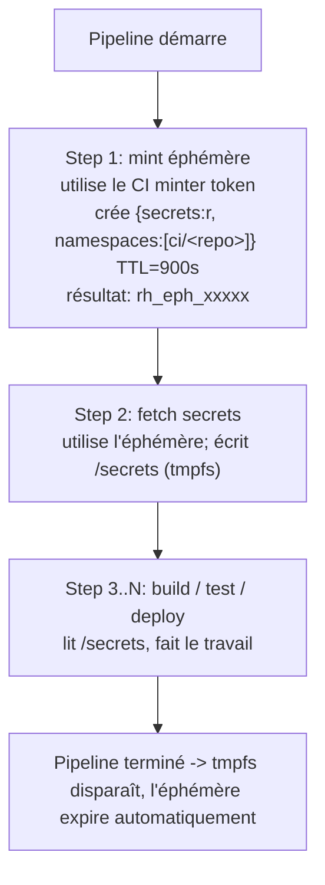
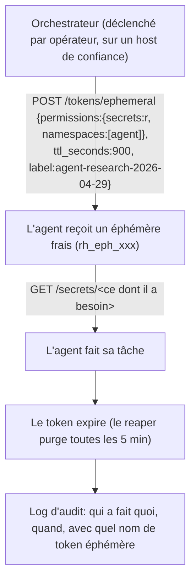

# Cas d'usage

Workflows pratiques, copiables-collables, pour brancher Resurgamus
Horizon sur ce que vous faites deja tourner.

Pour le modele d'auth sous-jacent (tokens, scopes, ephemeral, oneshot),
voir [`SECRETS-AND-TOKENS.md`](SECRETS-AND-TOKENS.md). Pour la CLI utilisee
dans ces exemples, voir [`CLI.md`](CLI.md). Pour la topologie de
deploiement, voir [`DEPLOYMENT.md`](DEPLOYMENT.md).

---

## 1. Remplacer les fichiers `.env` (zero secret sur disque)

**Probleme.** Des secrets eparpilles dans des fichiers `.env` sur chaque
machine. Un backup disque, un container inspect, ou un compte compromis
expose tout.

**Solution.** Les services recuperent leurs secrets depuis le vault au
demarrage. Rien ne persiste sur disque.

### Option A - `rh-inject` (remplacement d'entrypoint)

Remplacer les valeurs en clair par des references `rh://`. L'injecteur
les resout en memoire avant d'exec le vrai process en PID 1.

```yaml
# docker-compose.yml
services:
  myapp:
    image: myapp:latest
    entrypoint: ["/usr/local/bin/rh-inject", "--", "/app/start.sh"]
    environment:
      RH_ADDR: https://vault.internal:8443
      RH_TOKEN: rh_xxx
      DB_PASSWORD: "rh://prod/db-password"
      API_KEY:     "rh://prod/api-key"
      REDIS_URL:   "rh://prod/redis-url"
```

Ce qui se passe :

1. `rh-inject` scanne les env vars pour le prefixe `rh://`
2. Recupere chaque secret reference depuis l'API du vault
3. Remplace les valeurs dans l'env enfant, en memoire uniquement
4. Retire `RH_TOKEN` de l'environnement enfant
5. `exec` la vraie commande - les secrets ne touchent jamais le disque

> Caveat : l'injection par env var fait apparaitre les valeurs resolues
> dans `/proc/PID/environ`. Preferer l'Option B pour les workloads tres
> sensibles.

### Option B - `rh-fetch` (init container, fichiers sur tmpfs)

Ecrire les secrets comme fichiers sur un volume tmpfs. L'app les lit
comme n'importe quel autre fichier de config.

```yaml
services:
  secrets-init:
    image: rhorizon-agent:latest
    command: ["rh-fetch"]
    environment:
      RH_ADDR: https://vault.internal:8443
      RH_TOKEN: rh_xxx
      RH_SECRETS: "db-password:/secrets/db-pass,api-key:/secrets/api-key"
    volumes:
      - secrets:/secrets

  myapp:
    depends_on:
      secrets-init:
        condition: service_completed_successfully
    volumes:
      - secrets:/secrets:ro

volumes:
  secrets:
    driver_opts:
      type: tmpfs
      device: tmpfs   # RAM uniquement - ne touche jamais le disque
```

> **Attention : partage tmpfs docker vs podman**
>
> Le pattern named-volume `driver_opts: type: tmpfs` ci-dessus fonctionne
> correctement sur **podman** (le tmpfs est partage entre les containers
> du meme pod / projet) mais **PAS sur docker** : chaque container qui
> monte le volume obtient son propre tmpfs prive. L'init container ecrit
> avec succes, mais le service consommateur voit un repertoire `/secrets`
> vide et echoue.
>
> Contournements pour docker :
>
> 1. **Supprimer `driver_opts` entierement** - utiliser un volume `local`
>    classique. Les secrets atterrissent sur disque sous
>    `/var/lib/docker/volumes/...` (root-only), pas en RAM. Acceptable sur
>    un host single-tenant avec chiffrement disque complet ; perd la
>    garantie "ne touche jamais le disque".
> 2. **Bind-mount un chemin tmpfs host** - pre-creer quelque chose comme
>    `/run/<svc>-secrets/` sur le host (`/run` est tmpfs sous systemd) et
>    le bind-mount dans les deux containers. Garde la propriete zero-disque
>    au prix d'une preparation host unique.
>
> Tester sur le runtime *cible* avant de promouvoir - un setup qui
> marchait en dev podman peut casser silencieusement en prod docker.

#### Durcissement des permissions de fichiers

`rh-fetch` ecrit les secrets en mode `0400` owned par l'UID de l'ecrivain.
Ca marche en **podman** (l'UID-mapping rootless aligne l'ecrivain et le
consommateur) mais en **docker rootful** le process consommateur (ex.
`postgres` UID 999, `app` UID 1500...) a souvent un UID *different* de
l'ecrivain et obtient `EACCES` a la lecture. Il faut choisir une strategie :

| Mode | Owner | Portee | Compromis |
|---|---|---|---|
| `0400` | ecrivain | ecrivain seul | Le plus sur mais utile seulement si consommateur == ecrivain (podman, K8s `fsGroup`) |
| **`0400` + `chown` par fichier** | **UID consommateur specifique par secret** | **uniquement ce consommateur** | **Le plus defensif en pratique - necessite de controler l'UID de chaque consommateur (donc maitriser les Dockerfiles ou epingler les UID des images officielles)** |
| `0440` | GID partage | tout container dans ce GID | Style Vault-Agent. Necessite un GID coordonne entre images |
| `0444` | ecrivain | tout container qui monte le volume | Facile - mais si un futur service monte le volume, il voit les secrets |

**Recommande quand vous maitrisez la chaine de build : `0400` + `chown`
par fichier.** Lancer un sidecar init one-shot apres `rh-fetch` pour
re-cibler chaque fichier vers l'UID de son consommateur specifique :

```yaml
services:
  rh_fetch:
    image: rhorizon-agent:latest
    user: "0"                     # ecrit dans un volume frais root-owned
    command: ["rh-fetch"]
    environment:
      RH_ADDR: ...
      RH_TOKEN: ...
      RH_SECRETS: "db-password:/secrets/db-pass,api-key:/secrets/api-key"
    volumes:
      - secrets:/secrets

  secrets_perms:                  # NOUVEAU - chown par fichier + chmod 0400
    image: alpine:3.20
    user: "0"
    restart: "no"
    command:
      - "sh"
      - "-c"
      - |
        set -e
        chown 999:999   /secrets/db-pass && chmod 0400 /secrets/db-pass
        chown 1500:1500 /secrets/api-key && chmod 0400 /secrets/api-key
    volumes:
      - secrets:/secrets
    depends_on:
      rh_fetch:
        condition: service_completed_successfully

  myapp:
    depends_on:
      secrets_perms:
        condition: service_completed_successfully
    volumes:
      - secrets:/secrets:ro
```

##### Comparaison avec le reste de l'ecosysteme

| Outil | Mode par defaut | Owner par defaut | Ciblage par fichier |
|---|---|---|---|
| **K8s `Secret` volumes** | `0644` | controle par le `securityContext.fsGroup` du pod | par cle via `items[].mode` |
| **External Secrets Operator** | rend vers un `Secret` K8s natif | herite de K8s | herite de K8s |
| **SOPS / age** | `umask` fourni par l'utilisateur | utilisateur qui a dechiffre | manuel |
| **rhorizon (`0400` + chown)** | **`0400`** | **UID par consommateur** | **oui (recommande)** |

La plupart des outils s'arretent a `0640` + partage de groupe parce
qu'ils ne supposent pas que l'operateur controle l'UID de chaque image
consommatrice. **Un sysadmin competent qui fait tourner une stack
self-hosted sait toujours sous quel UID tourne chaque service au moment
du deploiement** (c'est dans le Dockerfile qu'il a ecrit ou les UID
bien connus des images officielles qu'il a tirees). Sous cette
hypothese, `0400` + `chown` par fichier est strictement plus restrictif
- et on le traite comme la baseline, pas un luxe.

Pour l'equivalent Kubernetes (init containers + emptyDir Memory), voir
[`K8S.md`](K8S.md#5-pattern-a---init-container-rh-fetch-recommandé).

### Cible de migration - services a faire en premier

| Service | Secrets a migrer | Namespace suggere |
|---|---|---|
| PostgreSQL | superuser, mot de passe replication | `db` |
| Gitea / Forgejo | mot de passe DB, secret_key, creds mailer | `git` |
| Woodpecker | agent secret, mot de passe DB, OAuth client | `ci` |
| Matrix / Synapse | mot de passe DB, signing key, mailer | `matrix` |
| Grafana | mot de passe admin, creds datasource | `monitoring` |
| Postfix / Dovecot | mots de passe SASL, cles privees DKIM | `mail` |
| Restic / Borg | mot de passe repo, cles S3 | `backup` |
| Reverse proxy | tokens DNS provider ACME | `proxy` |

### Gain de securite

| Avant | Apres |
|---|---|
| Fichiers `.env` lisibles sur disque | Secrets uniquement en memoire au runtime |
| Le backup inclut les secrets en clair | Le backup ne contient aucun clair |
| Aucune trace d'audit sur l'acces aux secrets | Chaque lecture loguee (acteur, IP, timestamp) |
| Rotation = editer N fichiers sur N machines | Rotation = mettre a jour une fois dans le vault, restart service |

---

## 2. Injection de secrets CI/CD

**Probleme.** Votre CI (Woodpecker, Gitea Actions, GitLab CI, runners
self-hosted GitHub Actions...) stocke les secrets dans sa propre base. Un
compromis de la CI fuite tous les secrets de pipeline.

**Solution.** Les pipelines recuperent les secrets depuis rhorizon avec
des **tokens ephemeres** scopes a un seul run de pipeline. Les secrets
long-lived vivent dans le vault, pas dans la CI.

### Pattern a deux tokens

| Token | Scope | TTL | Stocke ou |
|---|---|---|---|
| **CI minter** | `tokens:rw` (mint des tokens enfants) | persistant | le secret store de la CI |
| **Ephemere par pipeline** | `secrets:r` + namespace | duree du build | minte au debut du job, expire automatiquement |

### Workflow



### Exemple de pipeline Woodpecker

```yaml
# .woodpecker/deploy.yml
when:
  - event: push
    branch: main

steps:
  - name: mint-ephemeral
    image: rhorizon-cli:latest
    environment:
      RH_ADDR: https://vault.internal:8443
      RH_TOKEN:
        from_secret: rhorizon_ci_minter   # tokens:rw
    commands:
      - >
        rhorizon token ephemeral -q
        --ttl 900
        --scope secrets:r
        --namespace ci/${CI_REPO_NAME}
        --label "ci-${CI_PIPELINE_NUMBER}"
        > /shared/eph_token

  - name: build
    image: rhorizon-agent:latest
    command: ["rh-fetch"]
    environment:
      RH_ADDR: https://vault.internal:8443
      RH_TOKEN_FILE: /shared/eph_token
      RH_SECRETS: "registry-password:/secrets/registry-pw"
    volumes:
      - secrets:/secrets

  - name: docker-build
    image: docker:29-cli
    commands:
      - docker login -u deploy -p "$(cat /secrets/registry-pw)" registry.example
      - docker build -t registry.example/myapp:${CI_COMMIT_SHA} .
      - docker push registry.example/myapp:${CI_COMMIT_SHA}
    volumes:
      - secrets:/secrets:ro
```

### Ce que la CI stocke apres migration

| Avant | Apres |
|---|---|
| `registry_password`, `db_password`, `deploy_ssh_key`, ... | Juste un token `rhorizon_ci_minter` |
| Long-lived, partage avec N pipelines | Un ephemere par run de pipeline |
| Audit invisible (log propre a la CI) | Chaque lecture dans le journal Merkle de rhorizon avec `actor=eph-...` |

---

## 3. Playbooks Ansible

**Probleme.** `ansible-vault` utilise un fichier mot de passe statique
(`.vault_pass`) sur disque. Quiconque a l'acces disque dechiffre tout.

**Solution.** Ansible recupere les credentials depuis rhorizon au runtime
du playbook. Pas de fichier `.vault_pass` necessaire.

### Plugin lookup

```python
# plugins/lookup/rhorizon.py
from ansible.errors import AnsibleError
from ansible.plugins.lookup import LookupBase
import requests


class LookupModule(LookupBase):
    def run(self, terms, variables=None, **kwargs):
        addr = variables.get("rhorizon_addr") or kwargs.get("vault_url")
        token = variables.get("rhorizon_token") or kwargs.get("vault_token")
        if not addr or not token:
            raise AnsibleError("rhorizon_addr / rhorizon_token must be set")
        results = []
        for name in terms:
            r = requests.get(
                f"{addr}/api/v1/vault/secrets/{name}",
                headers={"Authorization": f"Bearer {token}"},
                timeout=10,
            )
            r.raise_for_status()
            results.append(r.json()["value"])
        return results
```

### Usage dans le playbook

```yaml
- hosts: all
  vars:
    rhorizon_addr: "http://10.0.0.20:8200"
    rhorizon_token: "{{ lookup('env', 'RH_TOKEN') }}"

  pre_tasks:
    - name: Fetch credentials from vault
      set_fact:
        db_password: "{{ lookup('rhorizon', 'prod/db-password') }}"
        api_key:     "{{ lookup('rhorizon', 'prod/api-key') }}"

  tasks:
    - name: Render config
      template:
        src: db.conf.j2
        dest: /etc/myapp/db.conf
        mode: '0600'
        owner: root
        group: root
```

`RH_TOKEN` vit uniquement dans votre shell operateur ; il n'entre
jamais dans `group_vars/`, n'est jamais committe.

### Gain de securite

| Avant | Apres |
|---|---|
| Fichier `.vault_pass` sur disque sur le controller | Env var ephemere, disparait quand le shell sort |
| Mot de passe de chiffrement statique (rotation rare) | Fetch dynamique par run ; rotation dans le vault, le prochain playbook prend la nouvelle valeur |
| Audit = "ansible a tourne" | Audit = "ansible-prod a lu prod/db-password a 14:32" |

---

## 4. Automatisation backup (Restic / Borg / pg_dump)

**Probleme.** Le mot de passe du repo de l'outil de backup stocke dans
un `.env` ou passe via `--password-command` depuis un fichier lisible
par l'utilisateur.

**Solution.** Le script de backup recupere le mot de passe depuis
rhorizon juste avant d'invoquer l'outil, puis le unset.

### Setup (une fois)

```bash
rhorizon set backup/restic-password    "long-backup-pass" -n backup
rhorizon set backup/s3-access-key      "AKIAXXXX"          -n backup
rhorizon set backup/s3-secret-key      "secret"            -n backup

rhorizon token create backup-agent --scope secrets:r --namespace backup
# rh_xxxxx - stocker dans /etc/rhorizon/backup-token (mode 0600, root)
```

### Script cron

```bash
#!/bin/bash
set -euo pipefail
export RH_ADDR="https://10.0.0.20:8443"
export RH_TOKEN_FILE="/etc/rhorizon/backup-token"

# Recupere les credentials
export RESTIC_PASSWORD=$(rhorizon get backup/restic-password)
export AWS_ACCESS_KEY_ID=$(rhorizon get backup/s3-access-key)
export AWS_SECRET_ACCESS_KEY=$(rhorizon get backup/s3-secret-key)

# Lance le backup
restic -r s3:s3.example.com/backups backup /data

# Les credentials disparaissent quand le script sort
```

Pour des runs de backup one-shot qui doivent laisser le vault scelle
ensuite, voir le pattern [oneshot](#7-oneshot-decrypt-and-die).

---

## 5. Integration d'agents IA (MCP ou token direct)

Deux patterns pour donner a un agent de code IA (Cursor, Aider, Claude
Code, LangChain custom) des credentials sans jamais les
embarquer dans des prompts, scripts, ou fichiers `.env`. MCP (cote modele,
policed par l'hote) ou token direct + helpers CLI (cote agent, policed
par le vault). Exemple complet utilisant le setup de ce repo meme, plus
une mock-stack lancable pour demo sans rien provisionner.

Doc complete : [`AI-INTEGRATION.md`](../AI-INTEGRATION.md). Saveur
specifique MCP : [`MCP.md`](MCP.md).

## 5b. Bring-your-own assistant IA via MCP

**Probleme.** Les clients LLM (Cursor, Cline, Claude Desktop, Continue)
ont besoin de credentials pour agir en votre nom. L'approche naive
depose les credentials dans la config du client ou l'env, ou une prompt
injection peut les exfiltrer.

**Solution.** Le serveur `rhorizon-mcp` fourni expose un ensemble d'opérations
vault comme outils MCP, validées contre une whitelist fail-closed. Les payloads
MCP omettent le token vault ; le compte local du serveur et root peuvent
toujours le lire.

Ce cas d'usage a son propre walkthrough - voir [`MCP.md`](MCP.md). TL;DR :

```bash
cd ~/dev/tools/rhorizon/mcp && pip install -e .
rhorizon token create mcp-agent --scope secrets:r --namespace mcp/mail
umask 077
read -rsp 'Token MCP : ' RH_TOKEN; echo
printf '%s\n' "$RH_TOKEN" > ~/.config/rhorizon/mcp.token
unset RH_TOKEN
$EDITOR ~/.config/rhorizon-mcp/policy.toml   # whitelist
# Brancher dans Cursor / Claude Desktop / etc. via leur config MCP
```

Le journal de lectures protégé par Merkle attribue chaque lecture à
`actor=mcp-agent` (ou au nom donné au token), afin de retracer ce que le LLM a
consulté et de vérifier que les preuves checkpointées n'ont pas été modifiées.

---

## 6. Agents autonomes (LangChain, CrewAI, custom)

**Probleme.** Les process d'agents long-running ont besoin d'acceder a
des secrets d'infra. Un token persistant accorde un acces permanent ;
un compromis fuite des credentials long-lived.

**Solution.** Minter des tokens ephemeres **par run** avec isolation par
namespace. Chaque run d'agent obtient l'acces minimum pour le temps
minimum.

### Workflow



### Squelette Python

```python
import httpx, os

VAULT = os.environ["RH_ADDR"] + "/api/v1/vault"


async def run_agent(task: str, *, admin_token: str) -> dict:
    async with httpx.AsyncClient() as client:
        # 1. Mint a per-run ephemeral
        r = await client.post(
            f"{VAULT}/tokens/ephemeral",
            headers={"Authorization": f"Bearer {admin_token}"},
            json={
                "permissions": {"secrets": "r", "namespaces": ["agent"]},
                "ttl_seconds": 900,
                "label": f"agent-{task}-{os.urandom(4).hex()}",
            },
        )
        r.raise_for_status()
        eph = r.json()["token"]

        # 2. Agent fetches what it specifically needs
        r = await client.get(
            f"{VAULT}/secrets/agent/openai-api-key",
            headers={"Authorization": f"Bearer {eph}"},
        )
        r.raise_for_status()
        api_key = r.json()["value"]

        # 3. Run the task with bounded credentials
        return await do_agent_work(task, api_key)
        # Token expires automatically - no cleanup
```

### Frontieres de securite

| Controle | Effet |
|---|---|
| TTL ephemere | L'agent perd l'acces apres la deadline, meme s'il est compromis |
| Scoping namespace | L'agent voit `agent/*` uniquement - jamais `prod/*` ou `backup/*` |
| Scope `admin` interdit sur les ephemeres | L'agent ne peut pas escalader, ni minter des tokens enfants, ni seal/unseal |
| Chaine d'audit | Chaque lecture loguee avec le nom de l'ephemere + IP - pret pour la forensique |
| Rate limiting | Les tentatives d'auth echouees declenchent le rate limiter par IP |

Pour les agents LLM policy-bound specifiquement (ou vous voulez filtrer
ce que l'agent est autorise a demander), le chemin MCP du section 5 est plus
fort que le DIY - laissez le serveur rhorizon-mcp enforcer la whitelist.

---

## 7. Oneshot decrypt-and-die

**Probleme.** Un job planifie a besoin d'*un* secret. Vous ne voulez pas
d'un token qui traine en CI / cron ; vous voulez une seule lecture sans
acces de suivi possible.

**Solution.** L'endpoint `oneshot` descelle le vault, lit le secret, et
re-scelle avant de retourner. La fenetre descellee est bornee par la
derivation Argon2id (~500 ms cote serveur).

```bash
# Le vault doit etre SCELLE au moment de l'appel
rhorizon oneshot prod/api-key
# Master password: ********
# Sortie : juste la valeur du secret, sur stdout
```

Pour un runner personnalisé, envoyez le mot de passe dans le corps HTTPS
depuis un descripteur de fichier protégé ou un secret store. Ne le placez pas
dans un argument de commande ni dans une variable d'environnement long-lived.
La requête contient aussi le challenge et la réponse YubiKey ; voir la
référence API.

Quand l'utiliser : un script de recovery ponctuel, un runner de backup
qui prend un credential et sort, une tache de maintenance d'urgence.

Quand NE PAS l'utiliser : tout ce qui utilise le vault de maniere
concurrente. Le re-seal est inconditionnel, donc les autres consommateurs
commenceront a echouer jusqu'a ce qu'un operateur re-descelle
manuellement. Voir
[`SECRETS-AND-TOKENS.md`](SECRETS-AND-TOKENS.md#26-decrypt-and-die-oneshot)
pour le rationnel.

---

## 8. Notifications Matrix / chat sans tokens fuites

Les post-hooks de backup, alertes de monitoring, resumes de deploy -
tout ce qui poste dans une room Matrix - finit en general avec un token
d'acces Matrix hardcode dans un script, un fichier env, ou une image de
container. Meme probleme que `.env` pour les secrets de service ; meme
fix.

`tools/matrix-notify` est un helper stdlib (Python 3.10+, sans deps) qui
lit son token d'acces + l'ID de room cible depuis le vault a chaque
envoi. Meme pattern de dogfood que `git-credential-rhorizon`.

```bash
# Minter le token bot Matrix + l'ID de room dans le vault
read -rsp 'Token du bot Matrix : ' RH_SECRET; echo
printf '%s' "$RH_SECRET" | rhorizon set matrix-bot-token \
  --namespace alerts --stdin
unset RH_SECRET

read -rp 'ID de la room Matrix : ' RH_ROOM
printf '%s' "$RH_ROOM" | rhorizon set matrix-alerts-room \
  --namespace alerts --stdin
unset RH_ROOM

# Token bootstrap pour le host d'alerting (allowlist a ce seul host)
curl -X POST "$VAULT_URL/api/v1/vault/tokens/" \
  -H "Authorization: Bearer $ADMIN_TOKEN" \
  -d '{
    "name":"alert-host",
    "permissions":{"secrets":"r","namespaces":["alerts"]},
    "allowed_ips":"10.0.0.1/32"
  }'

# Sur le host d'alerting : installer + configurer
sudo install -m 0755 tools/matrix-notify /usr/local/bin/
mkdir -p ~/.config/rhorizon && chmod 700 ~/.config/rhorizon
umask 077
read -rsp 'Token alert-host : ' RH_TOKEN; echo
printf '%s\n' "$RH_TOKEN" > ~/.config/rhorizon/token
unset RH_TOKEN
echo 'https://vault.example.com' > ~/.config/rhorizon/url
cat > ~/.config/rhorizon/matrix.conf <<EOF
homeserver   = https://matrix.example.com
token_secret = matrix-bot-token
room_secret  = matrix-alerts-room
EOF

# L'utiliser depuis n'importe ou
matrix-notify "deploy succeeded on $(hostname)"
restic backup ... && matrix-notify "backup ok" || matrix-notify "BACKUP FAILED"
```

Pour les services qui emettent des webhooks au lieu d'appels CLI (Grafana
alertmanager, Woodpecker, GitHub, post-hooks Restic), il y a un relais
HTTP compagnon qui convertit `POST /webhook` -> message Matrix, lui aussi
avec credentials backes par le vault et un header shared-secret optionnel
pour la defense en profondeur :
[`tools/matrix-notify.examples/webhook-relay.py`](../../tools/matrix-notify.examples/webhook-relay.py).

Walkthrough complet incluant senders, unit systemd, semantique des
exit-codes, mocker de test, notes operationnelles (volume d'audit,
rotation, cas limites de federation) :
[`tools/matrix-notify.examples/README.md`](../../tools/matrix-notify.examples/README.md).

---

## 9. fail2ban pour la protection brute-force

Resurgamus Horizon rate-limite deja par IP au niveau applicatif. Pour
une reponse plus forte (bloquer au niveau iptables/nftables a travers
tous les services du host), utilisez fail2ban - chaque echec d'auth est
logue dans un format regex-friendly.

Voir [`FAIL2BAN.md`](FAIL2BAN.md) pour le filtre et la config de jail.
Pattern pret a poser qui prend environ 10 minutes a brancher.

---

## Conventions de namespace

Ce sont des conventions, pas enforce par le code. Tenez-vous-en a une et
votre audit devient bien plus facile a lire.

```
default/        Usage general, infra partagee
prod/           Credentials de services production
  prod/db-password
  prod/redis-url
  prod/api-secret-key
ci/<repo>/      Un sous-namespace par repo
  ci/frontend/registry-password
  ci/frontend/deploy-ssh-key
  ci/api/npm-token
backup/         Credentials de backup
  backup/restic-password
  backup/s3-access-key
mail/           Credentials serveur mail
  mail/smtp-password
  mail/dkim-private-key
monitoring/     Credentials d'observabilite
  monitoring/grafana-admin
  monitoring/alertmanager-webhook
mcp/<task>/     Un sous-namespace par tache LLM
  mcp/mail/imap-password
  mcp/browse/cookie-jar
agent/          Credentials d'agents autonomes
  agent/openai-api-key
  agent/gitea-token
```

Faites correspondre le token de chaque consommateur au plus petit
namespace dont il a besoin :

| Consommateur | Permissions | Namespaces | TTL |
|---|---|---|---|
| Service production | `secrets:r` | `prod` | persistant |
| Pipeline CI/CD | `secrets:r` | `ci/<repo>` | ephemere (duree du build) |
| Cron de backup | `secrets:r` | `backup` | persistant |
| Playbook Ansible | `secrets:r` | `prod`, `mail`, ... | persistant (shell operateur seul) |
| Serveur MCP (par client LLM) | `secrets:r` | `mcp/<task>` | persistant (fichier 0600) |
| Agent autonome | `secrets:r` | `agent` | ephemere (15-60 min) |
| Operateur admin | `admin:rw` | (non-scope) | persistant + protege 2FA |

---

## Reference rapide des commandes

```bash
# Stocker + lire
rhorizon set prod/db-password "s3cure" -n prod
rhorizon get prod/db-password

# Lister
rhorizon list -n prod

# Tokens
rhorizon token create ci-frontend  --scope secrets:r --namespace ci/frontend
rhorizon token ephemeral --ttl 900 --scope secrets:r --namespace ci/frontend -q

# Audit
rhorizon audit tail -n 50 --actor ansible-prod
rhorizon audit verify

# Statut
rhorizon status
rhorizon whoami
```

Reference complete : [`CLI.md`](CLI.md). Deep dive token / scope /
lifecycle : [`SECRETS-AND-TOKENS.md`](SECRETS-AND-TOKENS.md).
