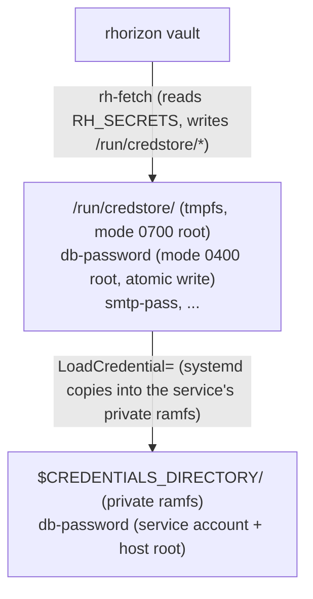

# systemd integration - rhorizon `LoadCredential=`

For bare-metal services (postgres, postfix, dovecot, mariadb, nginx, ...)
that run as systemd units directly on the host rather than in a container,
the canonical pattern is:

1. **`rhorizon-creds.service`** (oneshot) - fetches every secret the host
   needs via `rh-fetch` and drops them into a tmpfs `/run/credstore/`
   (mode 0700 root).

2. **Consumer service** - declares a `Requires=rhorizon-creds.service`
   dependency, then uses `LoadCredential=name:/run/credstore/name`, which
   copies the file into a private ramfs `$CREDENTIALS_DIRECTORY` readable
   by the service account and privileged host processes, mode 0400.



The private credential directory isolates ordinary peer services. It does not
protect credentials from host root, the service manager, or a compromised
consumer process.

## Files provided

| File | Role |
|---|---|
| `rhorizon-creds.service` | oneshot fetch-all service -> `/run/credstore/` |
| `postgres-with-rhorizon.conf` | `postgresql.service.d/` drop-in consuming a secret |
| `postfix-with-rhorizon.conf` | `postfix.service.d/` drop-in (smtp relay password) |

The `*.conf` drop-ins go into `/etc/systemd/system/<unit>.service.d/` and
extend the upstream unit without replacing it (handy for following distro
updates).

## Minimal setup on a new host

```bash
# 1. rh-fetch on the host
sudo cp agent/rust/target/x86_64-unknown-linux-musl/release/rh-fetch /usr/local/bin/
sudo chmod 755 /usr/local/bin/rh-fetch

# 2. Mint a host-bound vault token (operator side, from elsewhere)
rhorizon token create node-2-host \
  --scope secrets:r \
  --namespace node-2 \
  --allowed-ips 10.0.0.1/32 \
  --ttl 0
# Capture the returned token without copying it into shell history

# 3. Place the token (host side, root)
sudo mkdir -p /etc/rhorizon
read -rsp 'Host token: ' RH_TOKEN; echo
printf '%s\n' "$RH_TOKEN" | sudo install -m 0400 -o root -g root \
  /dev/stdin /etc/rhorizon/host.token
unset RH_TOKEN

# 4. Adapt rhorizon-creds.service to your secrets
sudo cp examples/systemd/rhorizon-creds.service /etc/systemd/system/
sudo $EDITOR /etc/systemd/system/rhorizon-creds.service
# Edit RH_ADDR and RH_SECRETS=name:path,name:path

# 5. Enable
sudo systemctl daemon-reload
sudo systemctl enable --now rhorizon-creds.service

# 6. Verify
sudo ls -la /run/credstore/
# You should see your secrets (mode 0400 root)

# 7. For each consumer service, drop in a config
sudo mkdir -p /etc/systemd/system/postgresql.service.d
sudo cp examples/systemd/postgres-with-rhorizon.conf \
       /etc/systemd/system/postgresql.service.d/rhorizon.conf
sudo systemctl daemon-reload
sudo systemctl restart postgresql

# 8. The service reads its credential
sudo systemd-run --unit=test-cred --pty --service-type=exec \
  --property=LoadCredential=db-password:/run/credstore/db-password \
  /bin/bash -c 'cat $CREDENTIALS_DIRECTORY/db-password'
```

## Secret rotation

`rh-fetch` is oneshot. If you rotate a secret on the vault side, two options:

- **Reboot**: rhorizon-creds re-runs at boot, fresh secrets. Fine for secrets
  that only change at reboot (db password, smtp).
- **Hot reload**: `systemctl restart rhorizon-creds`, then
  `systemctl reload <consumer>` if the service supports the reload signal.
  Combine with `rh-watch` (polling sidecar) for secrets that change often -
  see `agent/rust/src/watch.rs`.

## Encrypted-at-rest credentials (TPM, coming in v2)

systemd 254+ supports `ImportCredential=` and `SetCredentialEncrypted=`, which
seal the secret with the TPM2. v1 does not cover this case - for v2 we will
document `systemd-creds encrypt`, which takes a plaintext secret (from
rhorizon) and seals it. The secret at rest on disk is then unusable without
the host's TPM, which closes the "clone the disk" attack window.

## References
- [systemd.exec(5) - LoadCredential=](https://www.freedesktop.org/software/systemd/man/systemd.exec.html#LoadCredential=ID:PATH)
- [systemd-creds(1)](https://www.freedesktop.org/software/systemd/man/systemd-creds.html)
- `agent/rust/src/fetch.rs` - source for `rh-fetch`
- `agent/rust/src/watch.rs` - sidecar for runtime rotation
