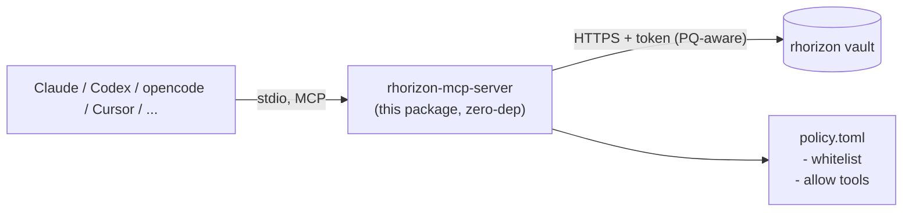

<!-- SPDX-License-Identifier: AGPL-3.0-or-later -->
<!-- Copyright (C) 2024-2026 shdw -->

# rhorizon-mcp-server

The MCP server proper. Exposes rhorizon vault operations as **read-only,
policy-gated MCP tools** that Claude Code, Claude Desktop, Codex, opencode,
Cursor, Cline, Continue, etc. can call. The server holds the vault token,
omits it from MCP tool schemas and responses, and filters every call against a
fail-closed whitelist policy.

**Zero third-party dependencies.** MCP-over-stdio is newline-delimited
JSON-RPC 2.0; this implements it directly on the Python standard library
(`json`, `urllib`, `ssl`, `tomllib`). There is no application-level
third-party dependency lockfile; the Python runtime remains a supply-chain
input. **stdio only** -- an HTTP transport was deliberately
dropped to keep the dependency set empty; HTTP-facing agents (cloud agents,
multi-vault) terminate at the separate `mcp-hub` (see the repo root README).

## Architecture



The server is the **trust boundary** between the AI and the vault:

- The AI sees only the MCP tool names (`vault_get_secret`, ...).
- The server holds the long-lived (scoped) vault token.
- For each tool call: check policy -> forward to rhorizon (or deny).
- The rhorizon audit chain records every read with actor = MCP token name.

## Install

```bash
# from this directory (rhorizon-mcp/server)
pipx install .            # puts rhorizon-mcp-server on PATH, isolated venv
rhorizon-mcp-server --version
```

No third-party dependencies are pulled: `pyproject.toml` declares
`dependencies = []`. `pipx` (or a plain venv) only places the console script.

Alternatively, in a venv:

```bash
python -m venv .venv && . .venv/bin/activate
pip install -e .
which rhorizon-mcp-server   # absolute path -- clients need it (see below)
```

## Environment

| Var | Meaning |
|-----|---------|
| `RH_VAULT_URL` | vault base URL (default `http://127.0.0.1:8200`) |
| `RH_TOKEN_FILE` | path to a 0600 file holding the vault token (or `RH_TOKEN`) |
| `RH_VAULT_CAFILE` | optional CA bundle for a private-CA HTTPS vault. TLS stays **verified**; only the trust anchor changes. |
| `RH_VAULT_PQ` | `prefer` (default) or `require` a post-quantum TLS group (X25519MLKEM768) to the vault. `require` fails the handshake if the vault cannot negotiate it. |
| `RH_MCP_POLICY` | policy file path (default `~/.config/rhorizon-mcp/policy.toml`) |

## Setup

Run `./setup.sh` from this directory. It mints the
token, writes the policy, registers local clients when their CLIs are present,
and prints config snippets for manual wiring. The manual steps below are what
it automates.

### 1. Mint a dedicated, scoped vault token

Operator side:

```bash
rhorizon token create mcp-agent \
  --scope secrets:r \
  --namespace mcp/demo \
  --namespace mcp/mail
umask 077
read -rsp 'MCP token: ' RH_TOKEN; echo
printf '%s\n' "$RH_TOKEN" > ~/.config/rhorizon/mcp.token
unset RH_TOKEN
```

### 2. Write the fail-closed policy

```bash
mkdir -p ~/.config/rhorizon-mcp
cat > ~/.config/rhorizon-mcp/policy.toml <<'EOF'
[secrets]
whitelist = [
    "mcp/demo/api-key",
    "mcp/mail/imap-host",
]

[namespaces]
allow = []            # or ["mcp/demo"] to allow every secret in the ns

[tools]
allow = [
    "vault_status",
    "vault_whoami",
    "vault_list_namespaces",
    "vault_list_secrets",
    "vault_get_secret",
]
EOF
chmod 600 ~/.config/rhorizon-mcp/policy.toml
```

**If the policy file is absent, the server denies every request** -- the
fail-closed default, on purpose. Configure it explicitly before the AI can do
anything.

### 3. Wire the client (stdio)

`command` must be the **absolute path** to `rhorizon-mcp-server` (the venv/pipx
binary), not a bare name -- desktop clients do not inherit your shell PATH.

**Claude Code** -- copy `claude.mcp.json` to your project root as
`.mcp.json`, or:

```bash
claude mcp add rhorizon-vault --scope user \
  -e RH_VAULT_URL=http://127.0.0.1:8200 \
  -e RH_TOKEN_FILE=$HOME/.config/rhorizon/mcp.token \
  -e RH_MCP_POLICY=$HOME/.config/rhorizon-mcp/policy.toml \
  -- "$(command -v rhorizon-mcp-server)"
```

**Codex** -- register the server in `~/.codex/config.toml`:

```bash
codex mcp add rhorizon-vault \
  --env RH_VAULT_URL=http://127.0.0.1:8200 \
  --env RH_TOKEN_FILE=$HOME/.config/rhorizon/mcp.token \
  --env RH_MCP_POLICY=$HOME/.config/rhorizon-mcp/policy.toml \
  -- "$(command -v rhorizon-mcp-server)"
```

Or merge `codex.config.toml` into `~/.codex/config.toml`, replacing placeholders
with absolute paths. Restart Codex after adding the server; already-running
sessions do not necessarily receive newly registered tools.

**Claude Desktop** -- `~/.config/Claude/claude_desktop_config.json`:

```json
{
  "mcpServers": {
    "rhorizon-vault": {
      "command": "/absolute/path/to/rhorizon-mcp-server",
      "env": {
        "RH_VAULT_URL": "http://127.0.0.1:8200",
        "RH_TOKEN_FILE": "/home/YOU/.config/rhorizon/mcp.token",
        "RH_MCP_POLICY": "/home/YOU/.config/rhorizon-mcp/policy.toml"
      }
    }
  }
}
```

**opencode** -- merge `opencode.json`'s `mcp` block into
`~/.config/opencode/opencode.json`. opencode does **not** expand `~`, so use
absolute paths. It spawns the server over stdio, like the other stdio clients above.
opencode prefixes tool names with the server name (e.g.
`rhorizon-vault_vault_get_secret`).

### 4. Restart the client

The agent now sees exactly the tools in `[tools].allow`:

- `vault_status` -- sealed/unsealed state
- `vault_whoami` -- discover its own scopes
- `vault_list_namespaces` -- visible namespaces
- `vault_list_secrets` -- names (never values) in a namespace
- `vault_get_secret` -- value of a whitelisted secret

## Security -- what it prevents, what it mitigates

**Enforced at the MCP protocol boundary**:

- MCP tool schemas and responses do not contain the vault token.
- The AI cannot reach endpoints not mapped as MCP tools; the only tools
  available are those in `[tools].allow`.

**Mitigated**:

- If the AI is compromised and exfiltrates a secret it read: that secret is
  compromised -- but only whitelisted secrets were ever reachable. Blast radius
  is bounded by the policy.
- The MCP token is `secrets:r` + named namespaces. An attacker who steals it
  cannot write, nor reach other namespaces. Keep it dedicated and minimal --
  that token is the real blast-radius ceiling.

**Out of scope**:

- The local account running the MCP server and host root can read the token
  file or process memory. Treat them as part of the trust boundary.
- Network sandboxing of the AI process itself (outbound firewall to stop C2
  exfiltration) -- that is your job to isolate.

## Use cases

Agent reads a whitelisted secret:

```
User: "Summarize my mail from the last hour"
  -> vault_get_secret(name=imap-password, namespace=mcp/mail)
     -> policy check ALLOW -> forward -> audit: actor=mcp-agent, action=read_secret
  -> agent connects over IMAP, reads, summarizes
```

Agent asks for a secret outside the whitelist:

```
User: "Connect to the prod DB"
  -> vault_get_secret(name=admin-password, namespace=prod/db)
     -> policy check DENY (not whitelisted)
     -> {"error": "policy_denied"}
  -> agent explains why it refuses; suggests widening the policy if legitimate
```

## Observability

```bash
rhorizon audit tail --actor mcp-agent    # everything the AI read
rhorizon audit follow                    # live tail
rhorizon audit verify                    # integrity check
```

## Troubleshooting

- **"Tool not allowed by policy"** -- add it to `[tools].allow`, restart the
  client.
- **"policy_denied" on a secret** -- add `namespace/name` to
  `[secrets].whitelist`, or allow the namespace via `[namespaces].allow`.
- **"Token validation failed"** -- the vault token is revoked/expired/wrong;
  check `RH_TOKEN_FILE` and `rhorizon token list`.
- **"Vault unreachable"** -- `RH_VAULT_URL` wrong or the stack is down;
  `curl $RH_VAULT_URL/health`.
- **Handshake fails with `RH_VAULT_PQ=require`** -- the vault's TLS stack does
  not offer X25519MLKEM768; use `prefer`, or upgrade the vault to OpenSSL 3.5+.

## Tests

```bash
python -m pytest tests/     # policy fail-closed / whitelist logic
```
